# stock-exceptions-outlined-actions — 2026-09-09T08:12:05.324Z

[All reports](../../README.md) · [Interactive HTML report](index.html) · [Full measurements and scoring](report.json)

GitHub renders this summary and the screenshots. Download or clone this folder to open the HTML report locally; GitHub does not serve it as a website.

**Subjective design score:** 95/100. Model: openai/gpt-5.6-sol. Rubric: 2.

**Arrusted adherence:** 100/100 (partial); evidence coverage 1.63%. Evaluator 3.

| Dimension | Conforming | Nonconforming | Unassessed | Adherence    |
| --------- | ---------- | ------------- | ---------- | ------------ |
| component | 20         | 0             | 2          | 100% (20/20) |
| api       | 53         | 0             | 10         | 100% (53/53) |
| styling   | 13         | 0             | 5165       | 100% (13/13) |

Scores from different evaluator versions or captured states are not directly comparable.

This report evaluates the captured preview; evaluation itself does not regenerate the app or prove a built backend. Scores are advisory and not human-calibrated.

## Ratings

| Dimension | Score | Reason |
| --- | --- | --- |
| hierarchy | 3/4 | The page title, exception list, selected-record heading, and stock evidence form a clear scan path. Selected-row treatment and severity pills make status easy to locate, while confirmation and result headings clearly replace the evidence view. The main replenishment action is comparatively subdued as an outlined footer control, so its priority is weaker than the otherwise strong hierarchy. |
| layout | 4/4 | The two-column list-detail composition is consistently aligned, with compact filters, uniform 86 px list rows, stable field/value columns, and actions anchored in panel footers. At 1024, both panes remain usable without horizontal overflow; at 1920, the centered content width keeps lines readable despite substantial surrounding whitespace. |
| typography | 4/4 | Heading levels, field labels, values, metadata, and severity labels are visually consistent and readable across all supplied sizes. Bold labels and restrained body text support quick comparison, and long content such as the supplier email and replenishment explanation remains legible without awkward wrapping. |
| responsive | 4/4 | The composition adapts effectively from a wide list-detail workspace at 1920 and 1024 to a focused detail panel at 700 px, where a clear Back to exceptions control replaces the list. Controls remain available, action groups fit, and constrained-height detail/result states use intentional vertical scrolling without document overflow. |
| productClarity | 4/4 | The purpose is stated directly, location and severity filters are labeled, each exception exposes product, location, deficit, severity, and cover, and selection reveals stock and supplier evidence. The mock flow clearly distinguishes review, confirmation, result, and reset, repeatedly stating that no order is placed and inventory remains unchanged. |

## Strengths

- Strong master-detail relationship: the selected Atlas row is visibly highlighted and its identity is repeated in the detail header.
- Exception rows expose both the reorder gap and days of cover, supporting fast prioritization without opening every record.
- The confirmation view explains how the 96-unit quantity derives from case rounding and the supplier minimum.
- Simulation safety is communicated before and after confirmation with explicit statements that no order is placed and underlying stock is unchanged.
- Secondary supplier facts are progressively disclosed, keeping the default evidence view concise while preserving access to case pack, receipt, contact, and terms.
- The 700 px constrained desktop treatment preserves context with a Back to exceptions affordance rather than squeezing both panes together.

## Improvements

- **medium — desktop-0:** Try mock replenishment is the principal task action, but its neutral outlined presentation gives it similar emphasis to secondary controls and makes it easy to overlook at the far edge of a large panel. Use the supported primary Button variant for this single task-advancing action while retaining the existing Arrusted palette and keeping Cancel and Reset as secondary actions.
- **low — desktop-custom-700x900-0:** The full page title and explanatory subtitle remain above the Back control in constrained detail mode, consuming vertical space before the selected product and stock evidence begin. In constrained detail mode, compact the page introduction or place the Back control on the same header row where composition allows, while retaining enough context to identify Stock exceptions.
- **low — desktop-window-5:** After expanding supplier facts in the shorter window, the internally scrolled detail begins mid-way through stock evidence at Reorder point. The persistent product header helps, but the missing stock-section heading makes the visible field group less self-explanatory. When disclosure expansion adjusts the internal scroll position, keep the Stock evidence heading visible until the supplier section reaches the top, or avoid moving the panel farther than needed to reveal the expanded section.

## Token evidence

Percentages cover only assessed properties. Missing provenance and ambiguous CSS remain unassessed; matching literals are not proof of token usage.

| Viewport | Category | Token references / assessed | Coverage |
| --- | --- | --- | --- |
| desktop-0 | color | 0/0 | 0% (0/232) |
| desktop-0 | typography | 0/0 | 0% (0/522) |
| desktop-0 | spacing | 0/0 | 0% (0/275) |
| desktop-0 | radius | 0/0 | 0% (0/116) |
| desktop-0 | border | 0/0 | 0% (0/125) |
| desktop-0 | shadow | 0/0 | 0% (0/120) |
| desktop-wide-0 | color | 0/0 | 0% (0/232) |
| desktop-wide-0 | typography | 0/0 | 0% (0/522) |
| desktop-wide-0 | spacing | 0/0 | 0% (0/275) |
| desktop-wide-0 | radius | 0/0 | 0% (0/116) |
| desktop-wide-0 | border | 0/0 | 0% (0/125) |
| desktop-wide-0 | shadow | 0/0 | 0% (0/120) |
| desktop-window-0 | color | 0/0 | 0% (0/232) |
| desktop-window-0 | typography | 0/0 | 0% (0/522) |
| desktop-window-0 | spacing | 0/0 | 0% (0/275) |
| desktop-window-0 | radius | 0/0 | 0% (0/116) |
| desktop-window-0 | border | 0/0 | 0% (0/125) |
| desktop-window-0 | shadow | 0/0 | 0% (0/120) |
| desktop-custom-700x900-0 | color | 0/0 | 0% (0/160) |
| desktop-custom-700x900-0 | typography | 0/0 | 0% (0/405) |
| desktop-custom-700x900-0 | spacing | 0/0 | 0% (0/184) |
| desktop-custom-700x900-0 | radius | 0/0 | 0% (0/81) |
| desktop-custom-700x900-0 | border | 0/0 | 0% (0/84) |
| desktop-custom-700x900-0 | shadow | 0/0 | 0% (0/81) |

## Latest-run screenshots

### desktop-0 — initial

Interaction: not-run.

### desktop-1 — Review modeled quantity before confirming

Interaction: passed.

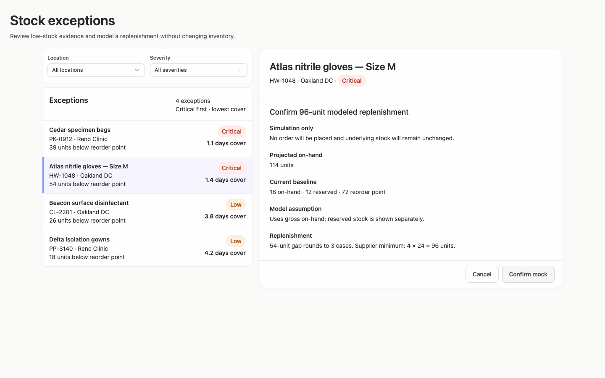

### desktop-2 — Mock replenishment result

Interaction: passed.

### desktop-3 — Result evidence at scroll boundary

Interaction: passed.

### desktop-4 — Reset from result footer

Interaction: passed.

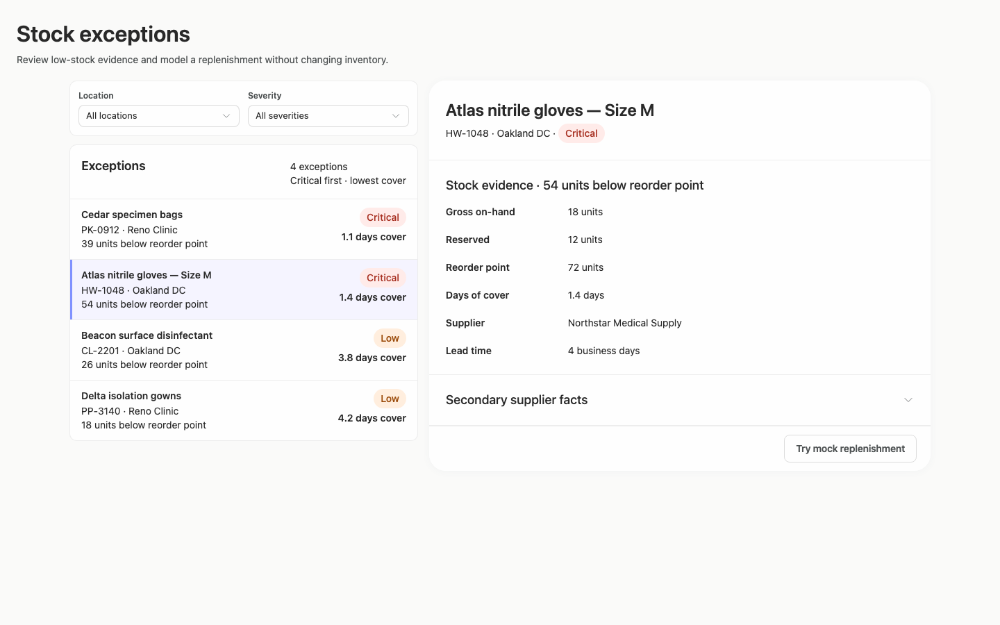

### desktop-5 — Expanded supplier facts

Interaction: passed.

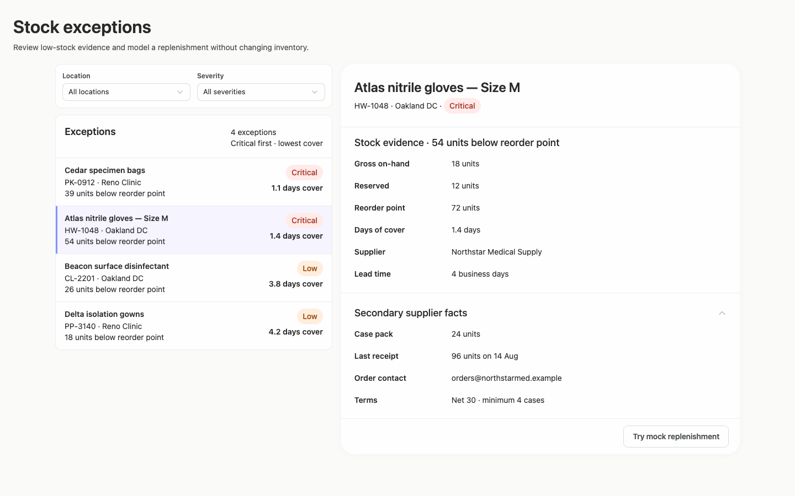

### desktop-wide-0 — initial

Interaction: not-run.

### desktop-wide-1 — Review modeled quantity before confirming

Interaction: passed.

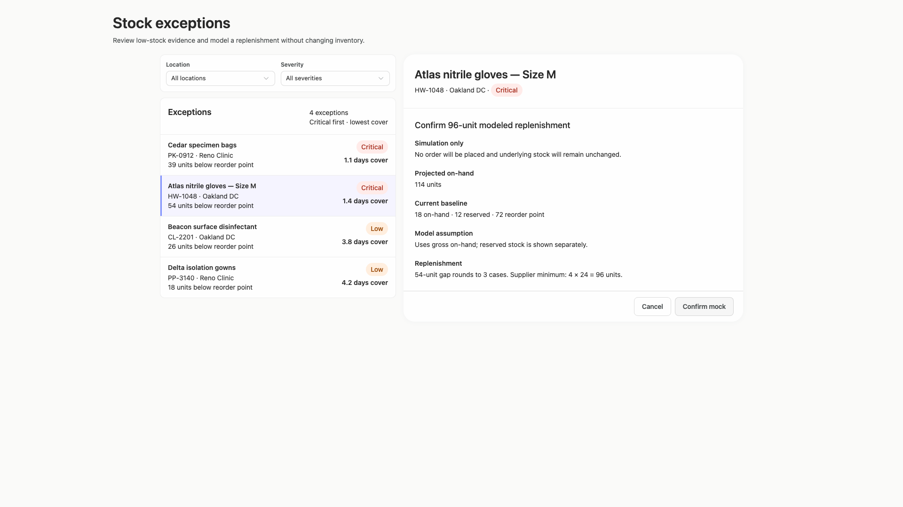

### desktop-wide-2 — Mock replenishment result

Interaction: passed.

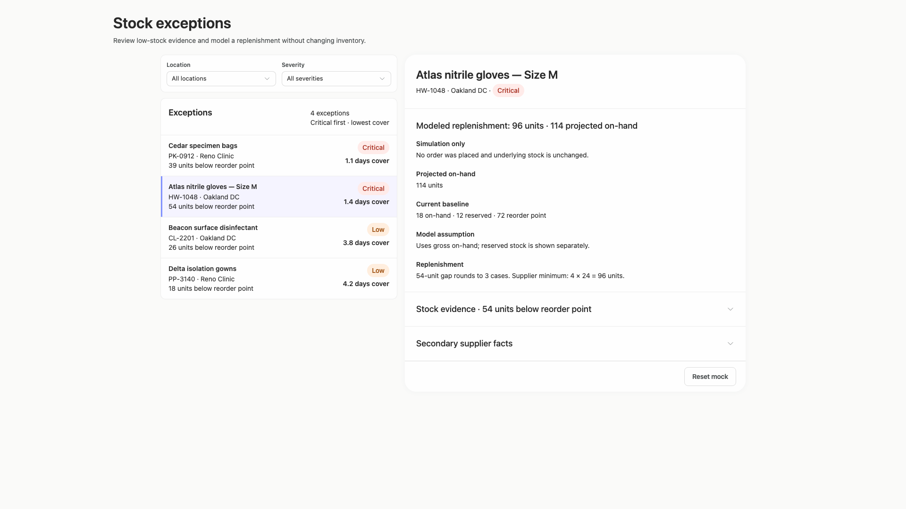

### desktop-wide-3 — Result evidence at scroll boundary

Interaction: passed.

### desktop-wide-4 — Reset from result footer

Interaction: passed.

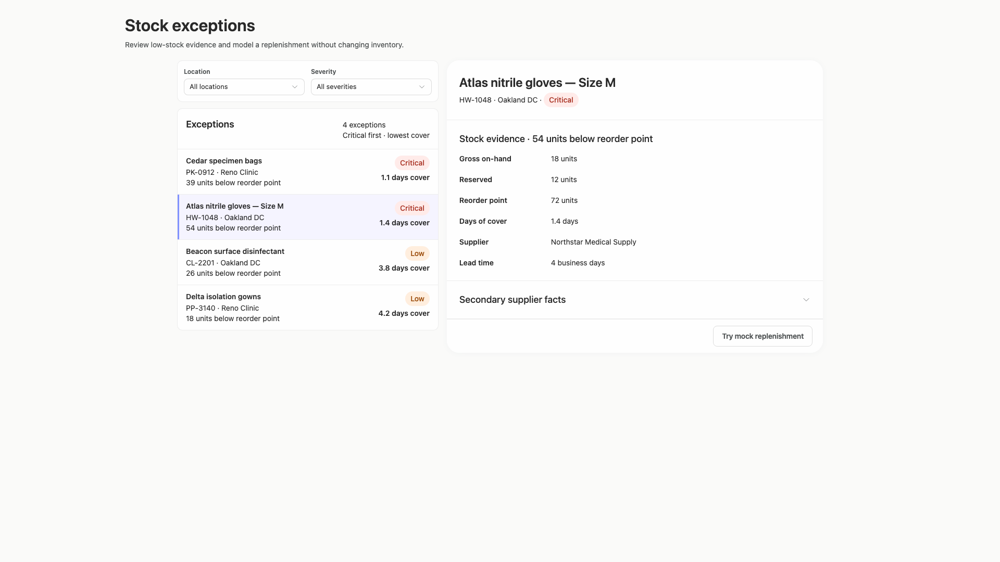

### desktop-wide-5 — Expanded supplier facts

Interaction: passed.

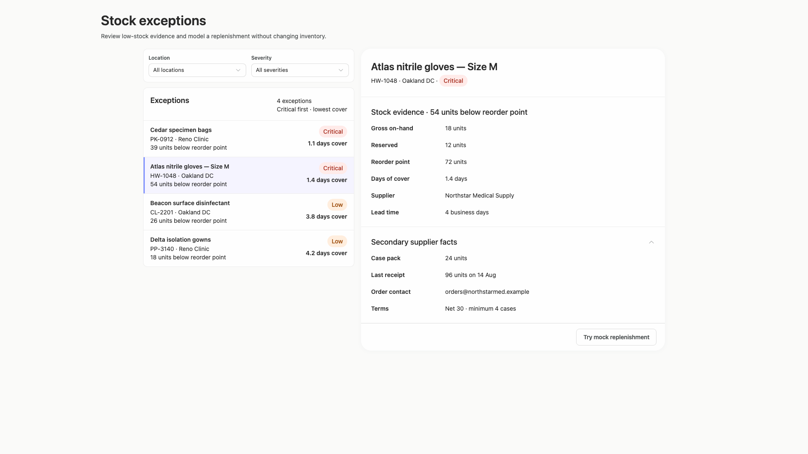

### desktop-window-0 — initial

Interaction: not-run.

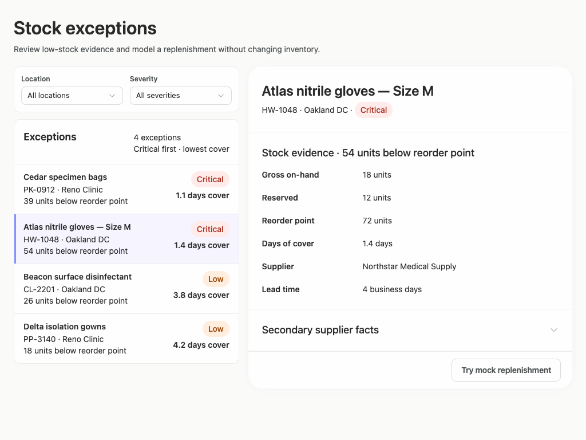

### desktop-window-1 — Review modeled quantity before confirming

Interaction: passed.

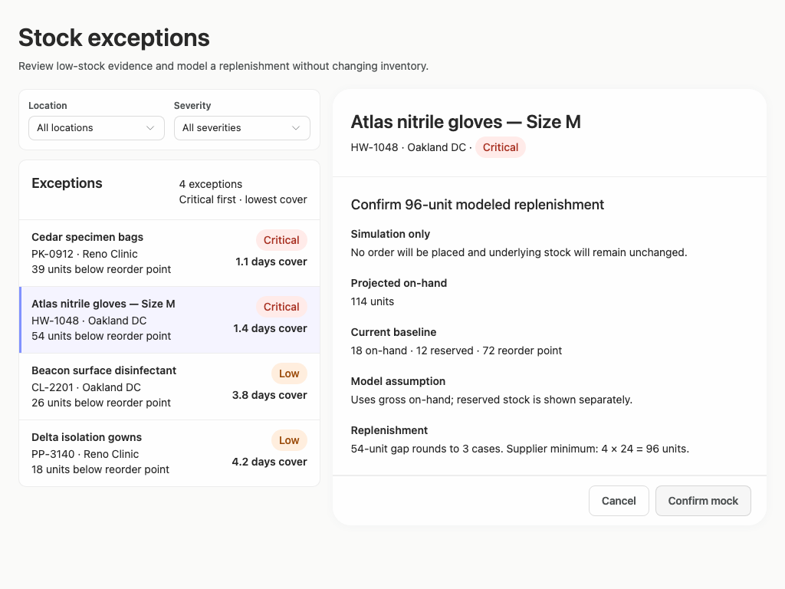

### desktop-window-2 — Mock replenishment result

Interaction: passed.

### desktop-window-3 — Result evidence at scroll boundary

Interaction: passed.

### desktop-window-4 — Reset from result footer

Interaction: passed.

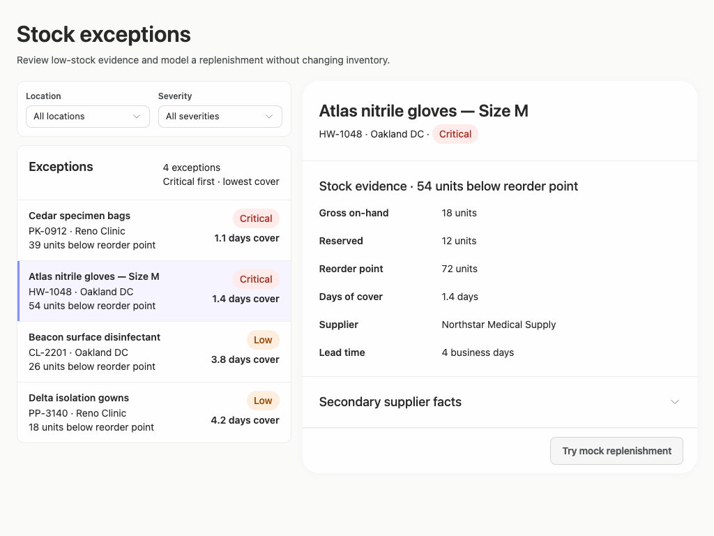

### desktop-window-5 — Expanded supplier facts

Interaction: passed.

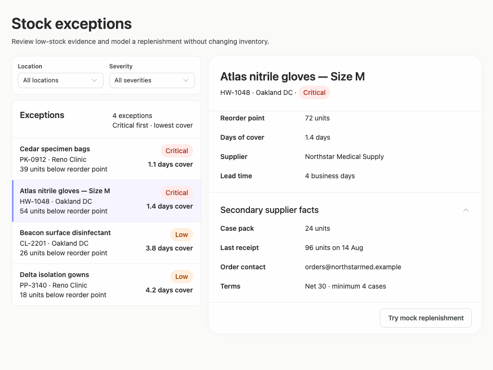

### desktop-custom-700x900-0 — initial

Interaction: not-run.

### desktop-custom-700x900-1 — Review modeled quantity before confirming

Interaction: passed.

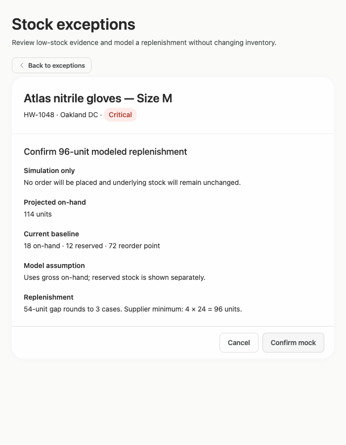

### desktop-custom-700x900-2 — Mock replenishment result

Interaction: passed.

### desktop-custom-700x900-3 — Result evidence at scroll boundary

Interaction: passed.

### desktop-custom-700x900-4 — Reset from result footer

Interaction: passed.

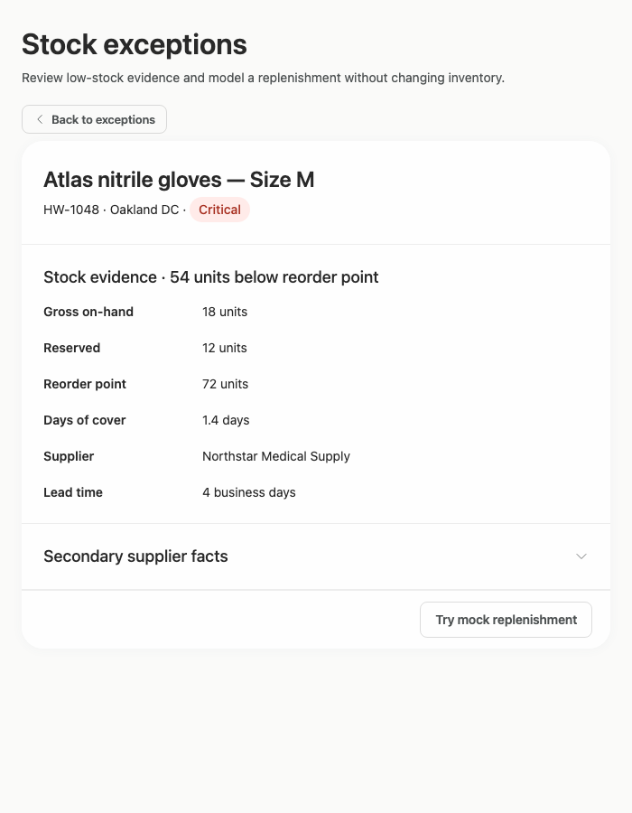

### desktop-custom-700x900-5 — Expanded supplier facts

Interaction: passed.

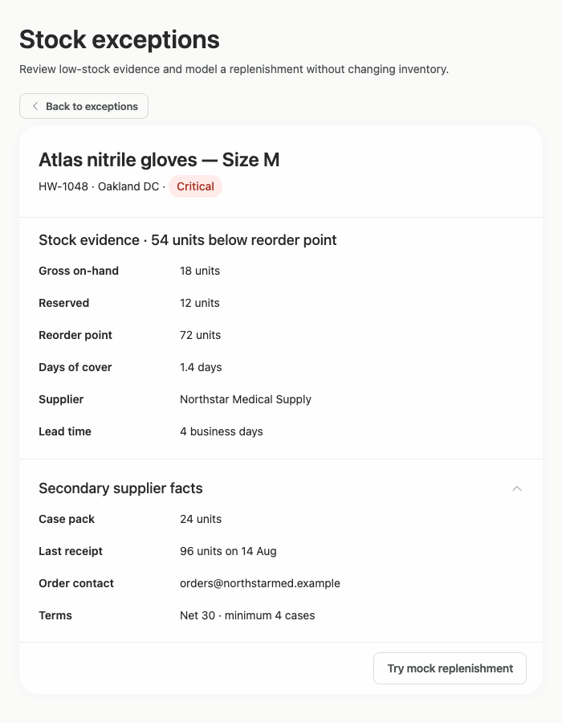

## Limitations

- No screenshot or other reviewable artifact shows the requested implementation plan, so its completeness and stop-before-publication status cannot be evaluated visually.
- Filter menus and filtered empty/result states were not shown or interaction-tested; only the presence of the location and severity controls is established.
- The constrained 700 px captures show detail mode but not the corresponding exception-list mode after using Back, so that state is unverified.
- Only the supplied desktop dimensions and states were assessed; intermediate panel widths, keyboard focus appearance, loading states, and long localized strings were not shown.
- Static screenshots and source evidence do not establish backend behavior, persistence, or whether any real inventory operation can occur.
