# stock-exceptions-primary-labels — 2026-09-09T09:29:55.074Z

[All reports](../../README.md) · [Interactive HTML report](index.html) · [Full measurements and scoring](report.json)

GitHub renders this summary and the screenshots. Download or clone this folder to open the HTML report locally; GitHub does not serve it as a website.

**Subjective design score:** 90/100. Model: openai/gpt-5.6-sol. Rubric: 2.

**Arrusted adherence:** 100/100 (partial); evidence coverage 1.77%. Evaluator 3.

| Dimension | Conforming | Nonconforming | Unassessed | Adherence    |
| --------- | ---------- | ------------- | ---------- | ------------ |
| component | 21         | 0             | 3          | 100% (21/21) |
| api       | 56         | 0             | 9          | 100% (56/56) |
| styling   | 13         | 0             | 4980       | 100% (13/13) |

Scores from different evaluator versions or captured states are not directly comparable.

This report evaluates the captured preview; evaluation itself does not regenerate the app or prove a built backend. Scores are advisory and not human-calibrated.

## Ratings

| Dimension      | Score | Reason                                                                                                                                                                                                                                                                                                                                        |
| -------------- | ----- | --------------------------------------------------------------------------------------------------------------------------------------------------------------------------------------------------------------------------------------------------------------------------------------------------------------------------------------------- |
| hierarchy      | 4/4   | The page establishes a clear sequence from title and filtering, to the exception list, selected record, evidence, and replenishment action. Selected-row treatment, severity pills, detail headings, and the three modeled-quantity cards make priorities immediately scannable.                                                              |
| layout         | 3/4   | Alignment and spacing are consistently strong across the filters, list rows, fact labels, and action footers. The 700px confirmation pane is somewhat dense because all three quantity cards remain in one row, and expanded supplier facts at 1024×768 move the primary action below the initial viewport.                                   |
| typography     | 4/4   | A restrained and consistent type scale clearly distinguishes page titles, record titles, section headings, labels, values, and explanatory copy. Inventory quantities receive useful emphasis without overwhelming the surrounding evidence.                                                                                                  |
| responsive     | 3/4   | The composition adapts effectively from centered wide layouts at 1920px to split panes at 1440px and 1024px, then switches to a focused detail view with a Back control at 700px. There is no observed horizontal overflow, but the expanded supplier state at 1024×768 requires page scrolling before the replenishment action is available. |
| productClarity | 4/4   | Location and severity filters are plainly labeled; each exception exposes product, SKU, location, shortage, severity, and days of cover. Stock and supplier evidence are connected to a clearly marked mock flow, and confirmation/result copy repeatedly explains that no real order or inventory change occurs.                             |

## Strengths

- The wide master-detail composition supports rapid comparison while keeping the selected product's evidence visible.
- The constrained 700px layout appropriately defers detail until selection and provides a clear “Back to exceptions” route.
- Severity, shortage, days of cover, supplier, lead time, case pack, minimum order, and projected stock provide relevant replenishment context without unnecessary dashboard material.
- The modeled action has a strong safety narrative: the review, confirmation, completed state, and reset affordance all distinguish simulation from a real order.
- Expanded supplier facts use progressive disclosure, keeping the default detail view concise.
- The supplied accessibility measurements report no violations in any captured state, and tested replenishment interactions passed at the captured widths.

## Improvements

- **medium — desktop-window-5:** In the expanded supplier state, the document reaches 858px while the measured window height is 768px; the replenishment button begins at y=782 and therefore sits below the initial viewport. Scrolling is usable and may be intentional, but expanding supporting evidence temporarily removes the primary next action from view. Keep the detail pane independently scrollable with its existing action footer remaining visible, or use a supported sticky action placement within the detail composition. Preserve the current Button variant and palette.
- **low — desktop-custom-700x900-1:** The three quantity summaries remain in a single row inside the 700px detail pane. They fit in the supplied capture, but long labels and large values leave limited breathing room and make this section visually denser than the rest of the page. Use the available container-aware KPI composition behavior to wrap the summaries into a 2+1 arrangement when the detail pane is this narrow, while retaining the same labels, values, and component styling.
- **low — desktop-custom-700x900-0:** Atlas appears with selected styling in the constrained list even though no detail is shown yet. Without an instruction, the highlight can look like a completed selection rather than an invitation to open the record. Keep the constrained list visually unselected until the user establishes a selection, or add concise guidance such as “Select an exception to review stock and supplier details” near the list heading.

## Token evidence

Percentages cover only assessed properties. Missing provenance and ambiguous CSS remain unassessed; matching literals are not proof of token usage.

| Viewport                 | Category   | Token references / assessed | Coverage   |
| ------------------------ | ---------- | --------------------------- | ---------- |
| desktop-0                | color      | 0/0                         | 0% (0/233) |
| desktop-0                | typography | 0/0                         | 0% (0/522) |
| desktop-0                | spacing    | 0/0                         | 0% (0/275) |
| desktop-0                | radius     | 0/0                         | 0% (0/116) |
| desktop-0                | border     | 0/0                         | 0% (0/125) |
| desktop-0                | shadow     | 0/0                         | 0% (0/120) |
| desktop-wide-0           | color      | 0/0                         | 0% (0/233) |
| desktop-wide-0           | typography | 0/0                         | 0% (0/522) |
| desktop-wide-0           | spacing    | 0/0                         | 0% (0/275) |
| desktop-wide-0           | radius     | 0/0                         | 0% (0/116) |
| desktop-wide-0           | border     | 0/0                         | 0% (0/125) |
| desktop-wide-0           | shadow     | 0/0                         | 0% (0/120) |
| desktop-window-0         | color      | 0/0                         | 0% (0/233) |
| desktop-window-0         | typography | 0/0                         | 0% (0/522) |
| desktop-window-0         | spacing    | 0/0                         | 0% (0/275) |
| desktop-window-0         | radius     | 0/0                         | 0% (0/116) |
| desktop-window-0         | border     | 0/0                         | 0% (0/125) |
| desktop-window-0         | shadow     | 0/0                         | 0% (0/120) |
| desktop-custom-700x900-0 | color      | 0/0                         | 0% (0/139) |
| desktop-custom-700x900-0 | typography | 0/0                         | 0% (0/287) |
| desktop-custom-700x900-0 | spacing    | 0/0                         | 0% (0/162) |
| desktop-custom-700x900-0 | radius     | 0/0                         | 0% (0/69)  |
| desktop-custom-700x900-0 | border     | 0/0                         | 0% (0/77)  |
| desktop-custom-700x900-0 | shadow     | 0/0                         | 0% (0/73)  |

## Latest-run screenshots

### desktop-0 — initial

Interaction: not-run.

### desktop-1 — Select record and review modeled quantity

Interaction: passed.

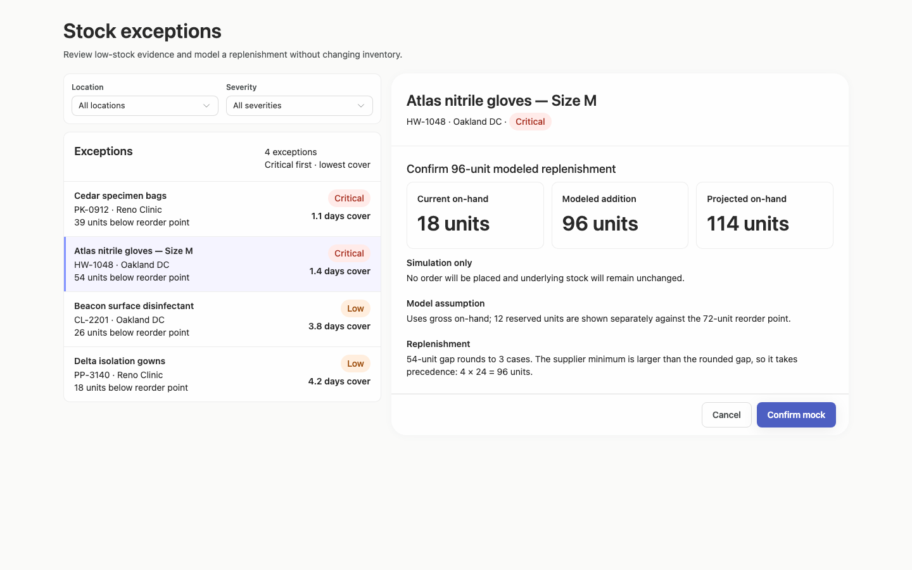

### desktop-2 — Confirm modeled replenishment

Interaction: passed.

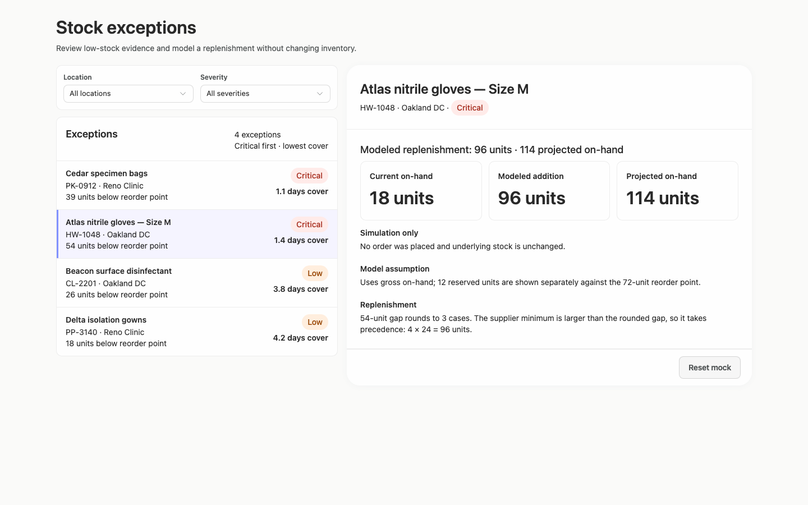

### desktop-3 — Read projected quantity

Interaction: passed.

### desktop-4 — Reset fixture result

Interaction: passed.

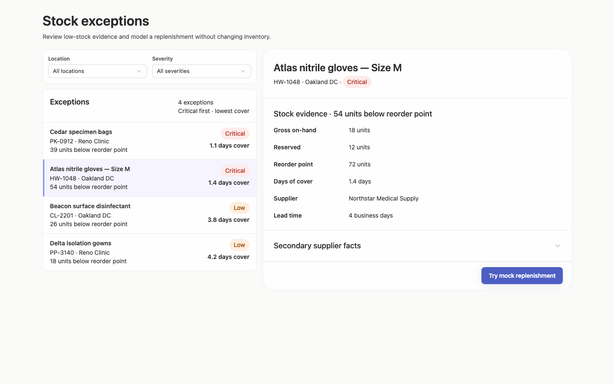

### desktop-5 — Read expanded supplier facts

Interaction: passed.

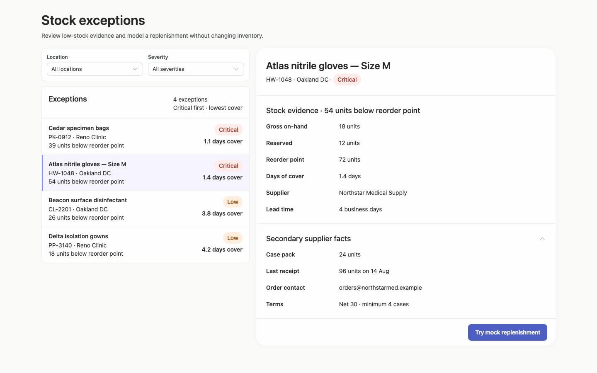

### desktop-wide-0 — initial

Interaction: not-run.

### desktop-wide-1 — Select record and review modeled quantity

Interaction: passed.

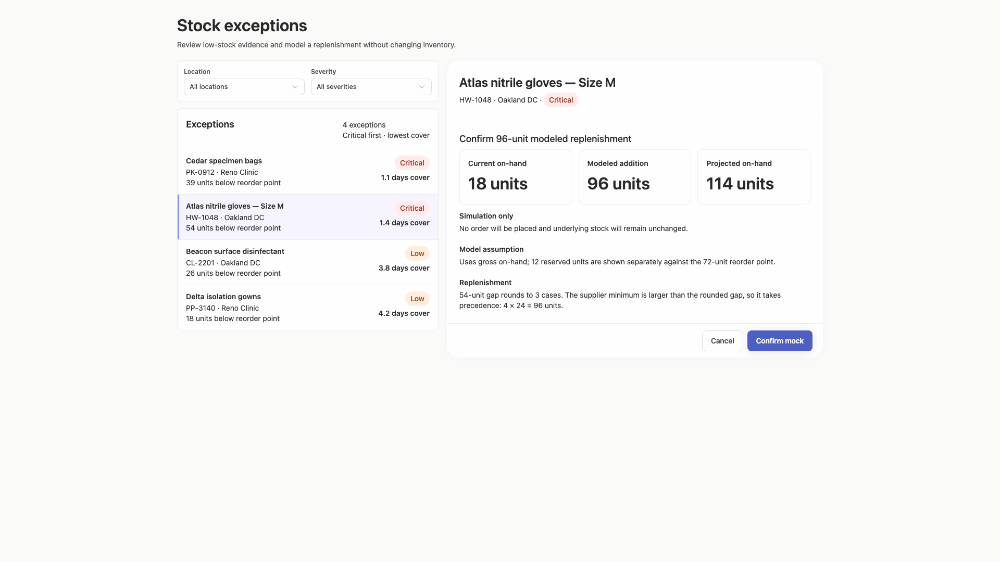

### desktop-wide-2 — Confirm modeled replenishment

Interaction: passed.

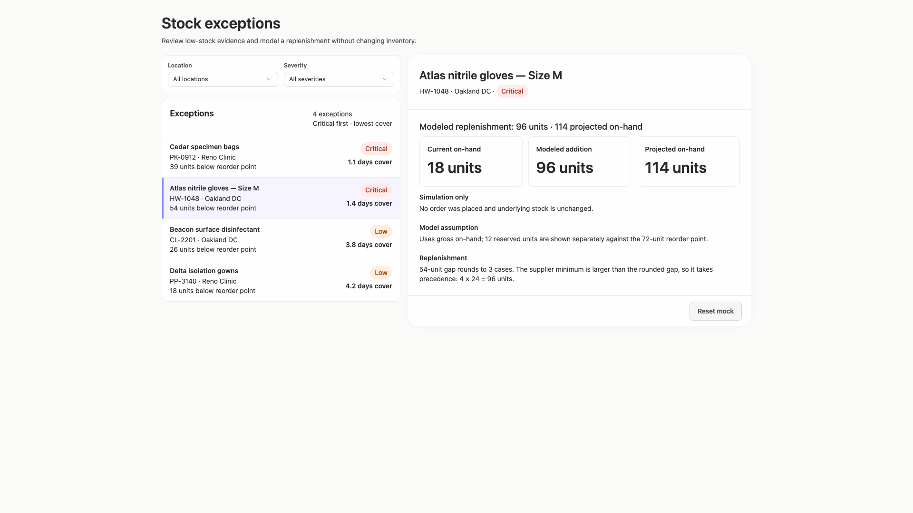

### desktop-wide-3 — Read projected quantity

Interaction: passed.

### desktop-wide-4 — Reset fixture result

Interaction: passed.

### desktop-wide-5 — Read expanded supplier facts

Interaction: passed.

### desktop-window-0 — initial

Interaction: not-run.

### desktop-window-1 — Select record and review modeled quantity

Interaction: passed.

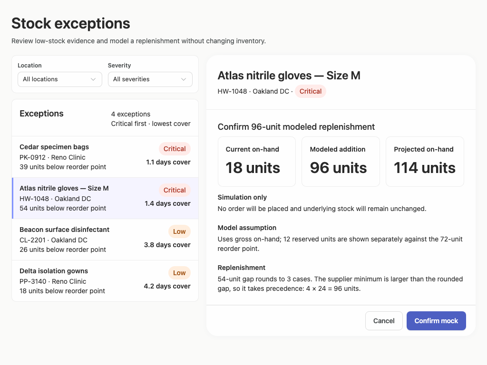

### desktop-window-2 — Confirm modeled replenishment

Interaction: passed.

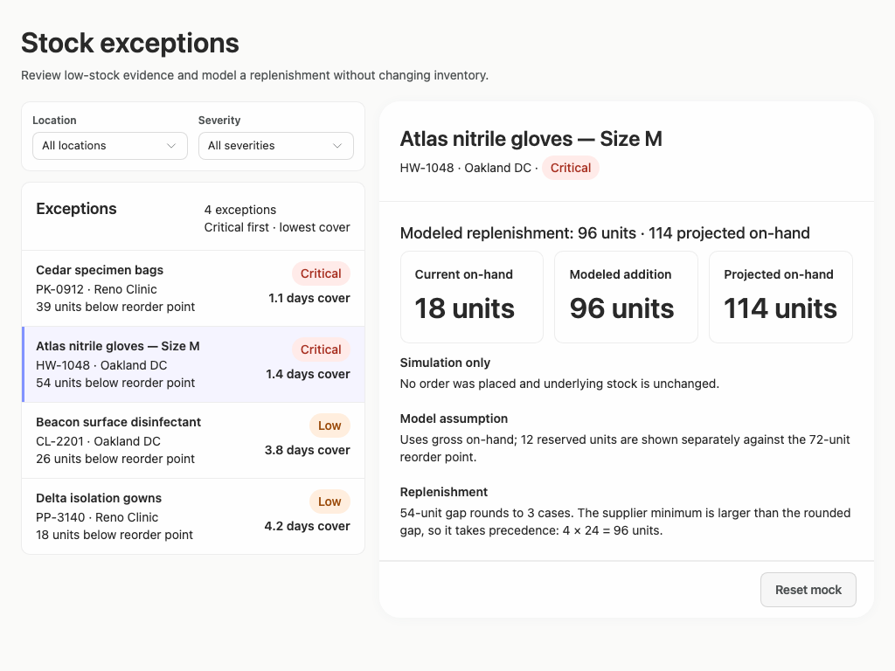

### desktop-window-3 — Read projected quantity

Interaction: passed.

### desktop-window-4 — Reset fixture result

Interaction: passed.

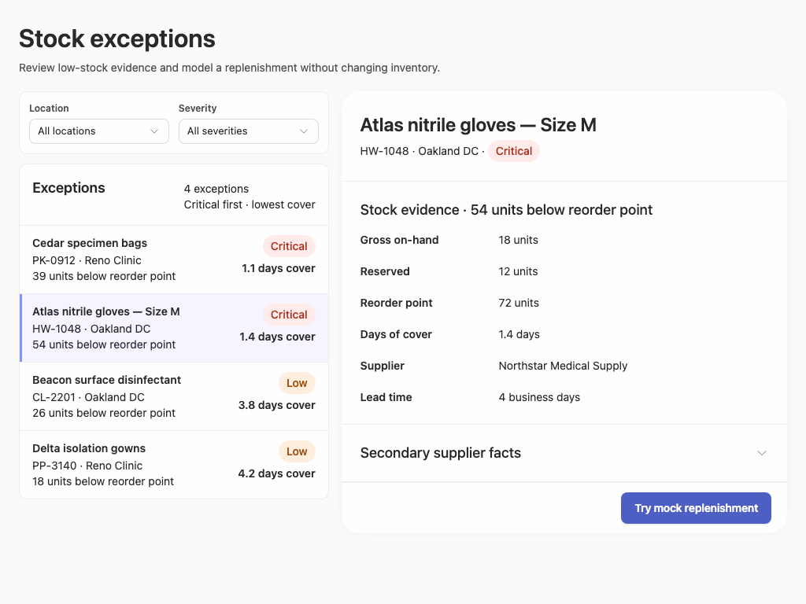

### desktop-window-5 — Read expanded supplier facts

Interaction: passed.

### desktop-custom-700x900-0 — initial

Interaction: not-run.

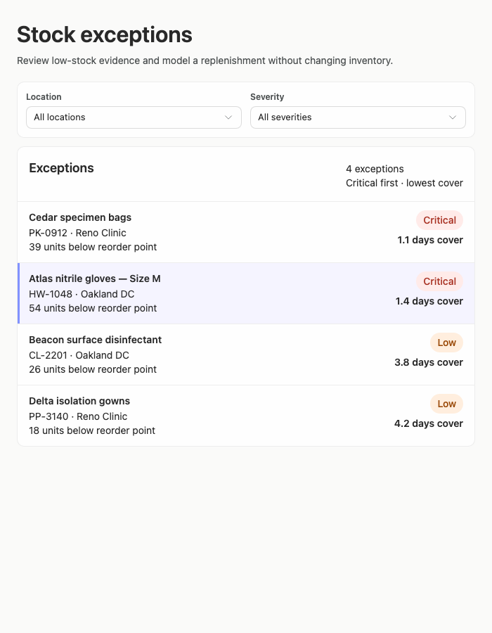

### desktop-custom-700x900-1 — Select record and review modeled quantity

Interaction: passed.

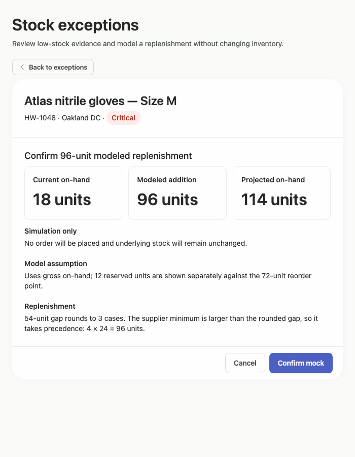

### desktop-custom-700x900-2 — Confirm modeled replenishment

Interaction: passed.

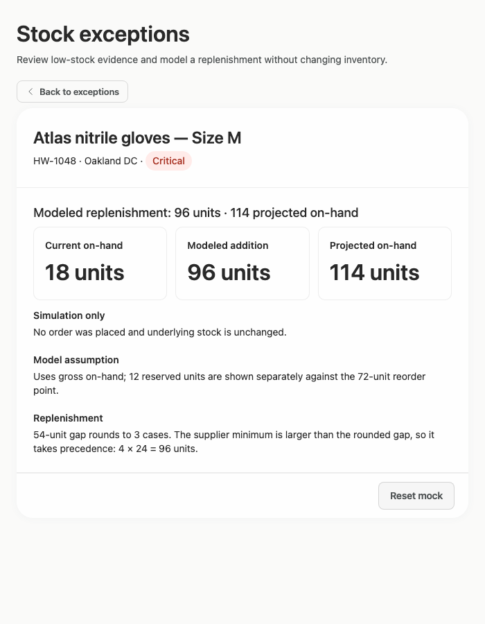

### desktop-custom-700x900-3 — Read projected quantity

Interaction: passed.

### desktop-custom-700x900-4 — Reset fixture result

Interaction: passed.

### desktop-custom-700x900-5 — Read expanded supplier facts

Interaction: passed.

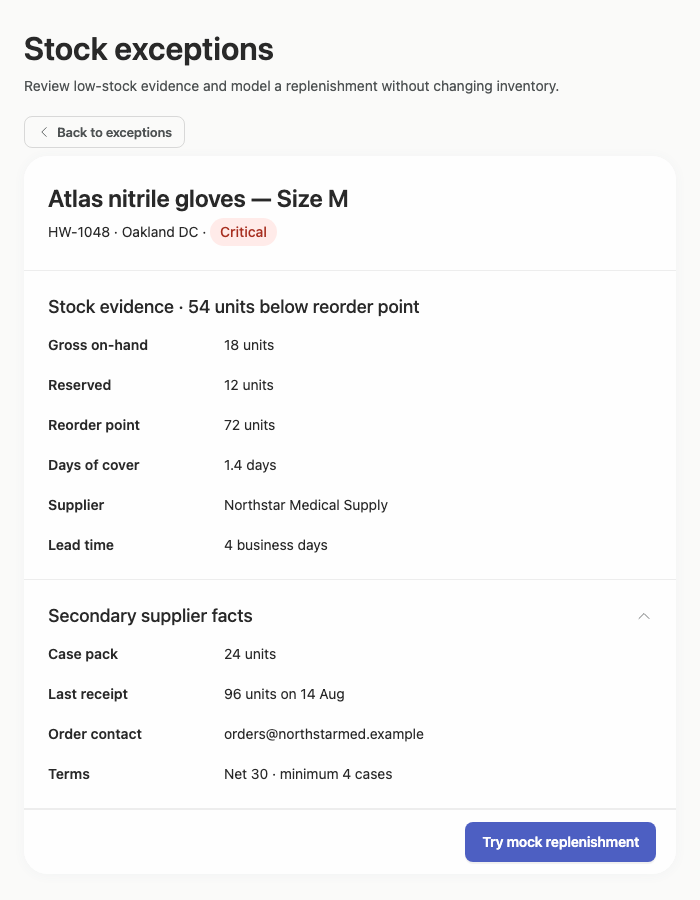

## Limitations

- No visual or textual implementation plan was supplied, so that requested deliverable cannot be evaluated.
- Filter menus and filtered result states were not shown or interaction-tested; updates, zero-result handling, and selection behavior after filtering remain uncertain.
- Hover, focus, keyboard navigation, loading, disabled, and error states were not visible in the supplied screenshots.
- The captures demonstrate fixture interactions only and do not establish backend behavior or persistence.
- Most styling provenance was unassessed by the supplied adherence evidence; the visible interface appears consistent with the provided Arrusted palette, but token-level implementation cannot be inferred from screenshots.
