# stock-exceptions-priority-label — 2026-09-09T07:20:51.570Z

[All reports](../../README.md) · [Interactive HTML report](index.html) · [Full measurements and scoring](report.json)

GitHub renders this summary and the screenshots. Download or clone this folder to open the HTML report locally; GitHub does not serve it as a website.

**Subjective design score:** 85/100. Model: openai/gpt-5.6-sol. Rubric: 2.

**Arrusted adherence:** 100/100 (partial); evidence coverage 1.54%. Evaluator 3.

| Dimension | Conforming | Nonconforming | Unassessed | Adherence    |
| --------- | ---------- | ------------- | ---------- | ------------ |
| component | 19         | 0             | 2          | 100% (19/19) |
| api       | 49         | 0             | 10         | 100% (49/49) |
| styling   | 13         | 0             | 5181       | 100% (13/13) |

Scores from different evaluator versions or captured states are not directly comparable.

This report evaluates the captured preview; evaluation itself does not regenerate the app or prove a built backend. Scores are advisory and not human-calibrated.

## Ratings

| Dimension      | Score | Reason                                                                                                                                                                                                                                                                                                                                                                                                                                                 |
| -------------- | ----- | ------------------------------------------------------------------------------------------------------------------------------------------------------------------------------------------------------------------------------------------------------------------------------------------------------------------------------------------------------------------------------------------------------------------------------------------------------ |
| hierarchy      | 3/4   | The page title, filters, exception list, selected-record header, evidence, and footer action create a clear review sequence. Selection is strongly indicated, and confirmation/result headlines elevate the workflow state. However, the supplier minimum that materially affects replenishment is hidden in a secondary disclosure and is not surfaced during confirmation.                                                                           |
| layout         | 4/4   | The two-column list-detail composition is consistently aligned and comfortably dense at 1024, 1440, and 1920 pixels. Labels and values form stable grids, rows have predictable spacing, and footer actions remain separated from evidence. At 700 pixels the focused detail layout uses the available width effectively without visible clipping.                                                                                                     |
| typography     | 3/4   | Headings, field labels, values, metadata, and status pills are visually consistent and generally easy to read. The confirmation explanation wraps cleanly at narrower desktop widths, though its long assumption text is comparatively dense. Automated evidence also reports marginal muted-text contrast and low primary-button label contrast; these should be addressed through supported Arrusted treatments rather than local palette overrides. |
| responsive     | 4/4   | The composition scales from a centered wide layout to a tighter 1024-pixel split view, then switches to a focused detail view with a clear Back control at 700 pixels. Actions remain visible, confirmation content reflows without horizontal overflow, and longer evidence uses bounded vertical scrolling where needed.                                                                                                                             |
| productClarity | 3/4   | The task is immediately understandable: filter exceptions, select an item, review stock and supplier facts, then run an explicitly simulated replenishment. Confirmation and result states repeatedly state that no order is placed. Clarity is reduced by proposing 3 cases while the expanded supplier terms specify a 4-case minimum, and by basing the shortfall on gross on-hand while reserved units are only explained later as context.        |

## Strengths

- Clear master-detail workflow with location and severity filters, visible exception priority, and an unambiguous selected row.
- Strong safety messaging throughout the mock action: confirmation and result states explicitly say inventory is unchanged and no order was placed.
- Useful operational evidence is grouped coherently, including on-hand, reserved, reorder point, cover, supplier, lead time, case pack, receipt, contact, and terms.
- Desktop resizing is handled thoughtfully: the split layout remains usable at 1024 pixels and converts to a focused detail panel with Back navigation at 700 pixels.
- Confirmation exposes the modeled quantity, case calculation, current baseline, assumption, and projected on-hand before the user confirms.

## Improvements

- **high — desktop-5:** The supplier terms state “minimum 4 cases,” but the confirmation and result states model only 3 cases of 24. The prototype neither adjusts the quantity nor warns that the modeled replenishment violates the displayed supplier constraint. Make the model honor the 4-case minimum, or prominently flag the exception in the confirmation with the supplier minimum, proposed quantity, and resulting projected on-hand before confirmation.
- **medium — desktop-1:** The 54-unit shortfall and 90-unit projection use gross on-hand, while 12 reserved units are deliberately not subtracted. Although the assumption is disclosed, inventory reviewers may initially interpret the figures as available stock and expect reservations to affect the recommendation. Label the baseline explicitly as “Gross on-hand” and show available stock as a separate derived value, or place a concise reservation treatment note directly beside the modeled quantity.
- **low — desktop-window-5:** After expanding supplier facts in the constrained split view, the detail scroll position starts partway through stock evidence: the section heading, on-hand, and reserved rows are no longer visible. The panel remains usable, but the user loses immediate context for the displayed reorder point and supplier data. Preserve the panel’s prior scroll position when opening the disclosure, or keep the active evidence section heading visible while the detail body scrolls.
- **low — desktop-0:** With no active filtering, “4 matching · 4 total” communicates the same count twice and competes with the useful ordering note below it. Show a single total such as “4 exceptions” in the unfiltered state, and introduce the matching-versus-total distinction only after a filter changes the result set.

## Token evidence

Percentages cover only assessed properties. Missing provenance and ambiguous CSS remain unassessed; matching literals are not proof of token usage.

| Viewport                 | Category   | Token references / assessed | Coverage   |
| ------------------------ | ---------- | --------------------------- | ---------- |
| desktop-0                | color      | 0/0                         | 0% (0/233) |
| desktop-0                | typography | 0/0                         | 0% (0/526) |
| desktop-0                | spacing    | 0/0                         | 0% (0/275) |
| desktop-0                | radius     | 0/0                         | 0% (0/116) |
| desktop-0                | border     | 0/0                         | 0% (0/125) |
| desktop-0                | shadow     | 0/0                         | 0% (0/120) |
| desktop-wide-0           | color      | 0/0                         | 0% (0/233) |
| desktop-wide-0           | typography | 0/0                         | 0% (0/526) |
| desktop-wide-0           | spacing    | 0/0                         | 0% (0/275) |
| desktop-wide-0           | radius     | 0/0                         | 0% (0/116) |
| desktop-wide-0           | border     | 0/0                         | 0% (0/125) |
| desktop-wide-0           | shadow     | 0/0                         | 0% (0/120) |
| desktop-window-0         | color      | 0/0                         | 0% (0/233) |
| desktop-window-0         | typography | 0/0                         | 0% (0/526) |
| desktop-window-0         | spacing    | 0/0                         | 0% (0/275) |
| desktop-window-0         | radius     | 0/0                         | 0% (0/116) |
| desktop-window-0         | border     | 0/0                         | 0% (0/125) |
| desktop-window-0         | shadow     | 0/0                         | 0% (0/120) |
| desktop-custom-700x900-0 | color      | 0/0                         | 0% (0/161) |
| desktop-custom-700x900-0 | typography | 0/0                         | 0% (0/405) |
| desktop-custom-700x900-0 | spacing    | 0/0                         | 0% (0/184) |
| desktop-custom-700x900-0 | radius     | 0/0                         | 0% (0/81)  |
| desktop-custom-700x900-0 | border     | 0/0                         | 0% (0/84)  |
| desktop-custom-700x900-0 | shadow     | 0/0                         | 0% (0/81)  |

## Latest-run screenshots

### desktop-0 — initial

Interaction: not-run.

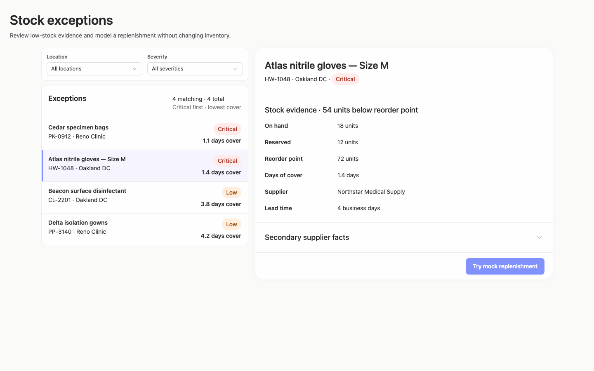

### desktop-1 — Review modeled quantity before confirming

Interaction: passed.

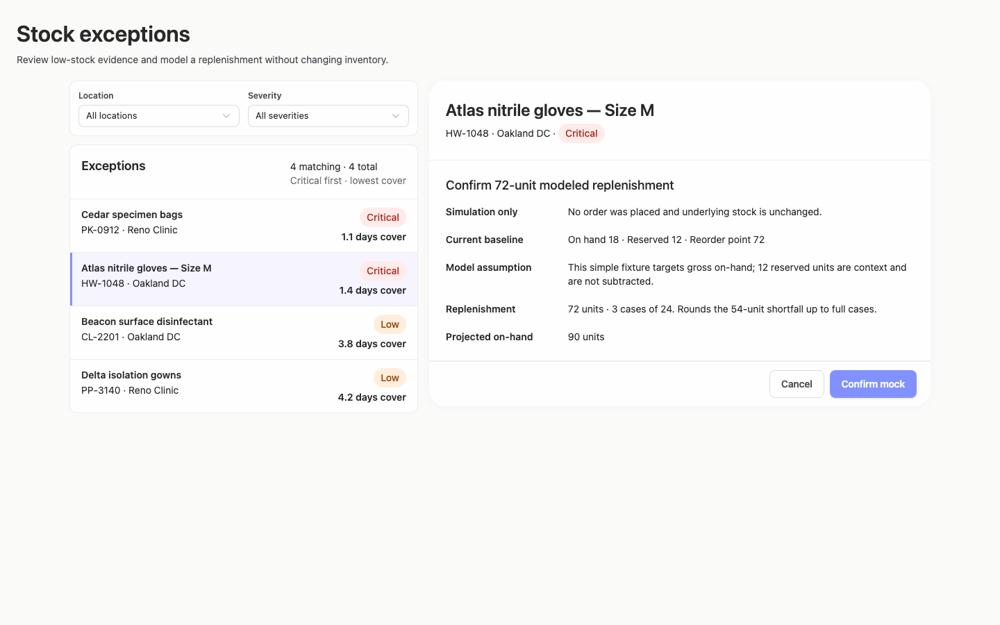

### desktop-2 — Mock replenishment result

Interaction: passed.

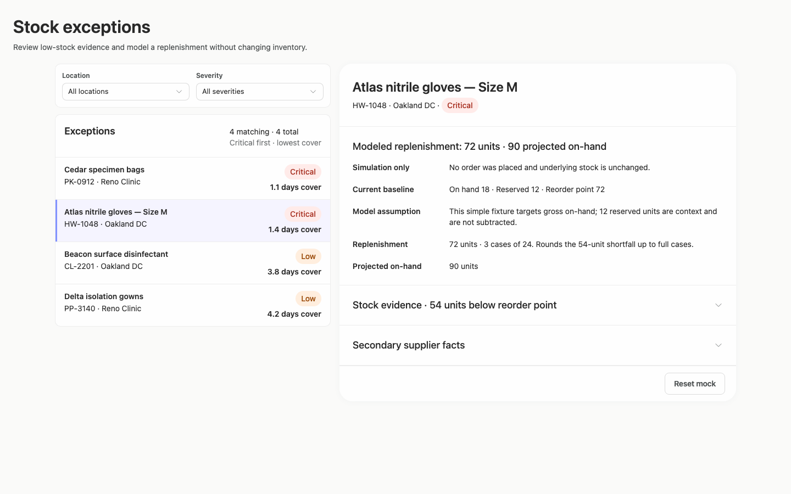

### desktop-3 — Result evidence at scroll boundary

Interaction: passed.

### desktop-4 — Reset from result footer

Interaction: passed.

### desktop-5 — Expanded supplier facts

Interaction: passed.

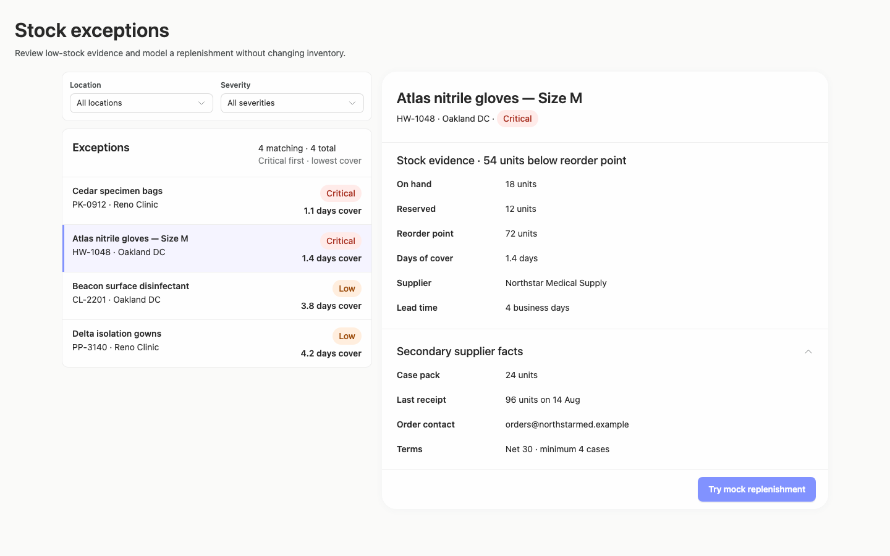

### desktop-wide-0 — initial

Interaction: not-run.

### desktop-wide-1 — Review modeled quantity before confirming

Interaction: passed.

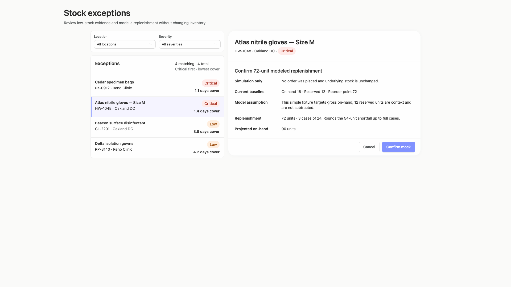

### desktop-wide-2 — Mock replenishment result

Interaction: passed.

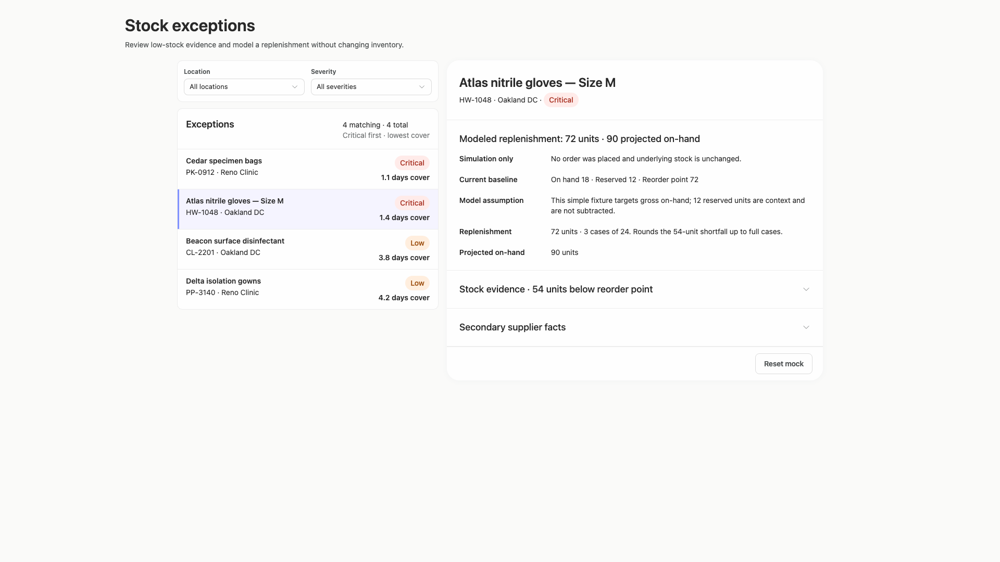

### desktop-wide-3 — Result evidence at scroll boundary

Interaction: passed.

### desktop-wide-4 — Reset from result footer

Interaction: passed.

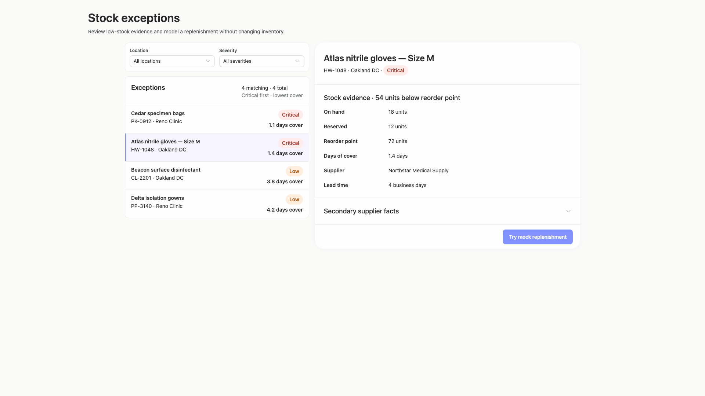

### desktop-wide-5 — Expanded supplier facts

Interaction: passed.

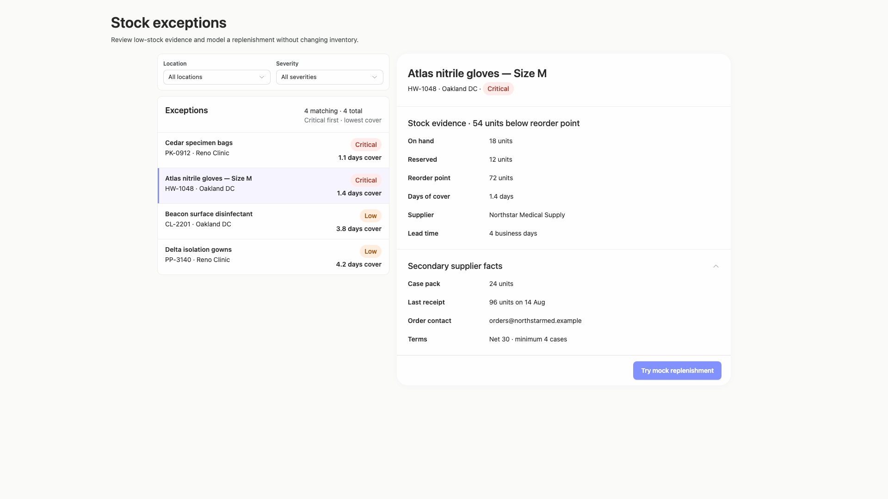

### desktop-window-0 — initial

Interaction: not-run.

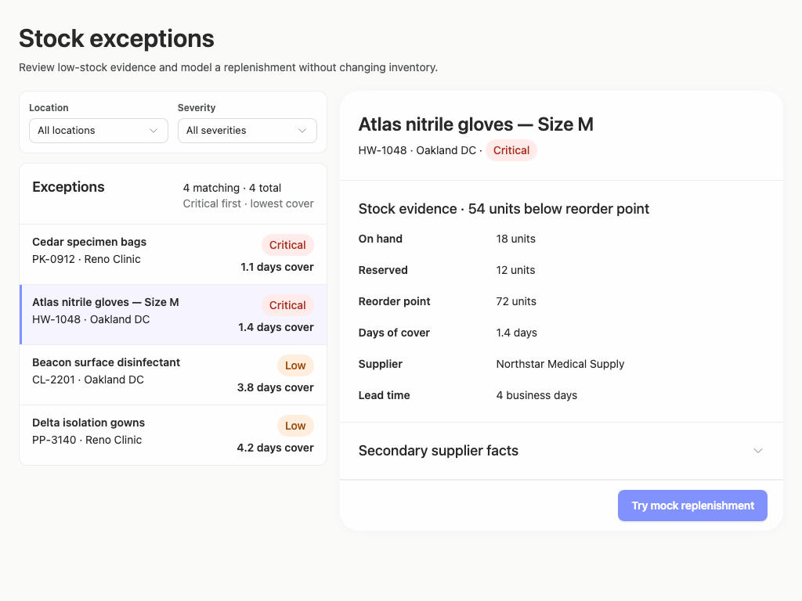

### desktop-window-1 — Review modeled quantity before confirming

Interaction: passed.

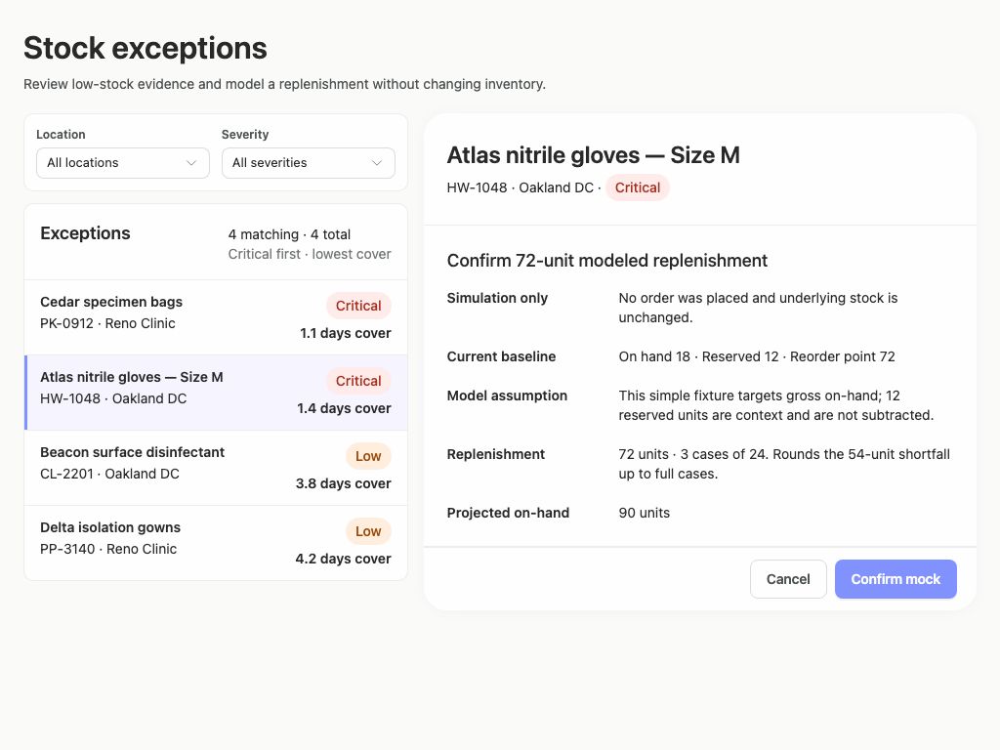

### desktop-window-2 — Mock replenishment result

Interaction: passed.

### desktop-window-3 — Result evidence at scroll boundary

Interaction: passed.

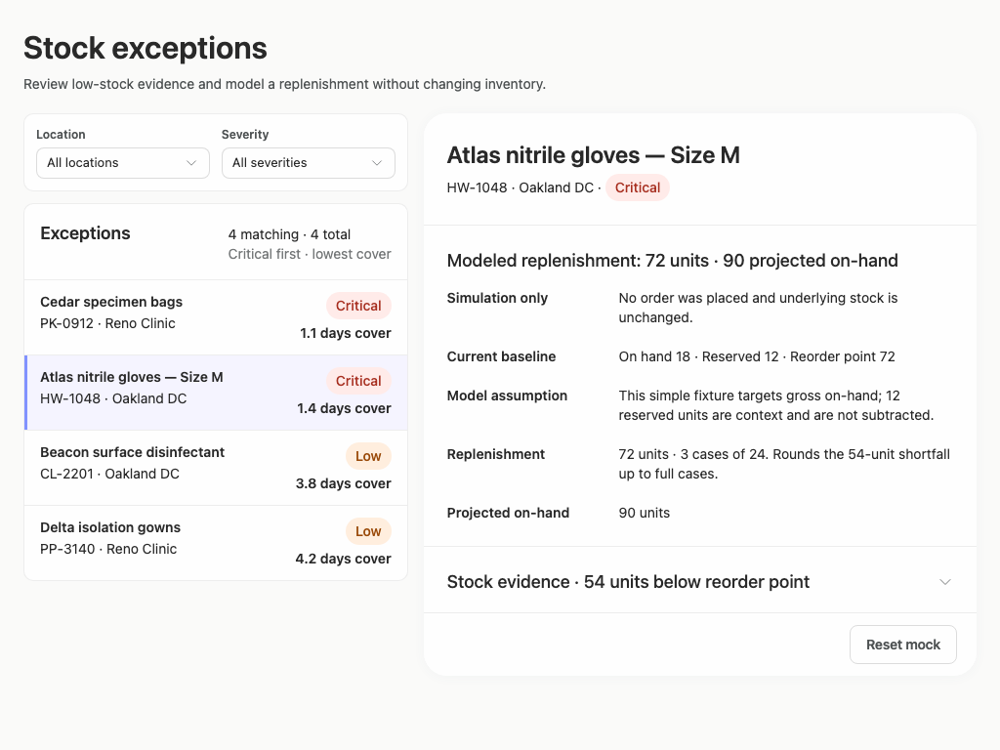

### desktop-window-4 — Reset from result footer

Interaction: passed.

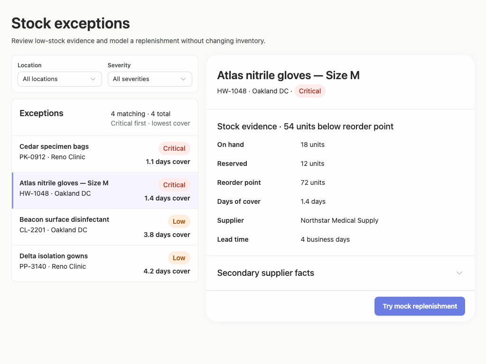

### desktop-window-5 — Expanded supplier facts

Interaction: passed.

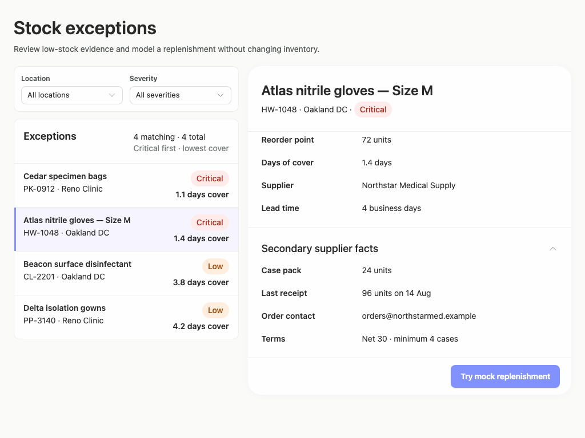

### desktop-custom-700x900-0 — initial

Interaction: not-run.

### desktop-custom-700x900-1 — Review modeled quantity before confirming

Interaction: passed.

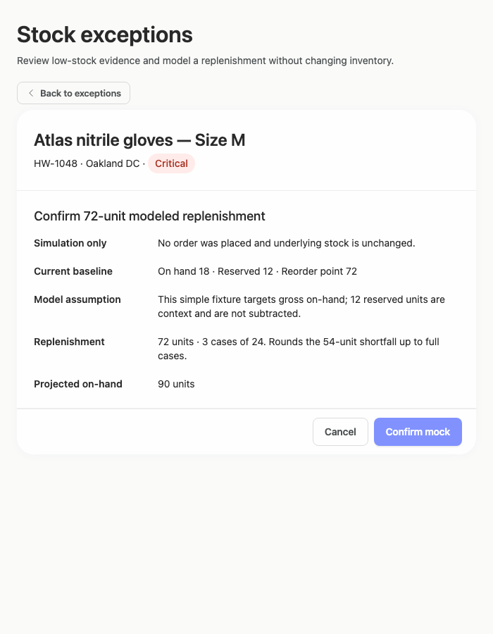

### desktop-custom-700x900-2 — Mock replenishment result

Interaction: passed.

### desktop-custom-700x900-3 — Result evidence at scroll boundary

Interaction: passed.

### desktop-custom-700x900-4 — Reset from result footer

Interaction: passed.

### desktop-custom-700x900-5 — Expanded supplier facts

Interaction: passed.

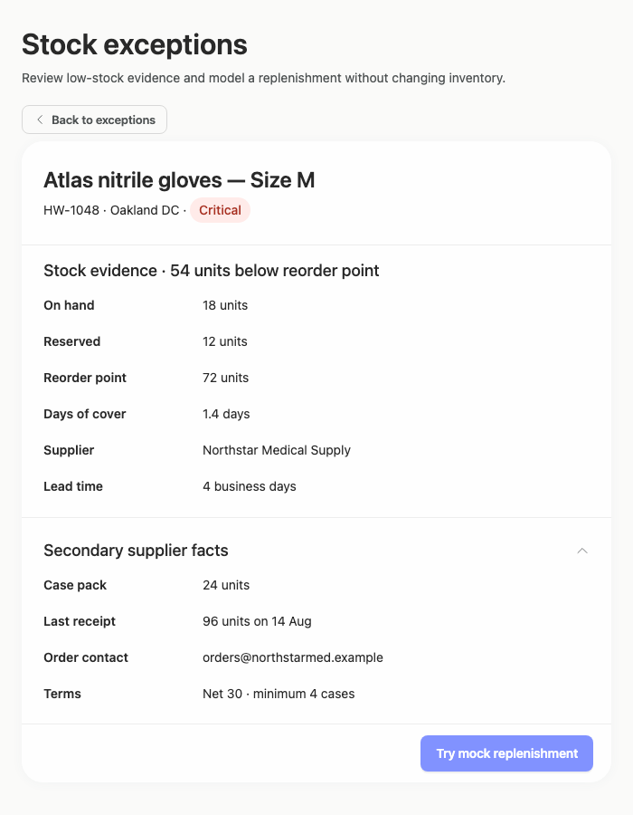

## Limitations

- No implementation-plan artifact is visible in the supplied images, so its quality and completeness cannot be evaluated.
- The screenshots show filter controls but not filtered result or empty-result states; those outcomes were not assessed.
- At 700 pixels, only the selected-detail state is shown. The exception list and filters after activating Back were not provided.
- Static captures and passed text checks do not establish persistence, authorization, supplier validation, or real inventory behavior.
- Automated contrast findings are advisory. The existing Arrusted palette remains authoritative, and no local recoloring or primary-button restyling is recommended.
- The expanded-panel scroll position may have been chosen to expose expected evidence during capture; user-driven scroll behavior was not independently tested.
