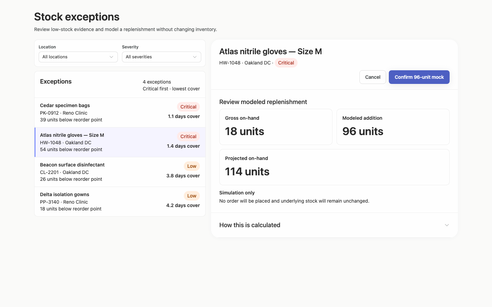
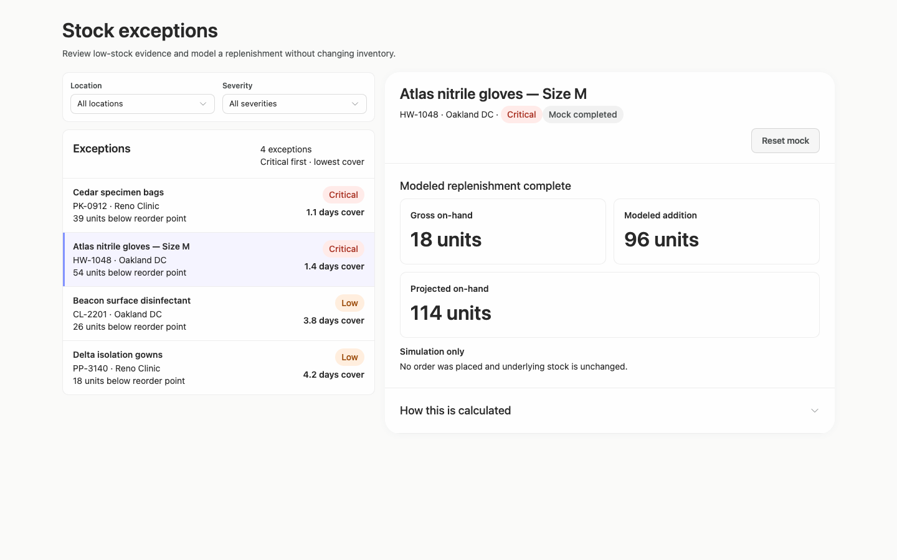
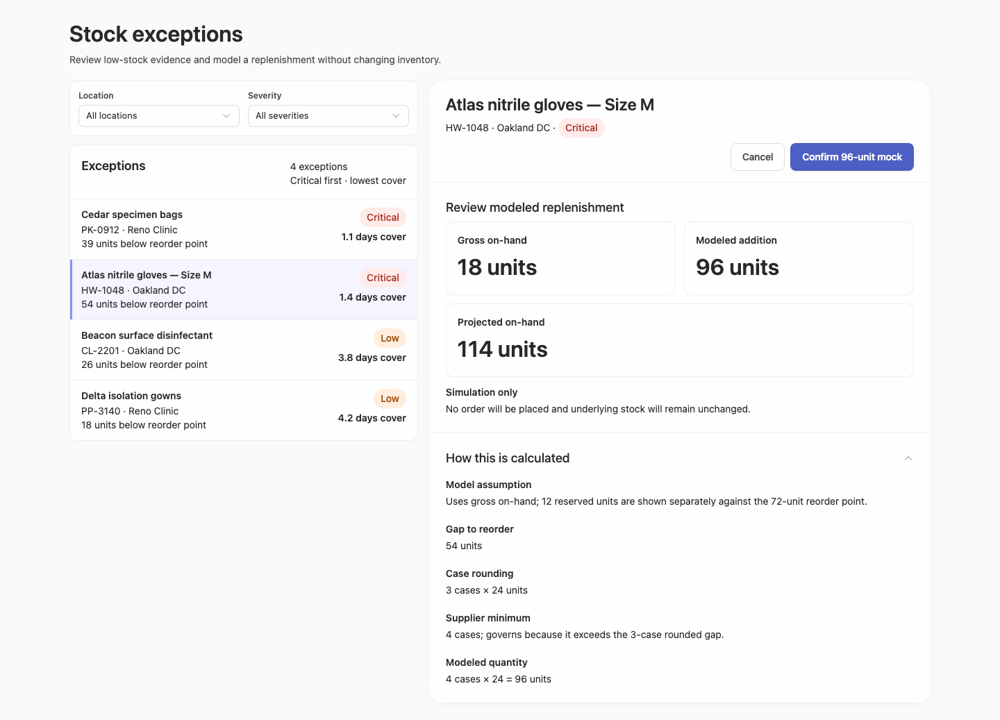
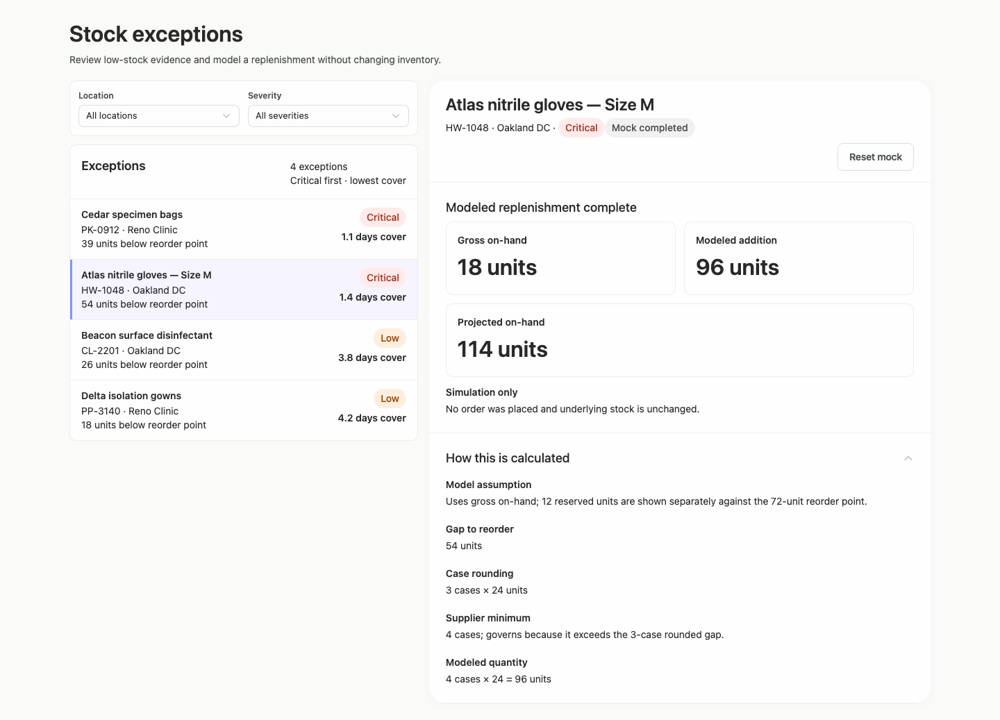
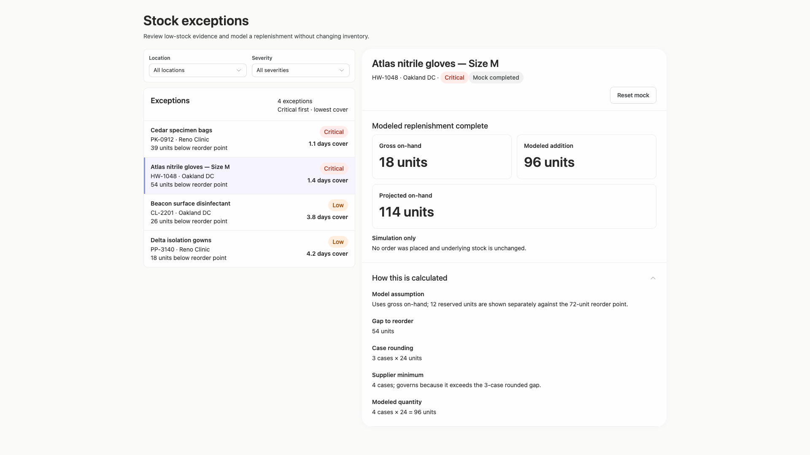
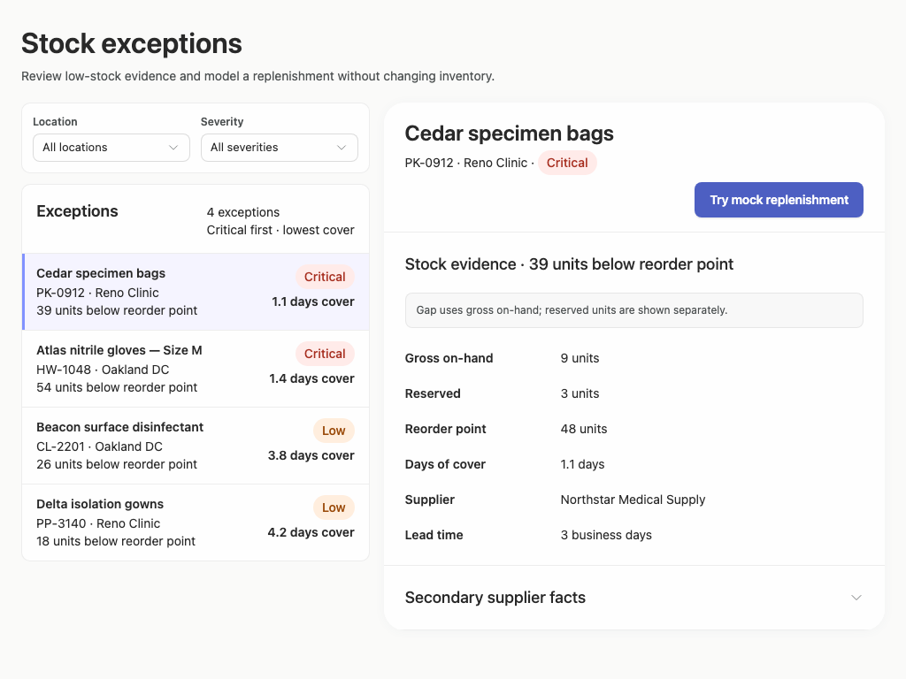
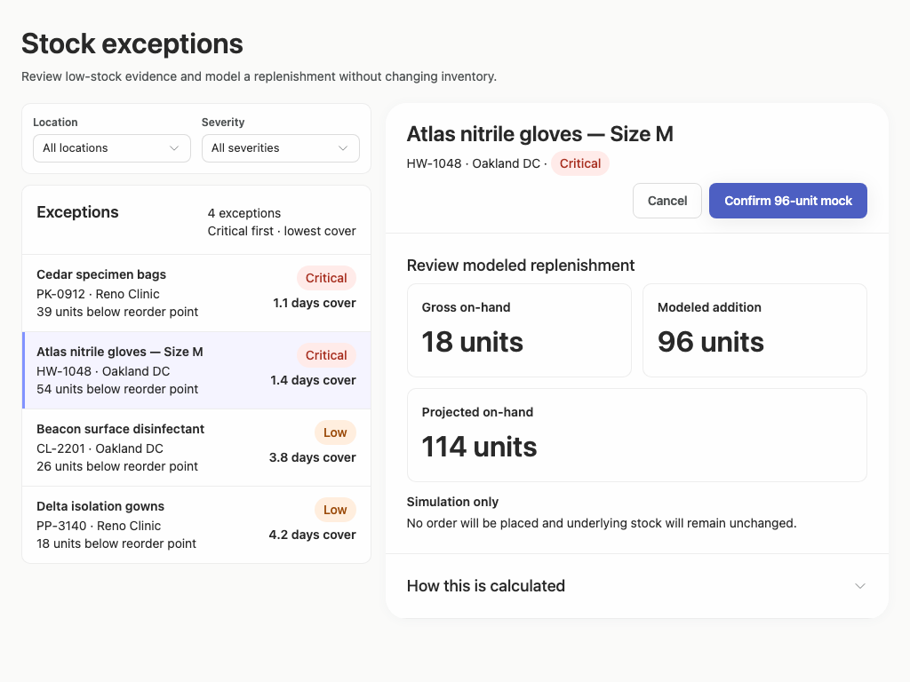
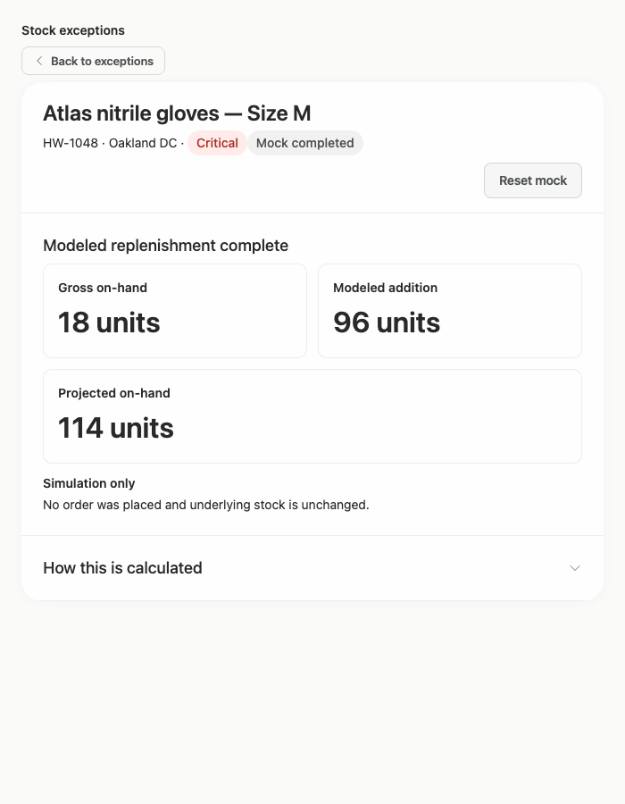
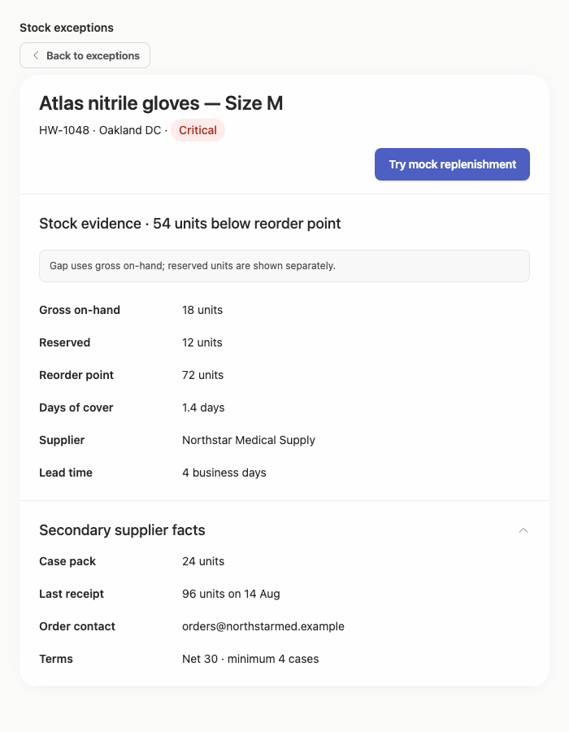

# stock-exceptions-ranked-selection — 2026-09-09T12:22:01.012Z

[All reports](../../README.md) · [Interactive HTML report](index.html) · [Full measurements and scoring](report.json)

GitHub renders this summary and the screenshots. Download or clone this folder to open the HTML report locally; GitHub does not serve it as a website.

**Subjective design score:** 90/100. Model: openai/gpt-5.6-sol. Rubric: 2.

**Arrusted adherence:** 100/100 (partial); evidence coverage 1.88%. Evaluator 3.

| Dimension | Conforming | Nonconforming | Unassessed | Adherence    |
| --------- | ---------- | ------------- | ---------- | ------------ |
| component | 23         | 0             | 5          | 100% (23/23) |
| api       | 60         | 0             | 12         | 100% (60/60) |
| styling   | 13         | 0             | 4995       | 100% (13/13) |

Scores from different evaluator versions or captured states are not directly comparable.

This report evaluates the captured preview; evaluation itself does not regenerate the app or prove a built backend. Scores are advisory and not human-calibrated.

## Ratings

| Dimension      | Score | Reason                                                                                                                                                                                                                                                                                                                                                                                                                                                 |
| -------------- | ----- | ------------------------------------------------------------------------------------------------------------------------------------------------------------------------------------------------------------------------------------------------------------------------------------------------------------------------------------------------------------------------------------------------------------------------------------------------------ |
| hierarchy      | 4/4   | The page title and filters establish context, the exception list emphasizes severity and days of cover, and the selected row is clearly distinguished. Detail states give the modeled quantities strong prominence while keeping supplier facts and calculation derivation secondary in disclosures.                                                                                                                                                   |
| layout         | 3/4   | The centered two-pane composition is consistently aligned and comfortably dense at 1024–1920 px, while the 700 px view switches cleanly between list and detail. Minor inefficiencies remain: constrained detail headers use a relatively tall band for identity and right-aligned actions, and the wide view leaves substantial unused space around a fairly small result set.                                                                        |
| typography     | 4/4   | Heading levels, labels, values, helper text, and status pills are visually consistent and highly readable. Large quantity figures such as 18, 96, and 114 units support rapid comparison without overwhelming the record identity or action labels.                                                                                                                                                                                                    |
| responsive     | 4/4   | The composition remains usable across the provided 1920, 1440, 1024, and 700 px desktop captures. At 700 px it intentionally defers detail until selection, provides a clear Back to exceptions control, preserves full-width filters, and keeps review actions and disclosures usable without horizontal overflow.                                                                                                                                    |
| productClarity | 3/4   | The workflow is immediately understandable: filter exceptions, select a product, inspect stock and supplier evidence, review a modeled quantity, confirm the mock, and reset it. Repeated Simulation only messaging clearly prevents confusion with a real order, though the reason for the 96-unit recommendation is initially hidden and list-row opening is mostly communicated through instructional copy rather than a persistent row affordance. |

## Strengths

- Strong master-detail workflow with clear selection, severity, shortage, and days-cover evidence.
- Location and severity filters are placed before the result set and remain usable at every supplied desktop width.
- Mock replenishment has distinct review, completed, and reset states, with explicit messaging that inventory is unchanged.
- Supplier facts and calculation derivation use progressive disclosure to keep the default detail view concise.
- The constrained desktop composition correctly replaces simultaneous panes with list-first navigation and a visible return action.
- The supplied captures show no clipping or horizontal document overflow, and reported accessibility checks contain no violations.

## Improvements

- **medium — desktop-window-1:** The review state prominently shows a 96-unit modeled addition, but the immediately visible summary does not explain that it represents four 24-unit cases governed by the supplier minimum. Users must expand How this is calculated before they can validate the recommendation. Add one compact explanatory line near Modeled addition, such as “4 cases × 24 · supplier minimum,” using existing Typography or Tag variants; retain the disclosure for the full derivation.
- **low — desktop-custom-700x900-0:** The constrained exception rows are visually clean but rely mainly on the instruction “Open an exception” to communicate that each full row is selectable. There is no persistent trailing chevron or compact action cue. Use a supported RecordList row treatment with a trailing navigation icon or compact secondary “Review” cue, while preserving the current severity and days-cover alignment.
- **low — desktop-custom-700x900-1:** In constrained detail, the title and metadata occupy the upper-left while the actions wrap onto a separate lower-right row, leaving a broad inactive area in the record header and slightly separating the action from its context. Use the supported wrapping header-action placement with tighter vertical spacing, or place the action group directly after the metadata in the same wrapping flow so the header remains compact without changing button styling.

## Token evidence

Percentages cover only assessed properties. Missing provenance and ambiguous CSS remain unassessed; matching literals are not proof of token usage.

| Viewport                 | Category   | Token references / assessed | Coverage   |
| ------------------------ | ---------- | --------------------------- | ---------- |
| desktop-0                | color      | 0/0                         | 0% (0/233) |
| desktop-0                | typography | 0/0                         | 0% (0/522) |
| desktop-0                | spacing    | 0/0                         | 0% (0/267) |
| desktop-0                | radius     | 0/0                         | 0% (0/116) |
| desktop-0                | border     | 0/0                         | 0% (0/126) |
| desktop-0                | shadow     | 0/0                         | 0% (0/120) |
| desktop-wide-0           | color      | 0/0                         | 0% (0/233) |
| desktop-wide-0           | typography | 0/0                         | 0% (0/522) |
| desktop-wide-0           | spacing    | 0/0                         | 0% (0/267) |
| desktop-wide-0           | radius     | 0/0                         | 0% (0/116) |
| desktop-wide-0           | border     | 0/0                         | 0% (0/126) |
| desktop-wide-0           | shadow     | 0/0                         | 0% (0/120) |
| desktop-window-0         | color      | 0/0                         | 0% (0/233) |
| desktop-window-0         | typography | 0/0                         | 0% (0/522) |
| desktop-window-0         | spacing    | 0/0                         | 0% (0/267) |
| desktop-window-0         | radius     | 0/0                         | 0% (0/116) |
| desktop-window-0         | border     | 0/0                         | 0% (0/126) |
| desktop-window-0         | shadow     | 0/0                         | 0% (0/120) |
| desktop-custom-700x900-0 | color      | 0/0                         | 0% (0/144) |
| desktop-custom-700x900-0 | typography | 0/0                         | 0% (0/302) |
| desktop-custom-700x900-0 | spacing    | 0/0                         | 0% (0/169) |
| desktop-custom-700x900-0 | radius     | 0/0                         | 0% (0/72)  |
| desktop-custom-700x900-0 | border     | 0/0                         | 0% (0/80)  |
| desktop-custom-700x900-0 | shadow     | 0/0                         | 0% (0/76)  |

## Latest-run screenshots

### desktop-0 — initial

Interaction: not-run.

### desktop-1 — Review modeled quantity

Interaction: passed.

### desktop-2 — Confirm modeled replenishment

Interaction: passed.

### desktop-3 — Read projected quantity

Interaction: passed.

### desktop-4 — Reset fixture result

Interaction: passed.

### desktop-5 — Inspect supplier facts

Interaction: passed.

### desktop-6 — Expand confirmation derivation

Interaction: passed.

### desktop-7 — Expand completed derivation

Interaction: passed.

### desktop-wide-0 — initial

Interaction: not-run.

### desktop-wide-1 — Review modeled quantity

Interaction: passed.

### desktop-wide-2 — Confirm modeled replenishment

Interaction: passed.

### desktop-wide-3 — Read projected quantity

Interaction: passed.

### desktop-wide-4 — Reset fixture result

Interaction: passed.

### desktop-wide-5 — Inspect supplier facts

Interaction: passed.

### desktop-wide-6 — Expand confirmation derivation

Interaction: passed.

### desktop-wide-7 — Expand completed derivation

Interaction: passed.

### desktop-window-0 — initial

Interaction: not-run.

### desktop-window-1 — Review modeled quantity

Interaction: passed.

### desktop-window-2 — Confirm modeled replenishment

Interaction: passed.

### desktop-window-3 — Read projected quantity

Interaction: passed.

### desktop-window-4 — Reset fixture result

Interaction: passed.

### desktop-window-5 — Inspect supplier facts

Interaction: passed.

### desktop-window-6 — Expand confirmation derivation

Interaction: passed.

### desktop-window-7 — Expand completed derivation

Interaction: passed.

### desktop-custom-700x900-0 — initial

Interaction: not-run.

### desktop-custom-700x900-1 — Review modeled quantity

Interaction: passed.

### desktop-custom-700x900-2 — Confirm modeled replenishment

Interaction: passed.

### desktop-custom-700x900-3 — Read projected quantity

Interaction: passed.

### desktop-custom-700x900-4 — Reset fixture result

Interaction: passed.

### desktop-custom-700x900-5 — Inspect supplier facts

Interaction: passed.

### desktop-custom-700x900-6 — Expand confirmation derivation

Interaction: passed.

### desktop-custom-700x900-7 — Expand completed derivation

Interaction: passed.

## Limitations

- No implementation plan artifact was provided, so its completeness and handoff quality cannot be assessed.
- No screenshots demonstrate applied location or severity filters, zero-result behavior, or changing result counts.
- The narrowest supplied desktop composition is 700 px; behavior in narrower desktop panels was not observed.
- Interaction evidence covers the mock replenishment, reset, supplier disclosure, and calculation disclosure flows, but not every list item or filter option.
- Screenshots and static evidence do not establish persistence, authorization, real inventory behavior, or backend correctness.
- Styling provenance coverage is very limited in the supplied adherence evidence, so palette and token implementation cannot be fully verified from it.
