# stock-exceptions-reachable-actions — 2026-09-09T04:34:43.346Z

[All reports](../../README.md) · [Interactive HTML report](index.html) · [Full measurements and scoring](report.json)

GitHub renders this summary and the screenshots. Download or clone this folder to open the HTML report locally; GitHub does not serve it as a website.

**Subjective design score:** 80/100. Model: openai/gpt-5.6-sol. Rubric: 2.

**Arrusted adherence:** 100/100 (partial); evidence coverage 1.55%. Evaluator 3.

| Dimension | Conforming | Nonconforming | Unassessed | Adherence    |
| --------- | ---------- | ------------- | ---------- | ------------ |
| component | 21         | 0             | 4          | 100% (21/21) |
| api       | 52         | 0             | 13         | 100% (52/52) |
| styling   | 10         | 0             | 5247       | 100% (10/10) |

Scores from different evaluator versions or captured states are not directly comparable.

This report evaluates the captured preview; evaluation itself does not regenerate the app or prove a built backend. Scores are advisory and not human-calibrated.

## Ratings

| Dimension | Score | Reason |
| --- | --- | --- |
| hierarchy | 3/4 | The page title, filters, exception list, selected product, stock decision, and replenishment action form a clear task sequence. Selection highlighting and severity labels support scanning, though supplier information is visually de-emphasized in a collapsed section despite being a core review requirement. |
| layout | 3/4 | Alignment and spacing are consistent, with a balanced list-detail split at 1024–1440px and comfortably sized controls. At 1920px the composition stretches almost edge to edge, producing very wide cards, long reading lines, and substantial unused space below the content. |
| typography | 3/4 | Headings, product names, labels, and values use a consistent hierarchy and remain readable across captures. Several secondary labels and compact status details are very small and muted; automated evidence repeatedly flags marginal contrast for metadata and status text, so those details may be harder to read even though the palette is preserved. |
| responsive | 4/4 | The composition adapts effectively across the supplied 1920px, 1440px, 1024px, and 700px desktop windows. Wide and medium windows retain list-detail context, while the 700px panel switches to a focused detail view with a clear Back to exceptions control; filters and actions remain usable, and the longer result state scrolls vertically without horizontal overflow. |
| productClarity | 3/4 | The interface clearly identifies low-stock exceptions, supports location and severity filtering, synchronizes selection, explains that replenishment is reversible and will not contact the supplier, and provides explicit success and reset states. Empty-filter messaging is also clear. Supplier review is less immediate because Supplier details is collapsed in every populated capture, and the initial compact-panel view begins on a selected detail rather than showing the available exceptions. |

## Strengths

- Clear master-detail workflow with visible selected-row treatment and synchronized filtering.
- Severity, location, SKU, on-hand quantity, safety stock, incoming stock, and suggested order provide useful decision context.
- Mock replenishment copy clearly distinguishes a preview from a real supplier or inventory action.
- The success state confirms quantity, product, supplier, and that no order or stock change occurred; Reset mock provides an obvious reversal.
- Empty results show both a zero count and actionable guidance, while clearing selection from the detail area.
- The constrained 700px desktop-panel composition uses a focused detail view and a visible back affordance rather than compressing both panes.
- The supplied captures preserve the established Arrusted palette and show consistent public-component styling.

## Improvements

- **medium — desktop-wide-0:** At 1920px the list-detail composition expands across nearly the entire window. The detail card becomes about 1100px wide, making the replenishment explanation a long line while leaving a large field of unused space below; this weakens density and reading focus. Place the list-detail composition in a centered, bounded content region or cap the pane widths using the supported wide list-detail composition behavior, allowing outer whitespace rather than continuously stretching both cards.
- **medium — desktop-0:** Supplier details is collapsed and visually separated at the bottom in every populated state shown. Because reviewing supplier details is part of the brief, users may reach the replenishment action without seeing the supplier evidence beyond its name in explanatory copy. Expand Supplier details by default for a newly selected exception, or surface a short supplier summary immediately above the mock action while keeping additional fields in the Disclosure.
- **low — desktop-window-0:** The severity and days-cover information is compressed into a very small pill at the far edge of the record header. Automated evidence also reports weak readability for compact status text, so the important days-cover value may be easy to miss. Keep Critical in the status pill but present “0.6 days cover” as regular record metadata near the title or stock-decision values, using an existing Typography treatment rather than relying on tiny pill content.
- **low — desktop-4:** When filters return no records, the right pane adds a separate “Select an exception to review” placeholder even though the left pane already explains that no exceptions match. The two messages describe different conditions and split attention. For a zero-result filter state, let the list empty state span the working area or change the detail placeholder to directly reinforce the filter outcome and Clear filters action.

## Token evidence

Percentages cover only assessed properties. Missing provenance and ambiguous CSS remain unassessed; matching literals are not proof of token usage.

| Viewport | Category | Token references / assessed | Coverage |
| --- | --- | --- | --- |
| desktop-0 | color | 0/0 | 0% (0/223) |
| desktop-0 | typography | 0/0 | 0% (0/507) |
| desktop-0 | spacing | 0/0 | 0% (0/280) |
| desktop-0 | radius | 0/0 | 0% (0/115) |
| desktop-0 | border | 0/0 | 0% (0/131) |
| desktop-0 | shadow | 0/0 | 0% (0/120) |
| desktop-wide-0 | color | 0/0 | 0% (0/223) |
| desktop-wide-0 | typography | 0/0 | 0% (0/507) |
| desktop-wide-0 | spacing | 0/0 | 0% (0/280) |
| desktop-wide-0 | radius | 0/0 | 0% (0/115) |
| desktop-wide-0 | border | 0/0 | 0% (0/131) |
| desktop-wide-0 | shadow | 0/0 | 0% (0/120) |
| desktop-window-0 | color | 0/0 | 0% (0/223) |
| desktop-window-0 | typography | 0/0 | 0% (0/507) |
| desktop-window-0 | spacing | 0/0 | 0% (0/280) |
| desktop-window-0 | radius | 0/0 | 0% (0/115) |
| desktop-window-0 | border | 0/0 | 0% (0/131) |
| desktop-window-0 | shadow | 0/0 | 0% (0/120) |
| desktop-custom-700x900-0 | color | 0/0 | 0% (0/178) |
| desktop-custom-700x900-0 | typography | 0/0 | 0% (0/447) |
| desktop-custom-700x900-0 | spacing | 0/0 | 0% (0/215) |
| desktop-custom-700x900-0 | radius | 0/0 | 0% (0/91) |
| desktop-custom-700x900-0 | border | 0/0 | 0% (0/97) |
| desktop-custom-700x900-0 | shadow | 0/0 | 0% (0/91) |

## Latest-run screenshots

### desktop-0 — initial

Interaction: not-run.

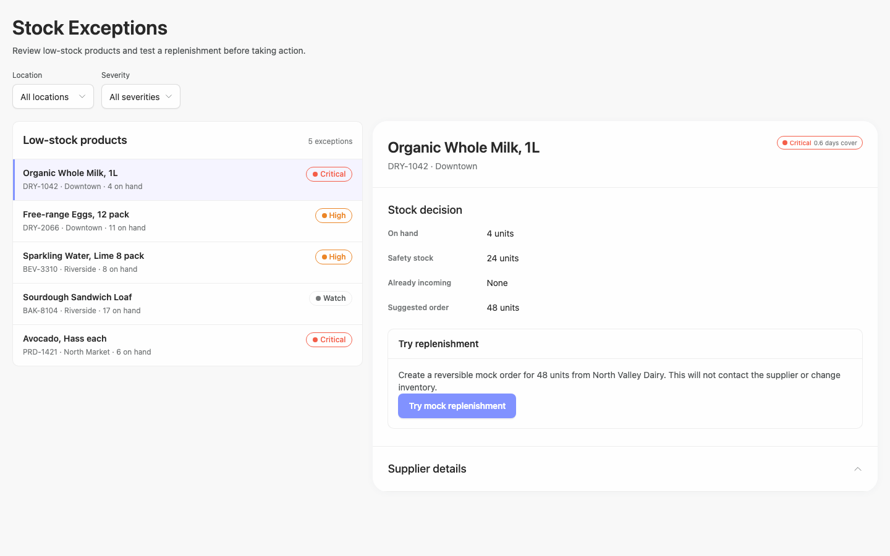

### desktop-1 — Mock replenishment result

Interaction: passed.

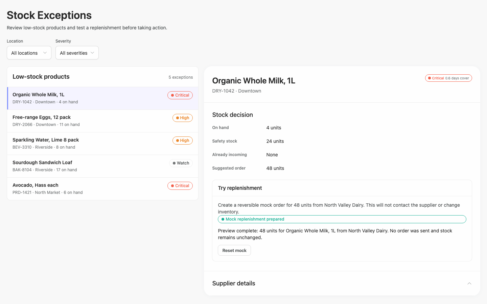

### desktop-2 — Reset mock result

Interaction: passed.

### desktop-3 — Filter and synchronize selection

Interaction: passed.

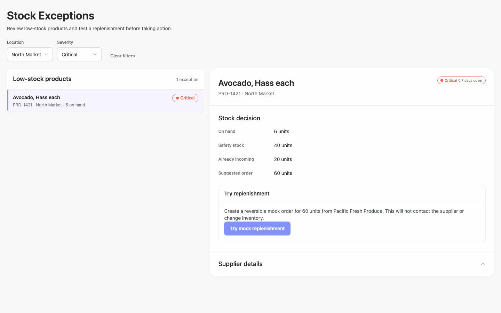

### desktop-4 — Empty filtered state

Interaction: passed.

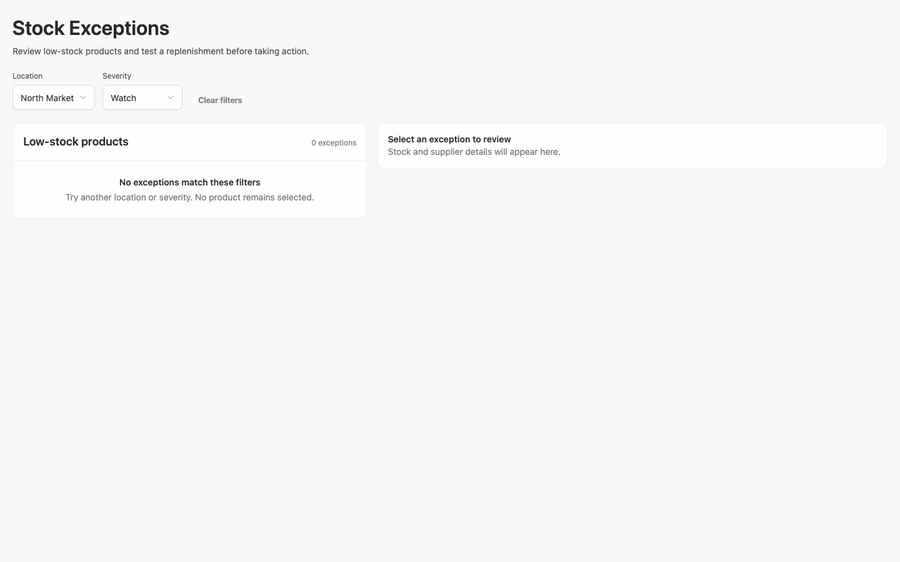

### desktop-wide-0 — initial

Interaction: not-run.

### desktop-wide-1 — Mock replenishment result

Interaction: passed.

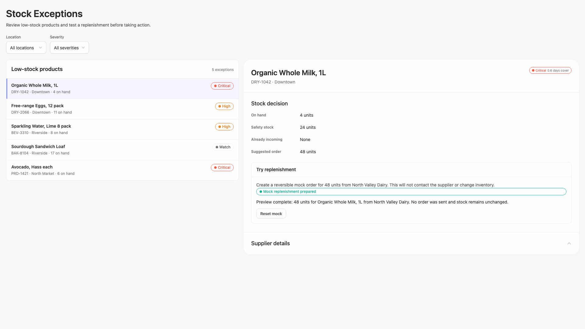

### desktop-wide-2 — Reset mock result

Interaction: passed.

### desktop-wide-3 — Filter and synchronize selection

Interaction: passed.

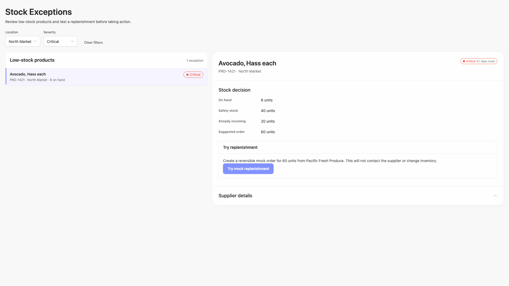

### desktop-wide-4 — Empty filtered state

Interaction: passed.

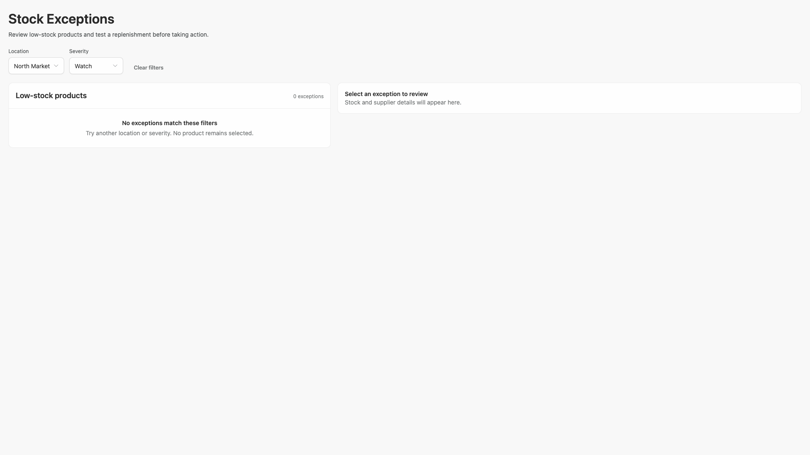

### desktop-window-0 — initial

Interaction: not-run.

### desktop-window-1 — Mock replenishment result

Interaction: passed.

### desktop-window-2 — Reset mock result

Interaction: passed.

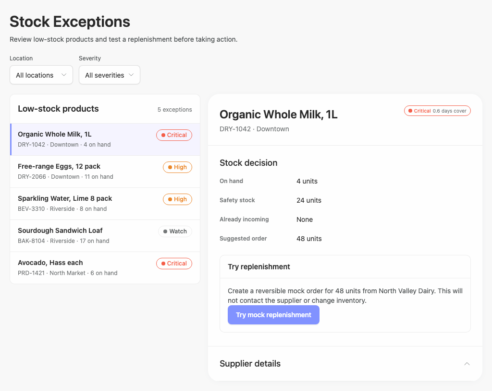

### desktop-window-3 — Filter and synchronize selection

Interaction: passed.

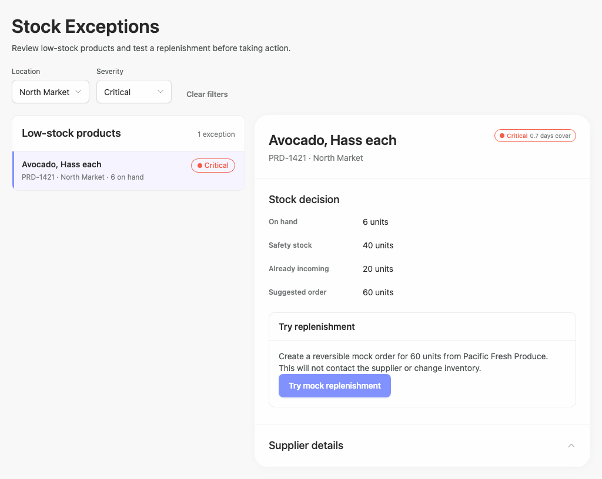

### desktop-window-4 — Empty filtered state

Interaction: passed.

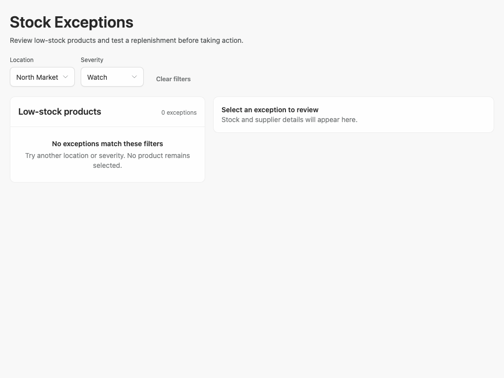

### desktop-custom-700x900-0 — initial

Interaction: not-run.

### desktop-custom-700x900-1 — Mock replenishment result

Interaction: passed.

### desktop-custom-700x900-2 — Reset mock result

Interaction: passed.

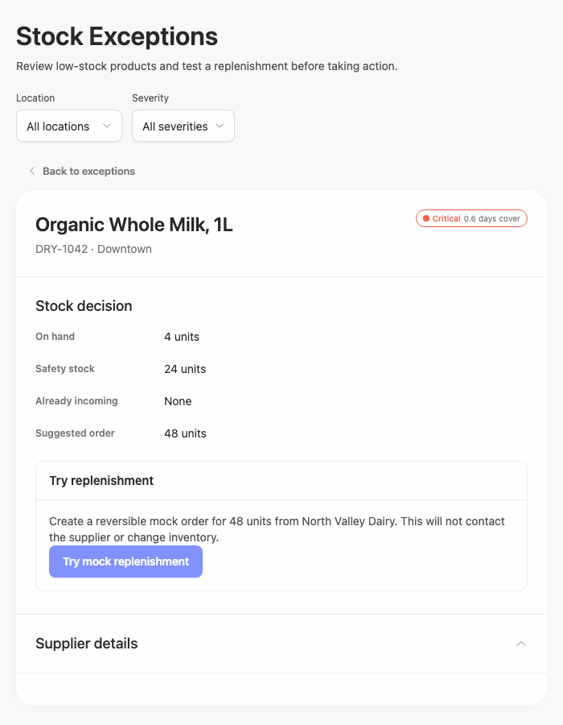

### desktop-custom-700x900-3 — Filter and synchronize selection

Interaction: passed.

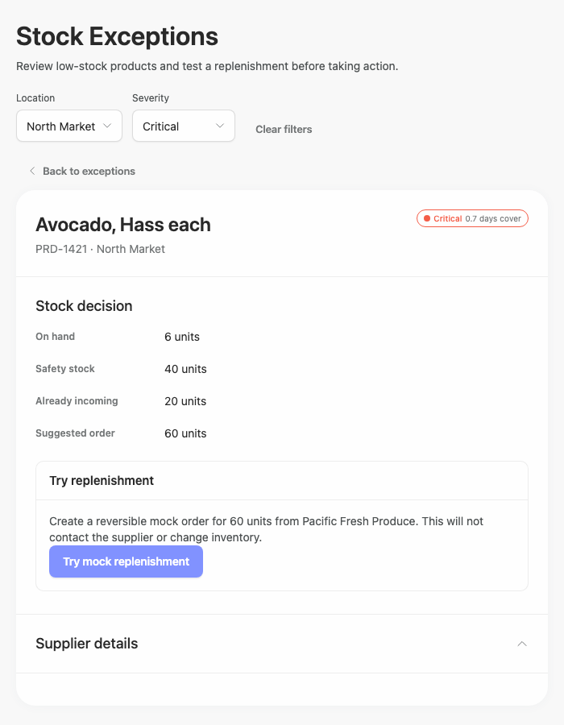

### desktop-custom-700x900-4 — Empty filtered state

Interaction: passed.

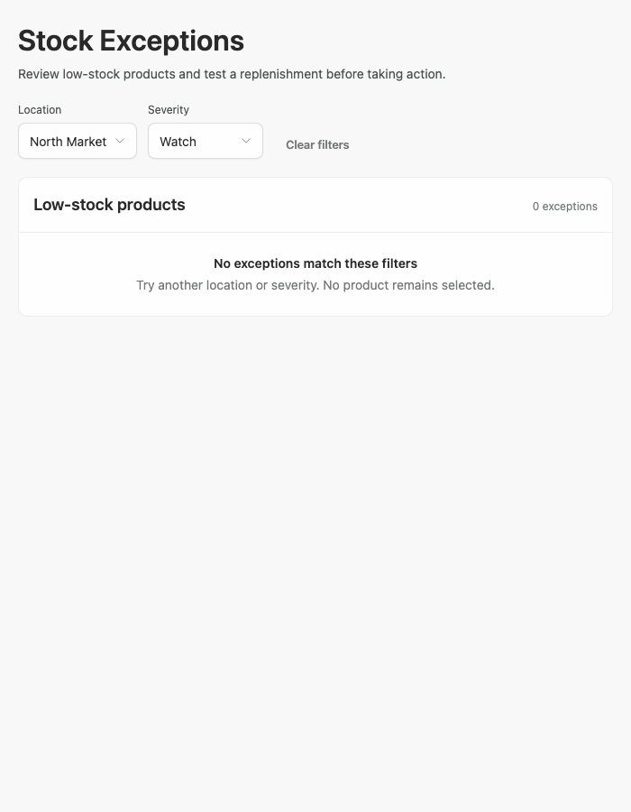

## Limitations

- Only static captures and reported interaction outcomes were supplied; hover, focus, keyboard traversal, disclosure expansion, select menus, and intermediate loading states were not visually tested.
- The captures demonstrate a visual prototype, but no visible implementation-plan artifact was provided, so completeness of the requested plan cannot be assessed.
- Supplier details content is not visible in any capture, so its information quality, density, and responsiveness are unknown.
- Static source and adherence evidence do not prove all dynamic branches or callbacks rendered; several props and branches remain unassessed.
- Contrast observations come from automated evidence and are advisory. Recommendations preserve the authoritative Arrusted palette and focus on composition or supported variants rather than color overrides.
