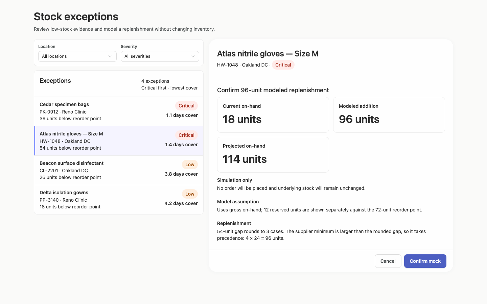
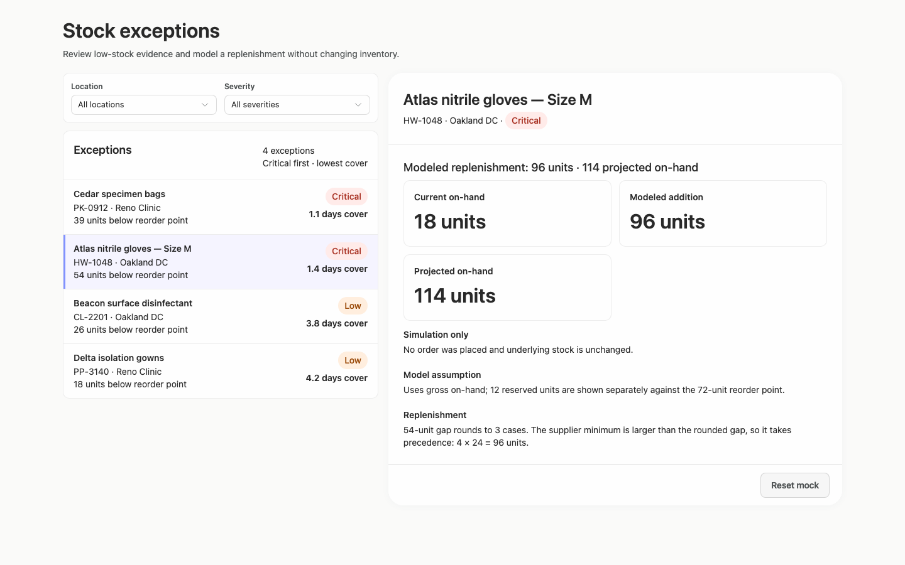
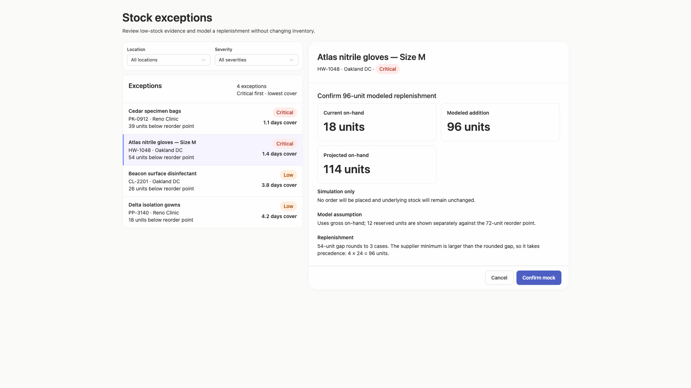
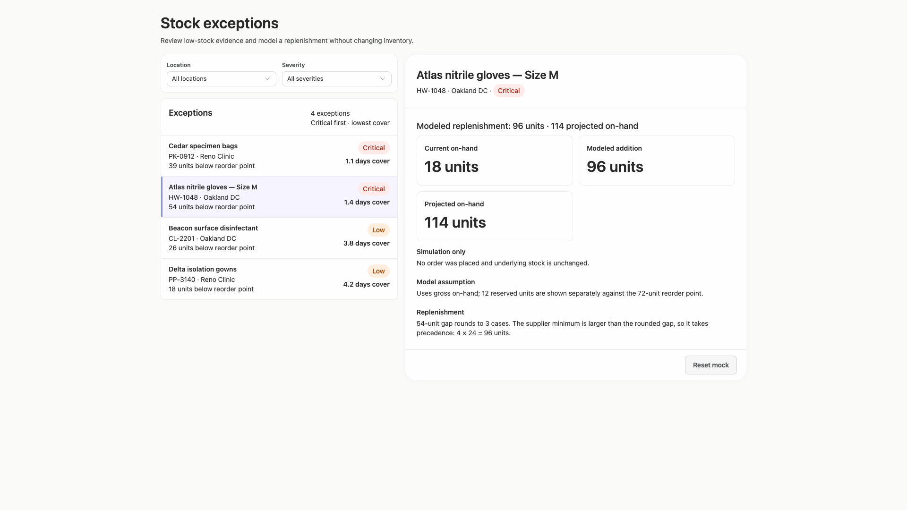
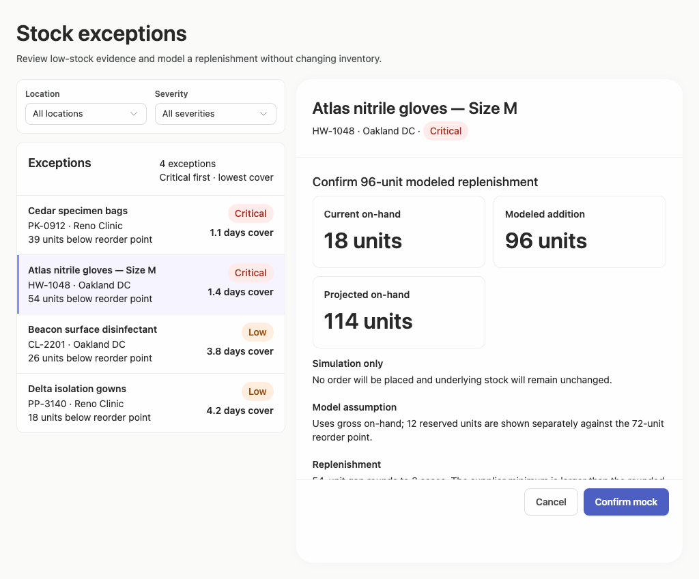
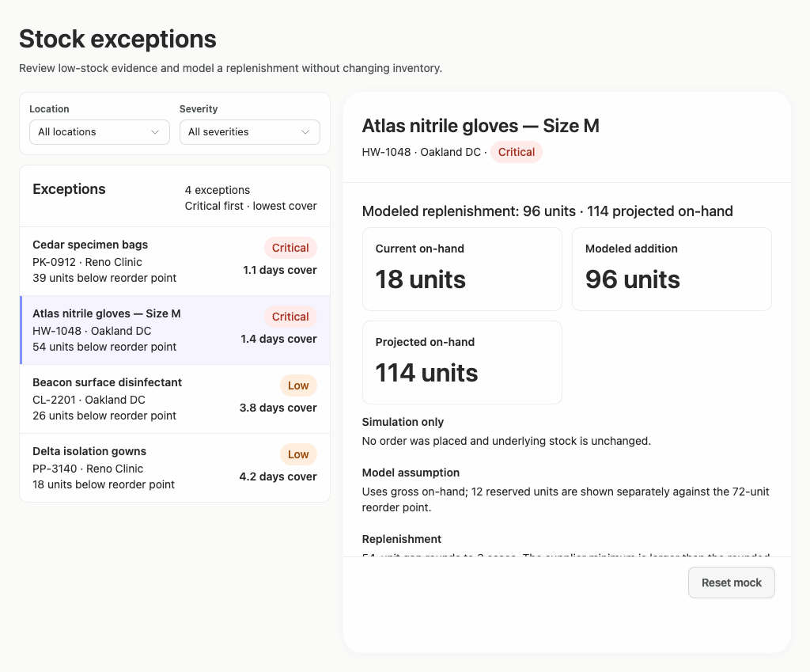
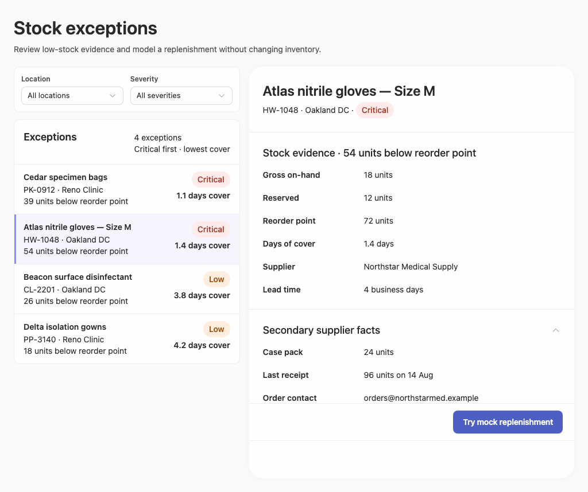
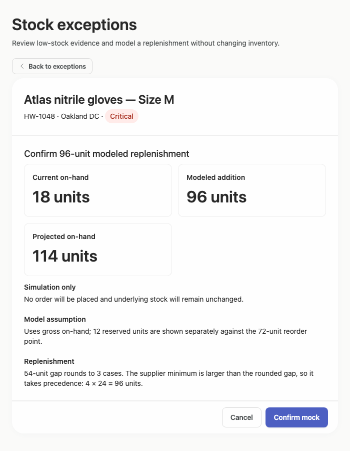
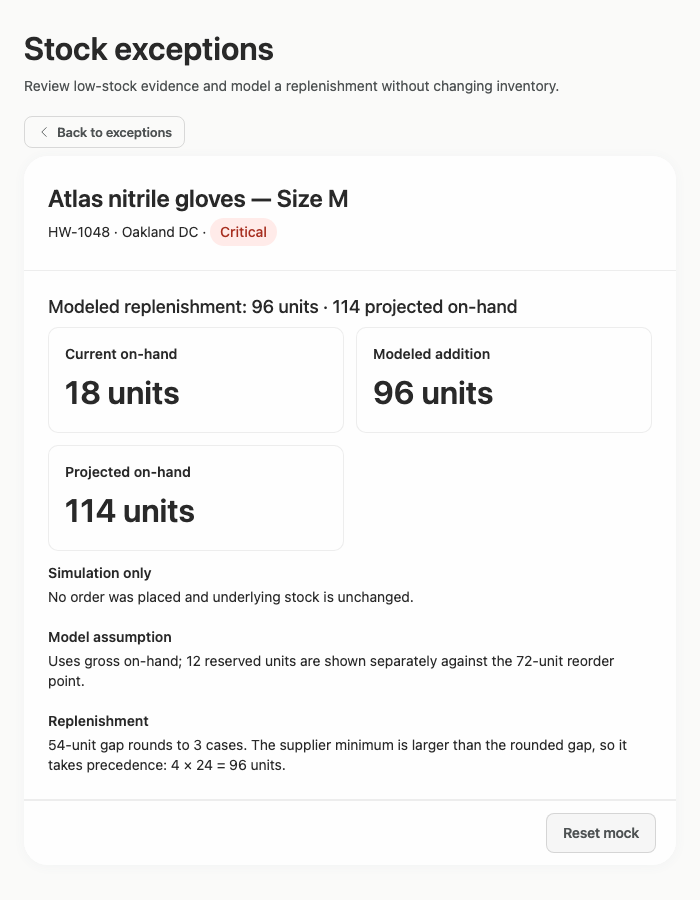

# stock-exceptions-reachable-actions — 2026-09-09T09:46:19.617Z

[All reports](../../README.md) · [Interactive HTML report](index.html) · [Full measurements and scoring](report.json)

GitHub renders this summary and the screenshots. Download or clone this folder to open the HTML report locally; GitHub does not serve it as a website.

**Subjective design score:** 80/100. Model: openai/gpt-5.6-sol. Rubric: 2.

**Arrusted adherence:** 99/100 (partial); evidence coverage 1.81%. Evaluator 3.

| Dimension | Conforming | Nonconforming | Unassessed | Adherence    |
| --------- | ---------- | ------------- | ---------- | ------------ |
| component | 21         | 0             | 3          | 100% (21/21) |
| api       | 57         | 1             | 9          | 98% (57/58)  |
| styling   | 13         | 0             | 4980       | 100% (13/13) |

Scores from different evaluator versions or captured states are not directly comparable.

This report evaluates the captured preview; evaluation itself does not regenerate the app or prove a built backend. Scores are advisory and not human-calibrated.

## Ratings

| Dimension      | Score | Reason                                                                                                                                                                                                                                                                                                                                                                                                                           |
| -------------- | ----- | -------------------------------------------------------------------------------------------------------------------------------------------------------------------------------------------------------------------------------------------------------------------------------------------------------------------------------------------------------------------------------------------------------------------------------- |
| hierarchy      | 3/4   | The page title, filter controls, exception list, selected-record header, evidence, and replenishment action form a clear review sequence. Selected-row treatment, severity pills, and large modeled quantities are easy to scan, though the constrained 700px list initially highlights Atlas before its detail is opened, creating a mildly ambiguous current state.                                                            |
| layout         | 3/4   | The two-pane desktop composition is consistently aligned, with compact list rows, well-grouped record facts, and stable action placement. It uses wide windows conservatively but readably. At the 1024px confirmation and expanded-supplier states, however, the detail footer overlaps or clips the final content instead of preserving a fully usable content area.                                                           |
| typography     | 4/4   | Typography is highly consistent: strong page and record headings, clear label/value differentiation, readable list metadata, and prominent quantity figures. Line lengths remain comfortable across the supplied widths, and no typographic collision is visible outside the separate footer-clipping issue.                                                                                                                     |
| responsive     | 2/4   | The composition successfully changes from side-by-side panes at 1024–1920px to deferred list/detail views with a clear Back action at 700px. Controls and KPI cards resize cleanly, but the intermediate 1024px detail panel clips replenishment text and expanded supplier facts behind its footer, which is a notable usability defect in resized desktop windows.                                                             |
| productClarity | 4/4   | The task is explicit from the subtitle, filters directly match location and severity, list rows expose shortage and days-of-cover evidence, and the selected detail includes stock and supplier facts. The mock flow clearly distinguishes current, added, and projected quantities and repeatedly states that no order or inventory change occurs; confirm, cancel, reset, disclosure, and back affordances are understandable. |

## Strengths

- Directly supports filtering low-stock exceptions by location and severity.
- List rows expose the most decision-relevant evidence—shortage, severity, location, and days of cover—without requiring record opening.
- Strong master-detail relationship through selected-row highlighting and repeated product identity in the detail header.
- Mock replenishment flow clearly explains the 96-unit calculation, projected 114-unit result, supplier minimum, and simulation-only status.
- Constrained desktop composition replaces the two-pane view with a focused detail and explicit Back to exceptions control.
- Expanded supplier facts provide useful case pack, receipt, contact, and terms information without crowding the initial review state.
- Supplied interaction checks passed for confirmation, result, reset, projected quantity, and supplier-fact states, although screenshots do not prove backend behavior.

## Improvements

- **high — desktop-window-1:** The Replenishment section continues underneath the fixed action footer; its paragraph is visibly cut off around y703. This prevents the reviewer from reading the full rationale immediately before confirming the modeled action. Make the detail body the scrollable/document-scrolling region and reserve bottom space equal to the action footer, or use the supported sticky action placement so all replenishment copy can scroll fully above the buttons.
- **high — desktop-window-5:** The expanded supplier section is clipped by the action footer. The order-contact row is partially obscured and the Terms row visible at other widths is not available in this captured 1024px state. Allow the expanded detail content to determine document height or scroll beneath a supported sticky footer with adequate bottom padding; verify that every supplier row remains reachable at this panel height.
- **low — desktop-custom-700x900-0:** Atlas is rendered with selected-row styling even though the constrained initial state still shows only the list. This can imply that the highlighted record is already open or that an action has occurred when the user must select it again to reveal detail. On constrained list-only views, defer selected styling until the user establishes a selection, or add an explicit row cue indicating that activating the highlighted record opens its review detail.

## Token evidence

Percentages cover only assessed properties. Missing provenance and ambiguous CSS remain unassessed; matching literals are not proof of token usage.

| Viewport                 | Category   | Token references / assessed | Coverage   |
| ------------------------ | ---------- | --------------------------- | ---------- |
| desktop-0                | color      | 0/0                         | 0% (0/233) |
| desktop-0                | typography | 0/0                         | 0% (0/522) |
| desktop-0                | spacing    | 0/0                         | 0% (0/275) |
| desktop-0                | radius     | 0/0                         | 0% (0/116) |
| desktop-0                | border     | 0/0                         | 0% (0/125) |
| desktop-0                | shadow     | 0/0                         | 0% (0/120) |
| desktop-wide-0           | color      | 0/0                         | 0% (0/233) |
| desktop-wide-0           | typography | 0/0                         | 0% (0/522) |
| desktop-wide-0           | spacing    | 0/0                         | 0% (0/275) |
| desktop-wide-0           | radius     | 0/0                         | 0% (0/116) |
| desktop-wide-0           | border     | 0/0                         | 0% (0/125) |
| desktop-wide-0           | shadow     | 0/0                         | 0% (0/120) |
| desktop-window-0         | color      | 0/0                         | 0% (0/233) |
| desktop-window-0         | typography | 0/0                         | 0% (0/522) |
| desktop-window-0         | spacing    | 0/0                         | 0% (0/275) |
| desktop-window-0         | radius     | 0/0                         | 0% (0/116) |
| desktop-window-0         | border     | 0/0                         | 0% (0/125) |
| desktop-window-0         | shadow     | 0/0                         | 0% (0/120) |
| desktop-custom-700x900-0 | color      | 0/0                         | 0% (0/139) |
| desktop-custom-700x900-0 | typography | 0/0                         | 0% (0/287) |
| desktop-custom-700x900-0 | spacing    | 0/0                         | 0% (0/162) |
| desktop-custom-700x900-0 | radius     | 0/0                         | 0% (0/69)  |
| desktop-custom-700x900-0 | border     | 0/0                         | 0% (0/77)  |
| desktop-custom-700x900-0 | shadow     | 0/0                         | 0% (0/73)  |

## Latest-run screenshots

### desktop-0 — initial

Interaction: not-run.

### desktop-1 — Select record and review modeled quantity

Interaction: passed.

### desktop-2 — Confirm modeled replenishment

Interaction: passed.

### desktop-3 — Read projected quantity

Interaction: passed.

### desktop-4 — Reset fixture result

Interaction: passed.

### desktop-5 — Read expanded supplier facts

Interaction: passed.

### desktop-wide-0 — initial

Interaction: not-run.

### desktop-wide-1 — Select record and review modeled quantity

Interaction: passed.

### desktop-wide-2 — Confirm modeled replenishment

Interaction: passed.

### desktop-wide-3 — Read projected quantity

Interaction: passed.

### desktop-wide-4 — Reset fixture result

Interaction: passed.

### desktop-wide-5 — Read expanded supplier facts

Interaction: passed.

### desktop-window-0 — initial

Interaction: not-run.

### desktop-window-1 — Select record and review modeled quantity

Interaction: passed.

### desktop-window-2 — Confirm modeled replenishment

Interaction: passed.

### desktop-window-3 — Read projected quantity

Interaction: passed.

### desktop-window-4 — Reset fixture result

Interaction: passed.

### desktop-window-5 — Read expanded supplier facts

Interaction: passed.

### desktop-custom-700x900-0 — initial

Interaction: not-run.

### desktop-custom-700x900-1 — Select record and review modeled quantity

Interaction: passed.

### desktop-custom-700x900-2 — Confirm modeled replenishment

Interaction: passed.

### desktop-custom-700x900-3 — Read projected quantity

Interaction: passed.

### desktop-custom-700x900-4 — Reset fixture result

Interaction: passed.

### desktop-custom-700x900-5 — Read expanded supplier facts

Interaction: passed.

## Limitations

- No implementation-plan artifact was supplied, so its quality and the brief requirement to stop before building or publication cannot be assessed from the screenshots.
- Static screenshots and passed fixture interactions do not establish persistence, authorization, filtering behavior, or backend effects.
- Only the supplied 700px, 1024px, 1440px, and 1920px desktop captures were assessed; intermediate widths, keyboard focus states, empty filter results, and long real-world content were not shown.
- The provided adherence evidence is primarily static and reports very low styling coverage; it does not prove the full rendered CSS cascade or component provenance.
- The single reported nonconforming RecordList description prop is implementation evidence rather than a visible product-design defect and was not used to reduce the interface-design scores.
