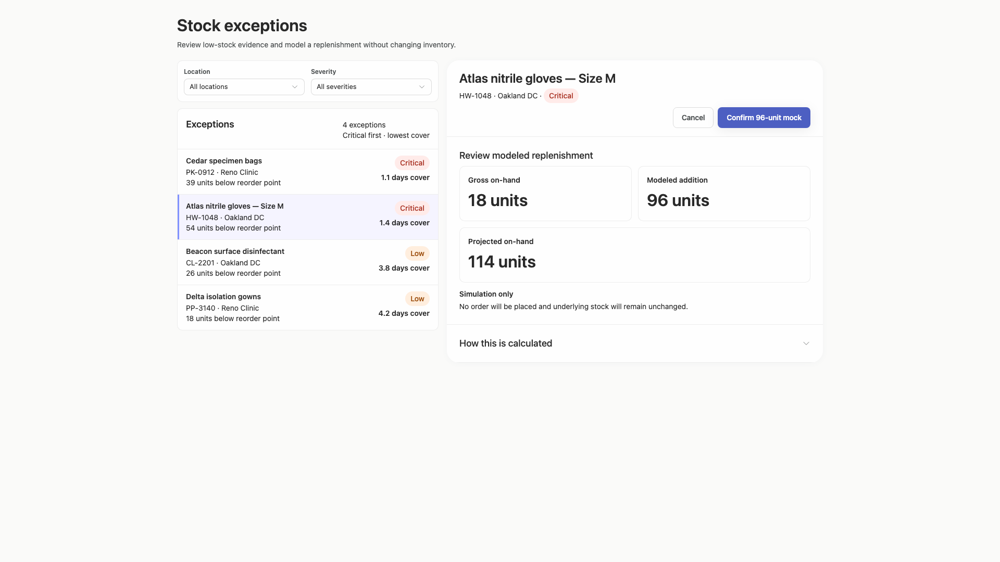
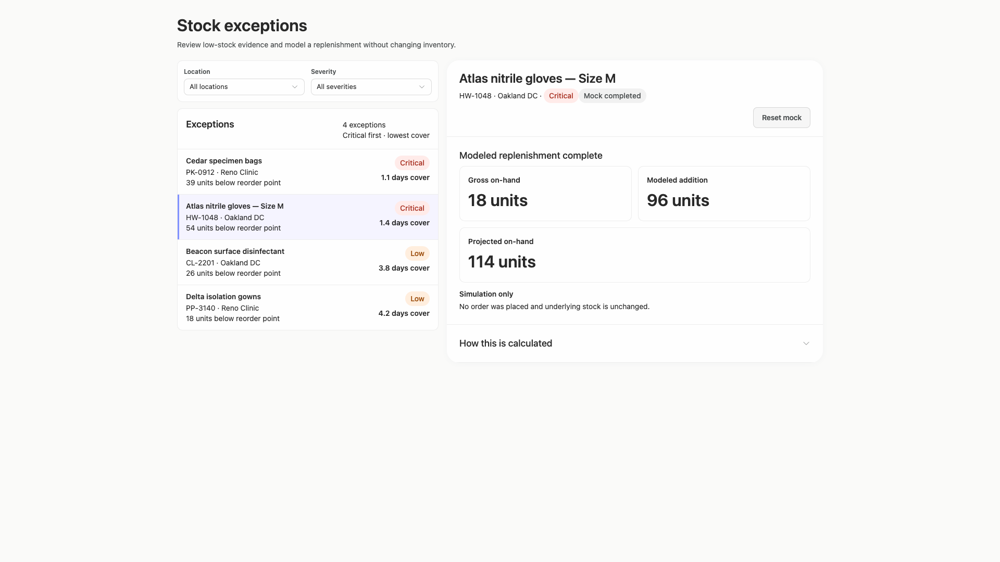
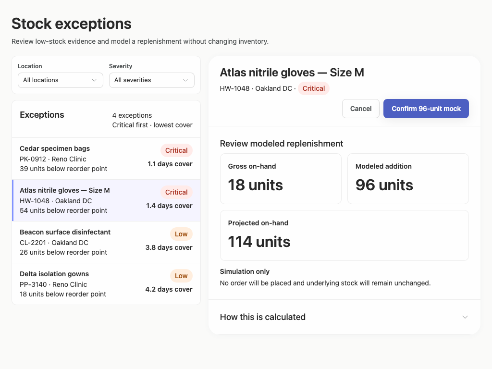
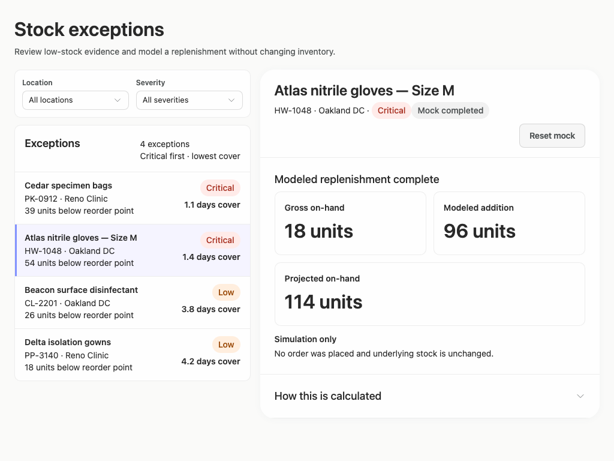
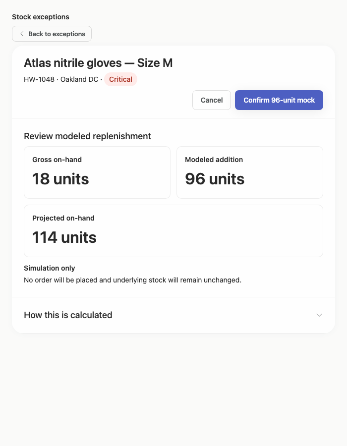
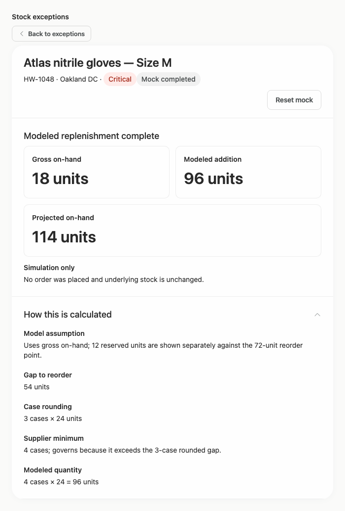

# stock-exceptions-readable-description — 2026-09-09T12:10:38.077Z

[All reports](../../README.md) · [Interactive HTML report](index.html) · [Full measurements and scoring](report.json)

GitHub renders this summary and the screenshots. Download or clone this folder to open the HTML report locally; GitHub does not serve it as a website.

**Subjective design score:** 90/100. Model: openai/gpt-5.6-sol. Rubric: 2.

**Arrusted adherence:** 100/100 (partial); evidence coverage 1.88%. Evaluator 3.

| Dimension | Conforming | Nonconforming | Unassessed | Adherence    |
| --------- | ---------- | ------------- | ---------- | ------------ |
| component | 23         | 0             | 5          | 100% (23/23) |
| api       | 60         | 0             | 12         | 100% (60/60) |
| styling   | 13         | 0             | 4995       | 100% (13/13) |

Scores from different evaluator versions or captured states are not directly comparable.

This report evaluates the captured preview; evaluation itself does not regenerate the app or prove a built backend. Scores are advisory and not human-calibrated.

## Ratings

| Dimension | Score | Reason |
| --- | --- | --- |
| hierarchy | 3/4 | The page title, filters, exception list, selected-record detail, and replenishment action form a clear scan path, while severity pills and prominent modeled quantities surface decision-critical information. However, the default detail shows Atlas at 1.4 days cover even though Cedar is ranked above it at 1.1 days cover under the stated “Critical first · lowest cover” ordering, weakening the initial priority signal. |
| layout | 3/4 | The two-pane desktop composition has consistent edges, spacing, row heights, and well-grouped detail sections. It remains clean at 1024px and is centered at 1920px, though the constrained 700px detail header uses a tall, sparsely occupied action row and the wide view leaves substantial unused canvas around a relatively compact work area. |
| typography | 4/4 | Heading levels, field labels, values, metadata, and large replenishment quantities are consistently differentiated and readable. Product names and days-of-cover values use weight effectively, while supporting copy remains visually subordinate without becoming difficult to read. |
| responsive | 4/4 | The composition adapts effectively across the supplied 1920px, 1440px, 1024px, and 700px desktop captures. It preserves side-by-side review where viable, switches to a focused list-then-detail flow with a clear Back control at 700px, and shows no visible clipping, overlap, or horizontal overflow; expanded disclosures use ordinary document scrolling when content grows. |
| productClarity | 4/4 | The purpose is explicit, location and severity filters are immediately available, exception rows expose location, shortage, severity, and cover, and selection reveals stock and supplier evidence. The mock flow clearly previews 18 + 96 = 114 units, explains supplier-minimum derivation, confirms that inventory is unchanged, and provides cancel/reset affordances. Minor “completed” terminology could still be mistaken for an operational action before the simulation note is read. |

## Strengths

- Strong master-detail workflow connects a scannable exception list directly to stock and supplier evidence.
- Severity, shortage, and days-of-cover signals make comparison practical without opening every record.
- The replenishment preview emphasizes the modeled addition and projected quantity while explicitly stating that no order is placed.
- Supplier terms and calculation derivation are progressively disclosed, keeping the initial detail concise while preserving auditability.
- The 700px desktop-panel treatment appropriately replaces the split view with focused navigation rather than compressing both panes.
- The supplied captures show consistent use of the existing Arrusted visual palette and component appearance, with no visible accessibility violations reported.

## Improvements

- **medium — desktop-0:** The list says it is ordered “Critical first · lowest cover,” placing Cedar at 1.1 days cover first, but Atlas at 1.4 days cover is selected by default and drives the detail pane. This makes the initial focus conflict with the visible urgency ranking. Default the wide detail to the first ranked exception, or begin without a user-established selection and prompt the reviewer to choose an item. Preserve an existing selection only when it results from user action or route state.
- **low — desktop-custom-700x900-1:** In the constrained detail view, Cancel and Confirm occupy a separate right-aligned row with considerable empty space between the identity metadata and actions, making the header taller and less compact than necessary. Use the supported wrapping header action arrangement with a smaller gap, and left-align the wrapped action group beneath the metadata when it cannot share the identity row.
- **low — desktop-custom-700x900-2:** The status reads “Mock completed” and the section later says “Modeled replenishment complete.” Although the simulation note clarifies that no order was placed, “completed” can initially sound like an operational replenishment was executed. Use consistently explicit simulation language such as “Simulation complete” or “Mock replenishment complete” in both the status pill and section heading.

## Token evidence

Percentages cover only assessed properties. Missing provenance and ambiguous CSS remain unassessed; matching literals are not proof of token usage.

| Viewport | Category | Token references / assessed | Coverage |
| --- | --- | --- | --- |
| desktop-0 | color | 0/0 | 0% (0/233) |
| desktop-0 | typography | 0/0 | 0% (0/522) |
| desktop-0 | spacing | 0/0 | 0% (0/267) |
| desktop-0 | radius | 0/0 | 0% (0/116) |
| desktop-0 | border | 0/0 | 0% (0/126) |
| desktop-0 | shadow | 0/0 | 0% (0/120) |
| desktop-wide-0 | color | 0/0 | 0% (0/233) |
| desktop-wide-0 | typography | 0/0 | 0% (0/522) |
| desktop-wide-0 | spacing | 0/0 | 0% (0/267) |
| desktop-wide-0 | radius | 0/0 | 0% (0/116) |
| desktop-wide-0 | border | 0/0 | 0% (0/126) |
| desktop-wide-0 | shadow | 0/0 | 0% (0/120) |
| desktop-window-0 | color | 0/0 | 0% (0/233) |
| desktop-window-0 | typography | 0/0 | 0% (0/522) |
| desktop-window-0 | spacing | 0/0 | 0% (0/267) |
| desktop-window-0 | radius | 0/0 | 0% (0/116) |
| desktop-window-0 | border | 0/0 | 0% (0/126) |
| desktop-window-0 | shadow | 0/0 | 0% (0/120) |
| desktop-custom-700x900-0 | color | 0/0 | 0% (0/144) |
| desktop-custom-700x900-0 | typography | 0/0 | 0% (0/302) |
| desktop-custom-700x900-0 | spacing | 0/0 | 0% (0/169) |
| desktop-custom-700x900-0 | radius | 0/0 | 0% (0/72) |
| desktop-custom-700x900-0 | border | 0/0 | 0% (0/80) |
| desktop-custom-700x900-0 | shadow | 0/0 | 0% (0/76) |

## Latest-run screenshots

### desktop-0 — initial

Interaction: not-run.

### desktop-1 — Review modeled quantity

Interaction: passed.

### desktop-2 — Confirm modeled replenishment

Interaction: passed.

### desktop-3 — Read projected quantity

Interaction: passed.

### desktop-4 — Reset fixture result

Interaction: passed.

### desktop-5 — Inspect supplier facts

Interaction: passed.

### desktop-6 — Expand confirmation derivation

Interaction: passed.

### desktop-7 — Expand completed derivation

Interaction: passed.

### desktop-wide-0 — initial

Interaction: not-run.

### desktop-wide-1 — Review modeled quantity

Interaction: passed.

### desktop-wide-2 — Confirm modeled replenishment

Interaction: passed.

### desktop-wide-3 — Read projected quantity

Interaction: passed.

### desktop-wide-4 — Reset fixture result

Interaction: passed.

### desktop-wide-5 — Inspect supplier facts

Interaction: passed.

### desktop-wide-6 — Expand confirmation derivation

Interaction: passed.

### desktop-wide-7 — Expand completed derivation

Interaction: passed.

### desktop-window-0 — initial

Interaction: not-run.

### desktop-window-1 — Review modeled quantity

Interaction: passed.

### desktop-window-2 — Confirm modeled replenishment

Interaction: passed.

### desktop-window-3 — Read projected quantity

Interaction: passed.

### desktop-window-4 — Reset fixture result

Interaction: passed.

### desktop-window-5 — Inspect supplier facts

Interaction: passed.

### desktop-window-6 — Expand confirmation derivation

Interaction: passed.

### desktop-window-7 — Expand completed derivation

Interaction: passed.

### desktop-custom-700x900-0 — initial

Interaction: not-run.

### desktop-custom-700x900-1 — Review modeled quantity

Interaction: passed.

### desktop-custom-700x900-2 — Confirm modeled replenishment

Interaction: passed.

### desktop-custom-700x900-3 — Read projected quantity

Interaction: passed.

### desktop-custom-700x900-4 — Reset fixture result

Interaction: passed.

### desktop-custom-700x900-5 — Inspect supplier facts

Interaction: passed.

### desktop-custom-700x900-6 — Expand confirmation derivation

Interaction: passed.

### desktop-custom-700x900-7 — Expand completed derivation

Interaction: passed.

## Limitations

- Only the supplied visual states were evaluated; open select menus, filtered result sets, empty results, loading states, keyboard focus, and selection of other records were not shown.
- The captures demonstrate mock-flow text changes, but screenshots do not establish backend behavior, persistence, or authorization.
- No separate implementation-plan artifact was provided, so completion or quality of the requested plan cannot be assessed from the interface captures.
- Static adherence evidence leaves most styling declarations unassessed and does not prove rendered component provenance; no token-adherence percentage is inferred.
- Scrolling in expanded supplier and calculation states appears intentional, but scroll restoration and focus management after navigation were not demonstrated.
