# stock-exceptions-readable-outcome — 2026-09-09T06:23:25.572Z

[All reports](../../README.md) · [Interactive HTML report](index.html) · [Full measurements and scoring](report.json)

GitHub renders this summary and the screenshots. Download or clone this folder to open the HTML report locally; GitHub does not serve it as a website.

**Subjective design score:** 75/100. Model: openai/gpt-5.6-sol. Rubric: 2.

**Arrusted adherence:** 100/100 (partial); evidence coverage 1.31%. Evaluator 3.

| Dimension | Conforming | Nonconforming | Unassessed | Adherence    |
| --------- | ---------- | ------------- | ---------- | ------------ |
| component | 17         | 0             | 2          | 100% (17/17) |
| api       | 39         | 0             | 11         | 100% (39/39) |
| styling   | 13         | 0             | 5169       | 100% (13/13) |

Scores from different evaluator versions or captured states are not directly comparable.

This report evaluates the captured preview; evaluation itself does not regenerate the app or prove a built backend. Scores are advisory and not human-calibrated.

## Ratings

| Dimension | Score | Reason |
| --- | --- | --- |
| hierarchy | 3/4 | The page title, filters, exception list, selected-item header, evidence, and replenishment action form a clear review sequence. Selection is strongly indicated, but severity is rendered as ordinary bold text, so urgent records do not stand out as quickly as they could. |
| layout | 3/4 | The two-column workspace is consistently aligned, uses compact list rows, and keeps detail actions in a predictable footer. The centered maximum-width composition remains balanced at 1440px and 1920px, though expanded content becomes less efficient in the height-constrained 1024px panel. |
| typography | 3/4 | Headings, field labels, values, and secondary identifiers use a consistent, readable scale with useful weight differences. The small muted result count is visually weak, and the supplied audit reports borderline contrast for caption text; this can be addressed through a supported larger Typography variant without changing the palette. |
| responsive | 3/4 | The composition adapts well across the supplied desktop widths: 1024px retains list-detail context, while 700px switches to a focused detail view with a Back control. At 1024×768, expanded and result states place additional sections inside a 403px internal scroll area with little visible indication that more content remains. |
| productClarity | 3/4 | The interface clearly supports location and severity filtering, exception selection, stock and supplier review, and a distinctly labeled mock replenishment. The result explicitly states that no order was placed and offers Reset mock, but plain-text severity reduces rapid triage clarity. |

## Strengths

- Clear master-detail relationship with an unmistakable selected row and repeated product identity in the detail header.
- Filters are grouped above the exception list and labeled directly, making their scope understandable.
- Stock evidence pairs concise labels and values, including on-hand, reserved, reorder point, days of cover, supplier, and lead time.
- The mock result communicates quantity, projected stock, assumptions, and the fact that inventory was unchanged.
- The 700px desktop-panel composition uses a focused detail view with a clear Back to exceptions affordance rather than compressing both panes.
- Supplier facts are progressively disclosed, keeping the initial review compact while preserving access to purchasing details.

## Improvements

- **medium — desktop-0:** Critical and Low severities appear as similarly styled bold text in every row. This makes a safety-relevant triage dimension slower to scan, especially when product names and days of cover already compete for attention. Present severity with the supported StatusPill or Tag component while preserving the existing Arrusted palette; keep days of cover as the aligned secondary metric.
- **medium — desktop-window-3:** The expanded supplier section is inside a vertically scrolling detail body, but only the first supplier row is visible before the fixed action footer and no strong scroll cue appears in the capture. Users may believe the disclosure contains only Case pack and miss receipt, contact, and terms information. When Secondary supplier facts opens in a height-constrained panel, collapse Stock evidence or bring the expanded disclosure to the top of the existing scroll region so several supplier rows are immediately visible. Retain the action footer outside the scrolling content.
- **low — desktop-0:** The “4 matching · 4 total” caption is small and muted relative to surrounding content. The supplied accessibility audit also identifies a borderline 4.47:1 caption contrast, making this supporting information slightly harder to read. Use a supported regular body or stronger caption Typography variant, or simplify the copy to a single concise count; do not alter the authoritative palette.

## Token evidence

Percentages cover only assessed properties. Missing provenance and ambiguous CSS remain unassessed; matching literals are not proof of token usage.

| Viewport | Category | Token references / assessed | Coverage |
| --- | --- | --- | --- |
| desktop-0 | color | 0/0 | 0% (0/233) |
| desktop-0 | typography | 0/0 | 0% (0/526) |
| desktop-0 | spacing | 0/0 | 0% (0/275) |
| desktop-0 | radius | 0/0 | 0% (0/116) |
| desktop-0 | border | 0/0 | 0% (0/125) |
| desktop-0 | shadow | 0/0 | 0% (0/120) |
| desktop-wide-0 | color | 0/0 | 0% (0/233) |
| desktop-wide-0 | typography | 0/0 | 0% (0/526) |
| desktop-wide-0 | spacing | 0/0 | 0% (0/275) |
| desktop-wide-0 | radius | 0/0 | 0% (0/116) |
| desktop-wide-0 | border | 0/0 | 0% (0/125) |
| desktop-wide-0 | shadow | 0/0 | 0% (0/120) |
| desktop-window-0 | color | 0/0 | 0% (0/233) |
| desktop-window-0 | typography | 0/0 | 0% (0/526) |
| desktop-window-0 | spacing | 0/0 | 0% (0/275) |
| desktop-window-0 | radius | 0/0 | 0% (0/116) |
| desktop-window-0 | border | 0/0 | 0% (0/125) |
| desktop-window-0 | shadow | 0/0 | 0% (0/120) |
| desktop-custom-700x900-0 | color | 0/0 | 0% (0/159) |
| desktop-custom-700x900-0 | typography | 0/0 | 0% (0/400) |
| desktop-custom-700x900-0 | spacing | 0/0 | 0% (0/182) |
| desktop-custom-700x900-0 | radius | 0/0 | 0% (0/80) |
| desktop-custom-700x900-0 | border | 0/0 | 0% (0/83) |
| desktop-custom-700x900-0 | shadow | 0/0 | 0% (0/80) |

## Latest-run screenshots

### desktop-0 — initial

Interaction: not-run.

### desktop-1 — Mock replenishment result

Interaction: passed.

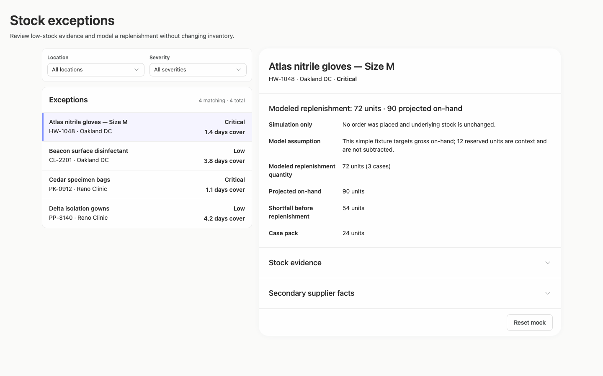

### desktop-2 — Reset from result footer

Interaction: passed.

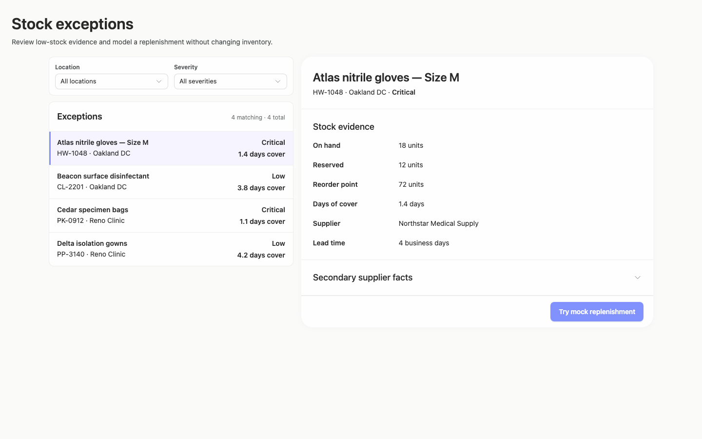

### desktop-3 — Expanded supplier facts

Interaction: passed.

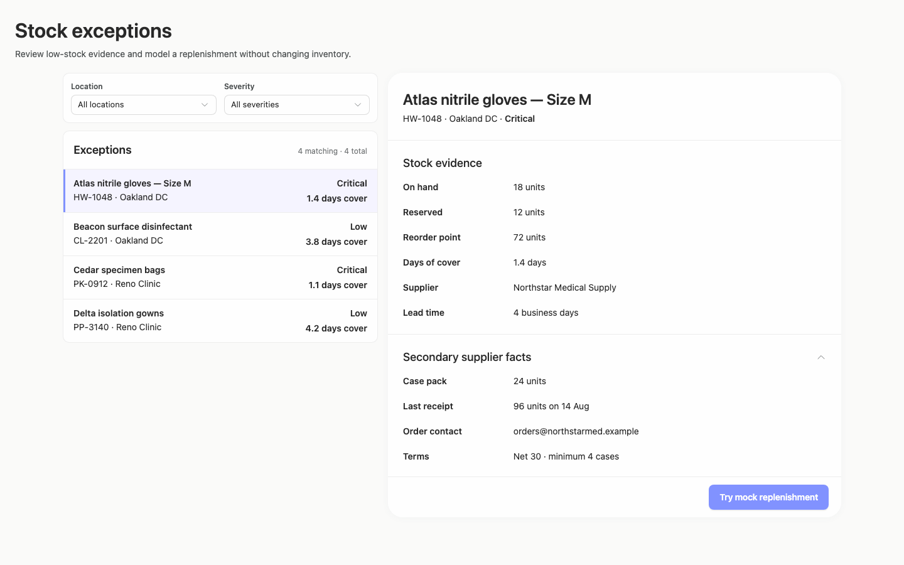

### desktop-wide-0 — initial

Interaction: not-run.

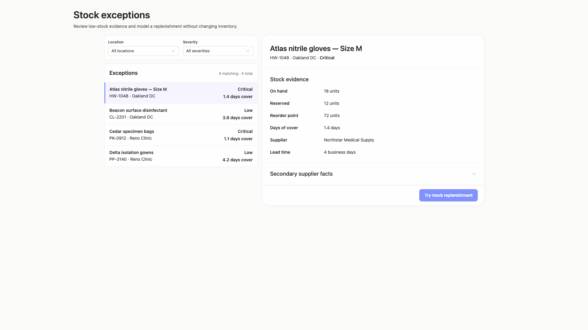

### desktop-wide-1 — Mock replenishment result

Interaction: passed.

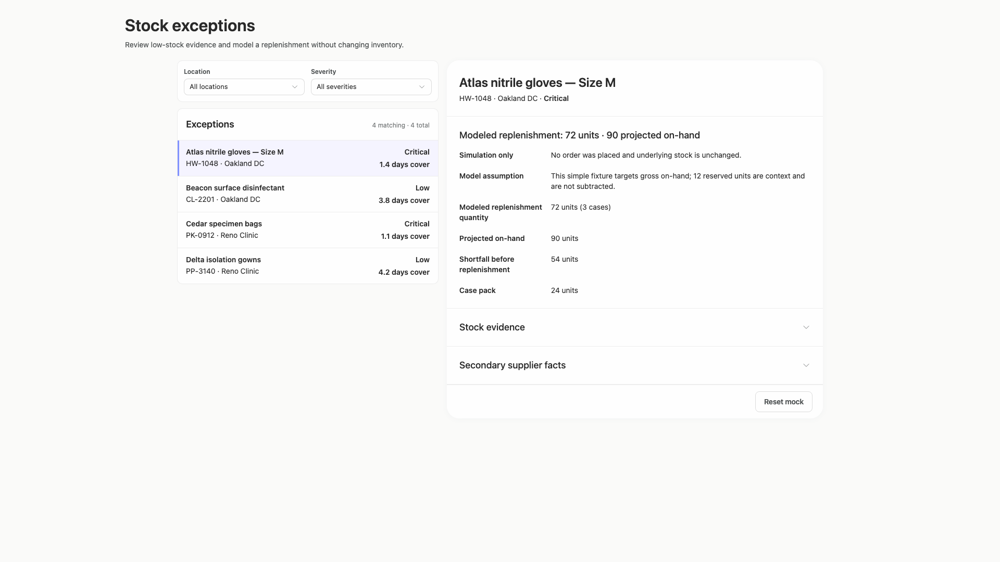

### desktop-wide-2 — Reset from result footer

Interaction: passed.

### desktop-wide-3 — Expanded supplier facts

Interaction: passed.

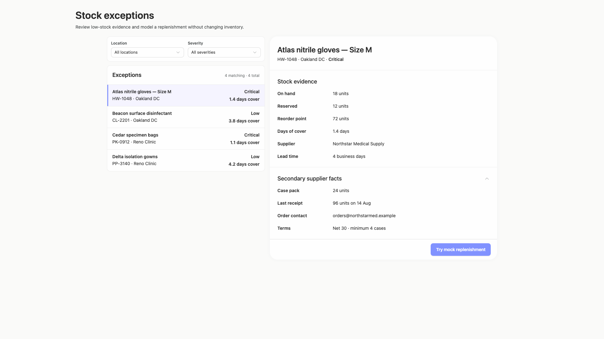

### desktop-window-0 — initial

Interaction: not-run.

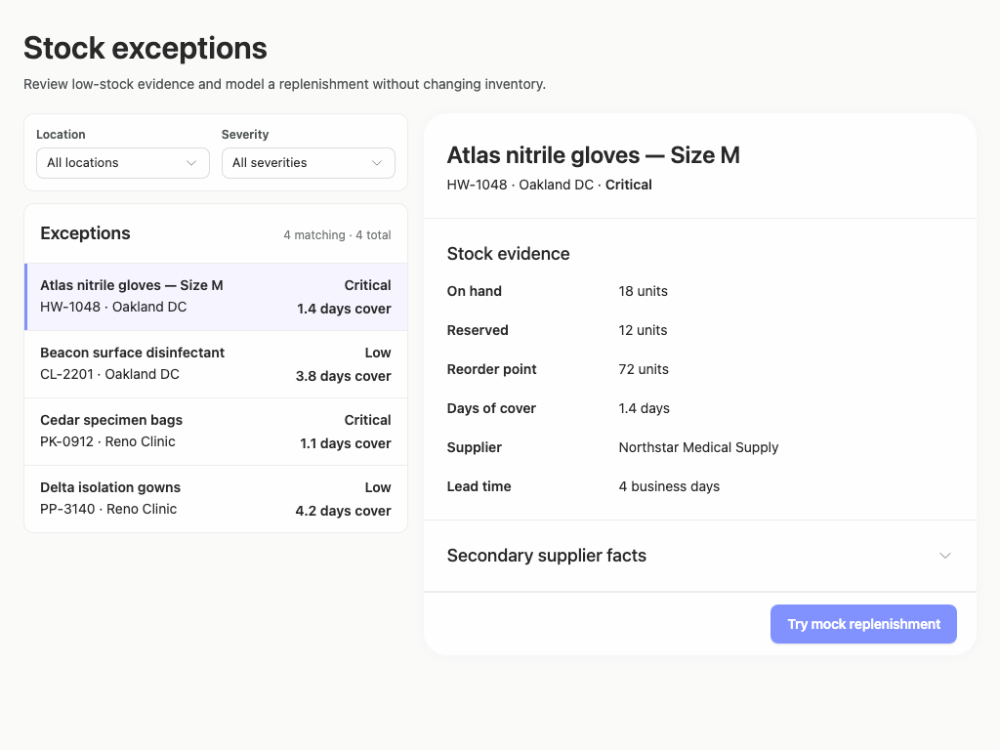

### desktop-window-1 — Mock replenishment result

Interaction: passed.

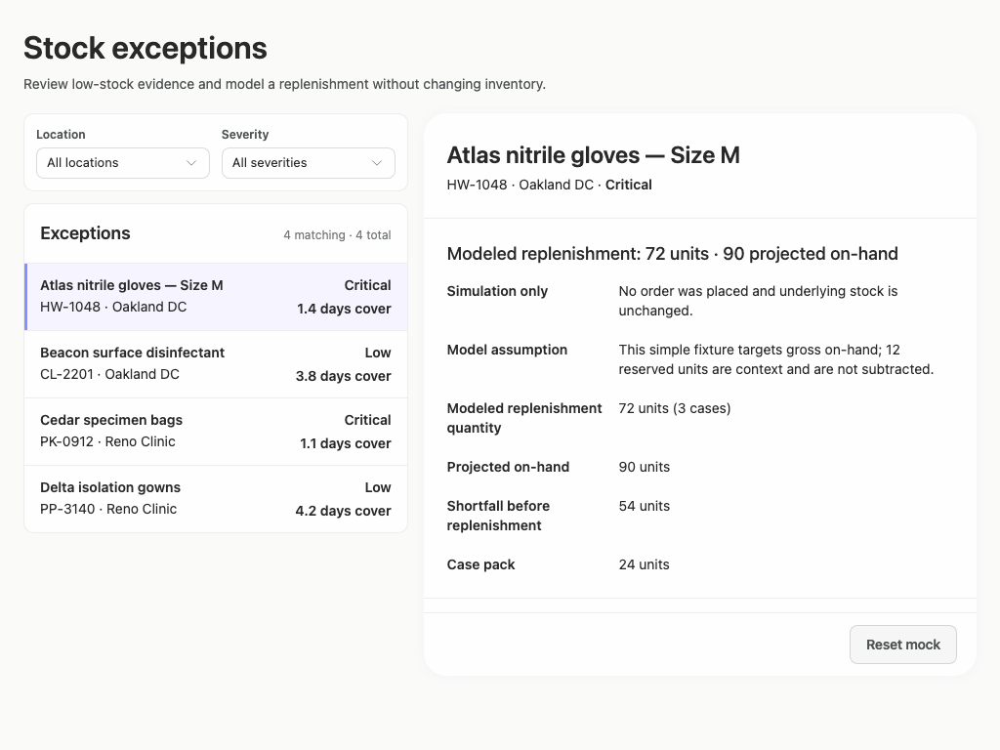

### desktop-window-2 — Reset from result footer

Interaction: passed.

### desktop-window-3 — Expanded supplier facts

Interaction: passed.

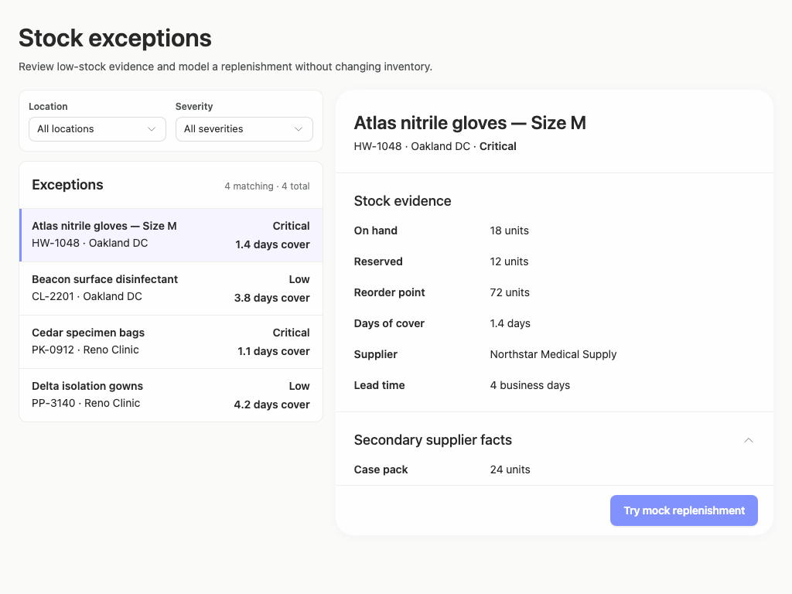

### desktop-custom-700x900-0 — initial

Interaction: not-run.

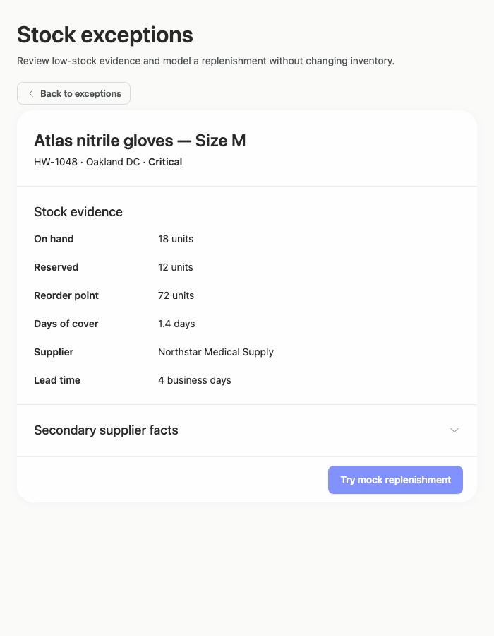

### desktop-custom-700x900-1 — Mock replenishment result

Interaction: passed.

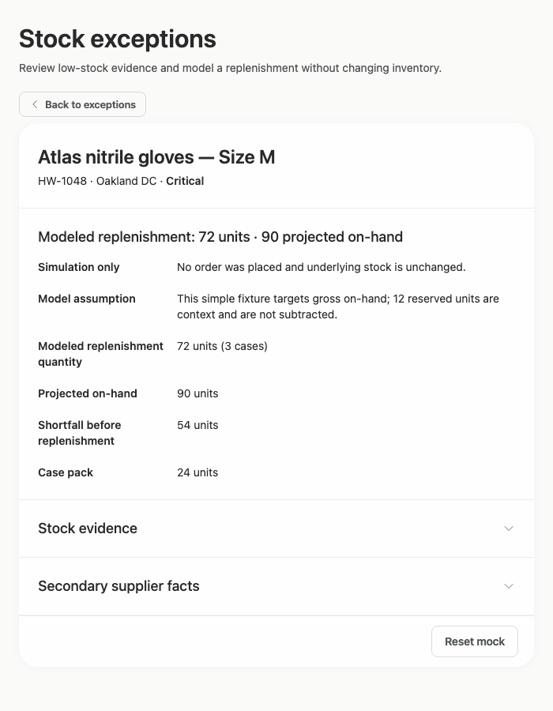

### desktop-custom-700x900-2 — Reset from result footer

Interaction: passed.

### desktop-custom-700x900-3 — Expanded supplier facts

Interaction: passed.

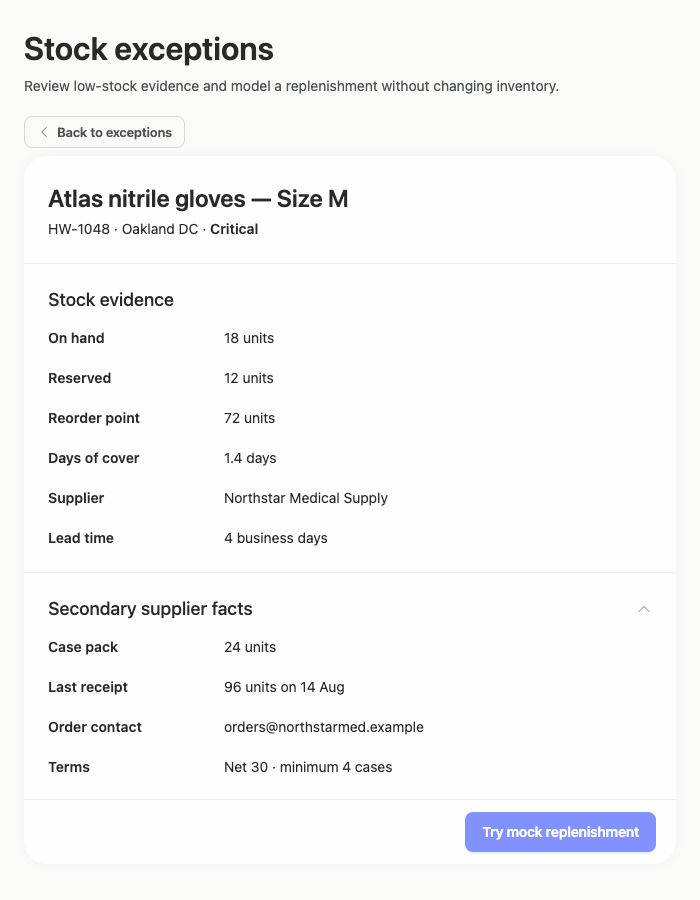

## Limitations

- Filter changes, empty results, and selecting records other than the initial item were not captured or interaction-tested.
- The 700px captures show the constrained detail state, but no capture demonstrates returning to the filtered exception list via Back.
- Mock replenishment, reset, and supplier disclosure interactions passed in the supplied states; backend persistence or real ordering behavior cannot be inferred.
- The screenshots do not establish whether an implementation plan was produced or whether work stopped before build/publication.
- Token provenance and much of the rendered styling were unassessed, so visual consistency with the supplied palette is observable but full token adherence cannot be verified.
