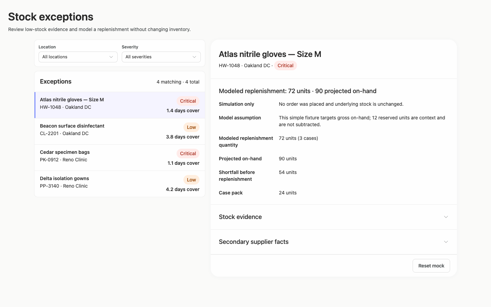
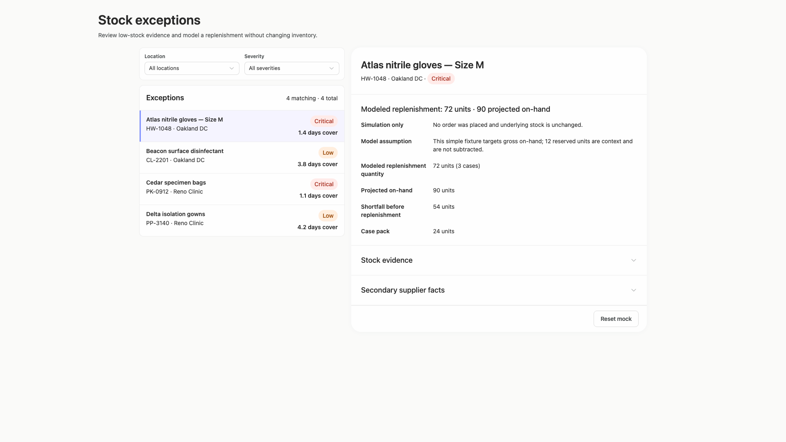
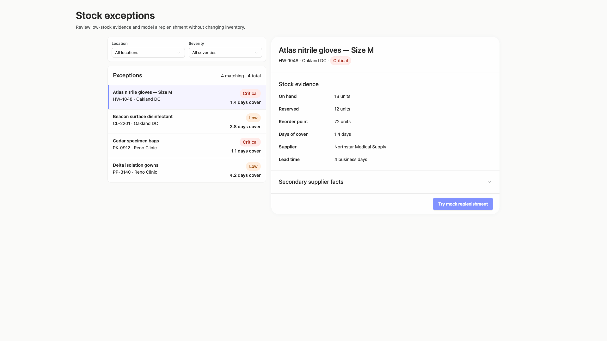
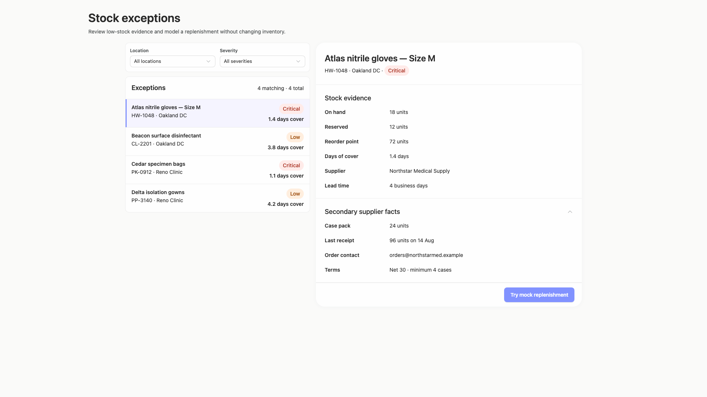
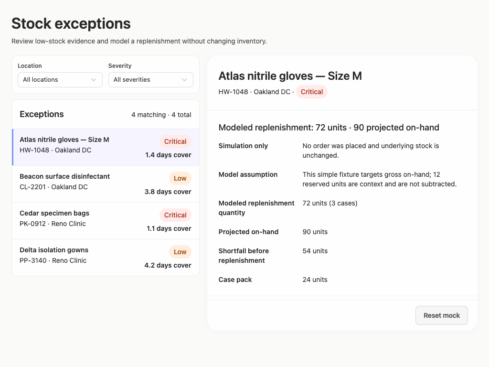
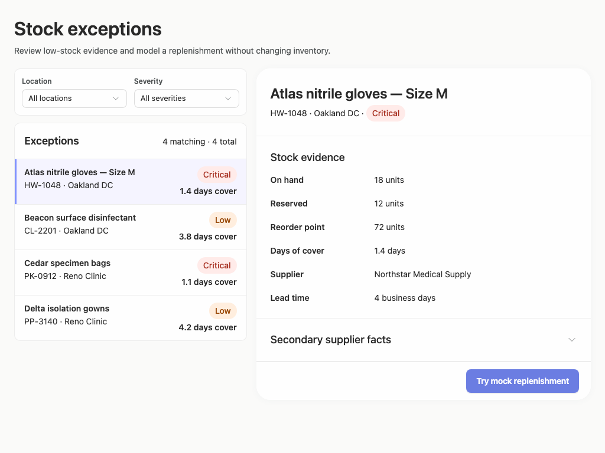
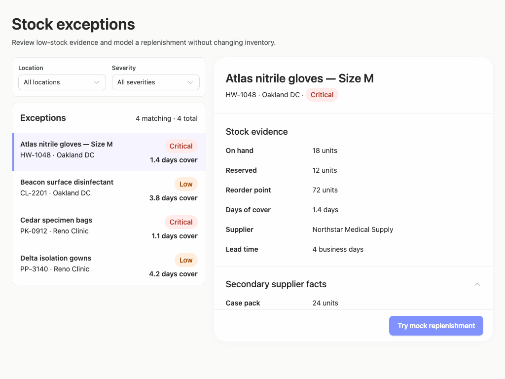
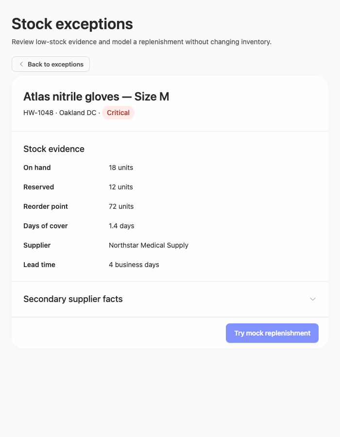
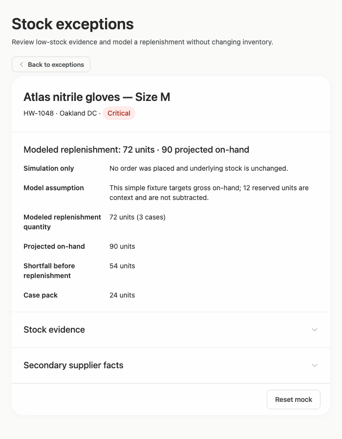

# stock-exceptions-readable-tag — 2026-09-09T06:33:14.792Z

[All reports](../../README.md) · [Interactive HTML report](index.html) · [Full measurements and scoring](report.json)

GitHub renders this summary and the screenshots. Download or clone this folder to open the HTML report locally; GitHub does not serve it as a website.

**Subjective design score:** 90/100. Model: openai/gpt-5.6-sol. Rubric: 2.

**Arrusted adherence:** 100/100 (partial); evidence coverage 1.37%. Evaluator 3.

| Dimension | Conforming | Nonconforming | Unassessed | Adherence    |
| --------- | ---------- | ------------- | ---------- | ------------ |
| component | 18         | 0             | 2          | 100% (18/18) |
| api       | 41         | 0             | 13         | 100% (41/41) |
| styling   | 13         | 0             | 5169       | 100% (13/13) |

Scores from different evaluator versions or captured states are not directly comparable.

This report evaluates the captured preview; evaluation itself does not regenerate the app or prove a built backend. Scores are advisory and not human-calibrated.

## Ratings

| Dimension      | Score | Reason                                                                                                                                                                                                                                                                                                                                                       |
| -------------- | ----- | ------------------------------------------------------------------------------------------------------------------------------------------------------------------------------------------------------------------------------------------------------------------------------------------------------------------------------------------------------------ |
| hierarchy      | 4/4   | The page title, filters, exception list, selected-record header, evidence, and primary mock action form a clear review sequence. Selected-row treatment and severity pills make priority and state immediately scannable, while the simulation result receives an appropriately prominent heading.                                                           |
| layout         | 3/4   | The two-column composition is consistently aligned and comfortably spaced from 1024px through 1920px, with a focused detail layout at 700px. The main weakness is vertical constraint handling: expanding supplier facts at 1024px exposes only the first supplier row while the remaining content sits inside the detail panel’s scroll region.             |
| typography     | 3/4   | Heading levels, labels, values, and supporting text are visually consistent and readable across captures. Dense result labels such as “Modeled replenishment quantity” wrap cleanly, though the resulting multi-line label/value grid is slightly slower to scan at the 1024px window size.                                                                  |
| responsive     | 4/4   | The interface adapts well across the supplied desktop widths: wide and standard windows retain a usable list-detail split, while the 700px panel switches to a focused detail view with an explicit “Back to exceptions” control. Controls remain visible without horizontal document overflow, and the mock action remains reachable in every tested state. |
| productClarity | 4/4   | The task is explicit in the subtitle, filters are clearly labeled, each exception exposes location, severity, and days of cover, and the selected record provides stock and supplier evidence. The mock result plainly states that no order was placed and inventory is unchanged, with a clear reset affordance.                                            |

## Strengths

- Strong master-detail workflow with an unmistakable selected exception and persistent record identity.
- Location and severity filters are grouped directly above the exception set, with a useful matching/total count.
- Severity and days-of-cover evidence are visible in every list row, supporting rapid prioritization.
- The replenishment result clearly distinguishes a simulation from a real inventory action and explains its assumptions.
- The constrained 700px desktop-panel composition avoids squeezing both columns and provides a clear route back to the exception list.
- The expanded supplier section adds relevant operational facts without overwhelming the default view.

## Improvements

- **medium — desktop-window-3:** At the 1024px window size, expanding “Secondary supplier facts” reveals only the Case pack row before the action footer. Measurements confirm that additional supplier rows remain inside the panel’s vertical scroll area, but the screenshot offers little visual indication that more expanded content is below. When opening this disclosure in a constrained-height panel, scroll its heading to the top or collapse the preceding evidence section so more of the newly requested content is immediately visible. Retain panel scrolling and the existing action placement.
- **low — desktop-1:** The modeled result replaces the visible baseline stock evidence and collapses that section. Although the result is understandable, comparing projected stock with current on-hand, reserved stock, and reorder point requires another disclosure interaction despite ample vertical room in this capture. On roomier desktop windows, keep Stock evidence expanded beneath the modeled result or repeat a compact set of baseline values in the result summary. Continue collapsing secondary supplier facts to control density.

## Token evidence

Percentages cover only assessed properties. Missing provenance and ambiguous CSS remain unassessed; matching literals are not proof of token usage.

| Viewport                 | Category   | Token references / assessed | Coverage   |
| ------------------------ | ---------- | --------------------------- | ---------- |
| desktop-0                | color      | 0/0                         | 0% (0/233) |
| desktop-0                | typography | 0/0                         | 0% (0/526) |
| desktop-0                | spacing    | 0/0                         | 0% (0/275) |
| desktop-0                | radius     | 0/0                         | 0% (0/116) |
| desktop-0                | border     | 0/0                         | 0% (0/125) |
| desktop-0                | shadow     | 0/0                         | 0% (0/120) |
| desktop-wide-0           | color      | 0/0                         | 0% (0/233) |
| desktop-wide-0           | typography | 0/0                         | 0% (0/526) |
| desktop-wide-0           | spacing    | 0/0                         | 0% (0/275) |
| desktop-wide-0           | radius     | 0/0                         | 0% (0/116) |
| desktop-wide-0           | border     | 0/0                         | 0% (0/125) |
| desktop-wide-0           | shadow     | 0/0                         | 0% (0/120) |
| desktop-window-0         | color      | 0/0                         | 0% (0/233) |
| desktop-window-0         | typography | 0/0                         | 0% (0/526) |
| desktop-window-0         | spacing    | 0/0                         | 0% (0/275) |
| desktop-window-0         | radius     | 0/0                         | 0% (0/116) |
| desktop-window-0         | border     | 0/0                         | 0% (0/125) |
| desktop-window-0         | shadow     | 0/0                         | 0% (0/120) |
| desktop-custom-700x900-0 | color      | 0/0                         | 0% (0/159) |
| desktop-custom-700x900-0 | typography | 0/0                         | 0% (0/400) |
| desktop-custom-700x900-0 | spacing    | 0/0                         | 0% (0/182) |
| desktop-custom-700x900-0 | radius     | 0/0                         | 0% (0/80)  |
| desktop-custom-700x900-0 | border     | 0/0                         | 0% (0/83)  |
| desktop-custom-700x900-0 | shadow     | 0/0                         | 0% (0/80)  |

## Latest-run screenshots

### desktop-0 — initial

Interaction: not-run.

### desktop-1 — Mock replenishment result

Interaction: passed.

### desktop-2 — Reset from result footer

Interaction: passed.

### desktop-3 — Expanded supplier facts

Interaction: passed.

### desktop-wide-0 — initial

Interaction: not-run.

### desktop-wide-1 — Mock replenishment result

Interaction: passed.

### desktop-wide-2 — Reset from result footer

Interaction: passed.

### desktop-wide-3 — Expanded supplier facts

Interaction: passed.

### desktop-window-0 — initial

Interaction: not-run.

### desktop-window-1 — Mock replenishment result

Interaction: passed.

### desktop-window-2 — Reset from result footer

Interaction: passed.

### desktop-window-3 — Expanded supplier facts

Interaction: passed.

### desktop-custom-700x900-0 — initial

Interaction: not-run.

### desktop-custom-700x900-1 — Mock replenishment result

Interaction: passed.

### desktop-custom-700x900-2 — Reset from result footer

Interaction: passed.

### desktop-custom-700x900-3 — Expanded supplier facts

Interaction: passed.

## Limitations

- Only the supplied static states were assessed; item selection, filter outcomes, empty results, keyboard behavior, and other unseen states were not tested.
- The screenshots demonstrate mock and reset states, but they do not establish backend behavior or persistence semantics.
- The requested implementation plan is not visible in the supplied captures, so its completeness and presentation cannot be evaluated.
- Automated evidence reports insufficient contrast on primary-button text in several captures. This is advisory here because the existing Arrusted palette and component variants are authoritative; no palette override or primary-button restyling is recommended.
- The expanded detail panel is identified as an intentional scroll container, so the finding concerns discoverability and immediate composition rather than treating scrolling itself as a defect.
