# stock-exceptions-review-action — 2026-09-09T00:56:43.352Z

[All reports](../../README.md) · [Interactive HTML report](index.html) · [Full measurements and scoring](report.json)

[Verified behavior and score-comparison limits](review-notes.md)

GitHub renders this summary and the screenshots. Download or clone this folder to open the HTML report locally; GitHub does not serve it as a website.

**Subjective design score:** 85/100. Model: openai/gpt-5.6-sol. Rubric: 2.

**Arrusted adherence:** 100/100 (partial); evidence coverage 2.13%. Evaluator 3.

| Dimension | Conforming | Nonconforming | Unassessed | Adherence    |
| --------- | ---------- | ------------- | ---------- | ------------ |
| component | 38         | 0             | 4          | 100% (38/38) |
| api       | 64         | 0             | 7          | 100% (64/64) |
| styling   | 23         | 0             | 5727       | 100% (23/23) |

Scores from different evaluator versions or captured states are not directly comparable.

This is the saved component-backed preview, not a new generation or a built backend. Scores are advisory and not human-calibrated.

## Ratings

| Dimension | Score | Reason |
| --- | --- | --- |
| hierarchy | 3/4 | The page title, review count, severity groups, selected row, and suggested-order section create a strong scan path. Selected records are visually obvious, but repeating the severity in both group headings and every row adds some redundant emphasis. |
| layout | 3/4 | The two-column master-detail composition is consistently aligned at 1024–1920px, with compact filters and well-spaced detail sections. At 700px the dedicated list/detail views work well, though the list cards compress severity, cover, and Review actions into a busy right-hand strip. |
| typography | 3/4 | Headings, product names, values, labels, and explanatory copy use consistent sizing and weight, and the important quantities remain readable across captures. Severity and arrival-status pills are comparatively small, while several neighboring metadata lines have similar visual weight. |
| responsive | 4/4 | The composition adapts especially well: 1440px and wider use master-detail, 1024px retains both useful panels without horizontal overflow, and 700px changes to an explicit Review list followed by a full-width detail view with Back navigation. The 1024×768 states require only slight vertical scrolling and preserve usable controls. |
| productClarity | 4/4 | The workflow is immediately understandable from the instructional subtitle, location and severity filters, review selection, stock/supplier tabs, suggested quantity, and prominent simulation action. Copy such as “Preview only · No supplier contacted,” “Stock unchanged,” and “Simulated — no order sent” clearly distinguishes the mock action from a real order. |

## Strengths

- Severity grouping and ascending days-of-cover values make urgent products easy to prioritize.
- Selected-row treatment maintains a clear relationship between the exception list and its detail panel.
- Stock position and supplier details are separated without hiding the proposed replenishment quantity or risk assessment.
- Arrival-gap and within-cover messages translate supplier lead time into an operational consequence.
- The narrow desktop-window treatment is thoughtfully changed to list and detail modes rather than forcing a cramped two-panel composition.
- The simulated state provides both action-level and explanatory feedback while explicitly confirming that inventory was unchanged.

## Improvements

- **low — desktop-0:** Each product repeats a Critical or Warning pill even though the records are already grouped beneath matching severity headings. This adds visual noise to an otherwise efficient exception list. In grouped list views, rely on the severity heading and cover value for repeated rows, reserving the pill for the selected detail or filtered/ungrouped contexts where severity would otherwise be ambiguous.
- **low — desktop-custom-700x900-0:** Severity pills, cover values, and repeated Review buttons share a narrow right-hand strip. It remains usable in the provided capture, but the stacked controls make the cards denser and leave limited flexibility for longer values or labels. Use a stable two-row card composition: keep product identity on the first row and place severity, cover, and the supported Review button variant in a clearly aligned metadata/action row below.
- **low — desktop-custom-700x900-1:** The Back button occupies its own row above the record heading, introducing a relatively large navigation gap before users see which product they are reviewing. Compose the supported back-button variant and product identity within one compact header area, while preserving the clear return affordance and existing palette.

## Token evidence

Percentages cover only assessed properties. Missing provenance and ambiguous CSS remain unassessed; matching literals are not proof of token usage.

| Viewport | Category | Token references / assessed | Coverage |
| --- | --- | --- | --- |
| desktop-0 | color | 0/0 | 0% (0/227) |
| desktop-0 | typography | 0/0 | 0% (0/557) |
| desktop-0 | spacing | 0/0 | 0% (0/299) |
| desktop-0 | radius | 0/0 | 0% (0/114) |
| desktop-0 | border | 0/0 | 0% (0/137) |
| desktop-0 | shadow | 0/0 | 0% (0/120) |
| desktop-wide-0 | color | 0/0 | 0% (0/227) |
| desktop-wide-0 | typography | 0/0 | 0% (0/557) |
| desktop-wide-0 | spacing | 0/0 | 0% (0/299) |
| desktop-wide-0 | radius | 0/0 | 0% (0/114) |
| desktop-wide-0 | border | 0/0 | 0% (0/137) |
| desktop-wide-0 | shadow | 0/0 | 0% (0/120) |
| desktop-window-0 | color | 0/0 | 0% (0/227) |
| desktop-window-0 | typography | 0/0 | 0% (0/557) |
| desktop-window-0 | spacing | 0/0 | 0% (0/299) |
| desktop-window-0 | radius | 0/0 | 0% (0/114) |
| desktop-window-0 | border | 0/0 | 0% (0/137) |
| desktop-window-0 | shadow | 0/0 | 0% (0/120) |
| desktop-custom-700x900-0 | color | 0/0 | 0% (0/216) |
| desktop-custom-700x900-0 | typography | 0/0 | 0% (0/549) |
| desktop-custom-700x900-0 | spacing | 0/0 | 0% (0/253) |
| desktop-custom-700x900-0 | radius | 0/0 | 0% (0/111) |
| desktop-custom-700x900-0 | border | 0/0 | 0% (0/125) |
| desktop-custom-700x900-0 | shadow | 0/0 | 0% (0/111) |

## Latest-run screenshots

### desktop-0 — initial

Interaction: not-run.

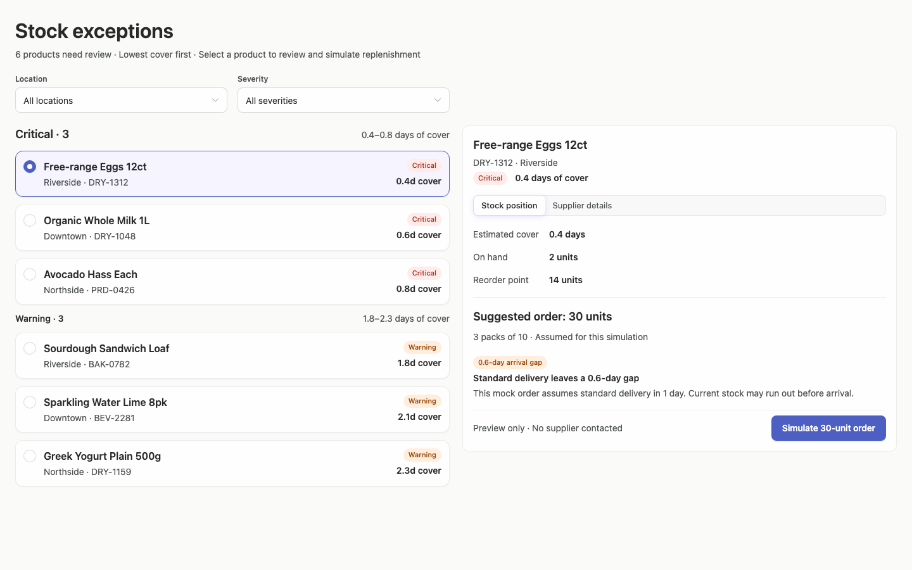

### desktop-1 — Select and inspect supplier

Interaction: passed.

### desktop-2 — Simulate replenishment

Interaction: passed.

### desktop-3 — Filter records

Interaction: passed.

### desktop-4 — Review delivery within cover

Interaction: passed.

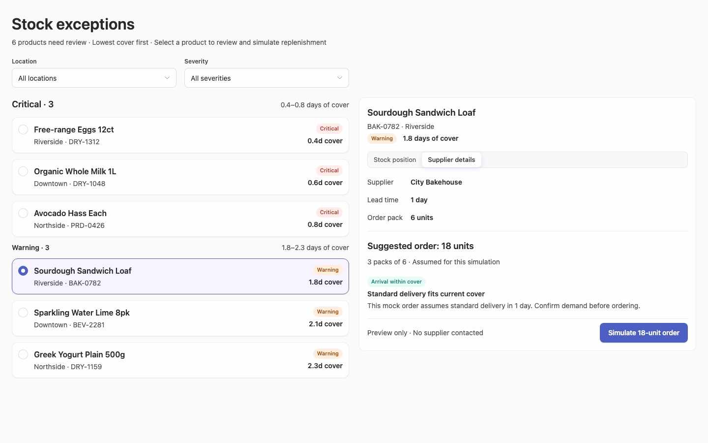

### desktop-5 — Read the stock-view delivery assumption

Interaction: passed.

### desktop-wide-0 — initial

Interaction: not-run.

### desktop-wide-1 — Select and inspect supplier

Interaction: passed.

### desktop-wide-2 — Simulate replenishment

Interaction: passed.

### desktop-wide-3 — Filter records

Interaction: passed.

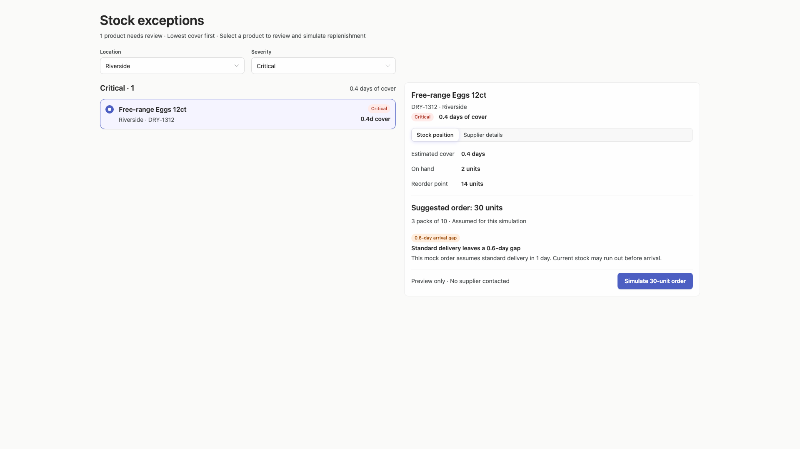

### desktop-wide-4 — Review delivery within cover

Interaction: passed.

### desktop-wide-5 — Read the stock-view delivery assumption

Interaction: passed.

### desktop-window-0 — initial

Interaction: not-run.

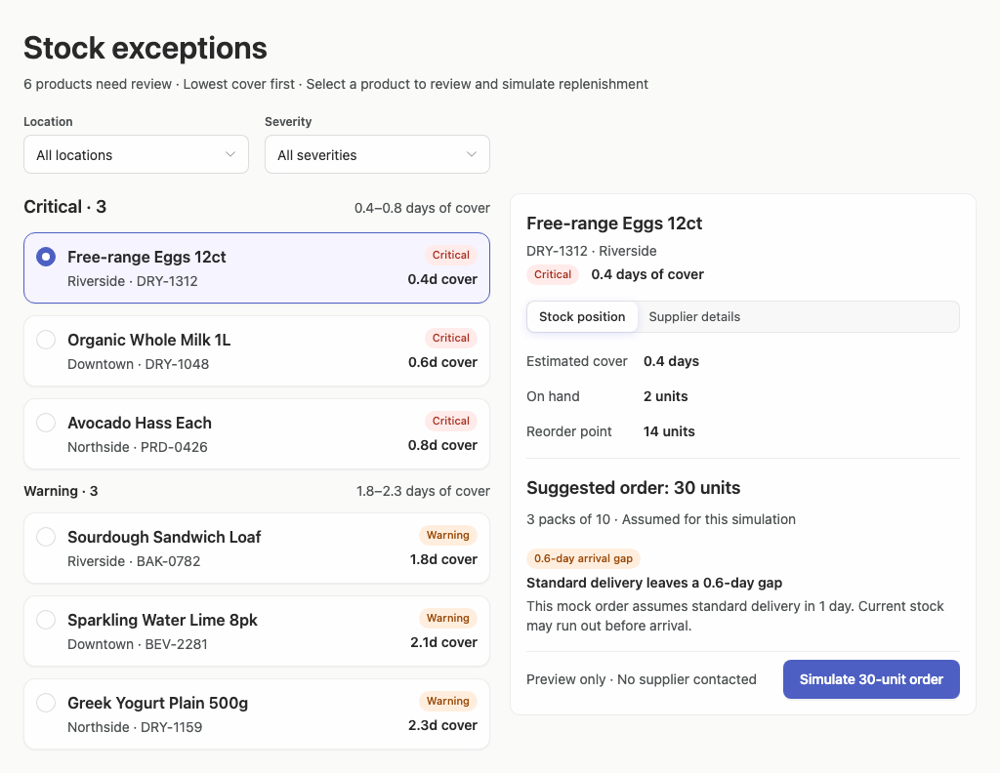

### desktop-window-1 — Select and inspect supplier

Interaction: passed.

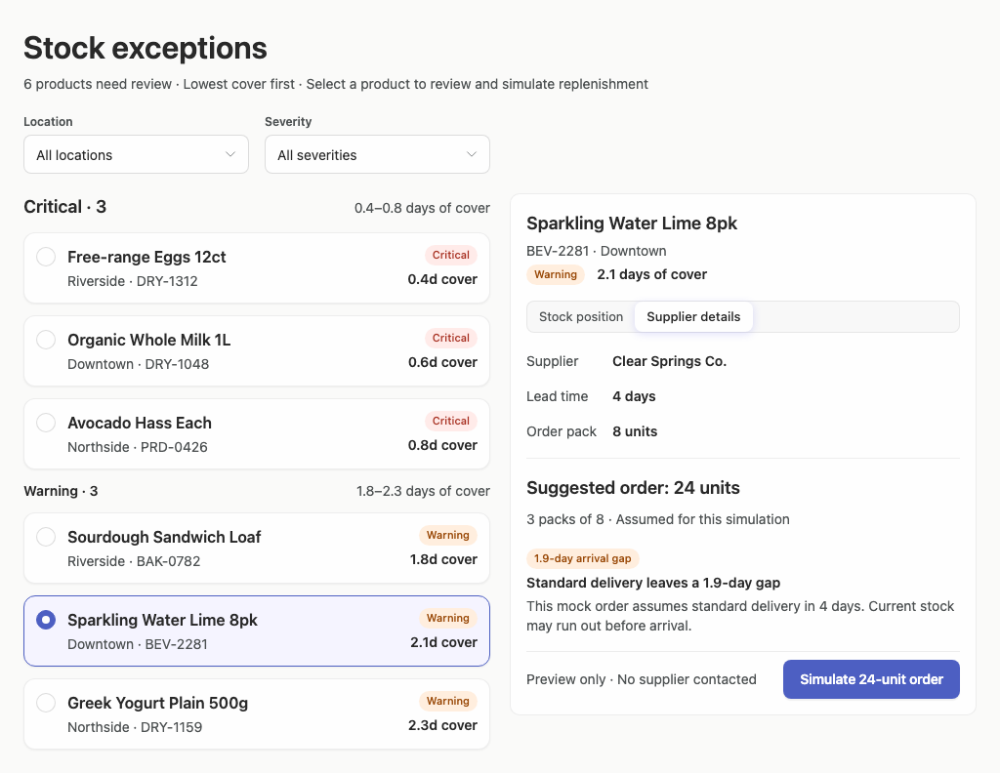

### desktop-window-2 — Simulate replenishment

Interaction: passed.

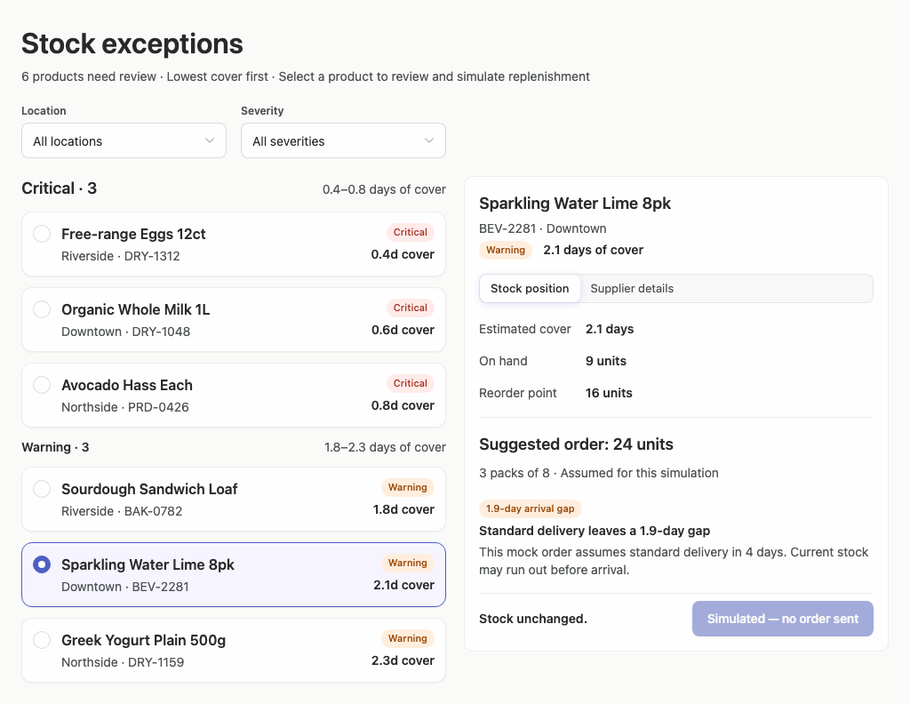

### desktop-window-3 — Filter records

Interaction: passed.

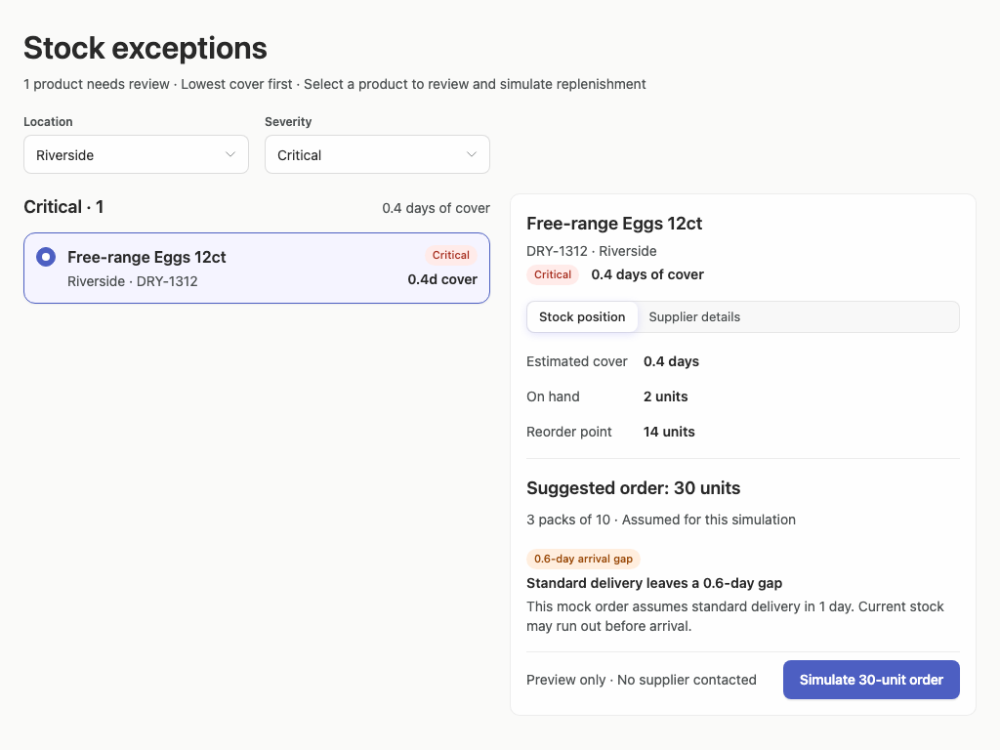

### desktop-window-4 — Review delivery within cover

Interaction: passed.

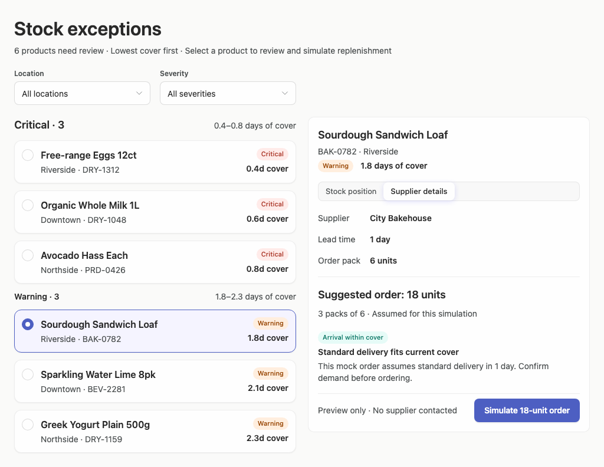

### desktop-window-5 — Read the stock-view delivery assumption

Interaction: passed.

### desktop-custom-700x900-0 — initial

Interaction: not-run.

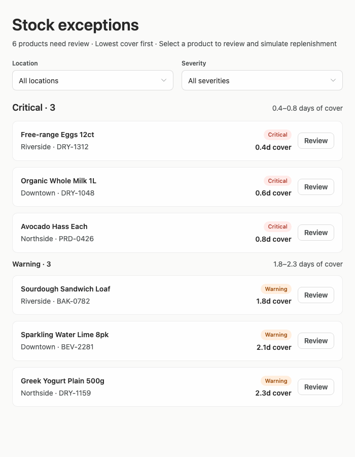

### desktop-custom-700x900-1 — Select and inspect supplier

Interaction: passed.

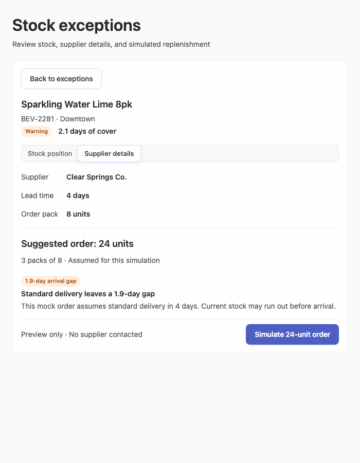

### desktop-custom-700x900-2 — Simulate replenishment

Interaction: passed.

### desktop-custom-700x900-3 — Filter records

Interaction: passed.

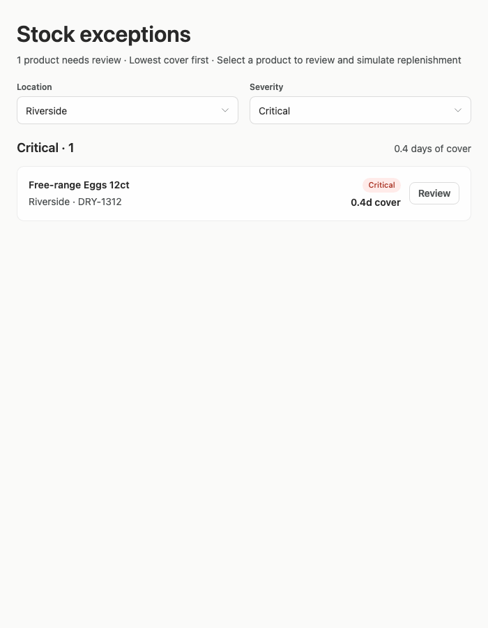

### desktop-custom-700x900-4 — Review delivery within cover

Interaction: passed.

### desktop-custom-700x900-5 — Read the stock-view delivery assumption

Interaction: passed.

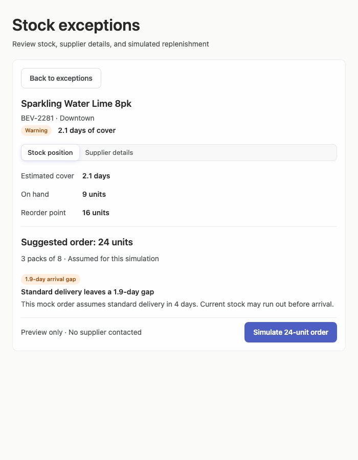

## Limitations

- No implementation-plan artifact is shown, so the brief’s planning deliverable cannot be evaluated from these interface captures.
- Only the supplied 700px, 1024px, 1440px, and 1920px desktop sizes and visible states were assessed; intermediate widths, resized panels, menus, focus states, and error or empty states were not shown.
- Initial-state interaction was not run in several capture sets, although the supplied selection, filtering, tab, and simulation checks passed.
- Screenshots and static source findings cannot establish backend behavior or prove that particular public components rendered at runtime.
- Styling provenance is largely unassessed in the supplied evidence, so Arrusted token adherence beyond the visible authoritative palette cannot be determined.
