# stock-exceptions-selection-guidance — 2026-09-09T10:41:07.615Z

[All reports](../../README.md) · [Interactive HTML report](index.html) · [Full measurements and scoring](report.json)

GitHub renders this summary and the screenshots. Download or clone this folder to open the HTML report locally; GitHub does not serve it as a website.

**Subjective design score:** 90/100. Model: openai/gpt-5.6-sol. Rubric: 2.

**Arrusted adherence:** 100/100 (partial); evidence coverage 1.9%. Evaluator 3.

| Dimension | Conforming | Nonconforming | Unassessed | Adherence    |
| --------- | ---------- | ------------- | ---------- | ------------ |
| component | 23         | 0             | 4          | 100% (23/23) |
| api       | 61         | 0             | 9          | 100% (61/61) |
| styling   | 13         | 0             | 4988       | 100% (13/13) |

Scores from different evaluator versions or captured states are not directly comparable.

This report evaluates the captured preview; evaluation itself does not regenerate the app or prove a built backend. Scores are advisory and not human-calibrated.

## Ratings

| Dimension | Score | Reason |
| --- | --- | --- |
| hierarchy | 4/4 | The page title, filters, exception list, selected record identity, evidence, and replenishment action form a clear review sequence. Selected-row treatment, severity pills, bold days-of-cover values, and large modeled quantities make urgent and decision-critical information easy to scan. |
| layout | 3/4 | The two-pane desktop composition is consistently aligned and comfortably dense from 1024 to 1920 pixels, while the 700-pixel view cleanly switches between list and detail. Cards and field/value columns are orderly, though the constrained detail header uses substantial vertical space and the default highlighted row can visually imply a stronger selection state than the surrounding instructions describe. |
| typography | 4/4 | Heading levels, labels, body copy, identifiers, quantities, and status text are visually consistent and readable. Large replenishment quantities are emphasized appropriately, while explanatory assumptions remain secondary without becoming difficult to read. |
| responsive | 4/4 | The composition remains usable across the supplied 1920-, 1440-, 1024-, and 700-pixel desktop captures. Filters contract cleanly, the 1024-pixel list-detail view retains usable controls, and the 700-pixel state replaces the split view with a clear Back affordance; no clipping or horizontal document overflow is shown. |
| productClarity | 3/4 | Location and severity filters, exception metrics, stock and supplier facts, and the mock replenishment sequence directly support the brief. The confirmation and result states explicitly explain that inventory is unchanged, but the initial constrained list highlights Atlas before the user has opened it, and the initial helper language is slightly inconsistent with the detail already displayed at wider sizes. |

## Strengths

- The workflow maps directly from filtering to exception selection, evidence review, supplier details, and a reversible mock replenishment.
- Critical and Low status pills, shortage values, and days of cover support rapid inventory triage without overloading the list.
- The modeled replenishment clearly exposes current, added, and projected quantities and explains the supplier-minimum calculation.
- Safety language is unusually clear: both confirmation and completed states state that no real order is placed and underlying stock remains unchanged.
- The constrained desktop composition provides an explicit Back to exceptions control rather than compressing both panes beyond usefulness.
- Supplier information is progressively disclosed, keeping the primary evidence concise while retaining access to case pack, terms, receipt, and contact facts.
- The supplied captures report no accessibility violations, and tested mock-action transitions passed at multiple desktop widths.

## Improvements

- **medium — desktop-custom-700x900-0:** Atlas is rendered with the same selected-row highlight used in the wide list-detail state, although this constrained initial view has not yet opened a detail and tells the user to open a row. The visual state can therefore suggest that the item is already selected while the interface still requires another selection action. Reserve the selected background and leading accent for a user-established selection. Present the default recommendation with the existing Suggested starting point text or a supported Tag, then apply selected styling only after the row is opened.
- **low — desktop-0:** The helper says to open a row to review details even though the suggested Atlas record is already open in the adjacent detail pane. The mismatch introduces minor uncertainty about whether another click is required. Use state-specific guidance such as “The suggested exception is open. Choose another exception to review it,” while retaining the current instruction in list-only states.
- **low — desktop-1:** The primary button says “Confirm mock,” while the exact 96-unit consequence appears only in the section heading below. The action remains understandable, but its label is less specific than the decision being confirmed. Include the modeled quantity in the action label where space permits, for example “Confirm 96-unit mock,” while keeping Cancel as the secondary action and using the existing Button variants.

## Token evidence

Percentages cover only assessed properties. Missing provenance and ambiguous CSS remain unassessed; matching literals are not proof of token usage.

| Viewport | Category | Token references / assessed | Coverage |
| --- | --- | --- | --- |
| desktop-0 | color | 0/0 | 0% (0/233) |
| desktop-0 | typography | 0/0 | 0% (0/521) |
| desktop-0 | spacing | 0/0 | 0% (0/271) |
| desktop-0 | radius | 0/0 | 0% (0/116) |
| desktop-0 | border | 0/0 | 0% (0/125) |
| desktop-0 | shadow | 0/0 | 0% (0/120) |
| desktop-wide-0 | color | 0/0 | 0% (0/233) |
| desktop-wide-0 | typography | 0/0 | 0% (0/521) |
| desktop-wide-0 | spacing | 0/0 | 0% (0/271) |
| desktop-wide-0 | radius | 0/0 | 0% (0/116) |
| desktop-wide-0 | border | 0/0 | 0% (0/125) |
| desktop-wide-0 | shadow | 0/0 | 0% (0/120) |
| desktop-window-0 | color | 0/0 | 0% (0/233) |
| desktop-window-0 | typography | 0/0 | 0% (0/521) |
| desktop-window-0 | spacing | 0/0 | 0% (0/271) |
| desktop-window-0 | radius | 0/0 | 0% (0/116) |
| desktop-window-0 | border | 0/0 | 0% (0/125) |
| desktop-window-0 | shadow | 0/0 | 0% (0/120) |
| desktop-custom-700x900-0 | color | 0/0 | 0% (0/143) |
| desktop-custom-700x900-0 | typography | 0/0 | 0% (0/296) |
| desktop-custom-700x900-0 | spacing | 0/0 | 0% (0/166) |
| desktop-custom-700x900-0 | radius | 0/0 | 0% (0/71) |
| desktop-custom-700x900-0 | border | 0/0 | 0% (0/79) |
| desktop-custom-700x900-0 | shadow | 0/0 | 0% (0/75) |

## Latest-run screenshots

### desktop-0 — initial

Interaction: not-run.

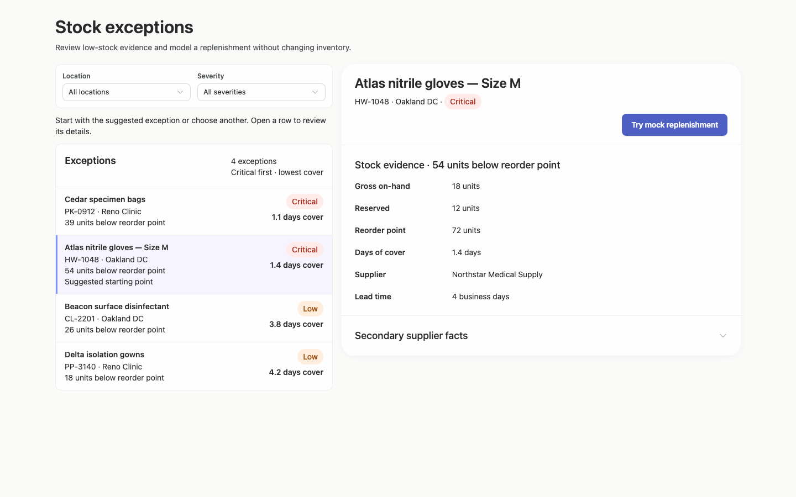

### desktop-1 — Select record and review modeled quantity

Interaction: passed.

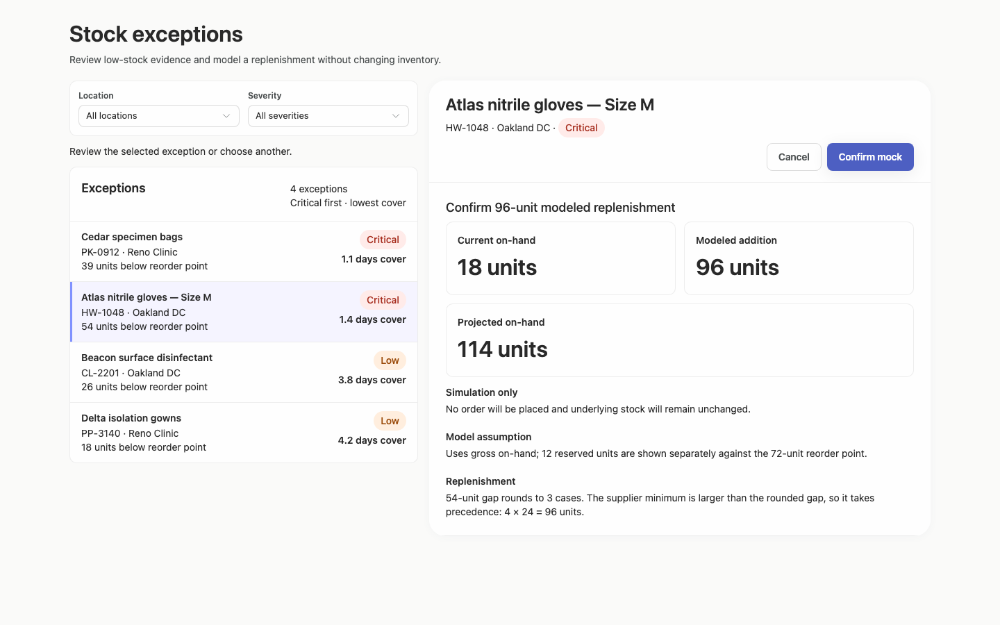

### desktop-2 — Confirm modeled replenishment

Interaction: passed.

### desktop-3 — Read projected quantity

Interaction: passed.

### desktop-4 — Reset fixture result

Interaction: passed.

### desktop-5 — Read expanded supplier facts

Interaction: passed.

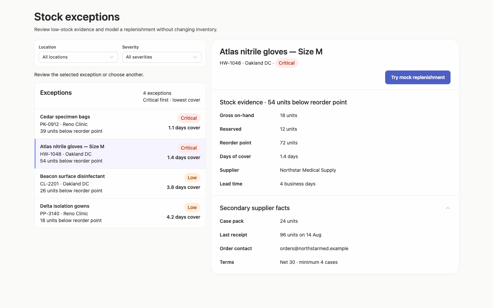

### desktop-wide-0 — initial

Interaction: not-run.

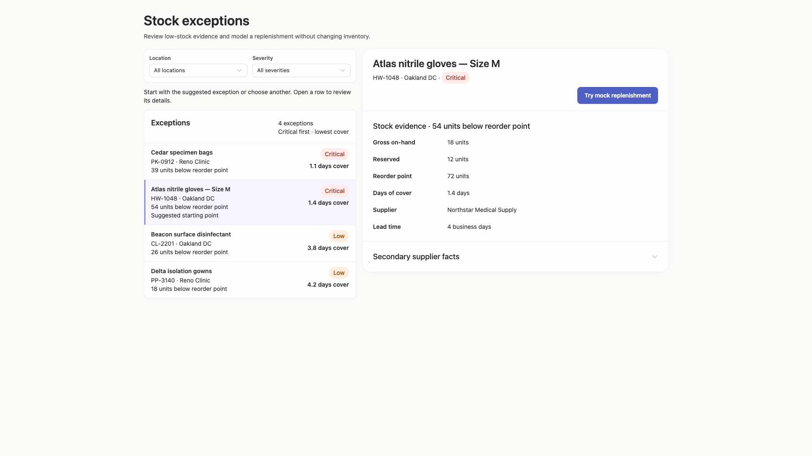

### desktop-wide-1 — Select record and review modeled quantity

Interaction: passed.

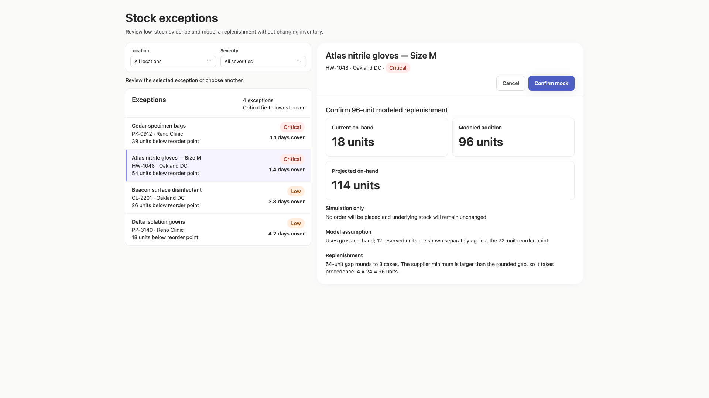

### desktop-wide-2 — Confirm modeled replenishment

Interaction: passed.

### desktop-wide-3 — Read projected quantity

Interaction: passed.

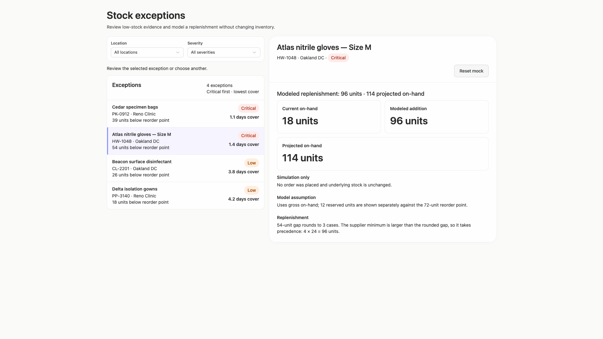

### desktop-wide-4 — Reset fixture result

Interaction: passed.

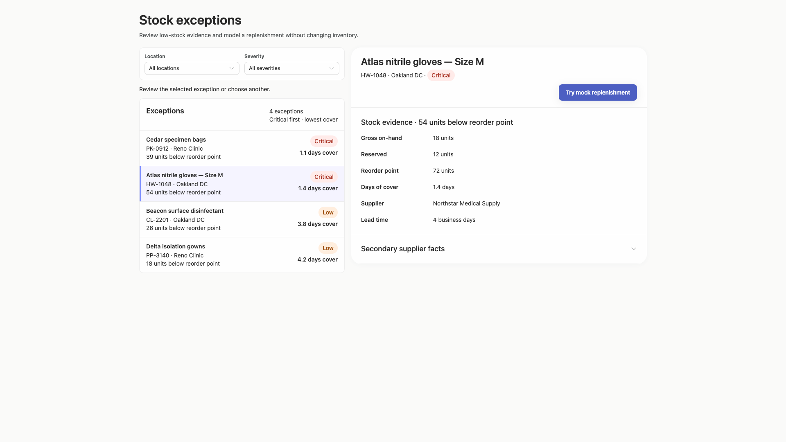

### desktop-wide-5 — Read expanded supplier facts

Interaction: passed.

### desktop-window-0 — initial

Interaction: not-run.

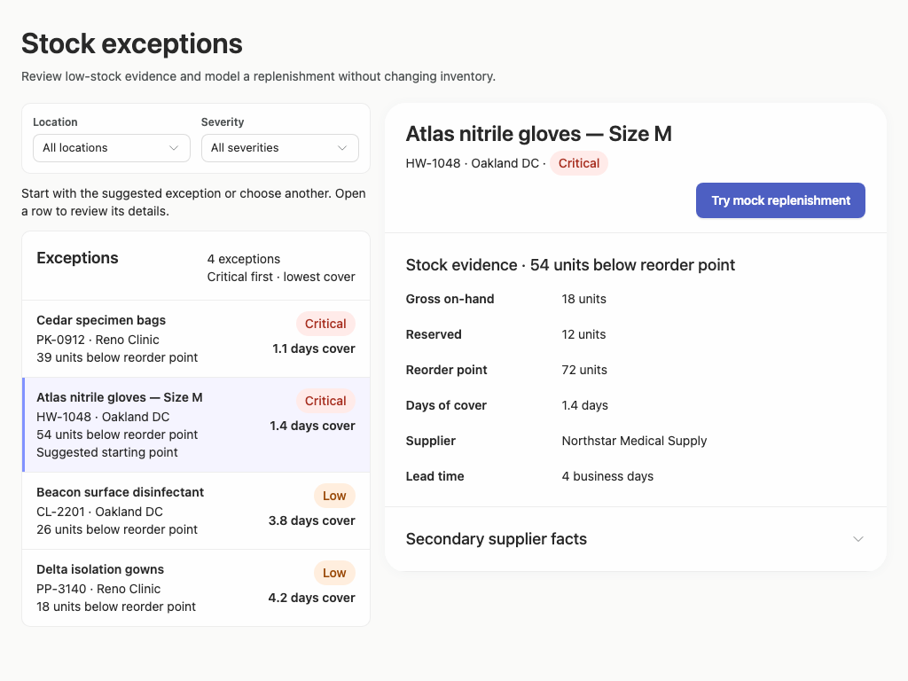

### desktop-window-1 — Select record and review modeled quantity

Interaction: passed.

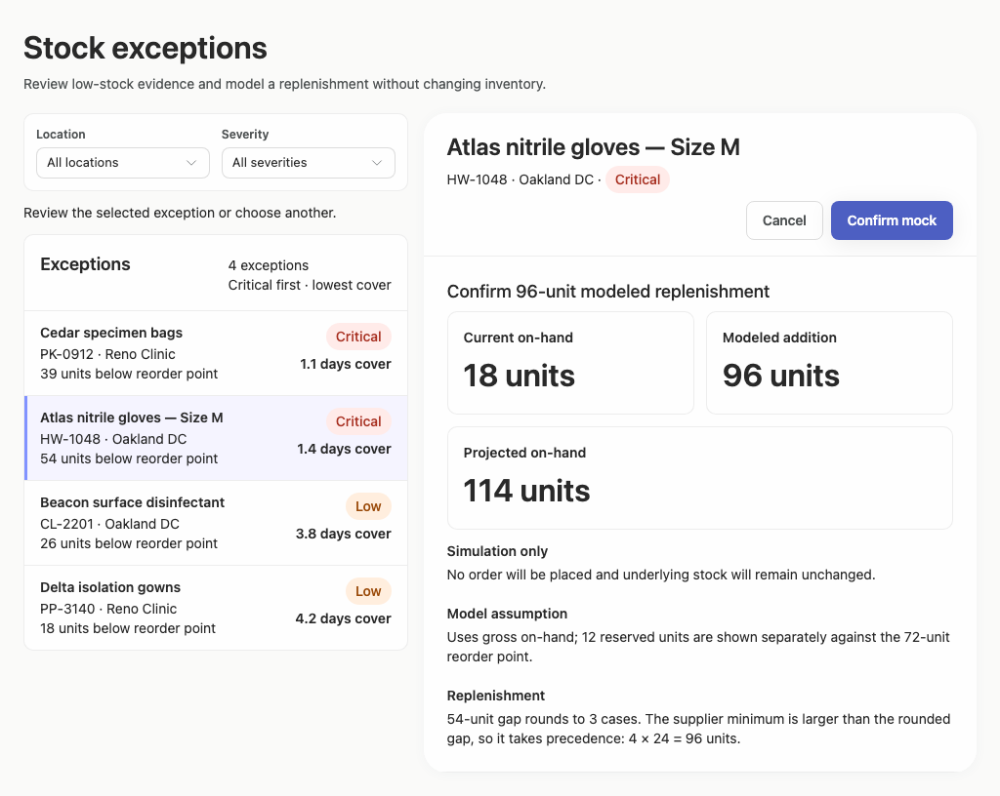

### desktop-window-2 — Confirm modeled replenishment

Interaction: passed.

### desktop-window-3 — Read projected quantity

Interaction: passed.

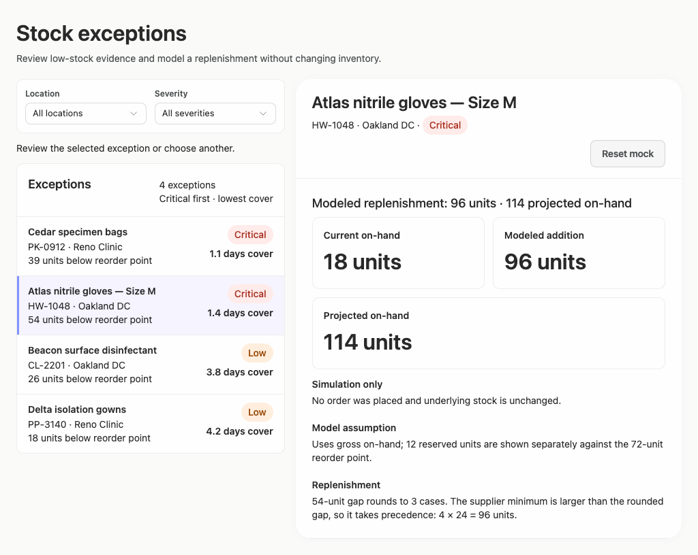

### desktop-window-4 — Reset fixture result

Interaction: passed.

### desktop-window-5 — Read expanded supplier facts

Interaction: passed.

### desktop-custom-700x900-0 — initial

Interaction: not-run.

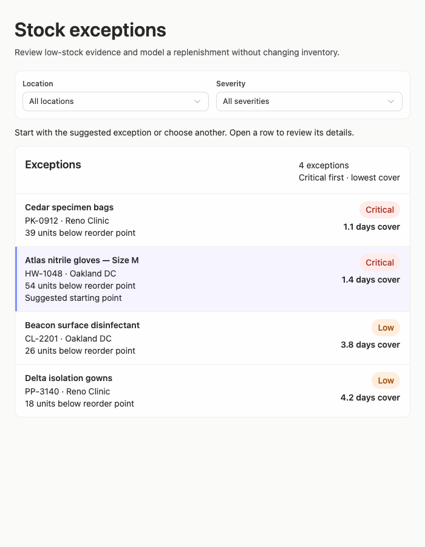

### desktop-custom-700x900-1 — Select record and review modeled quantity

Interaction: passed.

### desktop-custom-700x900-2 — Confirm modeled replenishment

Interaction: passed.

### desktop-custom-700x900-3 — Read projected quantity

Interaction: passed.

### desktop-custom-700x900-4 — Reset fixture result

Interaction: passed.

### desktop-custom-700x900-5 — Read expanded supplier facts

Interaction: passed.

## Limitations

- Only default filter selections are visible; filtered, zero-result, and filter-reset compositions were not shown or tested.
- No desktop widths between 700 and 1024 pixels were supplied, so the exact pane-switch threshold and intermediate wrapping behavior remain uncertain.
- Static captures and interaction summaries do not establish backend behavior, persistence, authorization, or production readiness.
- The evidence does not include an implementation-plan artifact, so completion of that brief deliverable and the requirement to stop before building or publication cannot be verified visually.
- Expanded supplier facts and the mock workflow were shown for one fixture record only; other record-specific edge cases were not visible.
- Styling provenance coverage is very limited in the supplied adherence evidence, so palette and token implementation cannot be fully assessed from that report; the visible palette itself appears consistent across captures.
