# stock-exceptions-shared-emphasis — 2026-09-09T06:12:09.440Z

[All reports](../../README.md) · [Interactive HTML report](index.html) · [Full measurements and scoring](report.json)

GitHub renders this summary and the screenshots. Download or clone this folder to open the HTML report locally; GitHub does not serve it as a website.

**Subjective design score:** 80/100. Model: openai/gpt-5.6-sol. Rubric: 2.

**Arrusted adherence:** 100/100 (partial); evidence coverage 1.2%. Evaluator 3.

| Dimension | Conforming | Nonconforming | Unassessed | Adherence    |
| --------- | ---------- | ------------- | ---------- | ------------ |
| component | 15         | 0             | 2          | 100% (15/15) |
| api       | 35         | 0             | 12         | 100% (35/35) |
| styling   | 13         | 0             | 5193       | 100% (13/13) |

Scores from different evaluator versions or captured states are not directly comparable.

This report evaluates the captured preview; evaluation itself does not regenerate the app or prove a built backend. Scores are advisory and not human-calibrated.

## Ratings

| Dimension | Score | Reason |
| --- | --- | --- |
| hierarchy | 3/4 | The page title, filters, exception list, selected-record header, evidence, and primary mock action form a clear review sequence. Selection and severity are easy to spot, although the result summary’s label/value spacing weakens scanning and the very tall detail card leaves the action visually distant from the evidence on larger windows. |
| layout | 3/4 | The two-column list-detail composition is consistently aligned at 1024, 1440, and 1920 widths, with compact rows and orderly field columns. The fixed-height detail area creates substantial unused space in the initial wide state, while the result state relies on an internal scroll area and can place content behind the persistent footer. |
| typography | 3/4 | Headings, labels, values, item names, and supporting identifiers use a consistent and readable scale. The modeled replenishment quantity label runs directly into its value, and the small Critical pill plus muted supporting text were repeatedly flagged for marginal or insufficient contrast, reducing readability of secondary information. |
| responsive | 3/4 | The composition adapts well across the supplied desktop sizes: list-detail remains usable down to 1024px, and the 700px panel switches to a focused detail view with a Back control. At shorter desktop height, the result panel requires nested vertical scrolling and the fixed footer visibly cuts into the simulation notice; the Back interaction and narrow list state were not shown. |
| productClarity | 4/4 | The task is immediately understandable: users can filter by location and severity, choose an exception, inspect stock and supplier evidence, expand secondary facts, and try a clearly labeled mock replenishment. The result explicitly states that no order was placed and inventory remains unchanged, and Reset mock provides an obvious recovery path. |

## Strengths

- Clear master-detail relationship with a strong selected-row treatment and matching product identity in the detail header.
- Location and severity filters are placed directly above the exception set, with a visible matching-count summary.
- Exception rows efficiently expose product, SKU, location, severity, and days of cover without requiring detail navigation.
- Stock and supplier facts use a simple label/value structure that supports quick operational review.
- The responsive 700px panel preserves context, evidence, disclosure, and the primary action while offering a Back to exceptions control.
- The mock result communicates quantity, projected on-hand, shortfall, case pack, assumptions, and the non-destructive nature of the simulation.
- Expanded supplier facts add practical ordering context such as case pack, receipt history, contact, and terms.

## Improvements

- **medium — desktop-1:** In the first modeled-result row, “Modeled replenishment” and “72 units (3 cases)” visually run together without a column gap. This makes the most important output harder to parse than the rows beneath it. Use the same fixed label column and explicit column gap as the other evidence rows, allowing the long label to wrap while keeping the value aligned in a separate column.
- **medium — desktop-window-1:** The Simulation only notice extends beneath the persistent footer in the 768px-high window, so its explanatory text is initially obscured even though the detail region can scroll. This weakens immediate confirmation that the action was non-destructive. Reserve bottom space inside the scrollable detail body equal to the action footer, or reduce result-section vertical spacing at shorter desktop heights so the complete simulation notice appears above the footer.
- **low — desktop-wide-0:** The initial detail card contains a large empty band between the collapsed supplier section and the action footer. The anchored action is consistent, but the excess height makes the evidence and action feel unnecessarily disconnected on a tall window. Let the detail card size more closely to its content on taller windows, or use the available region for a compact, relevant evidence summary while retaining the action footer’s alignment.
- **low — desktop-0:** The Critical status is visually very small relative to the record title, and automated review repeatedly flagged its red text treatment as insufficient contrast. Severity remains understandable from the text, but it is less readable than the surrounding metadata. Use an available larger or more prominent supported StatusPill/Tag variant, or repeat the severity in regular-sized record metadata; preserve the established Arrusted palette rather than introducing replacement colors.

## Token evidence

Percentages cover only assessed properties. Missing provenance and ambiguous CSS remain unassessed; matching literals are not proof of token usage.

| Viewport | Category | Token references / assessed | Coverage |
| --- | --- | --- | --- |
| desktop-0 | color | 0/0 | 0% (0/232) |
| desktop-0 | typography | 0/0 | 0% (0/526) |
| desktop-0 | spacing | 0/0 | 0% (0/275) |
| desktop-0 | radius | 0/0 | 0% (0/116) |
| desktop-0 | border | 0/0 | 0% (0/126) |
| desktop-0 | shadow | 0/0 | 0% (0/120) |
| desktop-wide-0 | color | 0/0 | 0% (0/232) |
| desktop-wide-0 | typography | 0/0 | 0% (0/526) |
| desktop-wide-0 | spacing | 0/0 | 0% (0/275) |
| desktop-wide-0 | radius | 0/0 | 0% (0/116) |
| desktop-wide-0 | border | 0/0 | 0% (0/126) |
| desktop-wide-0 | shadow | 0/0 | 0% (0/120) |
| desktop-window-0 | color | 0/0 | 0% (0/232) |
| desktop-window-0 | typography | 0/0 | 0% (0/526) |
| desktop-window-0 | spacing | 0/0 | 0% (0/275) |
| desktop-window-0 | radius | 0/0 | 0% (0/116) |
| desktop-window-0 | border | 0/0 | 0% (0/126) |
| desktop-window-0 | shadow | 0/0 | 0% (0/120) |
| desktop-custom-700x900-0 | color | 0/0 | 0% (0/162) |
| desktop-custom-700x900-0 | typography | 0/0 | 0% (0/410) |
| desktop-custom-700x900-0 | spacing | 0/0 | 0% (0/186) |
| desktop-custom-700x900-0 | radius | 0/0 | 0% (0/82) |
| desktop-custom-700x900-0 | border | 0/0 | 0% (0/86) |
| desktop-custom-700x900-0 | shadow | 0/0 | 0% (0/82) |

## Latest-run screenshots

### desktop-0 — initial

Interaction: not-run.

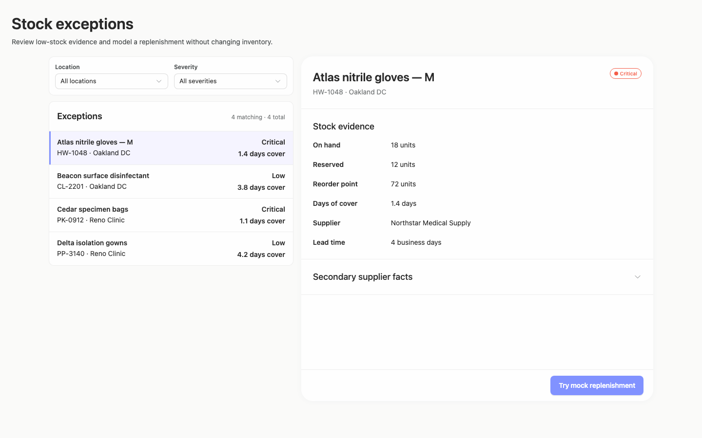

### desktop-1 — Mock replenishment result

Interaction: passed.

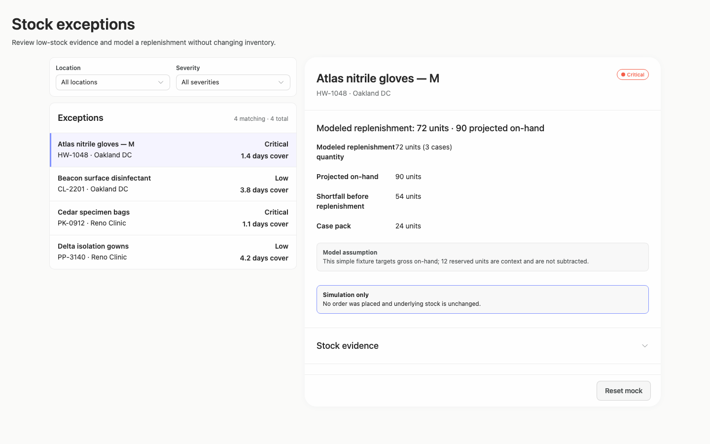

### desktop-2 — Reset from result footer

Interaction: passed.

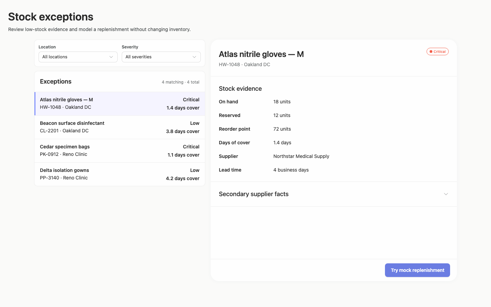

### desktop-3 — Expanded supplier facts

Interaction: passed.

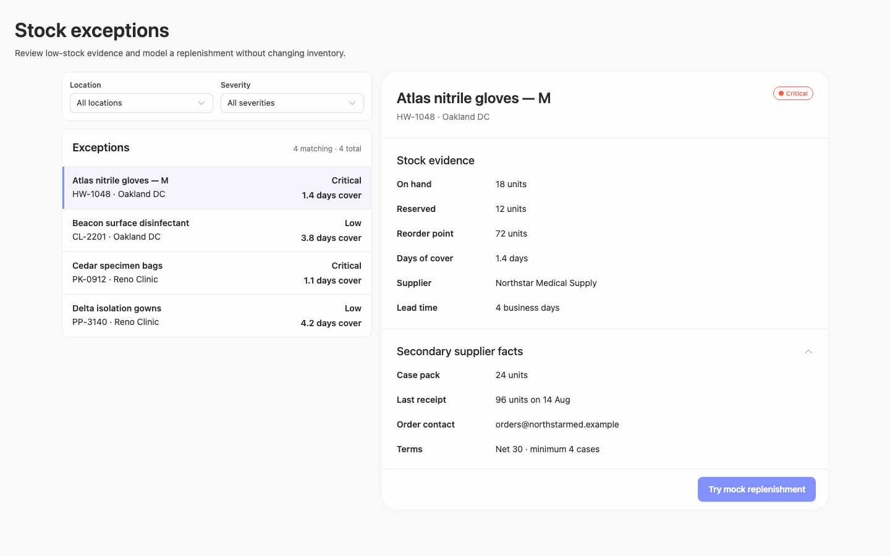

### desktop-wide-0 — initial

Interaction: not-run.

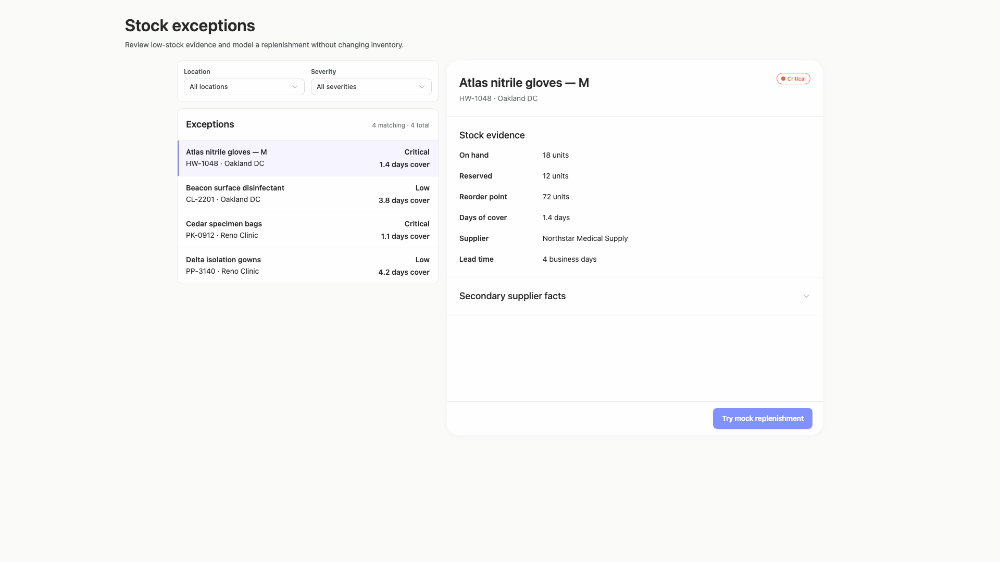

### desktop-wide-1 — Mock replenishment result

Interaction: passed.

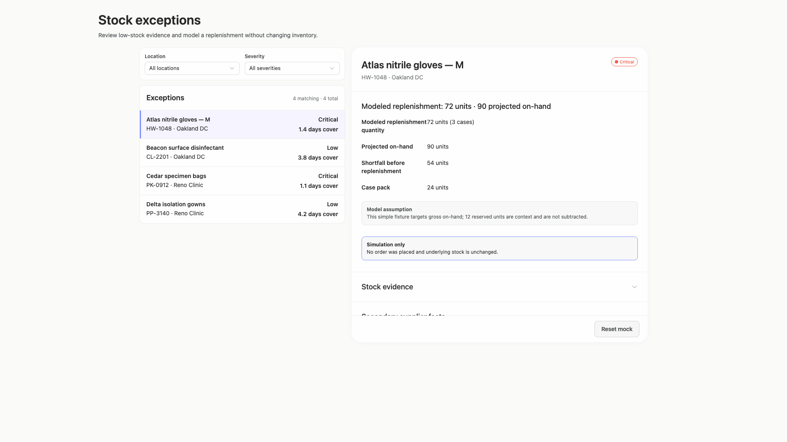

### desktop-wide-2 — Reset from result footer

Interaction: passed.

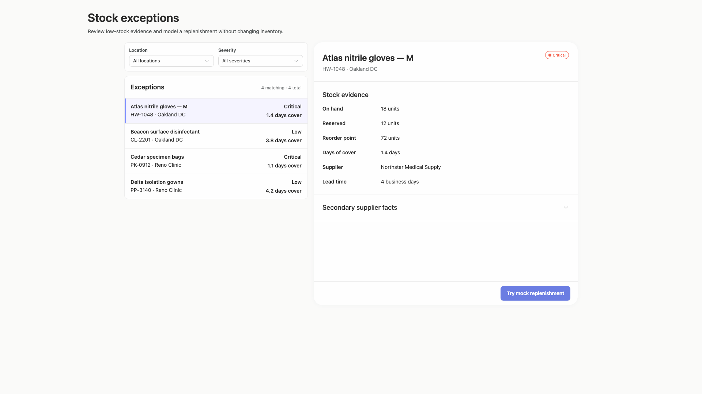

### desktop-wide-3 — Expanded supplier facts

Interaction: passed.

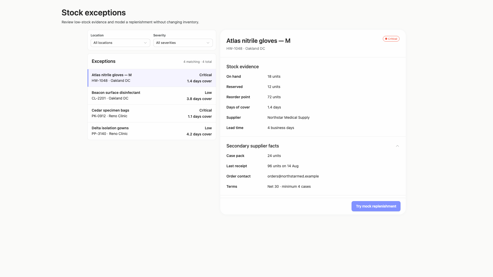

### desktop-window-0 — initial

Interaction: not-run.

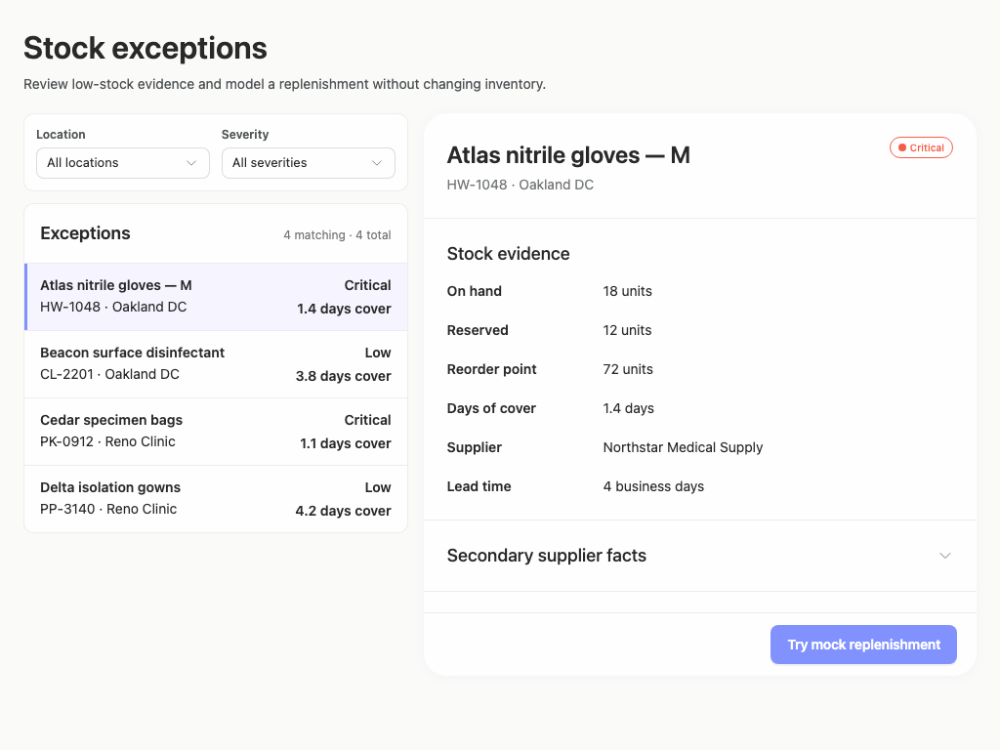

### desktop-window-1 — Mock replenishment result

Interaction: passed.

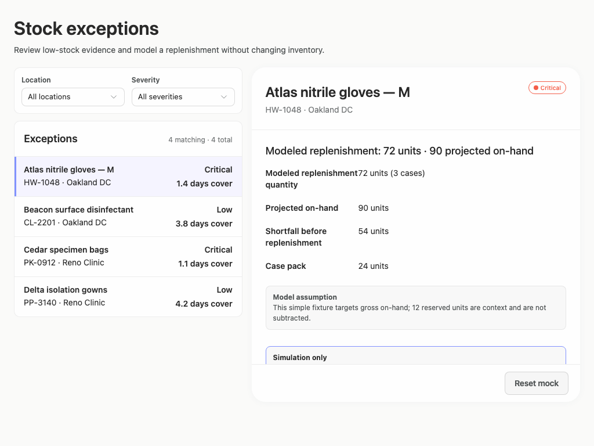

### desktop-window-2 — Reset from result footer

Interaction: passed.

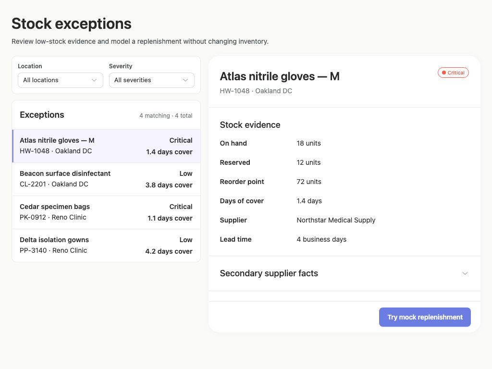

### desktop-window-3 — Expanded supplier facts

Interaction: passed.

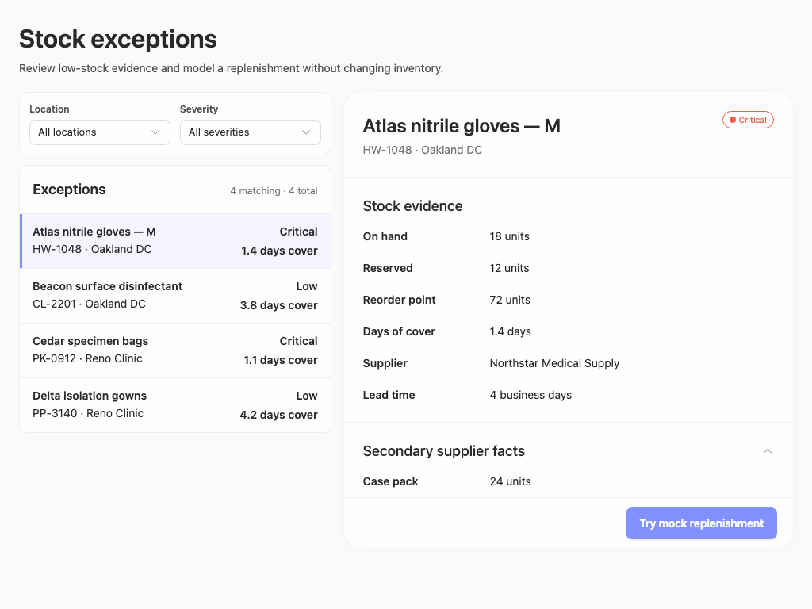

### desktop-custom-700x900-0 — initial

Interaction: not-run.

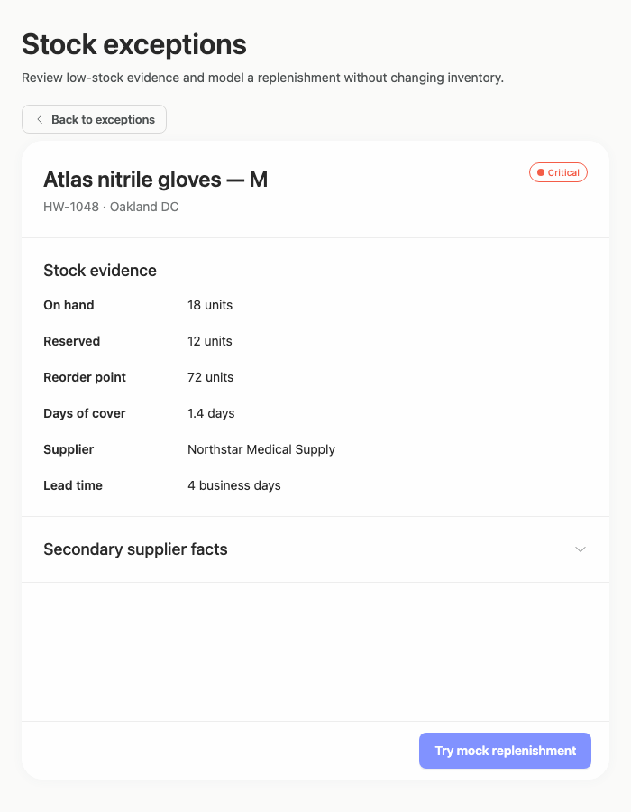

### desktop-custom-700x900-1 — Mock replenishment result

Interaction: passed.

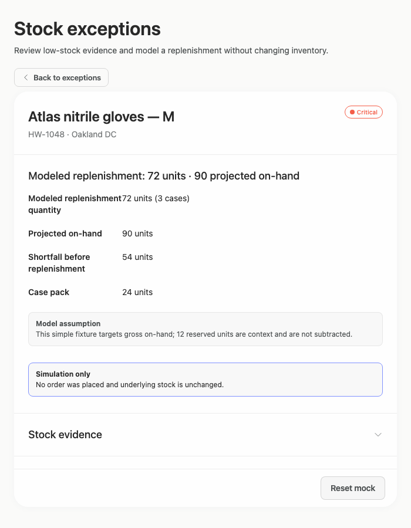

### desktop-custom-700x900-2 — Reset from result footer

Interaction: passed.

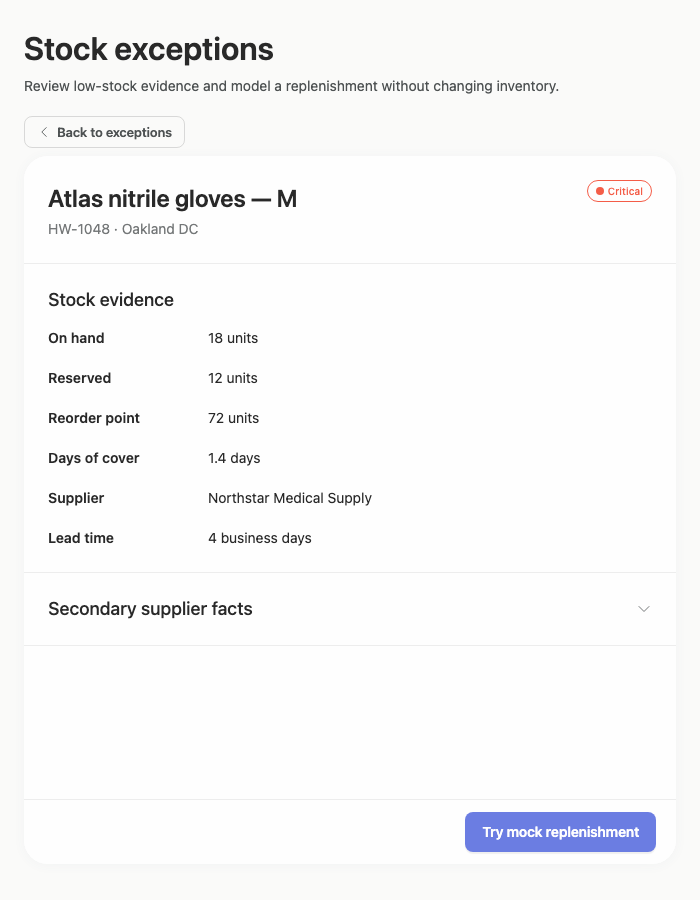

### desktop-custom-700x900-3 — Expanded supplier facts

Interaction: passed.

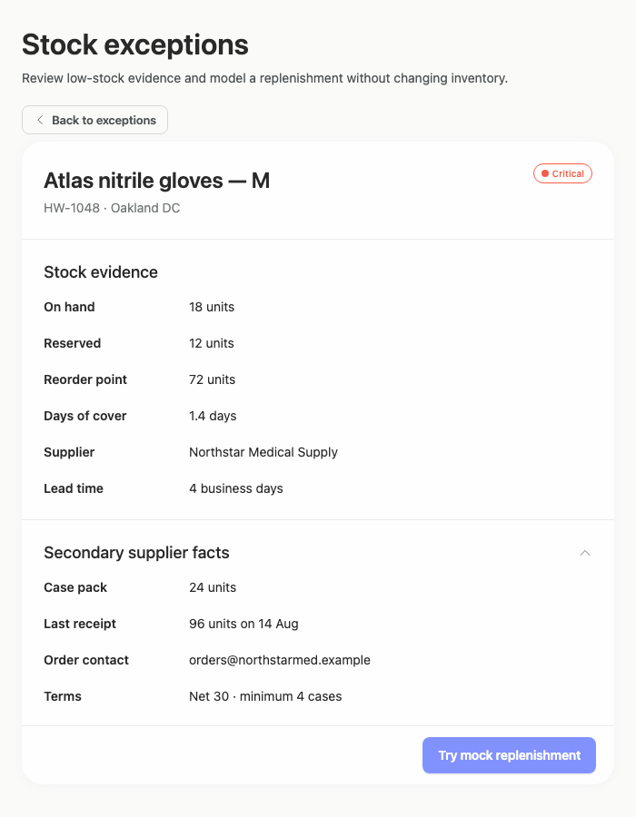

## Limitations

- Evaluation is based only on the supplied static captures and measurements; filtering behavior, record switching, disclosure animation, keyboard behavior, and the 700px Back transition were not directly tested.
- Only selected-detail narrow states are shown, so the appearance and usability of the exception list and filters at 700px cannot be assessed.
- The captures demonstrate a visual prototype and several mock interactions, but they do not show or verify the requested implementation plan or confirm that work stopped before publication.
- Internal scrolling appears intentional in measured result and expanded states; observations concern initial content visibility rather than assuming scrolling itself is defective.
- Static source and adherence evidence cannot prove that every public component rendered or that all callbacks work. Styling provenance coverage is especially limited, so no overall token-adherence conclusion is inferred.
- Automated contrast findings are treated as advisory design evidence only; the existing Arrusted palette remains authoritative.
