# stock-exceptions-sku-metadata — 2026-09-09T00:40:02.709Z

[All reports](../../README.md) · [Interactive HTML report](index.html) · [Full measurements and scoring](report.json)

[Reviewer notes and comparison limits](review-notes.md)

GitHub renders this summary and the screenshots. Download or clone this folder to open the HTML report locally; GitHub does not serve it as a website.

**Subjective design score:** 90/100. Model: openai/gpt-5.6-sol. Rubric: 2.

**Arrusted adherence:** 100/100 (partial); evidence coverage 1.84%. Evaluator 3.

| Dimension | Conforming | Nonconforming | Unassessed | Adherence    |
| --------- | ---------- | ------------- | ---------- | ------------ |
| component | 32         | 0             | 3          | 100% (32/32) |
| api       | 55         | 0             | 6          | 100% (55/55) |
| styling   | 19         | 0             | 5637       | 100% (19/19) |

Scores from different evaluator versions or captured states are not directly comparable.

This is the saved component-backed preview, not a new generation or a built backend. Scores are advisory and not human-calibrated.

## Ratings

| Dimension | Score | Reason |
| --- | --- | --- |
| hierarchy | 4/4 | The page establishes a clear sequence from title and review count to filters, severity-grouped exceptions, selected record details, replenishment recommendation, and action. Selected-row treatment, cover values, severity pills, and the prominent suggested-order heading make priorities immediately scannable. |
| layout | 3/4 | The split list/detail composition is consistently aligned and appropriately dense at 1440px and 1920px, while the 700px view cleanly changes to list and drill-in states. The 1024×768 capture has a small 24px document overflow, and the narrow list could communicate row navigation more explicitly. |
| typography | 4/4 | Heading levels, product names, metadata, values, and explanatory copy are visually consistent and readable across all supplied sizes. Bold numeric values and restrained secondary text support rapid inventory review without introducing competing type treatments. |
| responsive | 3/4 | The composition scales from a centered wide layout to a compact two-panel 1024px layout and then an effective single-view drill-in flow at 700px, with filters and controls remaining usable. The slight full-page overflow at the 768px-high window keeps this from being exceptional, although the primary action remains visible. |
| productClarity | 4/4 | The interface clearly explains that products need review, exposes location and severity filters, groups records by urgency, shows stock and supplier tabs, and labels replenishment as a simulation. Messages such as “Preview only,” “No supplier contacted,” and “Stock unchanged” make the mock action’s consequences especially clear. |

## Strengths

- Critical and warning groups pair counts with cover ranges, making urgency and ordering immediately understandable.
- Selection is reinforced through a radio state, border, and subtle row background without departing from the supplied palette.
- The detail panel combines current stock, reorder point, supplier lead time, pack size, suggested quantity, and arrival risk into a coherent decision view.
- The 700px desktop-panel treatment avoids squeezing both panes together and provides a clear “Back to exceptions” route.
- Scripted captures demonstrate filtering, supplier inspection, delivery-fit messaging, replenishment simulation, and explicit no-order confirmation.
- The wide layout uses a bounded, centered workspace rather than stretching operational content across the entire display.

## Improvements

- **low — desktop-custom-700x900-0:** In the narrow list state, rows use hollow radio circles even though choosing one opens a separate detail view. Without a visible selected state or directional cue in this state, the circles can suggest in-place single selection rather than navigation to review. Add a supported trailing icon or concise “Review” cue to each row while preserving whole-row selection, hover, and focus behavior. This would distinguish drill-in navigation from a radio-only choice without changing the palette.
- **low — desktop-window-0:** At the measured 1024×768 window, the document height reaches 792px, creating a small 24px page scroll around the final list row. The main action remains visible, so this is minor, but the extra scroll feels incidental rather than purposeful. Slightly tighten vertical list spacing at this height or use an intentional contained-scroll treatment for the exception list so the full-page overflow does not occur.
- **low — desktop-2:** After simulation, the primary action changes into “Simulated — no order sent” and visually behaves like a disabled button. The adjacent “Stock unchanged” message clarifies the result, but an action control doubling as status can make the next available step ambiguous. Present completion with a supported StatusPill beside “Stock unchanged,” then either remove the action or provide a clearly labeled supported reset or re-run action.

## Token evidence

Percentages cover only assessed properties. Missing provenance and ambiguous CSS remain unassessed; matching literals are not proof of token usage.

| Viewport | Category | Token references / assessed | Coverage |
| --- | --- | --- | --- |
| desktop-0 | color | 0/0 | 0% (0/227) |
| desktop-0 | typography | 0/0 | 0% (0/557) |
| desktop-0 | spacing | 0/0 | 0% (0/299) |
| desktop-0 | radius | 0/0 | 0% (0/114) |
| desktop-0 | border | 0/0 | 0% (0/137) |
| desktop-0 | shadow | 0/0 | 0% (0/120) |
| desktop-wide-0 | color | 0/0 | 0% (0/227) |
| desktop-wide-0 | typography | 0/0 | 0% (0/557) |
| desktop-wide-0 | spacing | 0/0 | 0% (0/299) |
| desktop-wide-0 | radius | 0/0 | 0% (0/114) |
| desktop-wide-0 | border | 0/0 | 0% (0/137) |
| desktop-wide-0 | shadow | 0/0 | 0% (0/120) |
| desktop-window-0 | color | 0/0 | 0% (0/227) |
| desktop-window-0 | typography | 0/0 | 0% (0/557) |
| desktop-window-0 | spacing | 0/0 | 0% (0/299) |
| desktop-window-0 | radius | 0/0 | 0% (0/114) |
| desktop-window-0 | border | 0/0 | 0% (0/137) |
| desktop-window-0 | shadow | 0/0 | 0% (0/120) |
| desktop-custom-700x900-0 | color | 0/0 | 0% (0/198) |
| desktop-custom-700x900-0 | typography | 0/0 | 0% (0/489) |
| desktop-custom-700x900-0 | spacing | 0/0 | 0% (0/265) |
| desktop-custom-700x900-0 | radius | 0/0 | 0% (0/99) |
| desktop-custom-700x900-0 | border | 0/0 | 0% (0/119) |
| desktop-custom-700x900-0 | shadow | 0/0 | 0% (0/105) |

## Latest-run screenshots

### desktop-0 — initial

Interaction: not-run.

### desktop-1 — Select and inspect supplier

Interaction: passed.

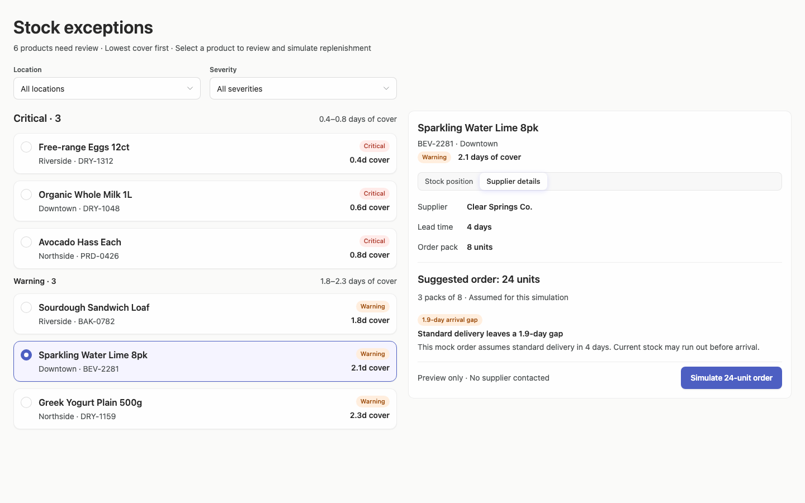

### desktop-2 — Simulate replenishment

Interaction: passed.

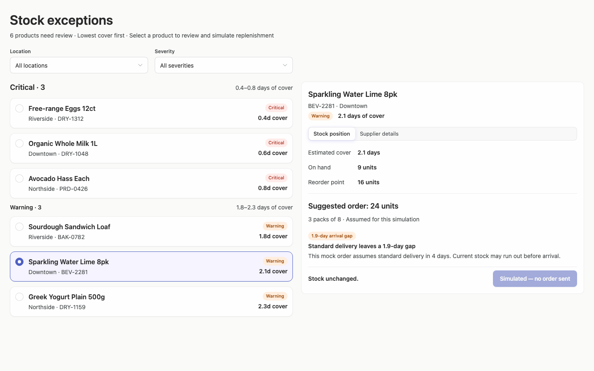

### desktop-3 — Filter records

Interaction: passed.

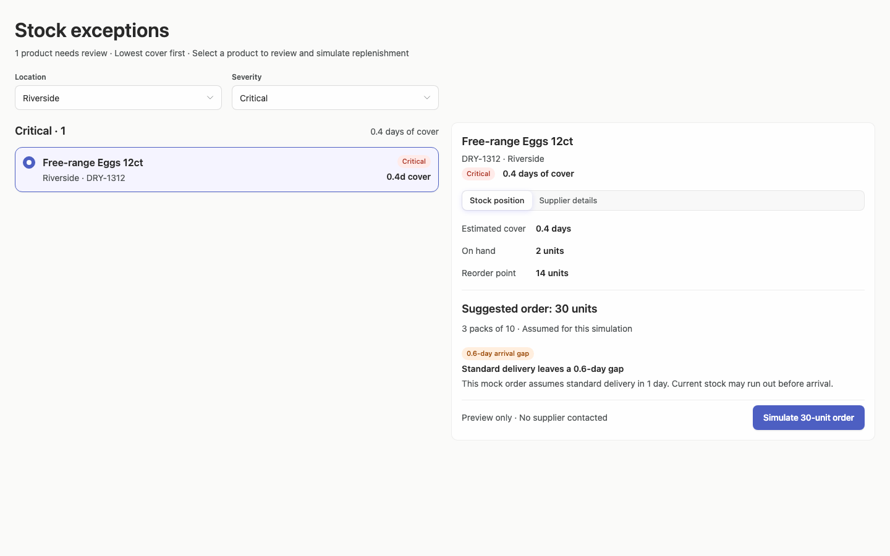

### desktop-4 — Review delivery within cover

Interaction: passed.

### desktop-5 — Read the stock-view delivery assumption

Interaction: passed.

### desktop-wide-0 — initial

Interaction: not-run.

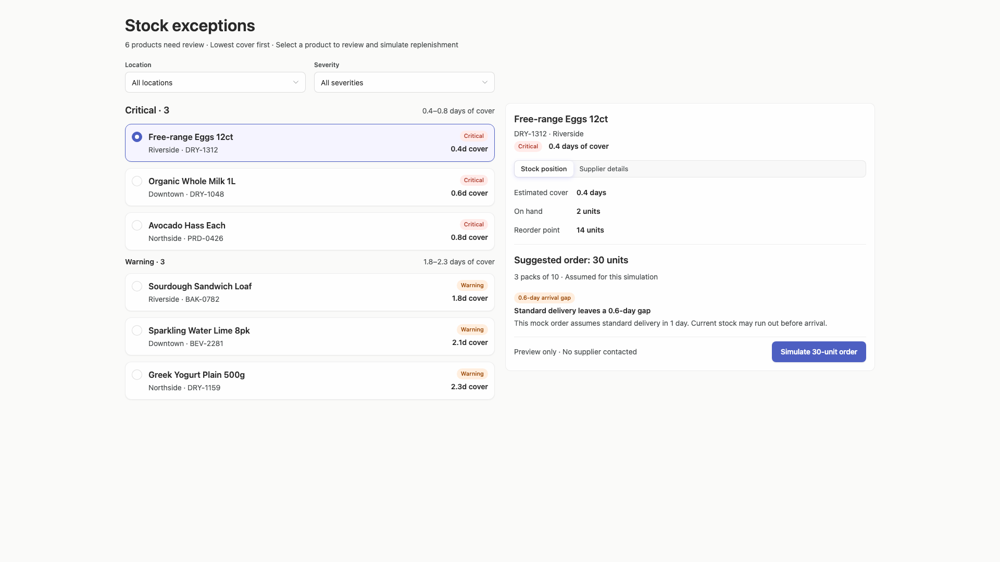

### desktop-wide-1 — Select and inspect supplier

Interaction: passed.

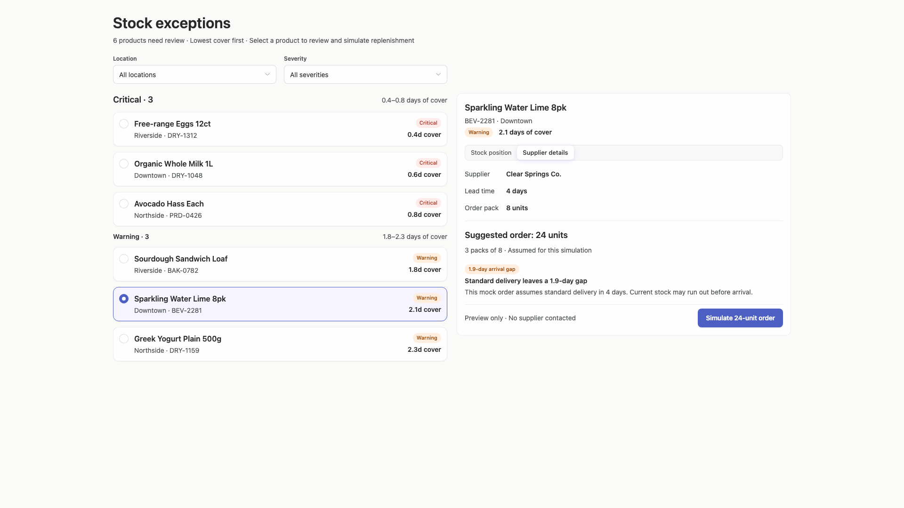

### desktop-wide-2 — Simulate replenishment

Interaction: passed.

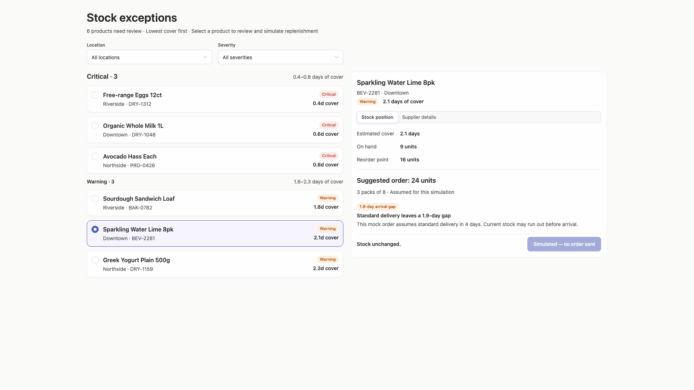

### desktop-wide-3 — Filter records

Interaction: passed.

### desktop-wide-4 — Review delivery within cover

Interaction: passed.

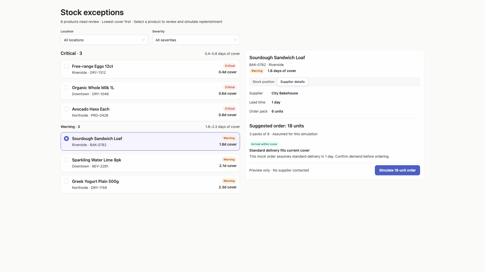

### desktop-wide-5 — Read the stock-view delivery assumption

Interaction: passed.

### desktop-window-0 — initial

Interaction: not-run.

### desktop-window-1 — Select and inspect supplier

Interaction: passed.

### desktop-window-2 — Simulate replenishment

Interaction: passed.

### desktop-window-3 — Filter records

Interaction: passed.

### desktop-window-4 — Review delivery within cover

Interaction: passed.

### desktop-window-5 — Read the stock-view delivery assumption

Interaction: passed.

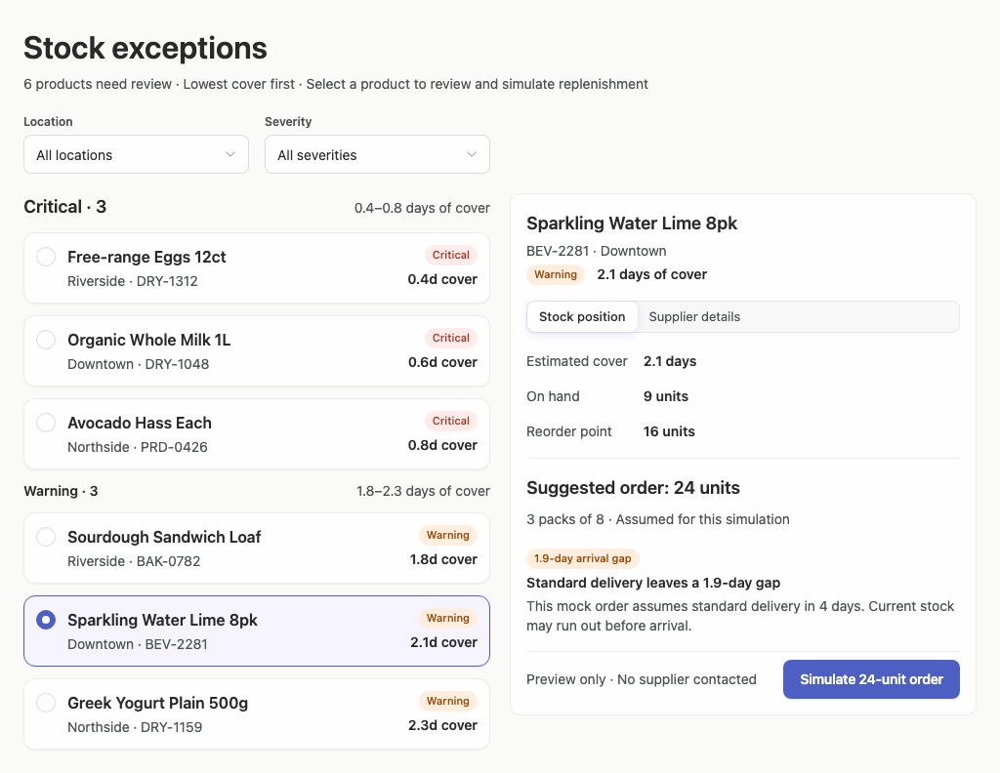

### desktop-custom-700x900-0 — initial

Interaction: not-run.

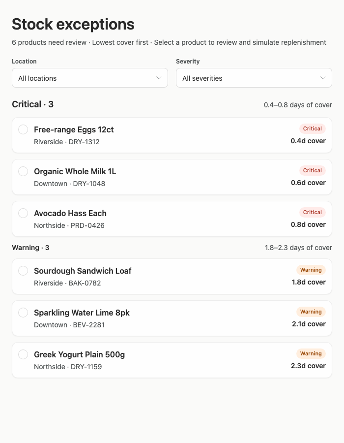

### desktop-custom-700x900-1 — Select and inspect supplier

Interaction: passed.

### desktop-custom-700x900-2 — Simulate replenishment

Interaction: passed.

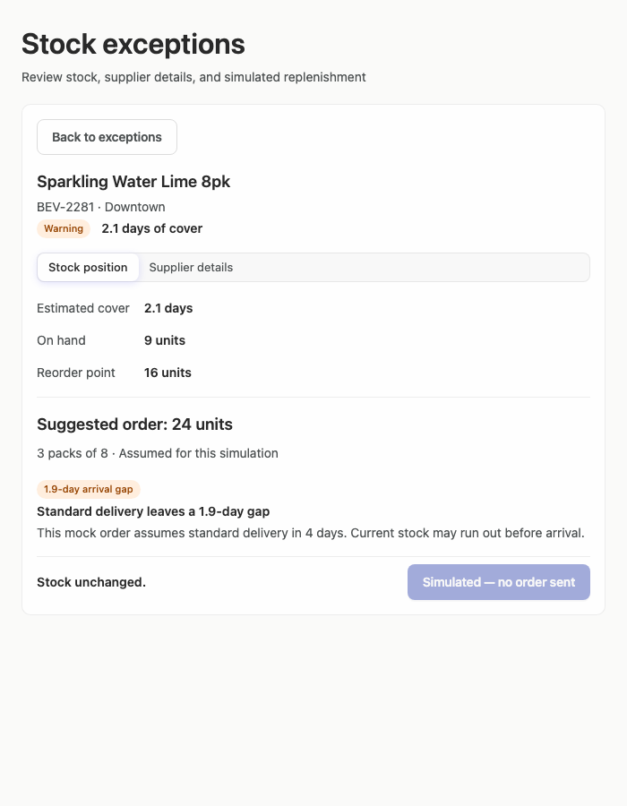

### desktop-custom-700x900-3 — Filter records

Interaction: passed.

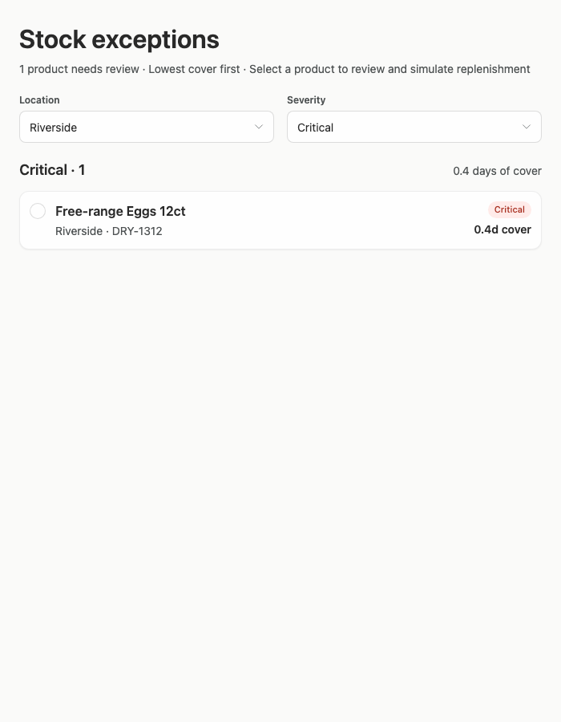

### desktop-custom-700x900-4 — Review delivery within cover

Interaction: passed.

### desktop-custom-700x900-5 — Read the stock-view delivery assumption

Interaction: passed.

## Limitations

- The captures do not provide a visible implementation-plan artifact, so fulfillment of that non-interface deliverable cannot be assessed.
- Dropdown-open, hover, focus, keyboard-navigation, loading, empty-result, and error states were not shown.
- Several interaction callbacks and conditional branches were statically unassessed; passed scripted captures demonstrate only the listed scenarios, not general backend behavior.
- The styling evidence has very limited assessed coverage and cannot establish complete semantic-token provenance, although no visible palette departure is apparent.
- No desktop width narrower than 700px or additional constrained panel combinations were provided.
