# stock-exceptions-stacked-explanations — 2026-09-09T07:43:37.561Z

[All reports](../../README.md) · [Interactive HTML report](index.html) · [Full measurements and scoring](report.json)

GitHub renders this summary and the screenshots. Download or clone this folder to open the HTML report locally; GitHub does not serve it as a website.

**Subjective design score:** 90/100. Model: openai/gpt-5.6-sol. Rubric: 2.

**Arrusted adherence:** 100/100 (partial); evidence coverage 1.54%. Evaluator 3.

| Dimension | Conforming | Nonconforming | Unassessed | Adherence    |
| --------- | ---------- | ------------- | ---------- | ------------ |
| component | 19         | 0             | 2          | 100% (19/19) |
| api       | 49         | 0             | 10         | 100% (49/49) |
| styling   | 13         | 0             | 5181       | 100% (13/13) |

Scores from different evaluator versions or captured states are not directly comparable.

This report evaluates the captured preview; evaluation itself does not regenerate the app or prove a built backend. Scores are advisory and not human-calibrated.

## Ratings

| Dimension      | Score | Reason                                                                                                                                                                                                                                                                                                                                                                        |
| -------------- | ----- | ----------------------------------------------------------------------------------------------------------------------------------------------------------------------------------------------------------------------------------------------------------------------------------------------------------------------------------------------------------------------------- |
| hierarchy      | 4/4   | The page establishes a clear sequence from title and filters to exception selection, record evidence, and the replenishment action. Selected-row treatment, severity pills, section headings, and distinct confirmation/result headings make each workflow state easy to scan.                                                                                                |
| layout         | 3/4   | The two-panel composition is aligned and comfortably dense at 1024–1920px, while the 700px view appropriately switches to a focused detail panel with Back navigation. The confirmation facts use mixed inline and stacked label/value arrangements at constrained widths, slightly weakening scan consistency.                                                               |
| typography     | 3/4   | Heading levels, field labels, values, identifiers, and supporting copy are visually consistent and generally readable. Automated evidence repeatedly flags low contrast for text inside the existing primary Button, so button-label readability remains an advisory concern despite otherwise strong typography.                                                             |
| responsive     | 4/4   | The composition remains usable across the supplied 1920×1080, 1440×900, 1024×768, and 700×900 desktop captures. It transitions from list-detail to constrained detail with a visible Back control, keeps actions available, and uses bounded vertical scrolling for expanded or result content without document overflow.                                                     |
| productClarity | 4/4   | Location and severity filters are explicit, list rows expose product, location, severity, and days of cover, and the selected detail explains stock and supplier evidence. The confirmation and result states repeatedly clarify that the action is a simulation, show the 96-unit calculation and projected 114 units, and state that no order or inventory change occurred. |

## Strengths

- Selected-row highlighting and persistent record identity make the list-to-detail relationship immediately understandable.
- Exception rows expose the most decision-relevant signals—severity and days of cover—without overcrowding the list.
- Supplier terms, case pack, lead time, and replenishment assumptions provide credible evidence for the mock decision.
- The constrained 700px desktop composition replaces the split view with focused detail and an explicit Back to exceptions affordance.
- Confirmation, result, reset, and expanded-supplier states are visually coherent and preserve the same product context.

## Improvements

- **medium — desktop-custom-700x900-1:** The confirmation summary alternates between two-column rows and stacked rows according to content length. This produces uneven reading starts for Simulation only, Current baseline, Model assumption, Replenishment, and Projected on-hand. At constrained desktop widths, compose all confirmation facts as consistently stacked label/value rows, or use one stable two-column grid with long values wrapping only in the value column.
- **low — desktop-window-5:** When supplier facts are expanded and the detail container is scrolled, the stock-evidence heading and first facts disappear while later stock fields remain above the supplier section. The persistent record title helps, but the boundary between evidence groups becomes less obvious. Keep the active section heading visible within the existing scroll container, or scroll the expanded disclosure heading to the top so users retain a clear section anchor.
- **low — desktop-0:** Automated evidence reports insufficient contrast for the primary Button label in several initial, confirmation, reset, and expanded states. This is advisory because the Arrusted palette and primary Button styling are authoritative. Keep the Arrusted Button unchanged, but place a concise neutral-text note adjacent to the action—such as “Simulation only; no order will be placed”—so critical action meaning does not depend solely on the button label. Treat any button-level contrast correction as a shared design-system issue rather than a local palette override.

## Token evidence

Percentages cover only assessed properties. Missing provenance and ambiguous CSS remain unassessed; matching literals are not proof of token usage.

| Viewport                 | Category   | Token references / assessed | Coverage   |
| ------------------------ | ---------- | --------------------------- | ---------- |
| desktop-0                | color      | 0/0                         | 0% (0/233) |
| desktop-0                | typography | 0/0                         | 0% (0/526) |
| desktop-0                | spacing    | 0/0                         | 0% (0/275) |
| desktop-0                | radius     | 0/0                         | 0% (0/116) |
| desktop-0                | border     | 0/0                         | 0% (0/125) |
| desktop-0                | shadow     | 0/0                         | 0% (0/120) |
| desktop-wide-0           | color      | 0/0                         | 0% (0/233) |
| desktop-wide-0           | typography | 0/0                         | 0% (0/526) |
| desktop-wide-0           | spacing    | 0/0                         | 0% (0/275) |
| desktop-wide-0           | radius     | 0/0                         | 0% (0/116) |
| desktop-wide-0           | border     | 0/0                         | 0% (0/125) |
| desktop-wide-0           | shadow     | 0/0                         | 0% (0/120) |
| desktop-window-0         | color      | 0/0                         | 0% (0/233) |
| desktop-window-0         | typography | 0/0                         | 0% (0/526) |
| desktop-window-0         | spacing    | 0/0                         | 0% (0/275) |
| desktop-window-0         | radius     | 0/0                         | 0% (0/116) |
| desktop-window-0         | border     | 0/0                         | 0% (0/125) |
| desktop-window-0         | shadow     | 0/0                         | 0% (0/120) |
| desktop-custom-700x900-0 | color      | 0/0                         | 0% (0/161) |
| desktop-custom-700x900-0 | typography | 0/0                         | 0% (0/405) |
| desktop-custom-700x900-0 | spacing    | 0/0                         | 0% (0/184) |
| desktop-custom-700x900-0 | radius     | 0/0                         | 0% (0/81)  |
| desktop-custom-700x900-0 | border     | 0/0                         | 0% (0/84)  |
| desktop-custom-700x900-0 | shadow     | 0/0                         | 0% (0/81)  |

## Latest-run screenshots

### desktop-0 — initial

Interaction: not-run.

### desktop-1 — Review modeled quantity before confirming

Interaction: passed.

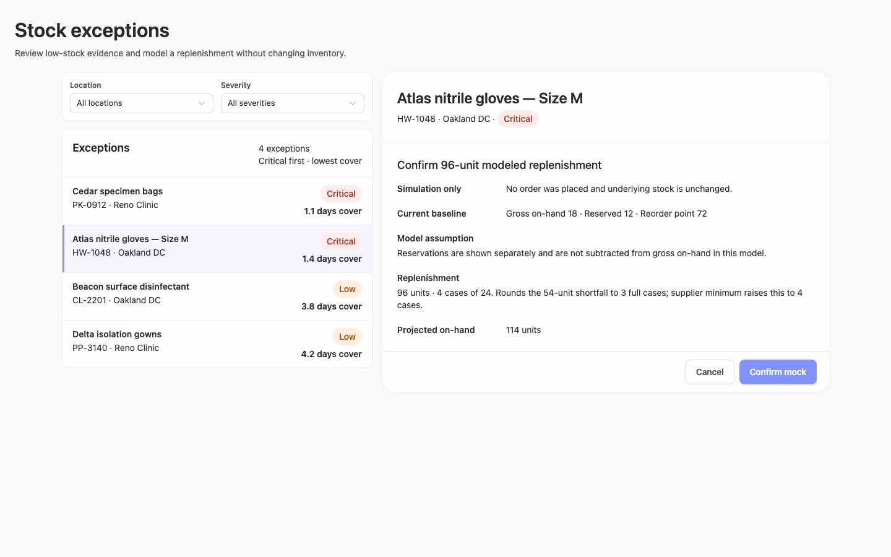

### desktop-2 — Mock replenishment result

Interaction: passed.

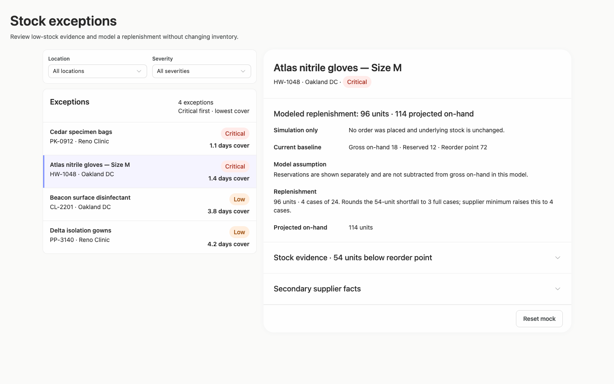

### desktop-3 — Result evidence at scroll boundary

Interaction: passed.

### desktop-4 — Reset from result footer

Interaction: passed.

### desktop-5 — Expanded supplier facts

Interaction: passed.

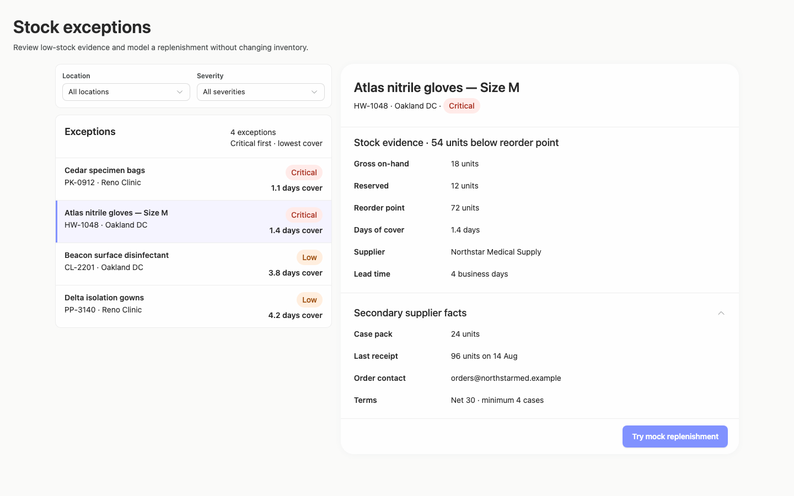

### desktop-wide-0 — initial

Interaction: not-run.

### desktop-wide-1 — Review modeled quantity before confirming

Interaction: passed.

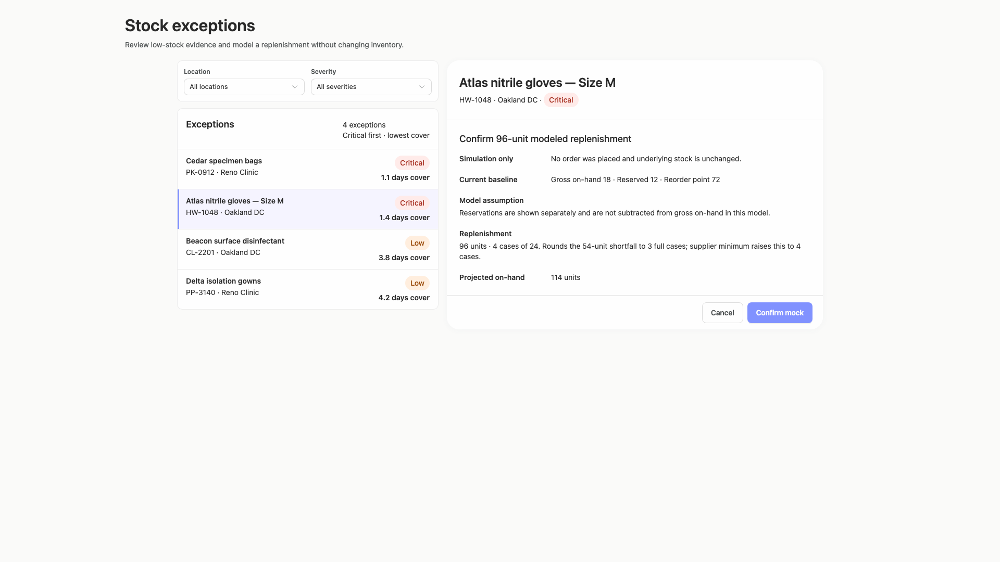

### desktop-wide-2 — Mock replenishment result

Interaction: passed.

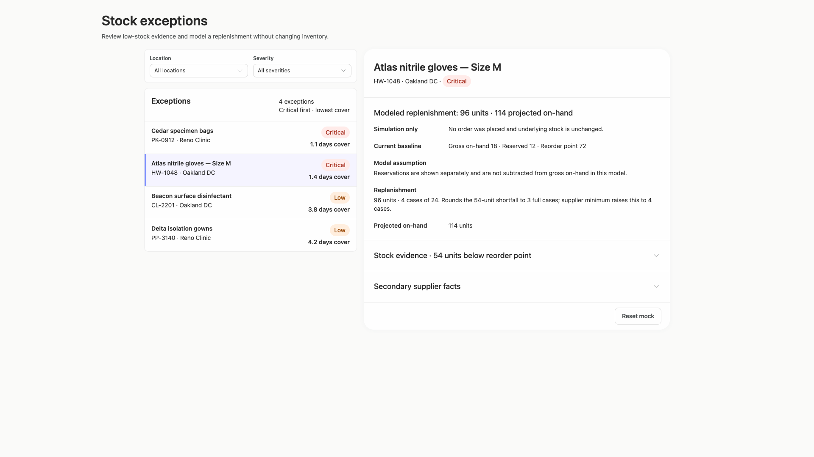

### desktop-wide-3 — Result evidence at scroll boundary

Interaction: passed.

### desktop-wide-4 — Reset from result footer

Interaction: passed.

### desktop-wide-5 — Expanded supplier facts

Interaction: passed.

### desktop-window-0 — initial

Interaction: not-run.

### desktop-window-1 — Review modeled quantity before confirming

Interaction: passed.

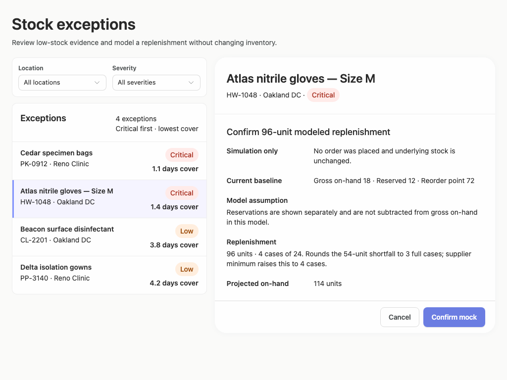

### desktop-window-2 — Mock replenishment result

Interaction: passed.

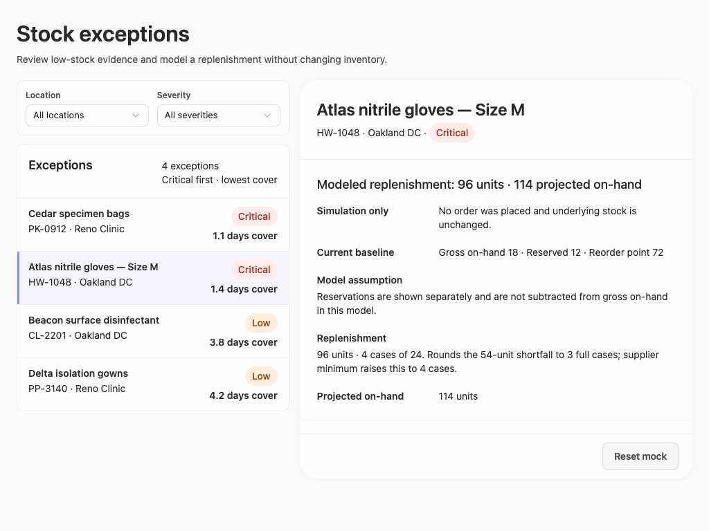

### desktop-window-3 — Result evidence at scroll boundary

Interaction: passed.

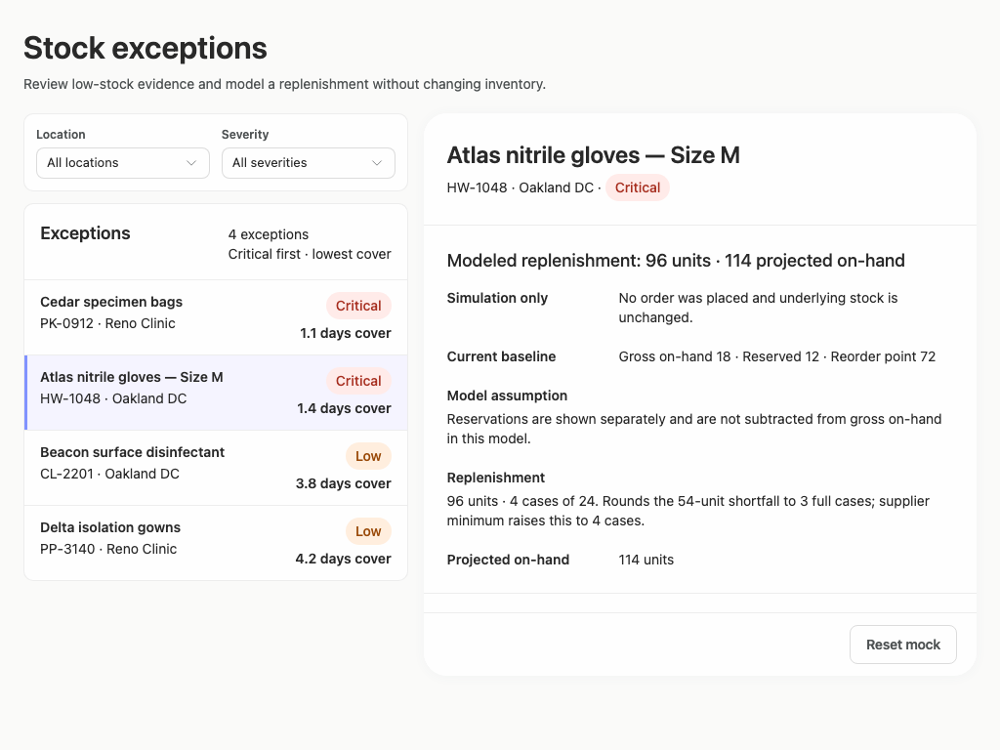

### desktop-window-4 — Reset from result footer

Interaction: passed.

### desktop-window-5 — Expanded supplier facts

Interaction: passed.

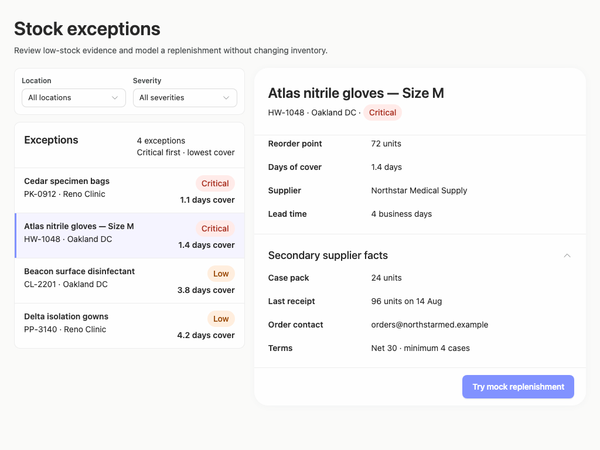

### desktop-custom-700x900-0 — initial

Interaction: not-run.

### desktop-custom-700x900-1 — Review modeled quantity before confirming

Interaction: passed.

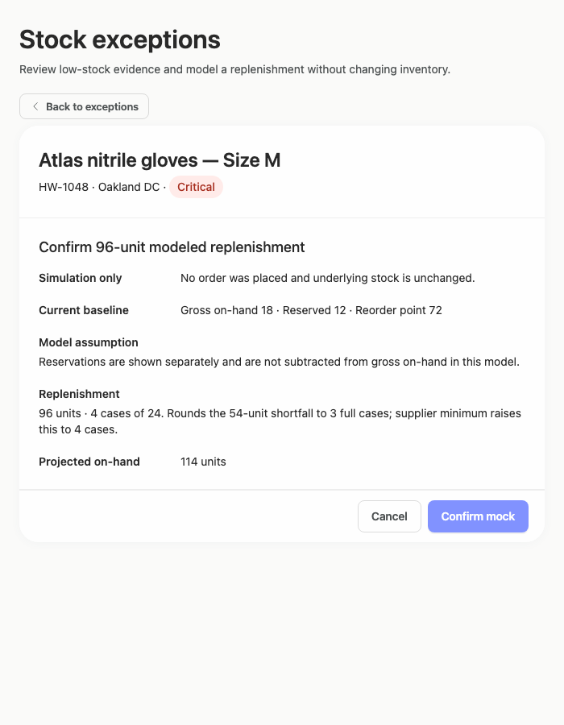

### desktop-custom-700x900-2 — Mock replenishment result

Interaction: passed.

### desktop-custom-700x900-3 — Result evidence at scroll boundary

Interaction: passed.

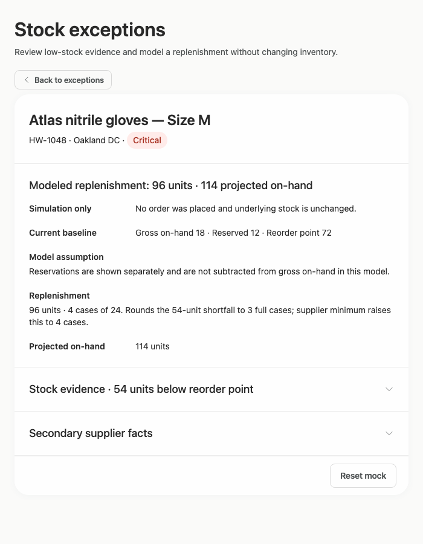

### desktop-custom-700x900-4 — Reset from result footer

Interaction: passed.

### desktop-custom-700x900-5 — Expanded supplier facts

Interaction: passed.

## Limitations

- No filter-result, zero-result, unselected-record, loading, disabled, or error screenshots were provided, so those states were not evaluated.
- Initial-state interaction was not run in several captures; screenshots and passed scripted states do not establish complete backend or callback behavior.
- The supplied images do not show an implementation-plan artifact or publication status, so those brief deliverables cannot be assessed visually.
- Static source findings do not prove that dynamic JSX branches or callbacks rendered or functioned beyond the captured states.
- The styling-adherence evidence has very low assessed coverage and is not a full CSS cascade or component-provenance proof.
