# stock-exceptions-state-aware-confirmation — 2026-09-09T08:04:04.459Z

[All reports](../../README.md) · [Interactive HTML report](index.html) · [Full measurements and scoring](report.json)

GitHub renders this summary and the screenshots. Download or clone this folder to open the HTML report locally; GitHub does not serve it as a website.

**Subjective design score:** 95/100. Model: openai/gpt-5.6-sol. Rubric: 2.

**Arrusted adherence:** 100/100 (partial); evidence coverage 1.63%. Evaluator 3.

| Dimension | Conforming | Nonconforming | Unassessed | Adherence    |
| --------- | ---------- | ------------- | ---------- | ------------ |
| component | 20         | 0             | 2          | 100% (20/20) |
| api       | 53         | 0             | 10         | 100% (53/53) |
| styling   | 13         | 0             | 5169       | 100% (13/13) |

Scores from different evaluator versions or captured states are not directly comparable.

This report evaluates the captured preview; evaluation itself does not regenerate the app or prove a built backend. Scores are advisory and not human-calibrated.

## Ratings

| Dimension | Score | Reason |
| --- | --- | --- |
| hierarchy | 4/4 | The page title, filters, exception list, selected-product header, evidence sections, and primary action form an immediately scannable sequence. Selected-row treatment, severity pills, days-of-cover values, and explicit confirmation/result headings keep priority clear across all shown states. |
| layout | 4/4 | The wide list-detail composition has consistent edges, restrained spacing, aligned evidence labels and values, and stable footer actions. At 1024px it remains dense but orderly, while the 700px view appropriately switches to a focused detail panel with a Back affordance. |
| typography | 3/4 | Heading levels, bold labels, body copy, identifiers, and numeric values are visually consistent and readable. However, the supplied accessibility measurements repeatedly flag low text contrast on the primary action treatment in initial and confirmation states; this is advisory because the existing Arrusted palette is authoritative. |
| responsive | 4/4 | The composition is demonstrated at 1920×1080, 1440×900, 1024×768, and a 700px desktop panel. It transitions cleanly from side-by-side review to a single-detail view, keeps Back and footer actions available, and uses bounded internal scrolling for longer evidence without document overflow. |
| productClarity | 4/4 | The task is explicit: filter exceptions, choose a product, inspect stock and supplier evidence, and run a simulation. Confirmation explains the 96-unit calculation before proceeding, and the result clearly states that no order was placed and underlying inventory is unchanged. |

## Strengths

- Exception rows combine product identity, location, stock gap, severity, and days of cover in a compact, highly scannable format.
- The selected record is reinforced in both the list and detail header, reducing context loss during review.
- The mock replenishment flow has strong safeguards: modeled quantity, projected stock, baseline, assumptions, supplier minimum, confirmation, result, and reset are all represented.
- Secondary supplier facts are progressively disclosed, keeping the default evidence view focused.
- The 700px desktop-panel composition preserves context and navigation rather than compressing the list and detail into unusable columns.

## Improvements

- **low — desktop-window-5:** After expanding supplier facts in the shorter 1024×768 window, the internally scrolled detail begins at “Reorder point”; the Stock evidence heading and preceding Gross on-hand and Reserved rows are no longer visible. Although scrolling is intentional, the exposed fragment offers little visual indication that earlier evidence exists above. Keep the current internal scrolling but preserve section context with a sticky Stock evidence heading or a subtle supported scroll-position cue inside the detail panel.
- **low — desktop-0:** The primary action is visually prominent and well placed, but the supplied audit reports a 2.78:1 text contrast ratio for this treatment. The Arrusted palette remains authoritative, so this is an advisory legibility concern rather than a recommendation to override component colors. If an existing supported Arrusted Button variant with clearer text legibility is appropriate to the same action hierarchy, use that variant; otherwise retain the palette and document the component-level contrast limitation for the design-system team.

## Token evidence

Percentages cover only assessed properties. Missing provenance and ambiguous CSS remain unassessed; matching literals are not proof of token usage.

| Viewport | Category | Token references / assessed | Coverage |
| --- | --- | --- | --- |
| desktop-0 | color | 0/0 | 0% (0/233) |
| desktop-0 | typography | 0/0 | 0% (0/522) |
| desktop-0 | spacing | 0/0 | 0% (0/275) |
| desktop-0 | radius | 0/0 | 0% (0/116) |
| desktop-0 | border | 0/0 | 0% (0/125) |
| desktop-0 | shadow | 0/0 | 0% (0/120) |
| desktop-wide-0 | color | 0/0 | 0% (0/233) |
| desktop-wide-0 | typography | 0/0 | 0% (0/522) |
| desktop-wide-0 | spacing | 0/0 | 0% (0/275) |
| desktop-wide-0 | radius | 0/0 | 0% (0/116) |
| desktop-wide-0 | border | 0/0 | 0% (0/125) |
| desktop-wide-0 | shadow | 0/0 | 0% (0/120) |
| desktop-window-0 | color | 0/0 | 0% (0/233) |
| desktop-window-0 | typography | 0/0 | 0% (0/522) |
| desktop-window-0 | spacing | 0/0 | 0% (0/275) |
| desktop-window-0 | radius | 0/0 | 0% (0/116) |
| desktop-window-0 | border | 0/0 | 0% (0/125) |
| desktop-window-0 | shadow | 0/0 | 0% (0/120) |
| desktop-custom-700x900-0 | color | 0/0 | 0% (0/161) |
| desktop-custom-700x900-0 | typography | 0/0 | 0% (0/405) |
| desktop-custom-700x900-0 | spacing | 0/0 | 0% (0/184) |
| desktop-custom-700x900-0 | radius | 0/0 | 0% (0/81) |
| desktop-custom-700x900-0 | border | 0/0 | 0% (0/84) |
| desktop-custom-700x900-0 | shadow | 0/0 | 0% (0/81) |

## Latest-run screenshots

### desktop-0 — initial

Interaction: not-run.

### desktop-1 — Review modeled quantity before confirming

Interaction: passed.

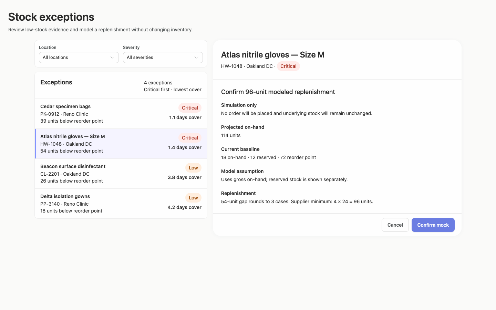

### desktop-2 — Mock replenishment result

Interaction: passed.

### desktop-3 — Result evidence at scroll boundary

Interaction: passed.

### desktop-4 — Reset from result footer

Interaction: passed.

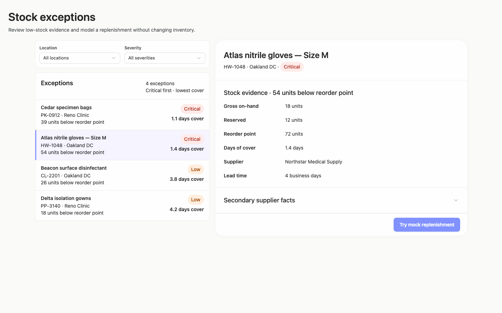

### desktop-5 — Expanded supplier facts

Interaction: passed.

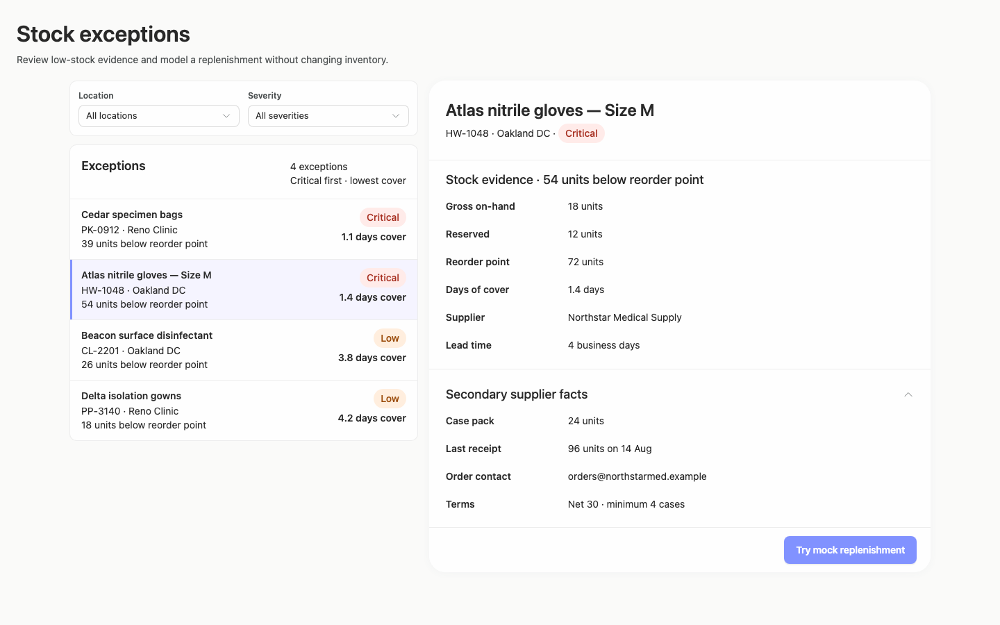

### desktop-wide-0 — initial

Interaction: not-run.

### desktop-wide-1 — Review modeled quantity before confirming

Interaction: passed.

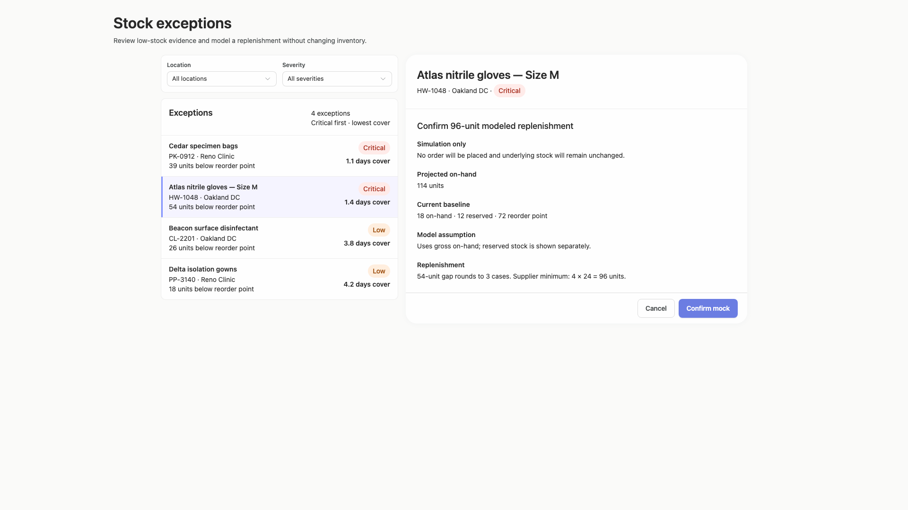

### desktop-wide-2 — Mock replenishment result

Interaction: passed.

### desktop-wide-3 — Result evidence at scroll boundary

Interaction: passed.

### desktop-wide-4 — Reset from result footer

Interaction: passed.

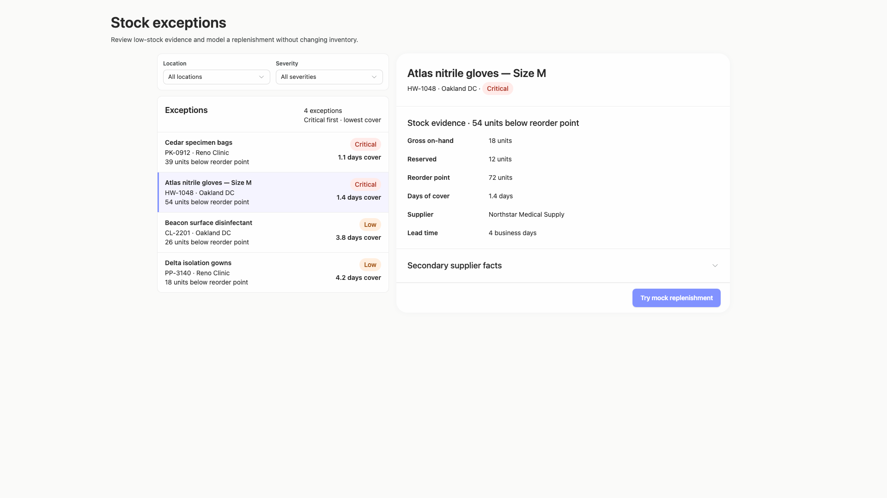

### desktop-wide-5 — Expanded supplier facts

Interaction: passed.

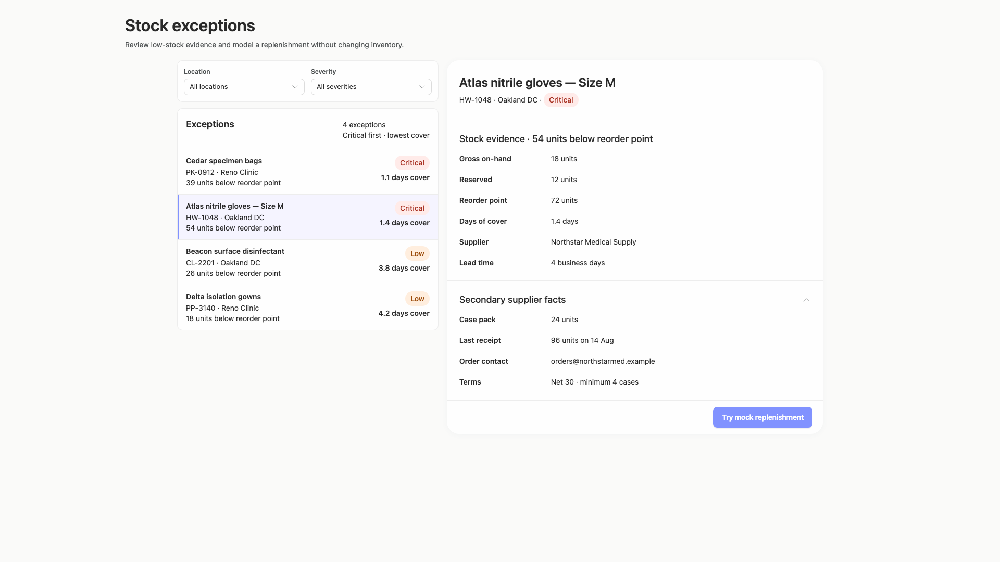

### desktop-window-0 — initial

Interaction: not-run.

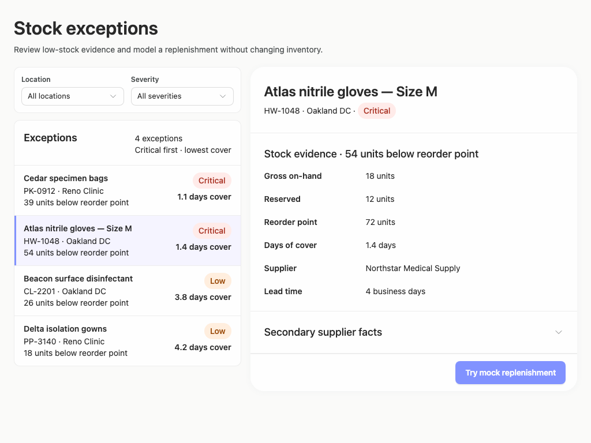

### desktop-window-1 — Review modeled quantity before confirming

Interaction: passed.

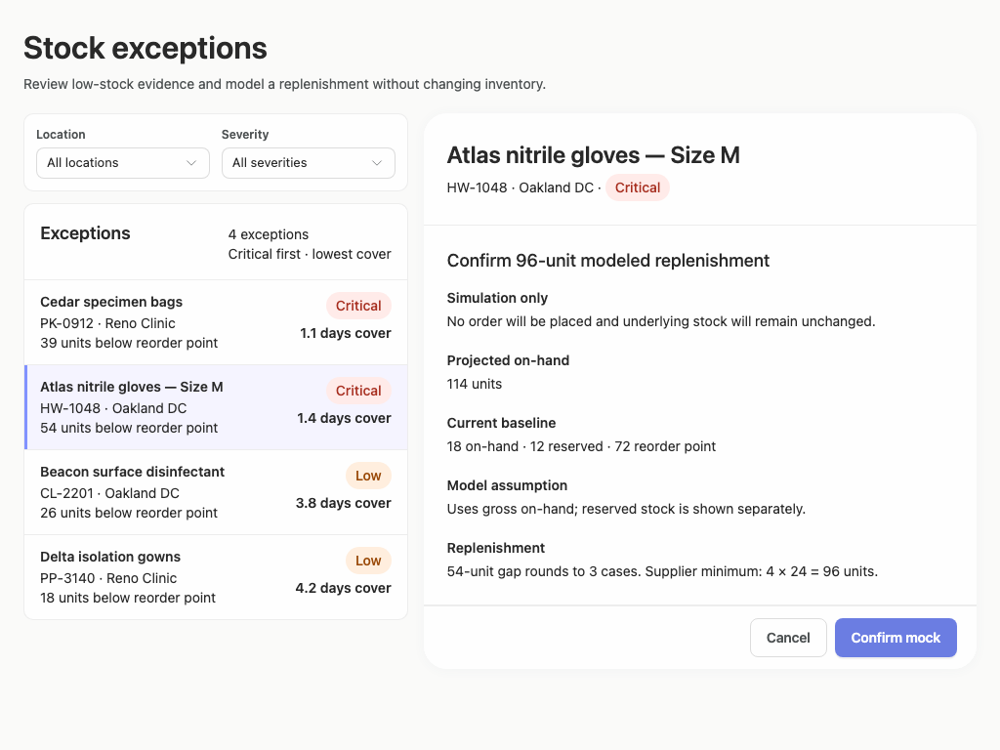

### desktop-window-2 — Mock replenishment result

Interaction: passed.

### desktop-window-3 — Result evidence at scroll boundary

Interaction: passed.

### desktop-window-4 — Reset from result footer

Interaction: passed.

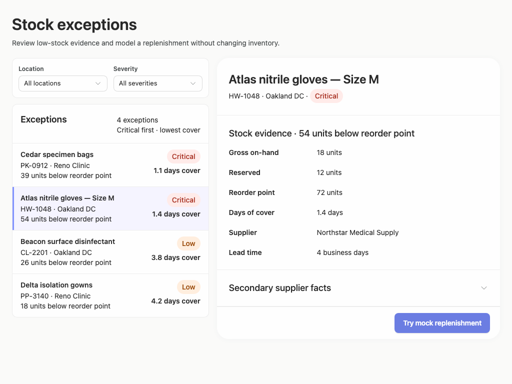

### desktop-window-5 — Expanded supplier facts

Interaction: passed.

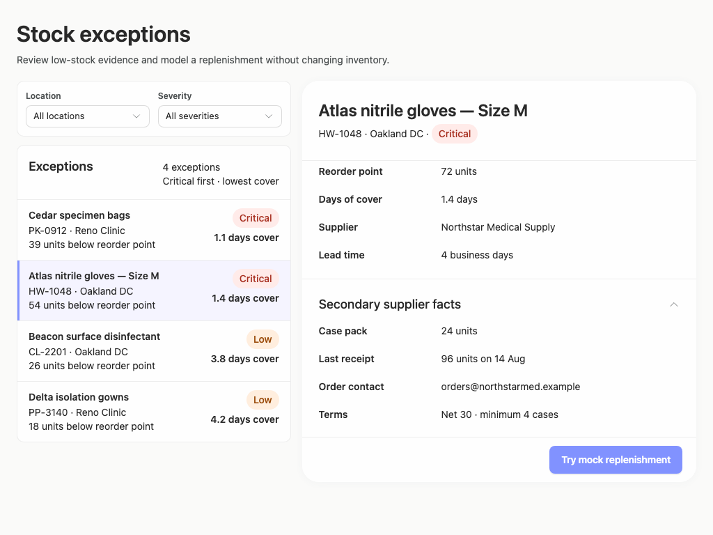

### desktop-custom-700x900-0 — initial

Interaction: not-run.

### desktop-custom-700x900-1 — Review modeled quantity before confirming

Interaction: passed.

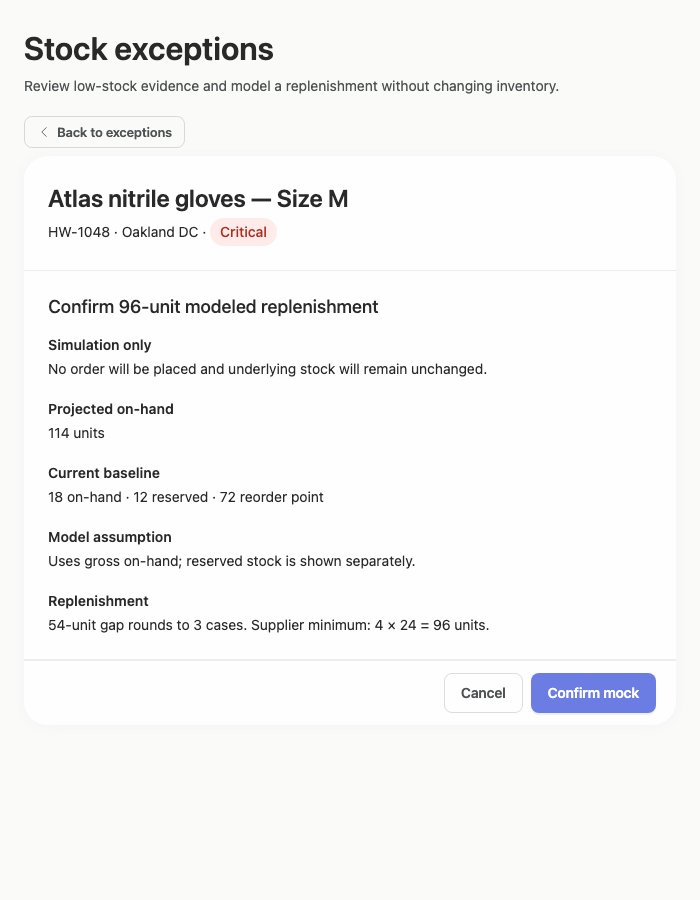

### desktop-custom-700x900-2 — Mock replenishment result

Interaction: passed.

### desktop-custom-700x900-3 — Result evidence at scroll boundary

Interaction: passed.

### desktop-custom-700x900-4 — Reset from result footer

Interaction: passed.

### desktop-custom-700x900-5 — Expanded supplier facts

Interaction: passed.

## Limitations

- Only the supplied static screenshots and measurements were assessed; filter-menu contents, keyboard focus, empty results, error handling, and arbitrary intermediate window sizes were not shown.
- Interaction evidence confirms several mock-action states, but it does not establish backend behavior or production readiness.
- The implementation plan requested by the brief was not provided as visible evidence, so its quality and completeness could not be assessed.
- Static adherence evidence has substantial unassessed styling coverage and does not prove every dynamic branch rendered from the cited public components.
