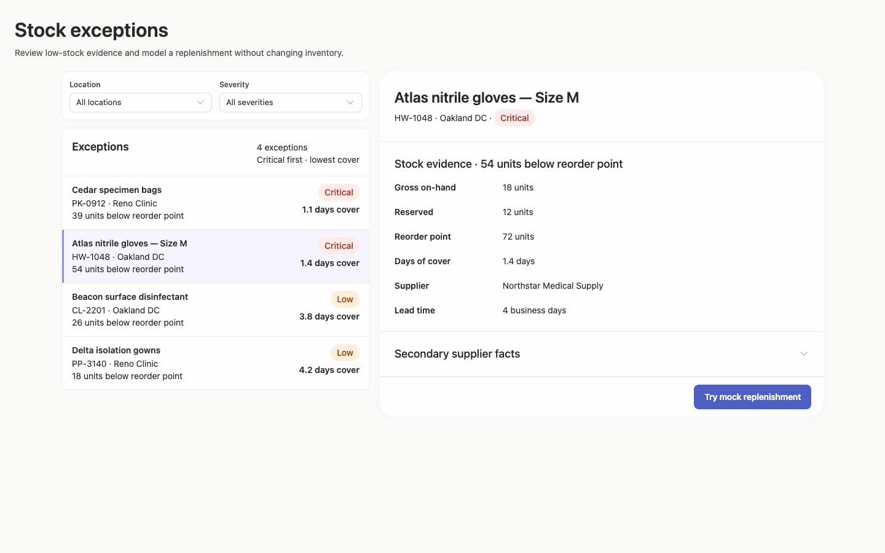
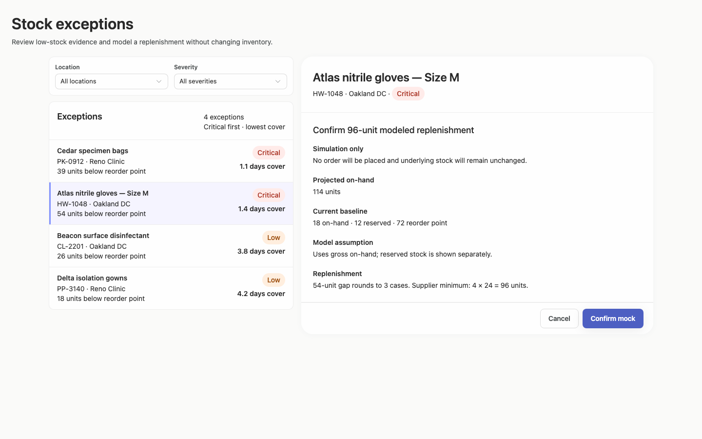
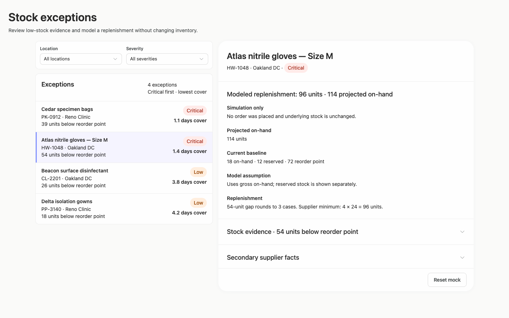
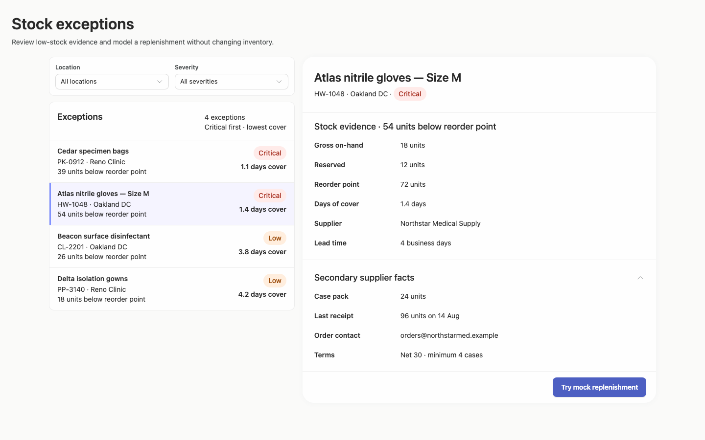
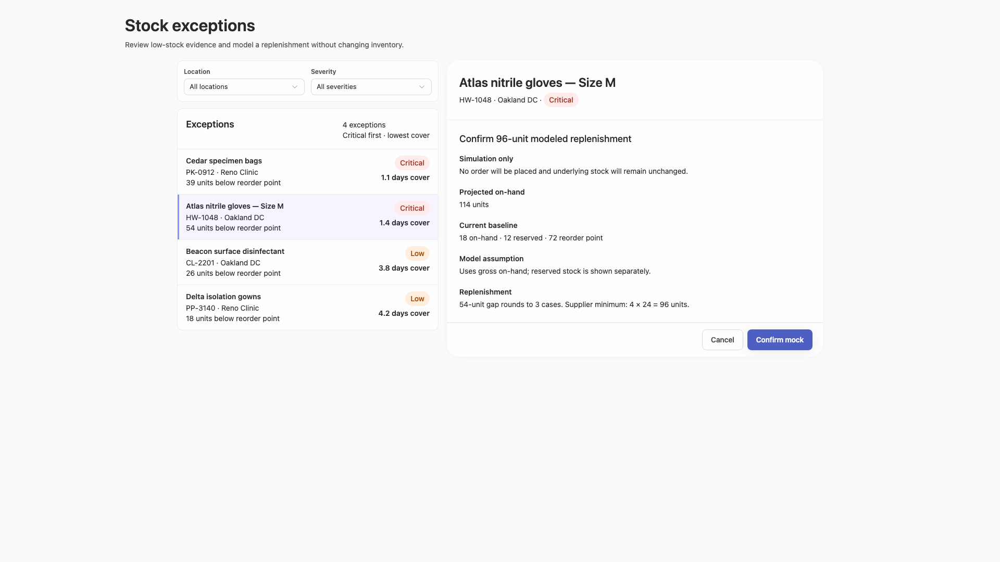
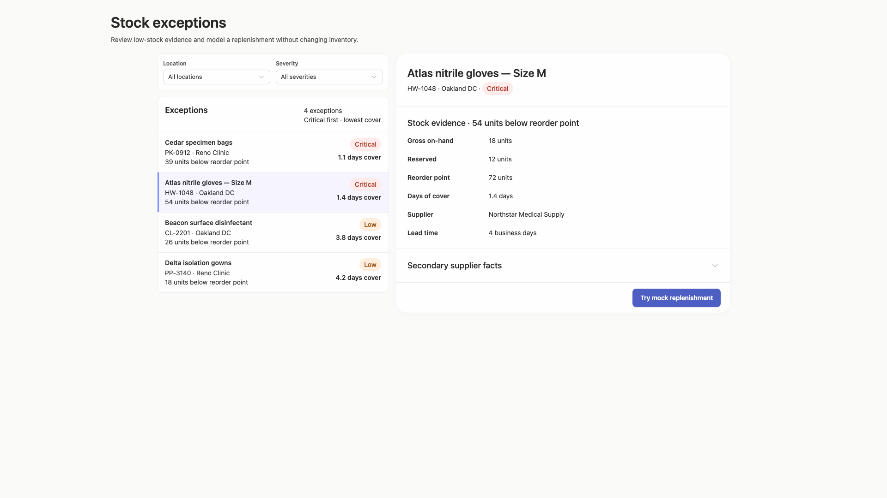
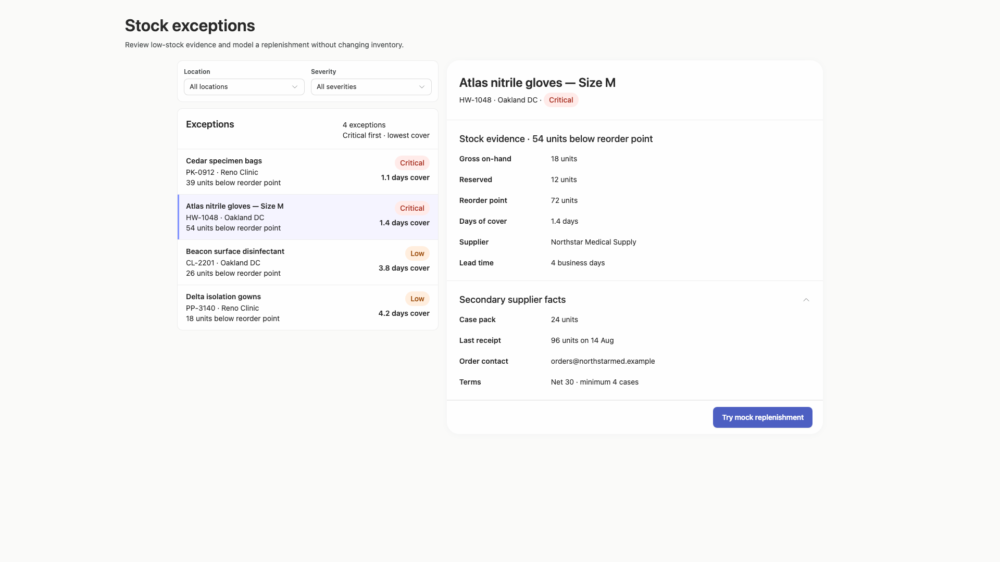
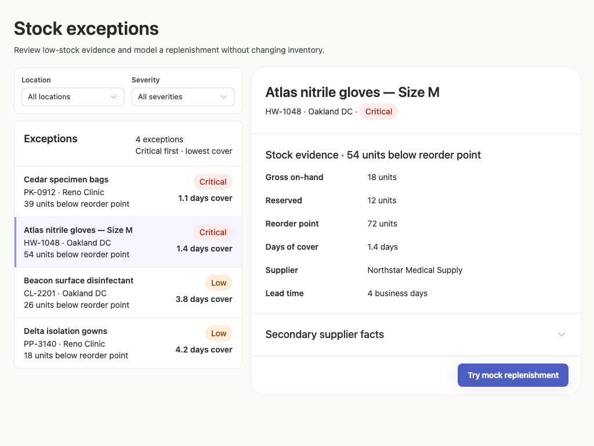
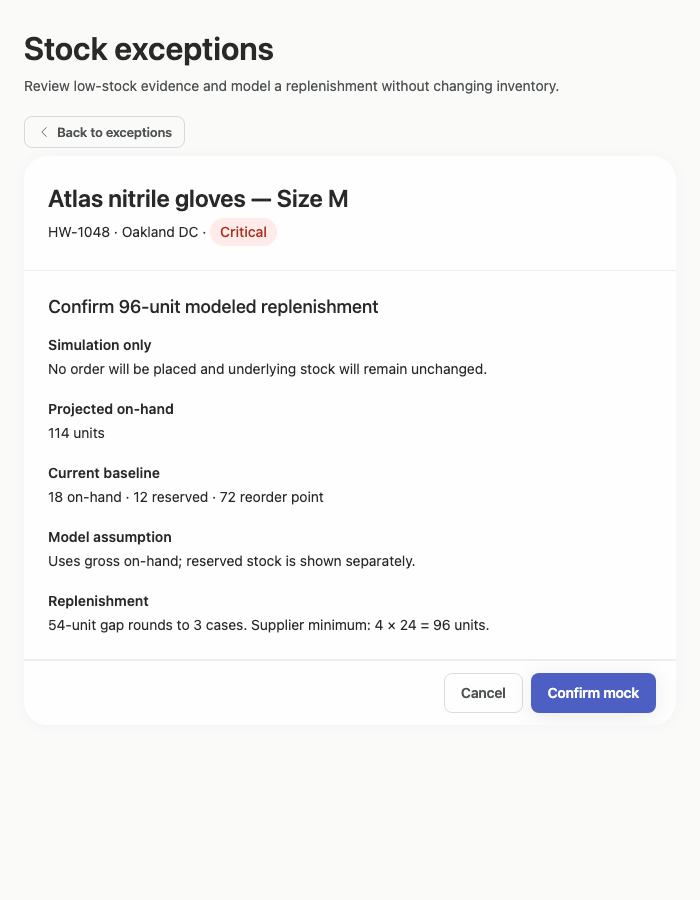
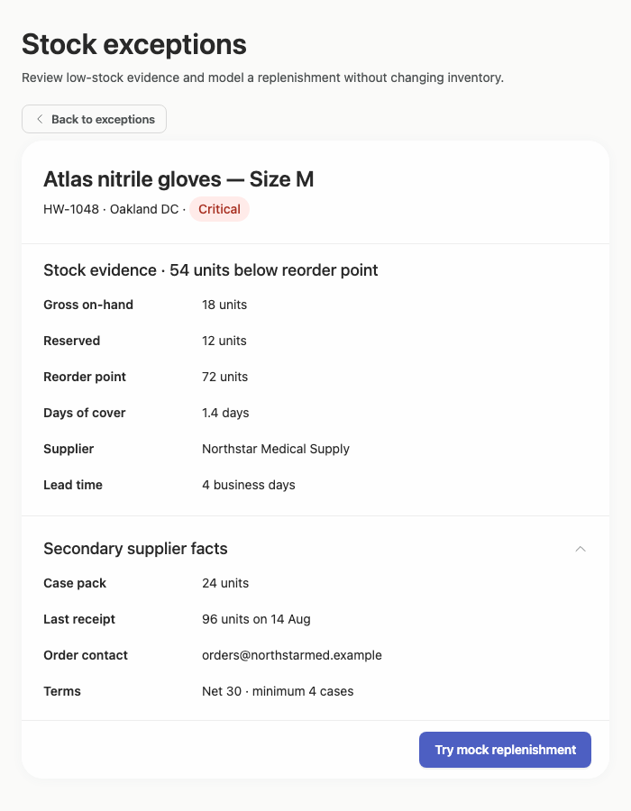

# stock-exceptions-strong-actions — 2026-09-09T08:22:18.776Z

[All reports](../../README.md) · [Interactive HTML report](index.html) · [Full measurements and scoring](report.json)

GitHub renders this summary and the screenshots. Download or clone this folder to open the HTML report locally; GitHub does not serve it as a website.

**Subjective design score:** 90/100. Model: openai/gpt-5.6-sol. Rubric: 2.

**Arrusted adherence:** 100/100 (partial); evidence coverage 1.63%. Evaluator 3.

| Dimension | Conforming | Nonconforming | Unassessed | Adherence    |
| --------- | ---------- | ------------- | ---------- | ------------ |
| component | 20         | 0             | 2          | 100% (20/20) |
| api       | 53         | 0             | 10         | 100% (53/53) |
| styling   | 13         | 0             | 5169       | 100% (13/13) |

Scores from different evaluator versions or captured states are not directly comparable.

This report evaluates the captured preview; evaluation itself does not regenerate the app or prove a built backend. Scores are advisory and not human-calibrated.

## Ratings

| Dimension | Score | Reason |
| --- | --- | --- |
| hierarchy | 4/4 | The page title and purpose lead naturally into filters, the exception list, and the selected record. Selected-row tint, severity pills, stock-evidence heading, and the emphasized mock action make priorities immediately scannable across the supplied states. |
| layout | 3/4 | The list-detail composition has consistent spacing, aligned evidence labels, and stable action footers. On 1440px and 1920px captures, however, the page heading begins noticeably left of the centered workspace, weakening the shared alignment and leaving the upper composition somewhat disconnected. |
| typography | 4/4 | Type sizes, weights, and line spacing consistently distinguish page title, record title, section headings, labels, and values. Product names, quantities, supplier details, and explanatory simulation copy remain readable in all shown desktop widths. |
| responsive | 3/4 | The composition remains usable at 1920×1080, 1440×900, and 1024×768, with constrained detail scrolling and accessible footer controls. At 700×900 it appropriately changes to detail-only navigation, but the initial capture opens on a preselected record, placing filtering and item selection behind an extra Back step. |
| productClarity | 4/4 | The interface clearly communicates low-stock review, location and severity filtering, selected-item evidence, supplier facts, and the replenishment calculation. Confirmation and result states repeatedly state that the action is a simulation and that no order or inventory change occurred, while Cancel, Confirm mock, Reset mock, and Back affordances are unambiguous. |

## Strengths

- The master-detail structure supports rapid comparison without losing the selected product’s evidence.
- Exception rows expose product identity, location, reorder-point gap, severity, and days of cover in a compact, useful scan pattern.
- The modeled quantity is explained through the stock gap, case rounding, supplier minimum, and case-pack size rather than presented as an unexplained number.
- Simulation safeguards are exceptionally clear before and after confirmation.
- Supplier facts use progressive disclosure to keep the default detail view concise.
- Action footers remain visible and well positioned while detail content scrolls in shorter desktop windows.
- No clipping, horizontal overflow, overlapping controls, or reported accessibility violations appear in the supplied captures.

## Improvements

- **low — desktop-wide-0:** The page title starts near x=240 while the filter and exception column starts near x=340. This 100px offset makes the heading feel detached from the main two-column workspace, especially with the substantial surrounding whitespace at 1920px. Place the page header and master-detail workspace inside the same centered container, or align the header with the workspace’s left edge while retaining the existing palette and components.
- **medium — desktop-custom-700x900-0:** The narrow desktop initial state opens directly on a selected record. The Back control makes recovery clear, but the brief’s primary filtering and exception-selection controls are not initially visible at this width and require an additional navigation step. For a fresh narrow-window visit, start on the exception list and filters, then enter the detail-only view after selection. When merely resizing an already selected record, preserve the current detail and Back behavior.

## Token evidence

Percentages cover only assessed properties. Missing provenance and ambiguous CSS remain unassessed; matching literals are not proof of token usage.

| Viewport | Category | Token references / assessed | Coverage |
| --- | --- | --- | --- |
| desktop-0 | color | 0/0 | 0% (0/233) |
| desktop-0 | typography | 0/0 | 0% (0/522) |
| desktop-0 | spacing | 0/0 | 0% (0/275) |
| desktop-0 | radius | 0/0 | 0% (0/116) |
| desktop-0 | border | 0/0 | 0% (0/125) |
| desktop-0 | shadow | 0/0 | 0% (0/120) |
| desktop-wide-0 | color | 0/0 | 0% (0/233) |
| desktop-wide-0 | typography | 0/0 | 0% (0/522) |
| desktop-wide-0 | spacing | 0/0 | 0% (0/275) |
| desktop-wide-0 | radius | 0/0 | 0% (0/116) |
| desktop-wide-0 | border | 0/0 | 0% (0/125) |
| desktop-wide-0 | shadow | 0/0 | 0% (0/120) |
| desktop-window-0 | color | 0/0 | 0% (0/233) |
| desktop-window-0 | typography | 0/0 | 0% (0/522) |
| desktop-window-0 | spacing | 0/0 | 0% (0/275) |
| desktop-window-0 | radius | 0/0 | 0% (0/116) |
| desktop-window-0 | border | 0/0 | 0% (0/125) |
| desktop-window-0 | shadow | 0/0 | 0% (0/120) |
| desktop-custom-700x900-0 | color | 0/0 | 0% (0/161) |
| desktop-custom-700x900-0 | typography | 0/0 | 0% (0/405) |
| desktop-custom-700x900-0 | spacing | 0/0 | 0% (0/184) |
| desktop-custom-700x900-0 | radius | 0/0 | 0% (0/81) |
| desktop-custom-700x900-0 | border | 0/0 | 0% (0/84) |
| desktop-custom-700x900-0 | shadow | 0/0 | 0% (0/81) |

## Latest-run screenshots

### desktop-0 — initial

Interaction: not-run.

### desktop-1 — Review modeled quantity before confirming

Interaction: passed.

### desktop-2 — Mock replenishment result

Interaction: passed.

### desktop-3 — Result evidence at scroll boundary

Interaction: passed.

### desktop-4 — Reset from result footer

Interaction: passed.

### desktop-5 — Expanded supplier facts

Interaction: passed.

### desktop-wide-0 — initial

Interaction: not-run.

### desktop-wide-1 — Review modeled quantity before confirming

Interaction: passed.

### desktop-wide-2 — Mock replenishment result

Interaction: passed.

### desktop-wide-3 — Result evidence at scroll boundary

Interaction: passed.

### desktop-wide-4 — Reset from result footer

Interaction: passed.

### desktop-wide-5 — Expanded supplier facts

Interaction: passed.

### desktop-window-0 — initial

Interaction: not-run.

### desktop-window-1 — Review modeled quantity before confirming

Interaction: passed.

### desktop-window-2 — Mock replenishment result

Interaction: passed.

### desktop-window-3 — Result evidence at scroll boundary

Interaction: passed.

### desktop-window-4 — Reset from result footer

Interaction: passed.

### desktop-window-5 — Expanded supplier facts

Interaction: passed.

### desktop-custom-700x900-0 — initial

Interaction: not-run.

### desktop-custom-700x900-1 — Review modeled quantity before confirming

Interaction: passed.

### desktop-custom-700x900-2 — Mock replenishment result

Interaction: passed.

### desktop-custom-700x900-3 — Result evidence at scroll boundary

Interaction: passed.

### desktop-custom-700x900-4 — Reset from result footer

Interaction: passed.

### desktop-custom-700x900-5 — Expanded supplier facts

Interaction: passed.

## Limitations

- Only the supplied static captures and recorded state outcomes were evaluated; open select menus, empty results, filtering results, loading states, and selection of other products were not shown.
- The screenshots do not establish backend behavior, persistence, ordering, or inventory mutation semantics.
- No separate implementation-plan artifact was supplied, so the brief’s implementation-plan deliverable and the instruction to stop before building or publication cannot be assessed visually.
- Styling provenance was largely unassessed in the supplied evidence, so full semantic-token or palette adherence cannot be verified from these screenshots alone.
