# stock-exceptions-structured-result — 2026-09-09T05:11:25.618Z

[All reports](../../README.md) · [Interactive HTML report](index.html) · [Full measurements and scoring](report.json)

GitHub renders this summary and the screenshots. Download or clone this folder to open the HTML report locally; GitHub does not serve it as a website.

**Subjective design score:** 75/100. Model: openai/gpt-5.6-sol. Rubric: 2.

**Arrusted adherence:** 100/100 (partial); evidence coverage 1.07%. Evaluator 3.

| Dimension | Conforming | Nonconforming | Unassessed | Adherence    |
| --------- | ---------- | ------------- | ---------- | ------------ |
| component | 14         | 0             | 2          | 100% (14/14) |
| api       | 32         | 0             | 14         | 100% (32/32) |
| styling   | 12         | 0             | 5356       | 100% (12/12) |

Scores from different evaluator versions or captured states are not directly comparable.

This report evaluates the captured preview; evaluation itself does not regenerate the app or prove a built backend. Scores are advisory and not human-calibrated.

## Ratings

| Dimension      | Score | Reason                                                                                                                                                                                                                                                                                                                                                                   |
| -------------- | ----- | ------------------------------------------------------------------------------------------------------------------------------------------------------------------------------------------------------------------------------------------------------------------------------------------------------------------------------------------------------------------------ |
| hierarchy      | 3/4   | The page title, filters, exception list, selected record, evidence sections, and replenishment action form a clear task sequence. Selection highlighting and section dividers support scanning, though the two similarly styled notices in the mock-result state have weak semantic distinction.                                                                         |
| layout         | 3/4   | The two-pane composition is consistently aligned and comfortably spaced at 1024–1920px, with concise 72px list rows and a well-contained detail panel. Empty, filtered, and expanded states remain orderly, but the constrained detail view retains a large filter block for a list that is no longer visible.                                                           |
| typography     | 3/4   | Headings, product names, field labels, and values use a consistent scale and predictable alignment. Numerous 10–12px muted labels, metadata lines, and status pills are visually faint; supplied audits repeatedly flag borderline or insufficient contrast, so some supporting information requires extra effort to read.                                               |
| responsive     | 3/4   | The design successfully changes from side-by-side list/detail at 1024px and above to a detail-only composition with a Back control at 700px. Controls remain contained without horizontal overflow, but filters continue to affect hidden list selection in the constrained view, and the 700px mock-result page grows to 1149px with reset available only near the top. |
| productClarity | 3/4   | Location and severity filtering, exception selection, stock and supplier review, empty-state recovery, and the mock replenishment action are all understandable. The result explicitly states that no order was placed, but its assumption and simulation notices resemble generic fields rather than clearly labeled explanatory messages.                              |

## Strengths

- The selected exception is unmistakable through both the highlighted list row and synchronized detail heading.
- Rows expose the most decision-relevant evidence—severity and days of cover—without requiring record expansion.
- Stock evidence and secondary supplier facts are separated into clear, progressively disclosed sections.
- The mock result presents shortfall, case-pack rounding, modeled quantity, projected stock, and an explicit no-order confirmation.
- Filtering updates the visible record and detail together, while the empty state supplies a direct Reset filters recovery action.
- The 700px desktop-panel composition replaces the split view with a focused detail view and a clear Back to exceptions affordance.
- The existing Arrusted palette and recognizable public-component styling appear consistent across captured states.

## Improvements

- **medium — desktop-0:** List metadata and severity indicators are rendered at a very small, muted scale. The supplied audit flags the row metadata around 4.14–4.47:1 and the status text around 2.63–3.2:1, weakening rapid comparison of location and severity. Keep the authoritative palette, but use supported Typography and status variants with a larger size or stronger weight. Preserve the written Critical/Low labels and consider moving severity into a slightly more prominent row position rather than relying on color prominence.
- **low — desktop-1:** The modeling assumption and no-order confirmation are important context, but both appear as nearly identical bordered fields. Their meanings are therefore less immediately distinguishable than the numerical result above them. Group them as two explicitly titled pieces of supporting information, such as “Model assumption” and “Simulation only,” using existing Card, Divider, and Typography compositions. Retain the current palette and confirmation wording.
- **medium — desktop-custom-700x900-0:** At the constrained desktop width, the exception list is hidden but its Location and Severity filters remain above the detail. Changing these controls can synchronize to a different hidden selection, while the separate Back control implies that list operations belong on another view. In constrained detail mode, place list filters on the exceptions view reached through Back, or add concise context explaining that changing a filter will select a matching exception. Continue using the supported constrained RecordListDetailLayout behavior.
- **low — desktop-custom-700x900-1:** The mock-result state extends to 1149px, while Reset mock appears only in the header near y=276. After reviewing the lower stock and supplier sections, users must return to the top to reset the simulation. Repeat the supported secondary Reset mock Button in the detail footer, or keep the detail action area available while the panel scrolls. Avoid overlaying content and retain normal document scrolling where needed.

## Token evidence

Percentages cover only assessed properties. Missing provenance and ambiguous CSS remain unassessed; matching literals are not proof of token usage.

| Viewport                 | Category   | Token references / assessed | Coverage   |
| ------------------------ | ---------- | --------------------------- | ---------- |
| desktop-0                | color      | 0/0                         | 0% (0/228) |
| desktop-0                | typography | 0/0                         | 0% (0/522) |
| desktop-0                | spacing    | 0/0                         | 0% (0/276) |
| desktop-0                | radius     | 0/0                         | 0% (0/116) |
| desktop-0                | border     | 0/0                         | 0% (0/130) |
| desktop-0                | shadow     | 0/0                         | 0% (0/120) |
| desktop-wide-0           | color      | 0/0                         | 0% (0/228) |
| desktop-wide-0           | typography | 0/0                         | 0% (0/522) |
| desktop-wide-0           | spacing    | 0/0                         | 0% (0/276) |
| desktop-wide-0           | radius     | 0/0                         | 0% (0/116) |
| desktop-wide-0           | border     | 0/0                         | 0% (0/130) |
| desktop-wide-0           | shadow     | 0/0                         | 0% (0/120) |
| desktop-window-0         | color      | 0/0                         | 0% (0/228) |
| desktop-window-0         | typography | 0/0                         | 0% (0/522) |
| desktop-window-0         | spacing    | 0/0                         | 0% (0/276) |
| desktop-window-0         | radius     | 0/0                         | 0% (0/116) |
| desktop-window-0         | border     | 0/0                         | 0% (0/130) |
| desktop-window-0         | shadow     | 0/0                         | 0% (0/120) |
| desktop-custom-700x900-0 | color      | 0/0                         | 0% (0/190) |
| desktop-custom-700x900-0 | typography | 0/0                         | 0% (0/474) |
| desktop-custom-700x900-0 | spacing    | 0/0                         | 0% (0/221) |
| desktop-custom-700x900-0 | radius     | 0/0                         | 0% (0/96)  |
| desktop-custom-700x900-0 | border     | 0/0                         | 0% (0/103) |
| desktop-custom-700x900-0 | shadow     | 0/0                         | 0% (0/96)  |

## Latest-run screenshots

### desktop-0 — initial

Interaction: not-run.

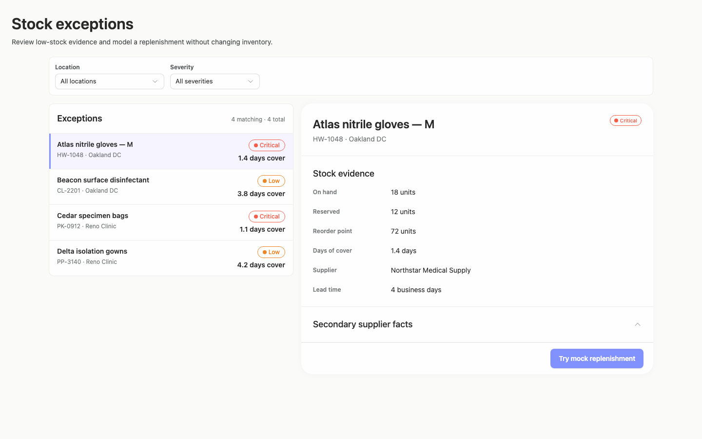

### desktop-1 — Mock replenishment result

Interaction: passed.

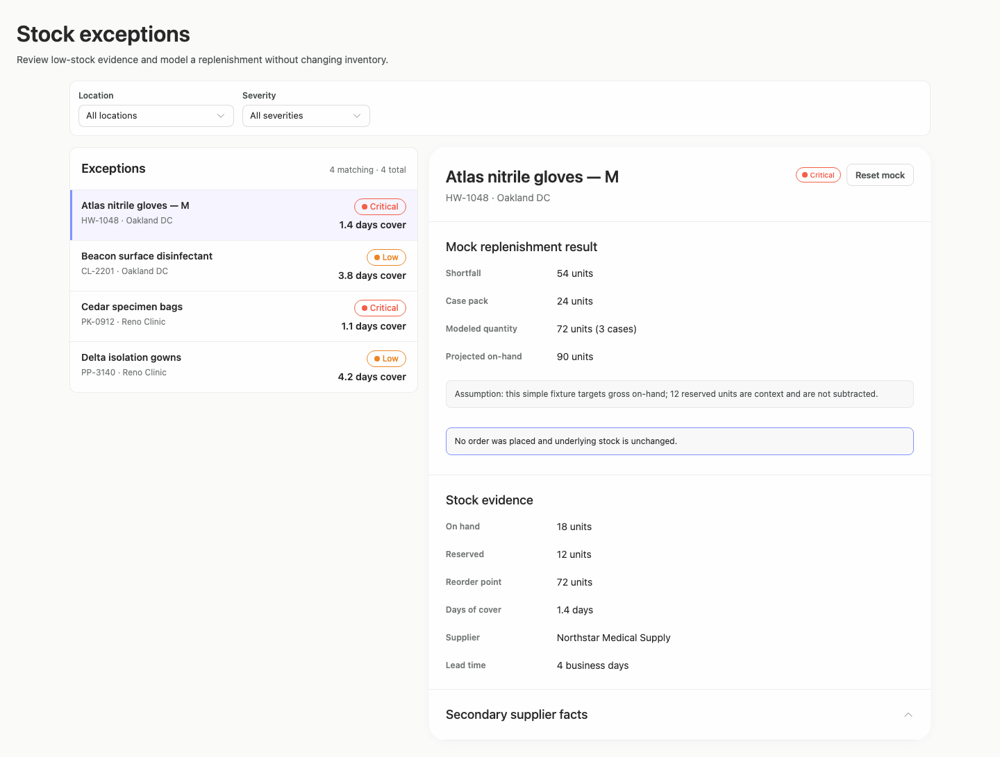

### desktop-2 — Reset mock result

Interaction: passed.

### desktop-3 — Filter and synchronize selection

Interaction: passed.

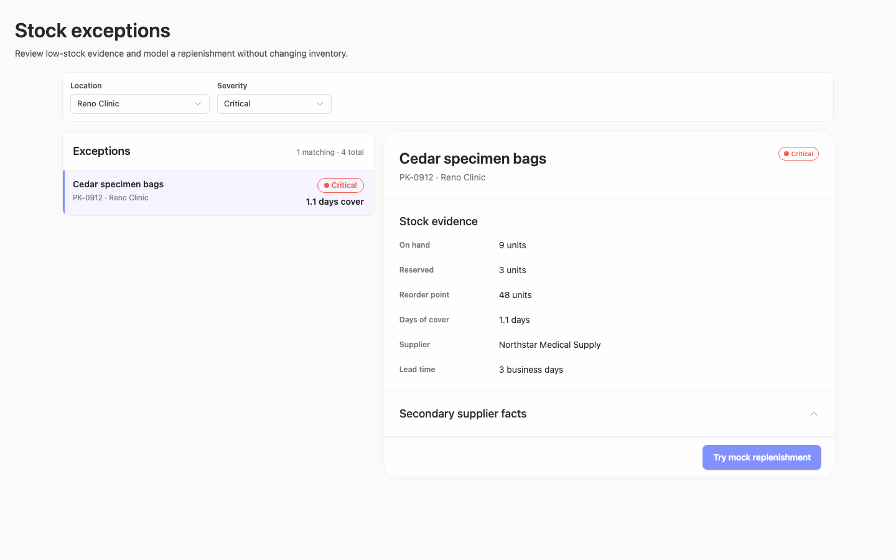

### desktop-4 — Empty filtered state

Interaction: passed.

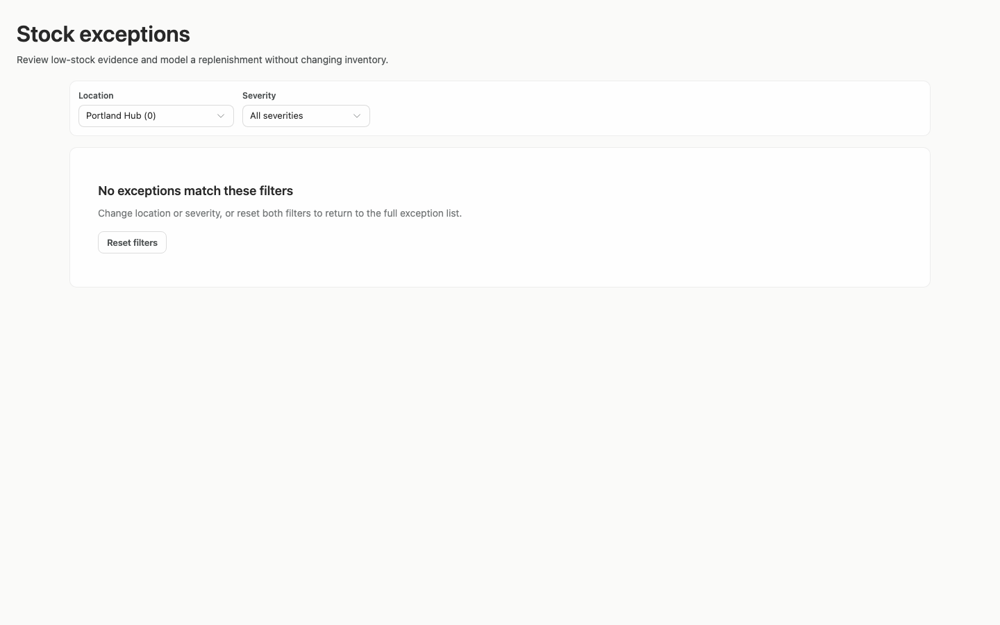

### desktop-5 — Expanded supplier facts

Interaction: passed.

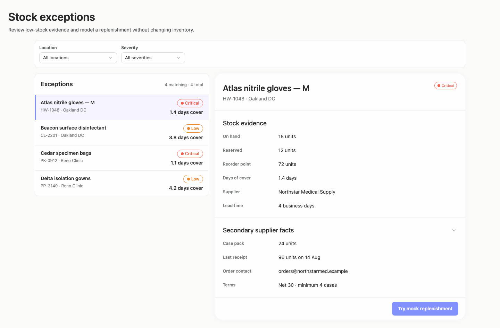

### desktop-wide-0 — initial

Interaction: not-run.

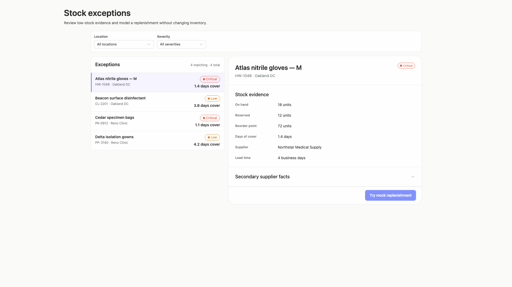

### desktop-wide-1 — Mock replenishment result

Interaction: passed.

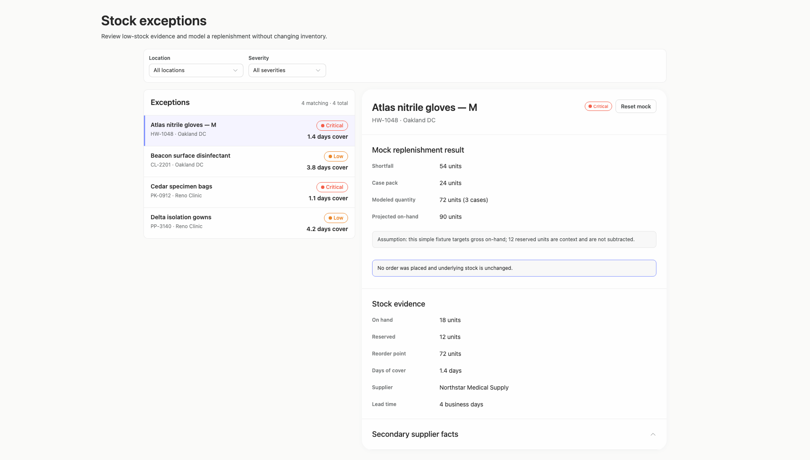

### desktop-wide-2 — Reset mock result

Interaction: passed.

### desktop-wide-3 — Filter and synchronize selection

Interaction: passed.

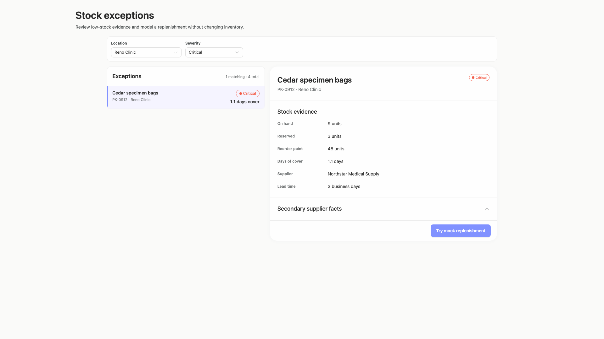

### desktop-wide-4 — Empty filtered state

Interaction: passed.

### desktop-wide-5 — Expanded supplier facts

Interaction: passed.

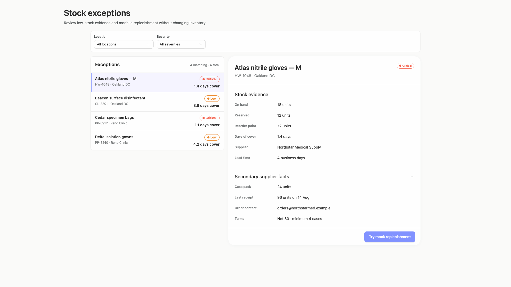

### desktop-window-0 — initial

Interaction: not-run.

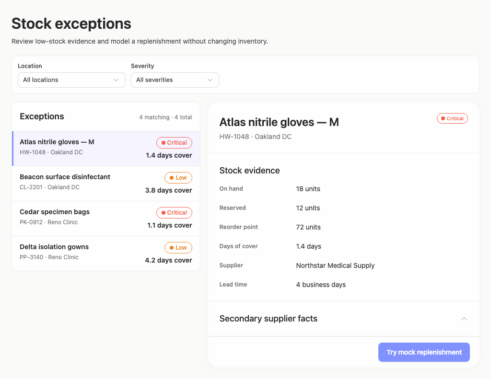

### desktop-window-1 — Mock replenishment result

Interaction: passed.

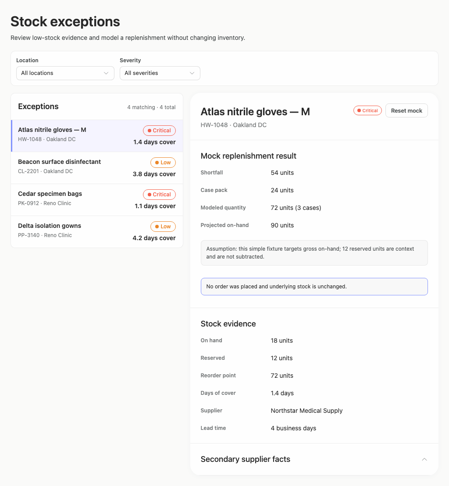

### desktop-window-2 — Reset mock result

Interaction: passed.

### desktop-window-3 — Filter and synchronize selection

Interaction: passed.

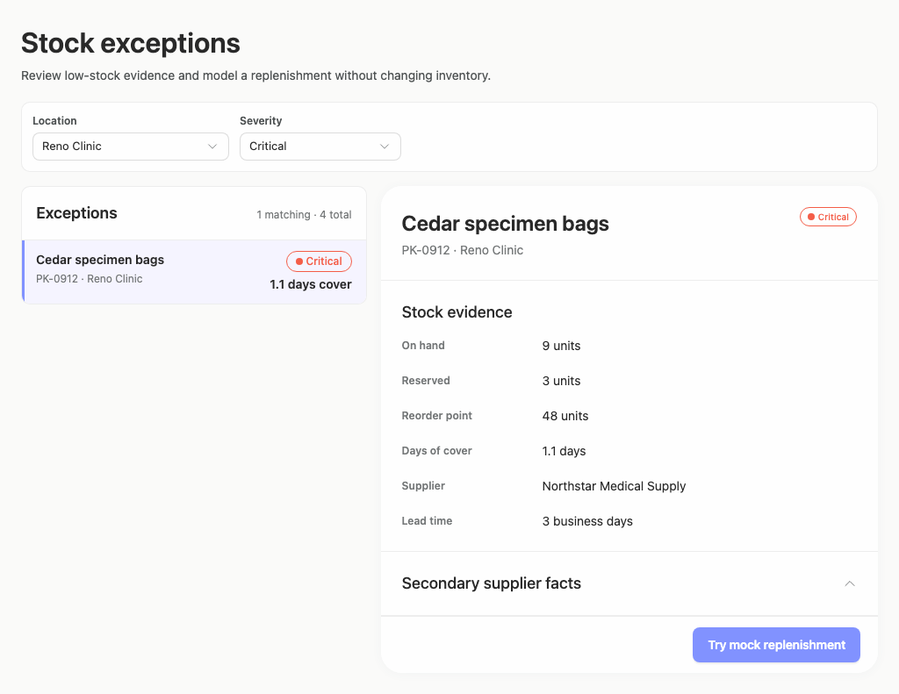

### desktop-window-4 — Empty filtered state

Interaction: passed.

### desktop-window-5 — Expanded supplier facts

Interaction: passed.

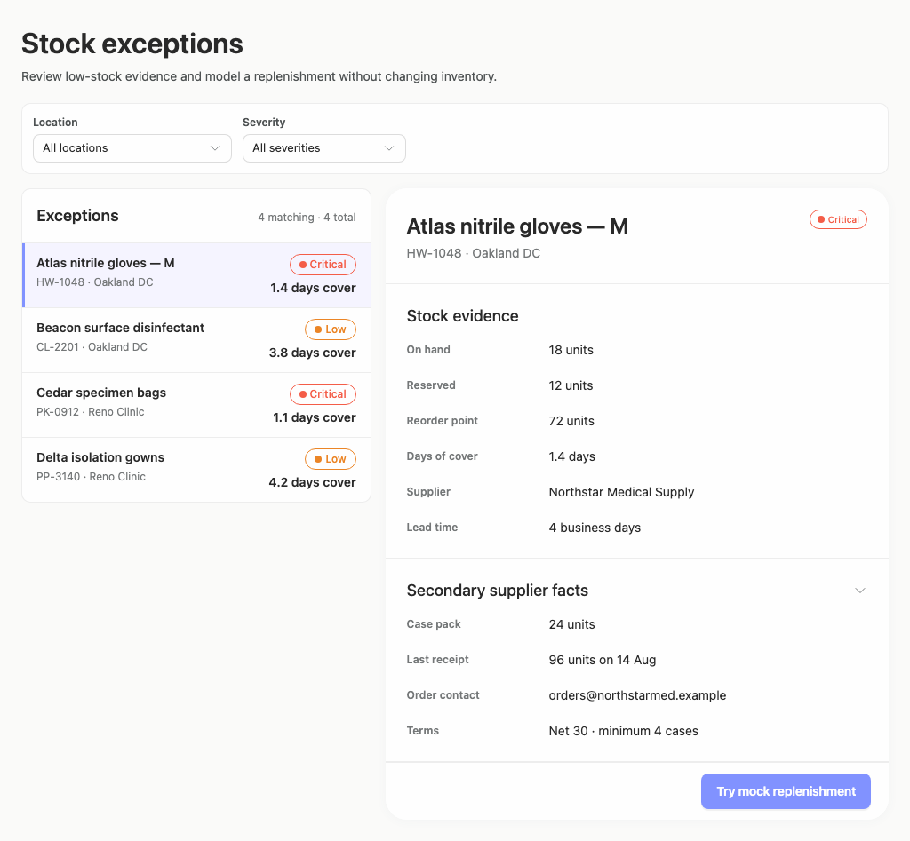

### desktop-custom-700x900-0 — initial

Interaction: not-run.

### desktop-custom-700x900-1 — Mock replenishment result

Interaction: passed.

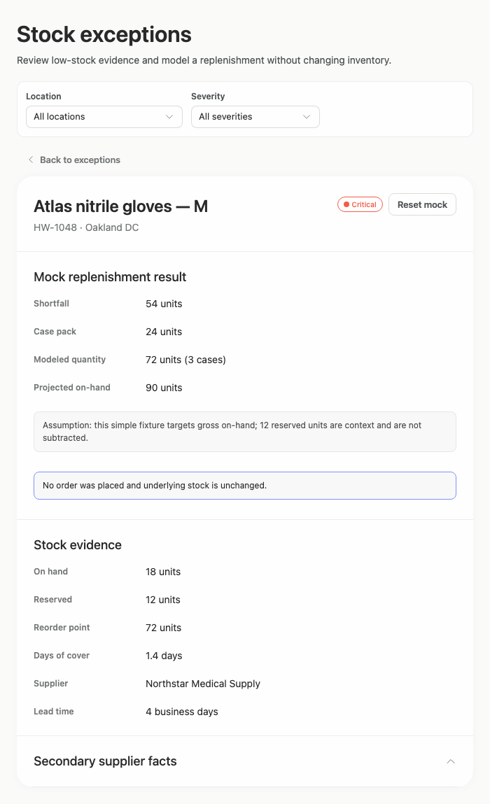

### desktop-custom-700x900-2 — Reset mock result

Interaction: passed.

### desktop-custom-700x900-3 — Filter and synchronize selection

Interaction: passed.

### desktop-custom-700x900-4 — Empty filtered state

Interaction: passed.

### desktop-custom-700x900-5 — Expanded supplier facts

Interaction: passed.

## Limitations

- No implementation-plan artifact is visible in the supplied screenshots, so the brief’s request for an implementation plan cannot be assessed.
- Static captures demonstrate only the named states; keyboard behavior, focus order, disclosure animation, long product names, loading states, and additional panel widths were not observed.
- Interaction evidence passed for the supplied mock, reset, filtering, empty-state, and disclosure checks, but it does not establish backend behavior or persistence.
- Arrusted styling evidence has very low assessed coverage, so palette and component observations are visual only and are not a token-adherence determination.
