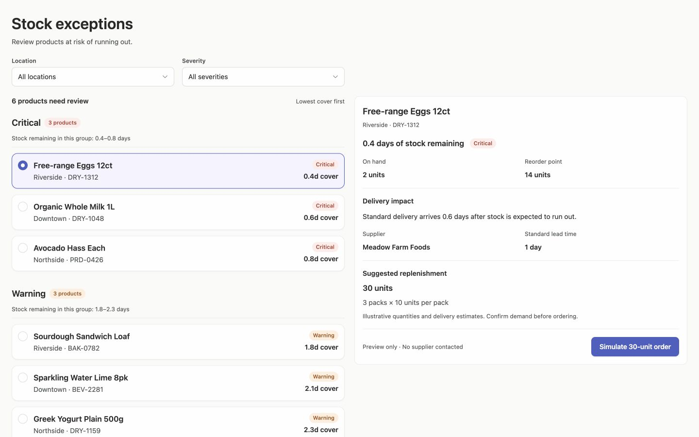
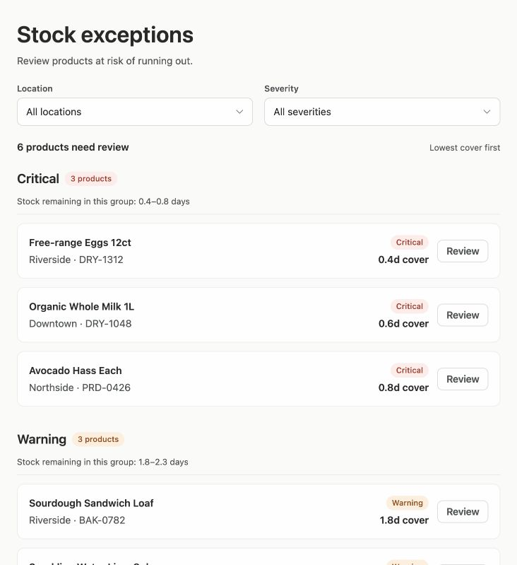
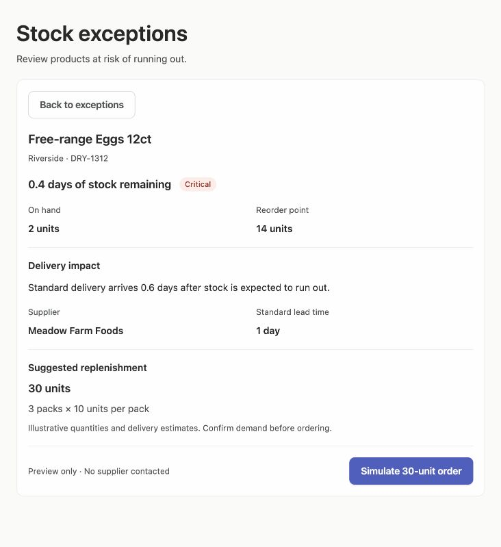

# Stock Exceptions — task-first composition

Manual composition revision of the existing fixture preview, following the
[builder-wide guidance](../../../../../agent/skills/design-app/references/information-composition.md).
Rendered through the existing Vercel Sandbox. No new app generation, scoring
call, deployment, or palette change was performed.

## Visible changes

- Page purpose, workload count, and sorting now occupy distinct contextual roles.
- Both severity sections have equal heading structure, an Arrusted count Tag,
  an adjacent group summary, and shared-token spacing between groups.
- The detail panel groups stock position, delivery impact, suggested
  replenishment, and action. Related supplier facts are visible without tabs.
- Existing wide two-pane selection and narrow Review/Back navigation remain.
- Source data, stock values, supplier facts, quantities, and simulation-only
  behavior are retained. No new shared visual component was needed.

## Focused Browser checks

- Review opens the chosen detail with focus on the detail region.
- Back returns to the list and restores focus to the originating Review button.
- Riverside filtering shows two matching records and updates the summary.
- Wide row selection switches to Sourdough and shows its delivery-fit result.
- Simulating the Eggs order leaves stock unchanged and disables the completed
  simulation button with “Simulated — no order sent.”

A missing spacing token and singular count wording were corrected during the
pass. Screenshots show final rendered bytes. The previous scenario file still
targets removed supplier tabs; it was not run or represented as passing.
This is a focused manual review, not full accessibility or hosted acceptance.
No new numeric score is claimed.

## Screenshots and source

Current desktop viewport captures include normal below-fold content. Wide view
was captured at 1440×900; the temporary viewport was restored afterward.

[Exact rendered fixture source](StockExceptions.tsx.txt)

This example illustrates general hierarchy principles; other generated apps
should choose their own task-appropriate structure rather than copy these
severity groups or replenishment sections.
