# stock-exceptions-urgency-context — 2026-09-09T07:16:25.252Z

[All reports](../../README.md) · [Interactive HTML report](index.html) · [Full measurements and scoring](report.json)

GitHub renders this summary and the screenshots. Download or clone this folder to open the HTML report locally; GitHub does not serve it as a website.

**Subjective design score:** 80/100. Model: openai/gpt-5.6-sol. Rubric: 2.

**Arrusted adherence:** 100/100 (partial); evidence coverage 1.5%. Evaluator 3.

| Dimension | Conforming | Nonconforming | Unassessed | Adherence    |
| --------- | ---------- | ------------- | ---------- | ------------ |
| component | 19         | 0             | 2          | 100% (19/19) |
| api       | 47         | 0             | 10         | 100% (47/47) |
| styling   | 13         | 0             | 5181       | 100% (13/13) |

Scores from different evaluator versions or captured states are not directly comparable.

This report evaluates the captured preview; evaluation itself does not regenerate the app or prove a built backend. Scores are advisory and not human-calibrated.

## Ratings

| Dimension      | Score | Reason                                                                                                                                                                                                                                                                                                                                        |
| -------------- | ----- | --------------------------------------------------------------------------------------------------------------------------------------------------------------------------------------------------------------------------------------------------------------------------------------------------------------------------------------------- |
| hierarchy      | 3/4   | The page title, exception list, selected-item header, evidence heading, and primary mock action form a clear review sequence. Severity pills and the selected-row treatment support scanning, though the exception summary and sort note run together visually in the list header.                                                            |
| layout         | 3/4   | The master-detail composition is consistently aligned and comfortably spaced from 1024px through 1920px, with compact evidence rows and stable footer actions. The list header becomes crowded, and the wide capture leaves substantial unused canvas because the working area remains tightly capped, but the core task area stays coherent. |
| typography     | 3/4   | Heading sizes, bold field labels, body values, and status treatments are consistent and readable across the supplied states. Small muted metadata is less distinct, and the missing separation between “4 total” and “Critical first” produces an apparent text collision.                                                                    |
| responsive     | 3/4   | The interface adapts from a two-panel layout at 1024–1920px to a focused detail view with a clear Back control at 700px. Actions remain visible and text wraps without horizontal overflow; however, constrained expanded/result panels introduce internal scrolling and can temporarily hide the leading stock facts.                        |
| productClarity | 4/4   | The task is explicit: filter exceptions, select a product, review stock and supplier evidence, and try a simulation. Confirmation and result states clearly identify the modeled quantity, projected stock, assumptions, and that no order or inventory change occurred; Reset and Back affordances are also unambiguous.                     |

## Strengths

- Strong master-detail workflow connects an exception selection directly to relevant stock and supplier evidence.
- Location and severity filters are placed before the exception list and remain compact across the supplied two-panel desktop widths.
- Rows expose product identity, location, severity, and days of cover, giving reviewers useful prioritization evidence without opening every record.
- Selected-state highlighting is clear without overpowering severity information.
- The mock action includes a review step, explicit assumptions, projected on-hand quantity, and repeated simulation-only messaging.
- Collapsible supplier facts keep secondary information subordinate while allowing deeper review.
- The 700px desktop-panel composition replaces the split view with a focused detail and a clear route back instead of compressing both columns.
- The existing Arrusted palette and familiar public-component styling appear visually consistent throughout the captures.

## Improvements

- **medium — desktop-0:** The exception count and sort explanation are concatenated as “4 matching · 4 totalCritical first · lowest cover.” This weakens scanability and makes two separate pieces of metadata look like one malformed phrase. Separate the count and sort note into distinct aligned elements with an explicit gap or divider. At constrained widths, place the sort note on a second line below the count.
- **medium — desktop-window-0:** At the narrower two-panel width, the same count/sort metadata collision is more prominent and occupies a crowded header beneath “Exceptions.” Use a stacked compact header at this width: keep “Exceptions” on the first row and place count and sort information on a second row with clear spacing between them.
- **low — desktop-window-5:** With secondary supplier facts expanded, the detail panel is scrolled so the stock-evidence heading plus the on-hand and reserved values are no longer visible. The product header remains present, but comparison between supplier terms and the most important stock baseline requires scrolling. When opening secondary facts in a constrained panel, preserve the current scroll position unless content must be revealed, or collapse the stock section into a labeled disclosure so its hidden state remains explicit.
- **low — desktop-wide-0:** The composition remains approximately the same working width as the 1440px version, leaving a very large amount of unused canvas at 1920px. This is orderly but slightly limits the benefit of a wide review workspace. Allow the supported list-detail composition to grow modestly at wide desktop sizes, prioritizing additional detail width or a slightly wider exception list while retaining readable line lengths.

## Token evidence

Percentages cover only assessed properties. Missing provenance and ambiguous CSS remain unassessed; matching literals are not proof of token usage.

| Viewport                 | Category   | Token references / assessed | Coverage   |
| ------------------------ | ---------- | --------------------------- | ---------- |
| desktop-0                | color      | 0/0                         | 0% (0/233) |
| desktop-0                | typography | 0/0                         | 0% (0/526) |
| desktop-0                | spacing    | 0/0                         | 0% (0/275) |
| desktop-0                | radius     | 0/0                         | 0% (0/116) |
| desktop-0                | border     | 0/0                         | 0% (0/125) |
| desktop-0                | shadow     | 0/0                         | 0% (0/120) |
| desktop-wide-0           | color      | 0/0                         | 0% (0/233) |
| desktop-wide-0           | typography | 0/0                         | 0% (0/526) |
| desktop-wide-0           | spacing    | 0/0                         | 0% (0/275) |
| desktop-wide-0           | radius     | 0/0                         | 0% (0/116) |
| desktop-wide-0           | border     | 0/0                         | 0% (0/125) |
| desktop-wide-0           | shadow     | 0/0                         | 0% (0/120) |
| desktop-window-0         | color      | 0/0                         | 0% (0/233) |
| desktop-window-0         | typography | 0/0                         | 0% (0/526) |
| desktop-window-0         | spacing    | 0/0                         | 0% (0/275) |
| desktop-window-0         | radius     | 0/0                         | 0% (0/116) |
| desktop-window-0         | border     | 0/0                         | 0% (0/125) |
| desktop-window-0         | shadow     | 0/0                         | 0% (0/120) |
| desktop-custom-700x900-0 | color      | 0/0                         | 0% (0/161) |
| desktop-custom-700x900-0 | typography | 0/0                         | 0% (0/405) |
| desktop-custom-700x900-0 | spacing    | 0/0                         | 0% (0/184) |
| desktop-custom-700x900-0 | radius     | 0/0                         | 0% (0/81)  |
| desktop-custom-700x900-0 | border     | 0/0                         | 0% (0/84)  |
| desktop-custom-700x900-0 | shadow     | 0/0                         | 0% (0/81)  |

## Latest-run screenshots

### desktop-0 — initial

Interaction: not-run.

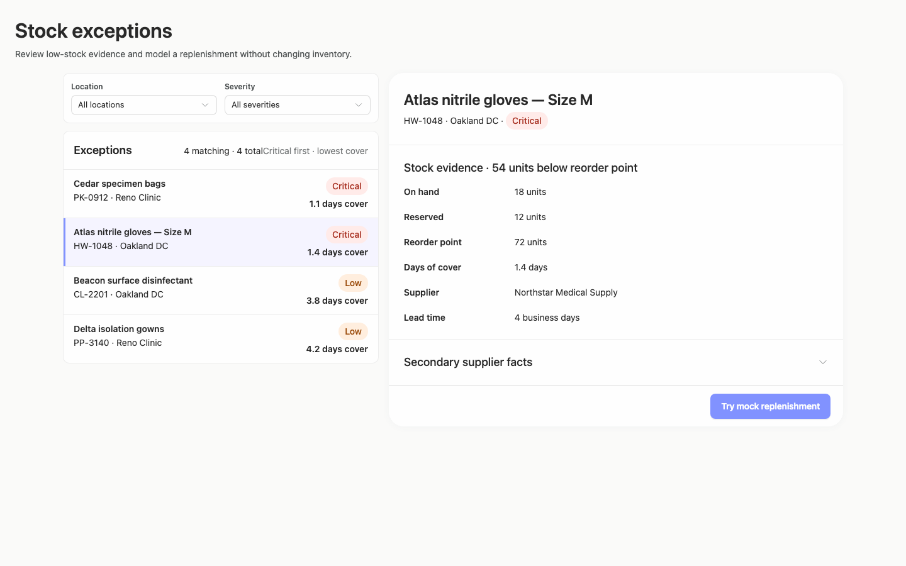

### desktop-1 — Review modeled quantity before confirming

Interaction: passed.

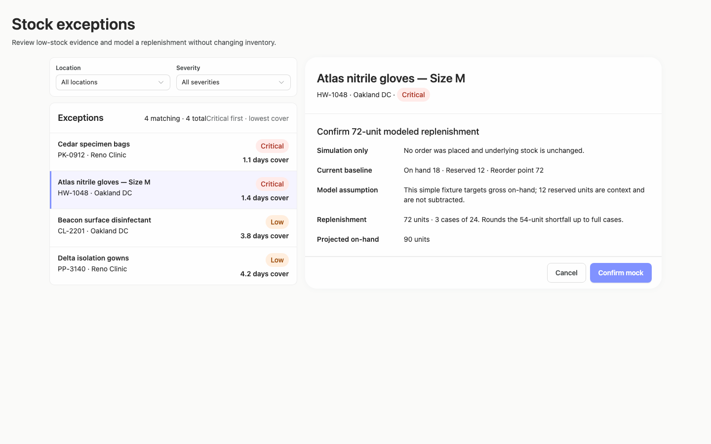

### desktop-2 — Mock replenishment result

Interaction: passed.

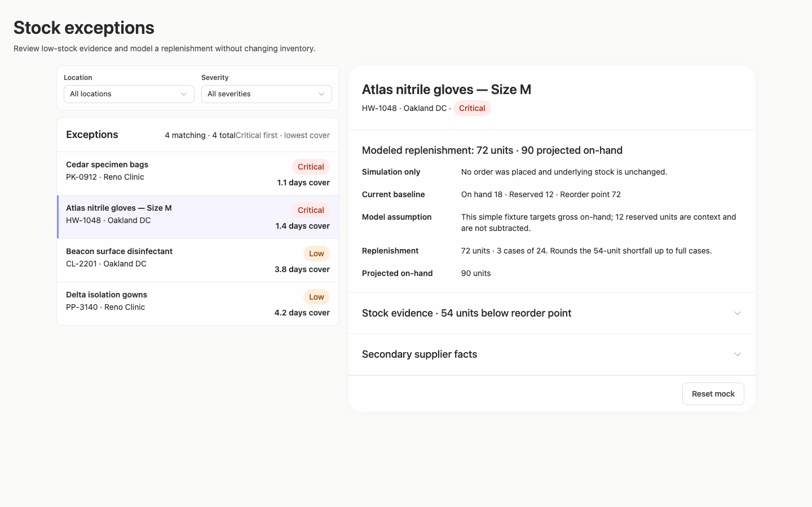

### desktop-3 — Result evidence at scroll boundary

Interaction: passed.

### desktop-4 — Reset from result footer

Interaction: passed.

### desktop-5 — Expanded supplier facts

Interaction: passed.

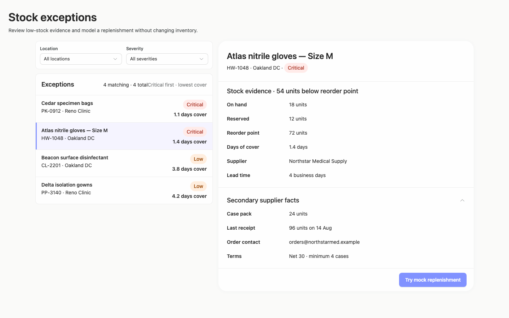

### desktop-wide-0 — initial

Interaction: not-run.

### desktop-wide-1 — Review modeled quantity before confirming

Interaction: passed.

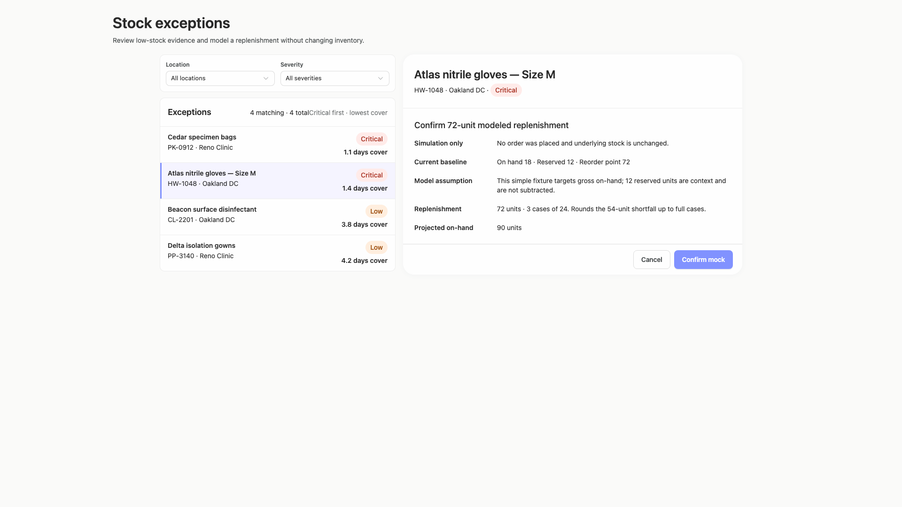

### desktop-wide-2 — Mock replenishment result

Interaction: passed.

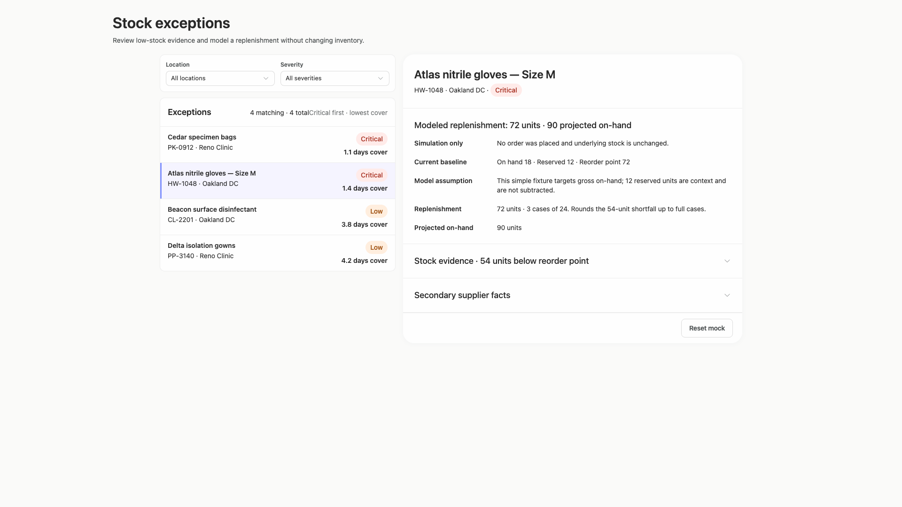

### desktop-wide-3 — Result evidence at scroll boundary

Interaction: passed.

### desktop-wide-4 — Reset from result footer

Interaction: passed.

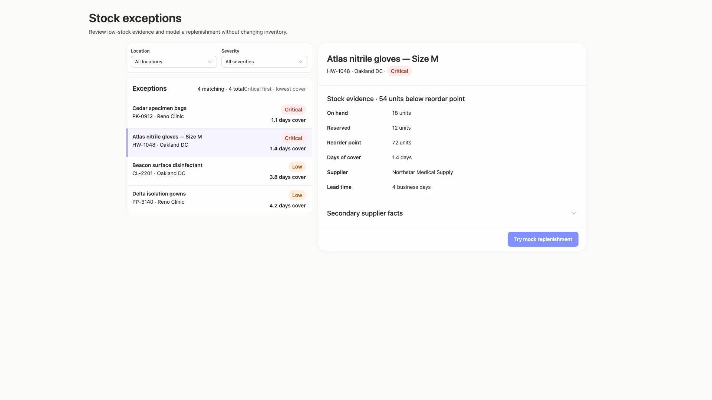

### desktop-wide-5 — Expanded supplier facts

Interaction: passed.

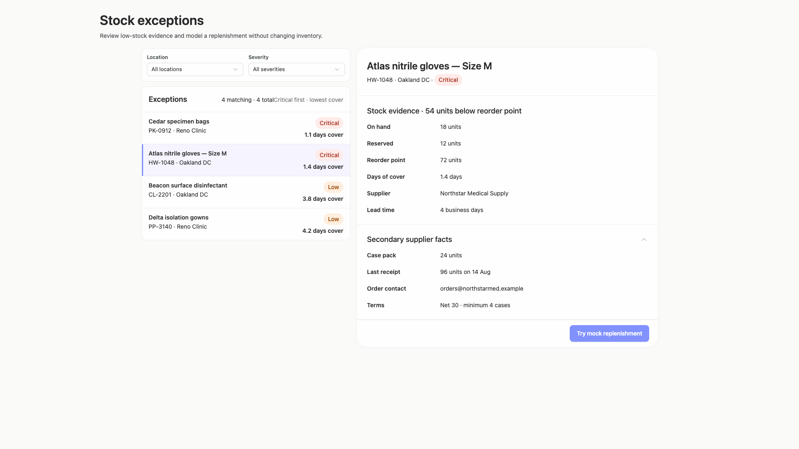

### desktop-window-0 — initial

Interaction: not-run.

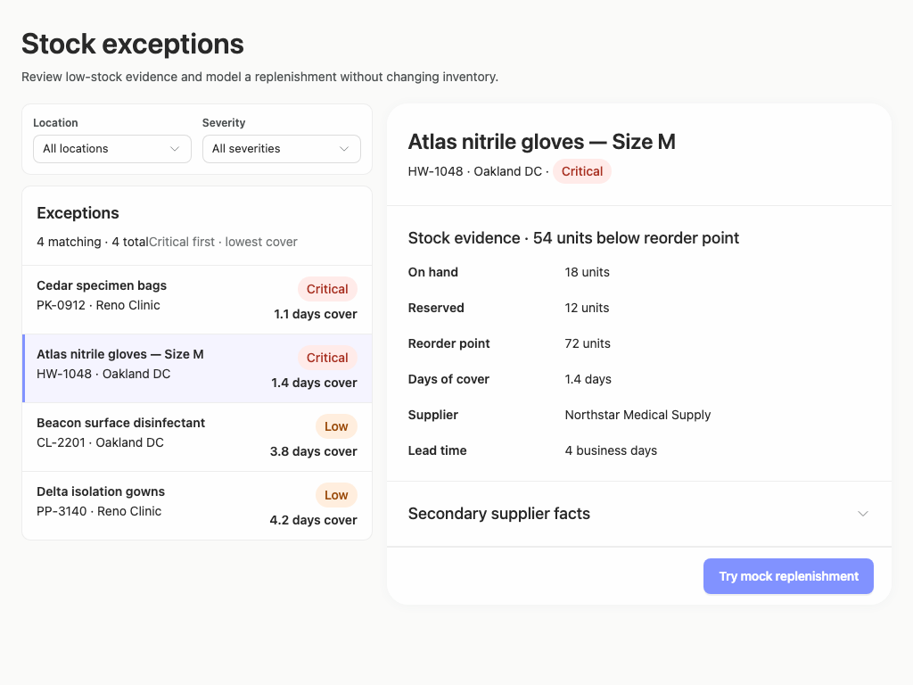

### desktop-window-1 — Review modeled quantity before confirming

Interaction: passed.

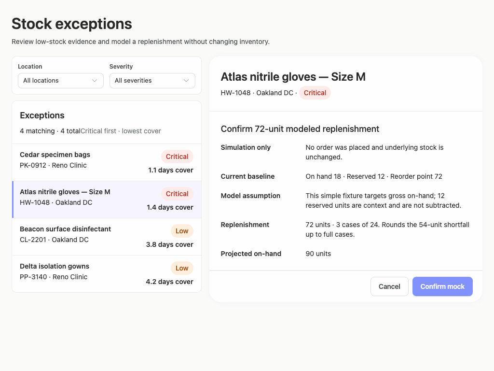

### desktop-window-2 — Mock replenishment result

Interaction: passed.

### desktop-window-3 — Result evidence at scroll boundary

Interaction: passed.

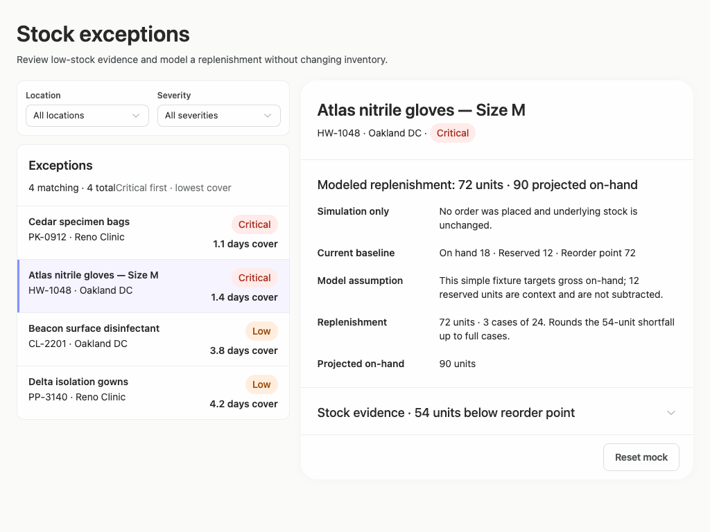

### desktop-window-4 — Reset from result footer

Interaction: passed.

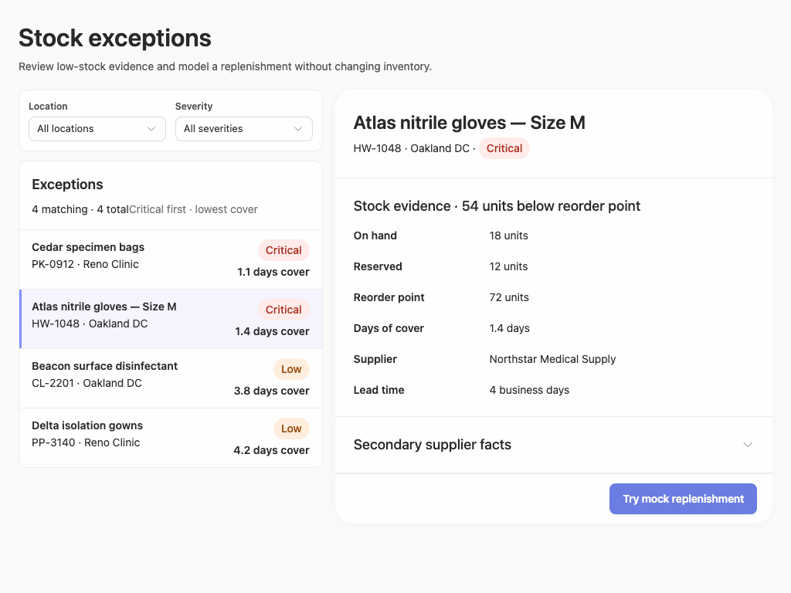

### desktop-window-5 — Expanded supplier facts

Interaction: passed.

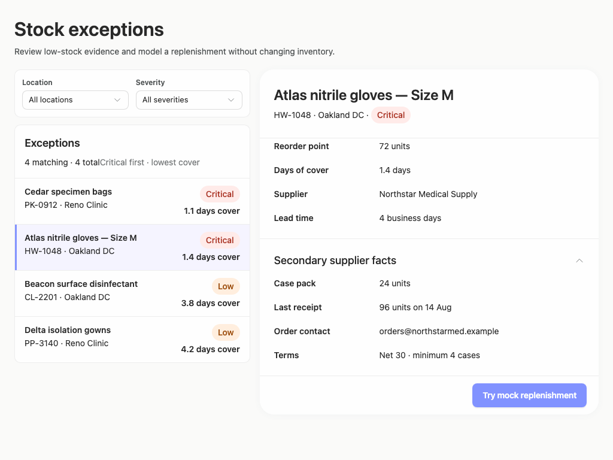

### desktop-custom-700x900-0 — initial

Interaction: not-run.

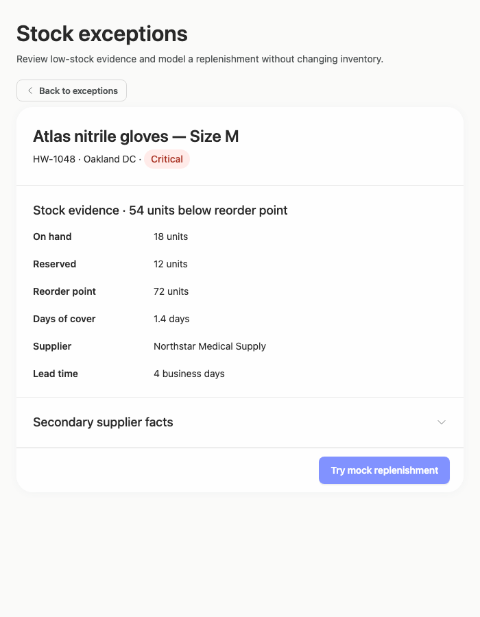

### desktop-custom-700x900-1 — Review modeled quantity before confirming

Interaction: passed.

### desktop-custom-700x900-2 — Mock replenishment result

Interaction: passed.

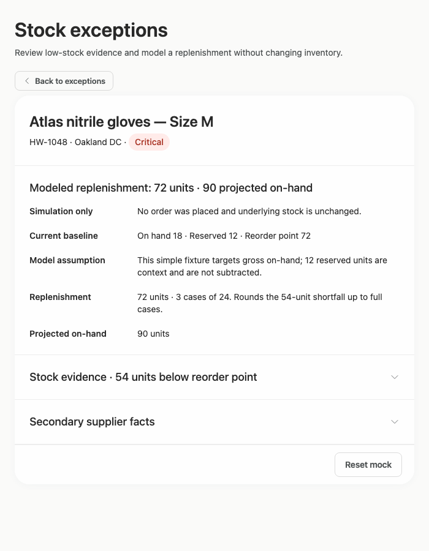

### desktop-custom-700x900-3 — Result evidence at scroll boundary

Interaction: passed.

### desktop-custom-700x900-4 — Reset from result footer

Interaction: passed.

### desktop-custom-700x900-5 — Expanded supplier facts

Interaction: passed.

## Limitations

- Only the supplied static captures and measurement evidence were assessed; filter menus, empty results, focus states, keyboard flow, loading states, and arbitrary intermediate window sizes were not observed.
- Interaction evidence covers the mock confirmation, result, reset, and supplier disclosure paths, but does not prove backend behavior or persistence.
- The 700px captures begin on a selected detail route, so the narrow-window exception-list and filter view was not shown.
- Automated evidence reports marginal muted-text contrast and low contrast for text on the existing primary Button. These observations are advisory; no palette override or primary Button restyling is recommended because the existing Arrusted palette is authoritative.
- Static source evidence does not establish that every dynamic component branch rendered, and styling provenance coverage was very limited.
- No implementation-plan artifact was supplied in the visual captures, so the brief’s requested plan and stop-before-build/publication boundary could not be evaluated.
