# stock-exceptions-verified-interactions — 2026-09-09T05:04:48.232Z

[All reports](../../README.md) · [Interactive HTML report](index.html) · [Full measurements and scoring](report.json)

GitHub renders this summary and the screenshots. Download or clone this folder to open the HTML report locally; GitHub does not serve it as a website.

**Subjective design score:** 80/100. Model: openai/gpt-5.6-sol. Rubric: 2.

**Arrusted adherence:** 100/100 (partial); evidence coverage 1.05%. Evaluator 3.

| Dimension | Conforming | Nonconforming | Unassessed | Adherence    |
| --------- | ---------- | ------------- | ---------- | ------------ |
| component | 14         | 0             | 2          | 100% (14/14) |
| api       | 31         | 0             | 13         | 100% (31/31) |
| styling   | 12         | 0             | 5356       | 100% (12/12) |

Scores from different evaluator versions or captured states are not directly comparable.

This report evaluates the captured preview; evaluation itself does not regenerate the app or prove a built backend. Scores are advisory and not human-calibrated.

## Ratings

| Dimension      | Score | Reason                                                                                                                                                                                                                                                                                                                                                                                       |
| -------------- | ----- | -------------------------------------------------------------------------------------------------------------------------------------------------------------------------------------------------------------------------------------------------------------------------------------------------------------------------------------------------------------------------------------------- |
| hierarchy      | 3/4   | The page title, filters, exception list, selected-record header, evidence, supplier disclosure, and primary mock action form a clear progression. Selection is reinforced by a tinted row and accent edge, while severity and days of cover are easy to scan. The mock result is less hierarchical because several calculations and the no-order disclaimer are combined into one paragraph. |
| layout         | 3/4   | The two-column review composition is consistently aligned at 1024–1920 px, with orderly label/value rows and stable action placement. The centered maximum-width layout prevents excessive stretching, though the sparse filter and empty-state containers consume substantial horizontal area, and expanded result states add avoidable vertical length.                                    |
| typography     | 3/4   | Heading sizes, weights, labels, values, and button text are visually consistent and readable overall. However, automated evidence repeatedly flags small muted metadata, field labels, and status text as marginal or insufficient contrast; using supported larger or stronger typography variants would improve readability without changing the authoritative palette.                    |
| responsive     | 4/4   | The composition adapts effectively across the supplied desktop widths: 1024 px retains a usable list-detail split, while 700 px switches to a focused detail view with a Back control. Filters remain usable and no horizontal overflow is reported. Expanded mock results require ordinary vertical scrolling at shorter windows, but controls remain available.                            |
| productClarity | 3/4   | The purpose is stated directly, filters are labeled, rows expose product, location, severity, and cover, and the result explicitly says no order was placed or stock changed. The count label “1 of 4” is ambiguous after filtering, and the fixed mock calculation could be presented more transparently as distinct inputs and outputs.                                                    |

## Strengths

- Strong master-detail workflow with synchronized selection and prominent stock and supplier evidence.
- Location and severity filters are consistently positioned and include a clear recoverable empty state with Reset filters.
- Severity is communicated with explicit text rather than color alone, and days of cover is visible directly in each list row.
- The constrained 700 px desktop composition appropriately replaces the split view with a focused detail panel and Back navigation.
- The mock result clearly distinguishes modeling from a real inventory-changing order, and Reset mock provides a reversible prototype state.

## Improvements

- **medium — desktop-1:** The mock result places modeled quantity, reserved-stock treatment, shortfall, case-pack rounding, projected stock, and the no-order disclaimer into one dense paragraph. This makes the decision evidence harder to verify quickly. Present the calculation as compact label/value rows—shortfall, case pack, modeled quantity, projected on-hand—followed by a separate informational note stating that no order was placed and inventory is unchanged.
- **low — desktop-window-1:** At the measured 768 px viewport height, the expanded result pushes Reset mock to y=924 in the document, requiring a substantial scroll before the recovery action is visible. Place Reset mock beside the “Mock replenishment result” heading or immediately below the result summary, using a supported secondary Button variant, so the state-changing control remains associated with the result.
- **medium — desktop-0:** List metadata and severity pills use small text, and the supplied accessibility evidence reports contrast ratios below the expected threshold for several muted captions and status labels. This weakens rapid scanning of SKU, location, and severity. Preserve the Arrusted palette, but use supported typography or density variants that give metadata and pill labels a larger size or stronger weight; retain the explicit Critical and Low wording.
- **low — desktop-3:** After filtering, “1 of 4” can be interpreted as either the first selected record or one matching record out of four total records. Use an explicit count such as “1 matching · 4 total” in the list header.
- **low — desktop-custom-700x900-0:** The constrained initial view opens directly on a selected record, so the exception-selection step is hidden behind a visually subdued Back control. The workflow remains usable, but discoverability of the full list is reduced. Use a supported secondary or subtle Button treatment with a more informative label such as “View exceptions (4)” while retaining the same back behavior.

## Token evidence

Percentages cover only assessed properties. Missing provenance and ambiguous CSS remain unassessed; matching literals are not proof of token usage.

| Viewport                 | Category   | Token references / assessed | Coverage   |
| ------------------------ | ---------- | --------------------------- | ---------- |
| desktop-0                | color      | 0/0                         | 0% (0/228) |
| desktop-0                | typography | 0/0                         | 0% (0/522) |
| desktop-0                | spacing    | 0/0                         | 0% (0/276) |
| desktop-0                | radius     | 0/0                         | 0% (0/116) |
| desktop-0                | border     | 0/0                         | 0% (0/130) |
| desktop-0                | shadow     | 0/0                         | 0% (0/120) |
| desktop-wide-0           | color      | 0/0                         | 0% (0/228) |
| desktop-wide-0           | typography | 0/0                         | 0% (0/522) |
| desktop-wide-0           | spacing    | 0/0                         | 0% (0/276) |
| desktop-wide-0           | radius     | 0/0                         | 0% (0/116) |
| desktop-wide-0           | border     | 0/0                         | 0% (0/130) |
| desktop-wide-0           | shadow     | 0/0                         | 0% (0/120) |
| desktop-window-0         | color      | 0/0                         | 0% (0/228) |
| desktop-window-0         | typography | 0/0                         | 0% (0/522) |
| desktop-window-0         | spacing    | 0/0                         | 0% (0/276) |
| desktop-window-0         | radius     | 0/0                         | 0% (0/116) |
| desktop-window-0         | border     | 0/0                         | 0% (0/130) |
| desktop-window-0         | shadow     | 0/0                         | 0% (0/120) |
| desktop-custom-700x900-0 | color      | 0/0                         | 0% (0/190) |
| desktop-custom-700x900-0 | typography | 0/0                         | 0% (0/474) |
| desktop-custom-700x900-0 | spacing    | 0/0                         | 0% (0/221) |
| desktop-custom-700x900-0 | radius     | 0/0                         | 0% (0/96)  |
| desktop-custom-700x900-0 | border     | 0/0                         | 0% (0/103) |
| desktop-custom-700x900-0 | shadow     | 0/0                         | 0% (0/96)  |

## Latest-run screenshots

### desktop-0 — initial

Interaction: not-run.

### desktop-1 — Mock replenishment result

Interaction: passed.

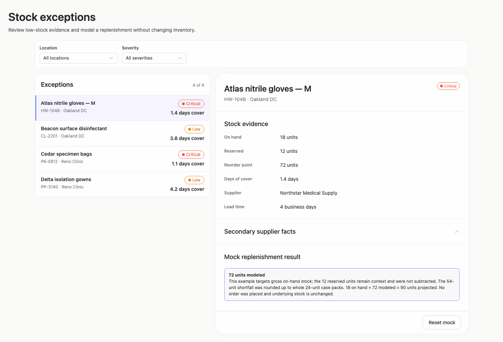

### desktop-2 — Reset mock result

Interaction: passed.

### desktop-3 — Filter and synchronize selection

Interaction: passed.

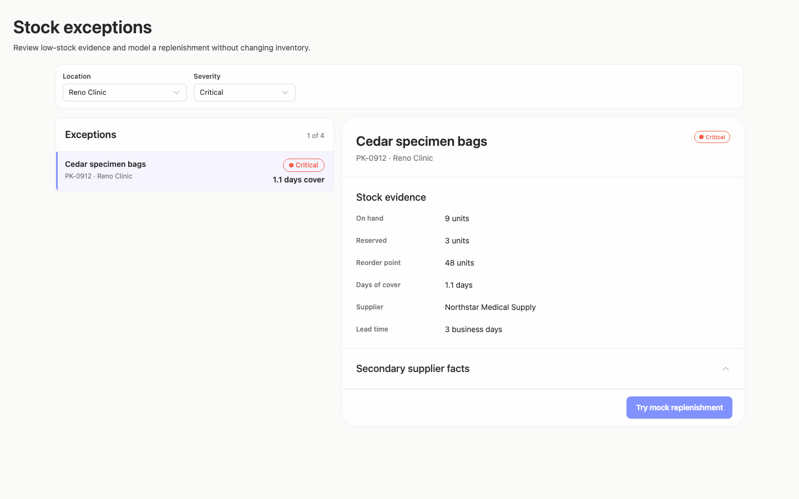

### desktop-4 — Empty filtered state

Interaction: passed.

### desktop-5 — Expanded supplier facts

Interaction: passed.

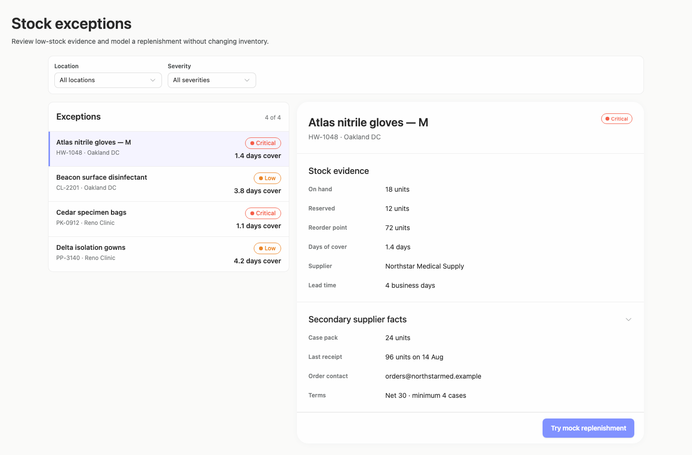

### desktop-wide-0 — initial

Interaction: not-run.

### desktop-wide-1 — Mock replenishment result

Interaction: passed.

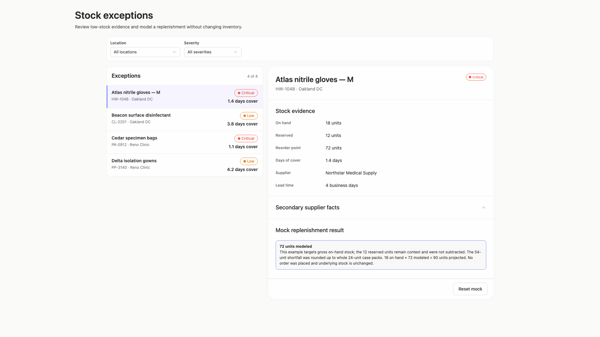

### desktop-wide-2 — Reset mock result

Interaction: passed.

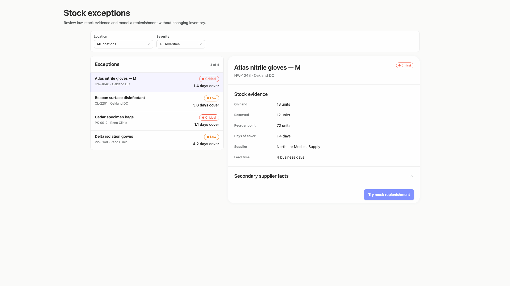

### desktop-wide-3 — Filter and synchronize selection

Interaction: passed.

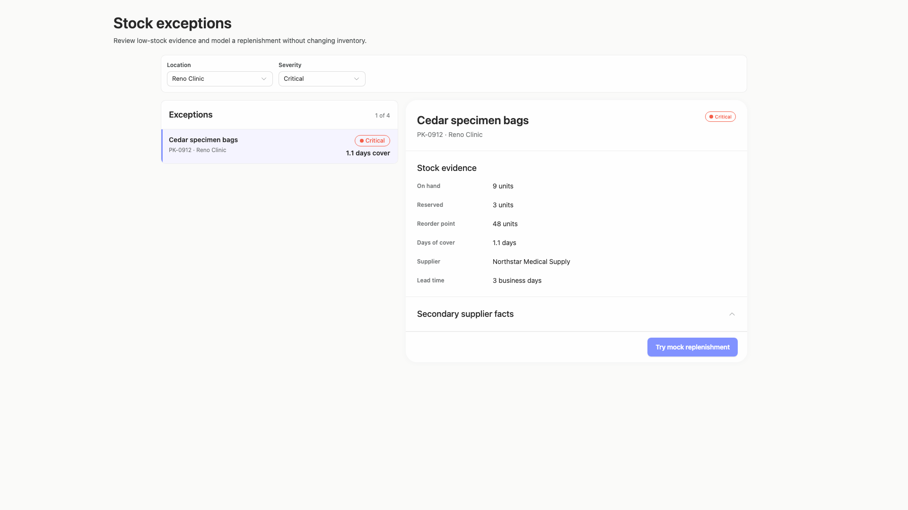

### desktop-wide-4 — Empty filtered state

Interaction: passed.

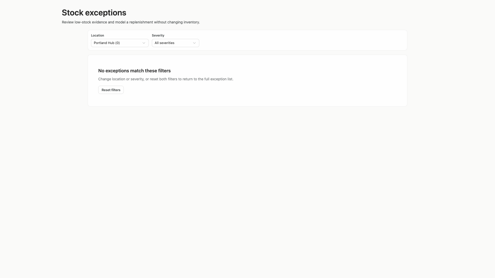

### desktop-wide-5 — Expanded supplier facts

Interaction: passed.

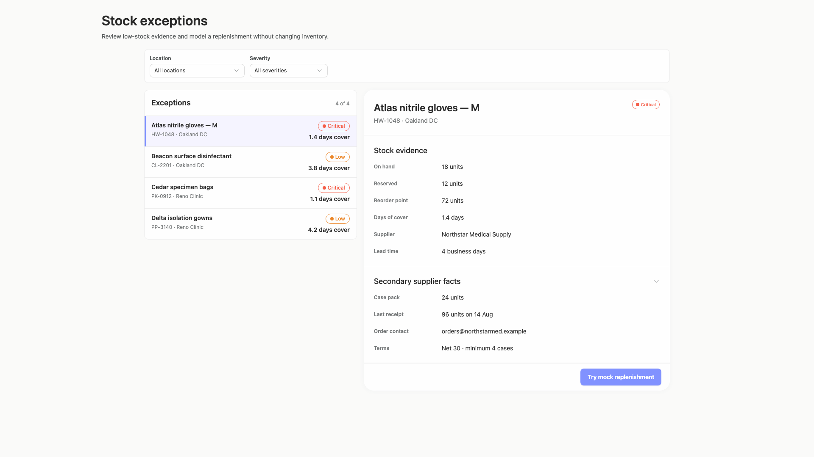

### desktop-window-0 — initial

Interaction: not-run.

### desktop-window-1 — Mock replenishment result

Interaction: passed.

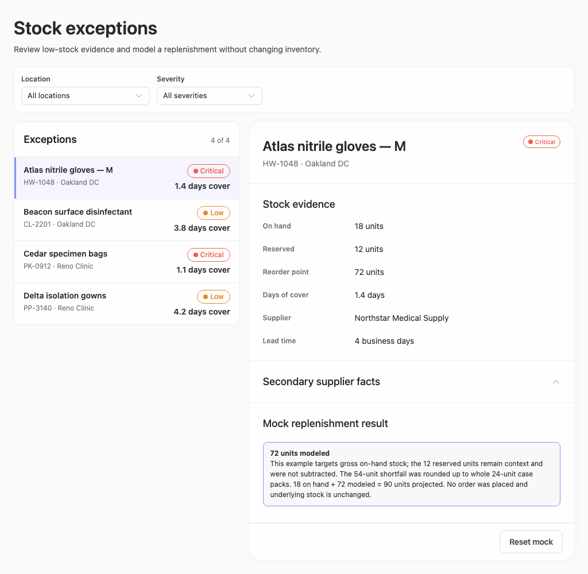

### desktop-window-2 — Reset mock result

Interaction: passed.

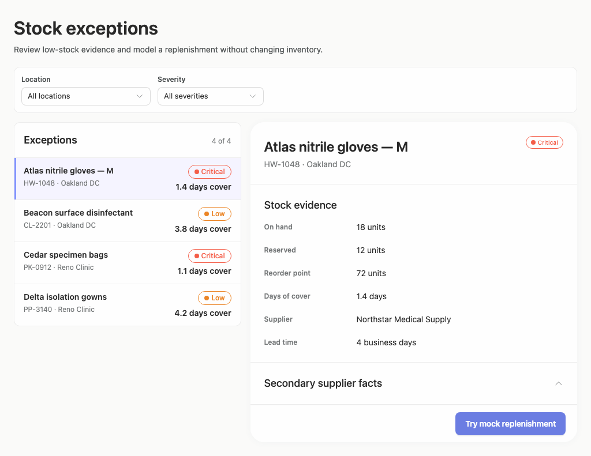

### desktop-window-3 — Filter and synchronize selection

Interaction: passed.

### desktop-window-4 — Empty filtered state

Interaction: passed.

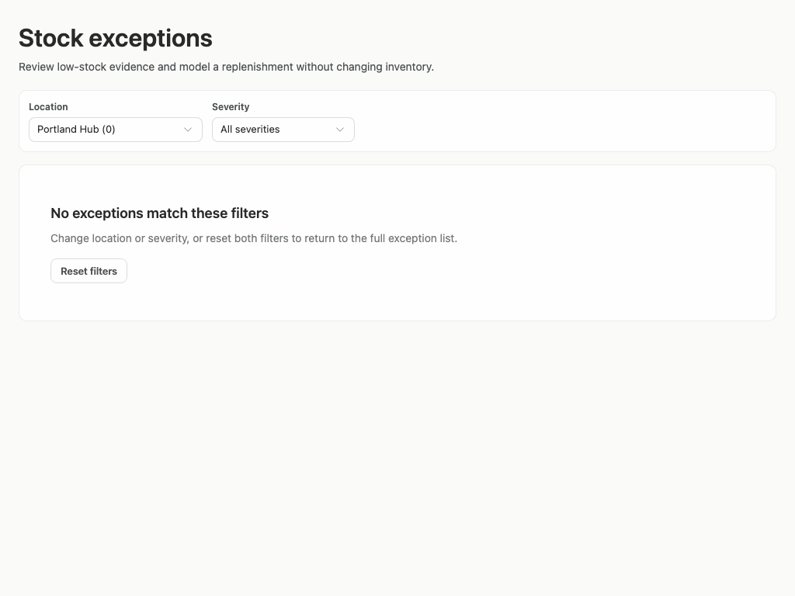

### desktop-window-5 — Expanded supplier facts

Interaction: passed.

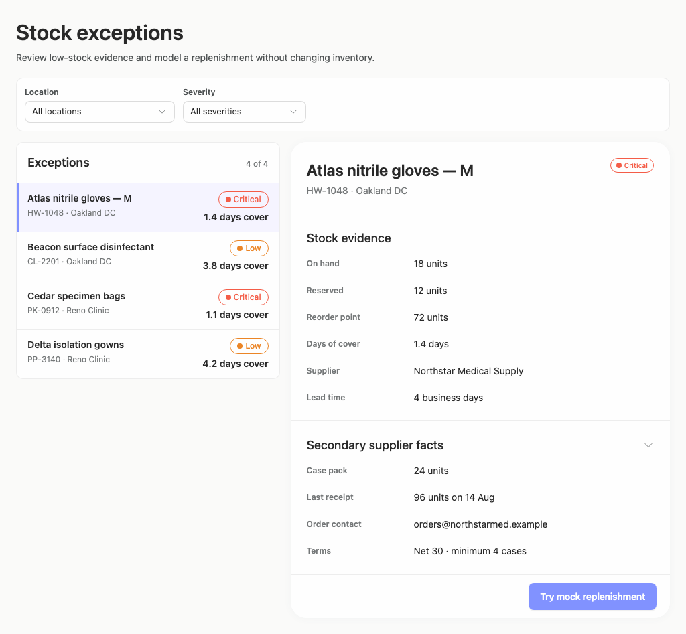

### desktop-custom-700x900-0 — initial

Interaction: not-run.

### desktop-custom-700x900-1 — Mock replenishment result

Interaction: passed.

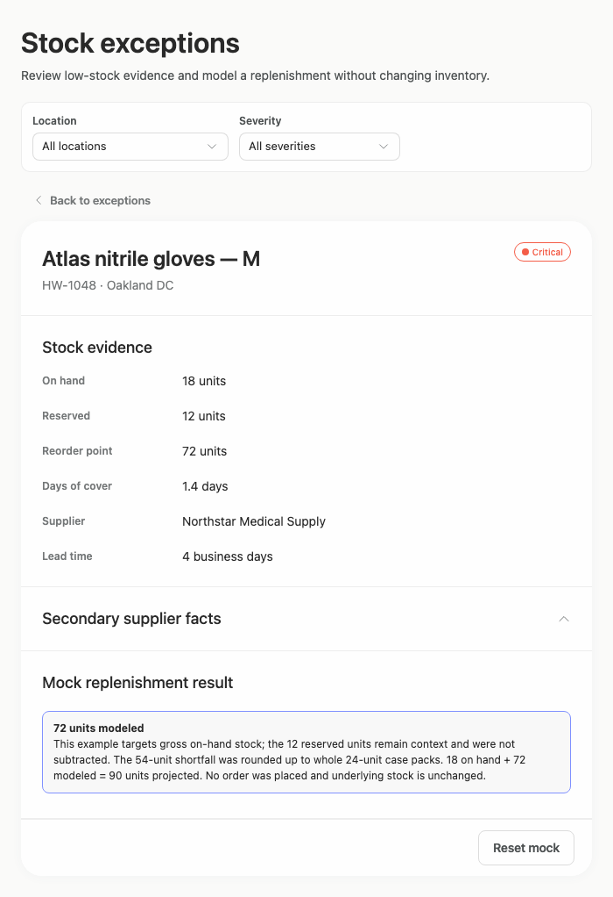

### desktop-custom-700x900-2 — Reset mock result

Interaction: passed.

### desktop-custom-700x900-3 — Filter and synchronize selection

Interaction: passed.

### desktop-custom-700x900-4 — Empty filtered state

Interaction: passed.

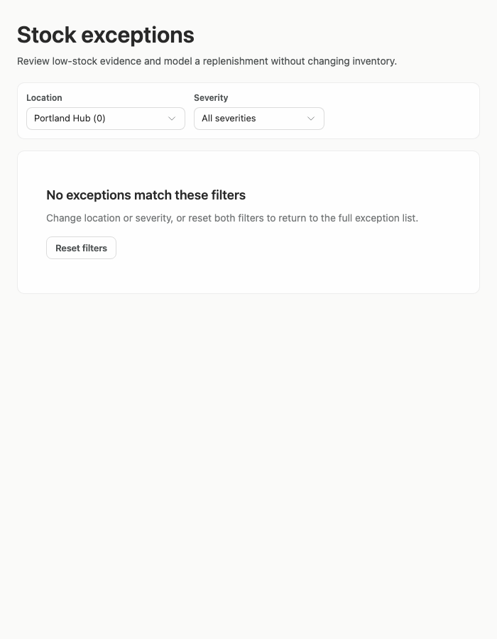

### desktop-custom-700x900-5 — Expanded supplier facts

Interaction: passed.

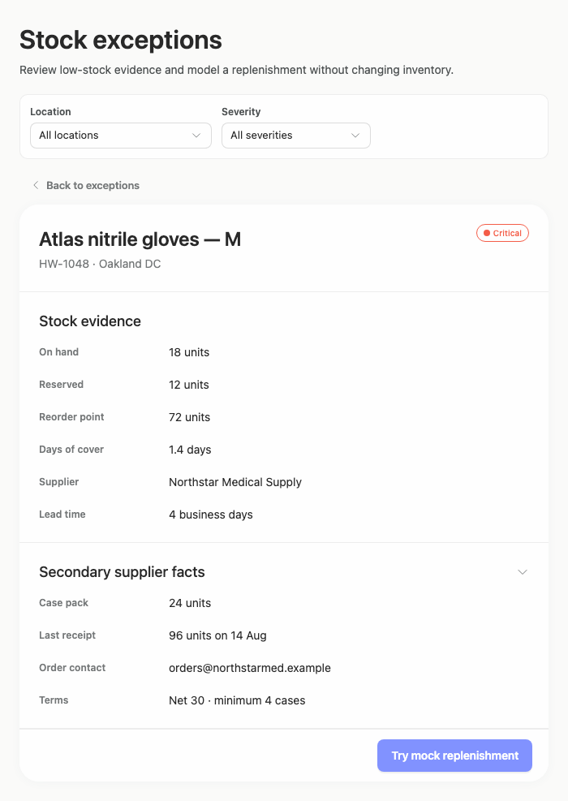

## Limitations

- No implementation-plan artifact is included in the evidence, so completion or quality of that requested deliverable cannot be assessed.
- Only supplied screenshots and reported interaction checks were evaluated; hover, focus, keyboard traversal, loading, error, and very long data states were not shown.
- The narrow-width screenshots do not show the list view after activating Back, so that specific selection state cannot be visually verified.
- Reported source adherence and static JSX evidence were kept separate from the interface-design scores and do not prove runtime component behavior.
