# stock-exceptions-visible-selection — 2026-09-09T10:53:42.438Z

[All reports](../../README.md) · [Interactive HTML report](index.html) · [Full measurements and scoring](report.json)

GitHub renders this summary and the screenshots. Download or clone this folder to open the HTML report locally; GitHub does not serve it as a website.

**Subjective design score:** 95/100. Model: openai/gpt-5.6-sol. Rubric: 2.

**Arrusted adherence:** 100/100 (partial); evidence coverage 1.79%. Evaluator 3.

| Dimension | Conforming | Nonconforming | Unassessed | Adherence    |
| --------- | ---------- | ------------- | ---------- | ------------ |
| component | 22         | 0             | 3          | 100% (22/22) |
| api       | 56         | 0             | 11         | 100% (56/56) |
| styling   | 13         | 0             | 4979       | 100% (13/13) |

Scores from different evaluator versions or captured states are not directly comparable.

This report evaluates the captured preview; evaluation itself does not regenerate the app or prove a built backend. Scores are advisory and not human-calibrated.

## Ratings

| Dimension | Score | Reason |
| --- | --- | --- |
| hierarchy | 4/4 | The page title, filters, exception list, selected-record identity, evidence, and replenishment action form a clear task sequence. Severity pills, selected-row treatment, days of cover, and the prominent projected quantity make risk and outcomes easy to scan. |
| layout | 3/4 | The two-column composition is consistently aligned and comfortably spaced at 1024–1920 px, with readable detail rows and well-grouped confirmation cards. At the constrained 700 px detail view, repeated page context, navigation, and record identity consume substantial vertical space before the task content. |
| typography | 4/4 | Heading levels, labels, values, metadata, and explanatory text are visually consistent and readable. Large quantity values are appropriately emphasized, while supporting assumptions remain subordinate without becoming illegible. |
| responsive | 4/4 | The interface successfully changes from side-by-side list/detail at 1024–1920 px to deferred list and detail views at 700 px. Filters expand cleanly, detail controls remain usable, a clear Back action appears, and the supplied captures show no horizontal overflow or clipped controls. |
| productClarity | 4/4 | The purpose is explicit, location and severity filters are understandable, exception rows expose the decision evidence, and record details include both stock and supplier information. The mock action clearly previews 18 + 96 = 114 units and repeatedly states that inventory and orders remain unchanged. |

## Strengths

- Exception rows combine product identity, location, shortage, severity, and days of cover without requiring users to open every record.
- The selected exception remains visible beside its evidence at wider desktop sizes, supporting efficient review.
- The modeled replenishment flow has distinct preview, confirmation, completed, and reset states with explicit simulation-only language.
- Supplier facts are progressively disclosed, keeping the default detail view focused while retaining purchasing context.
- The 700 px panel behavior provides a dedicated detail view and Back action rather than compressing both panes into an unusable split.
- The existing Arrusted palette and component appearance remain visually consistent across the supplied states.

## Improvements

- **low — desktop-custom-700x900-1:** In the constrained confirmation view, the global title and subtitle, Back control, record header, and action row occupy roughly the first 300 px; the modeled replenishment content does not begin until around y=330. Use a more compact constrained-detail header composition—for example, keep the Back action and record identity together and omit or reduce repeated introductory copy while the detail view is active.
- **low — desktop-window-1:** The model assumption and replenishment derivation are presented as two dense prose blocks. The calculation is understandable, but slower to scan during repeated exception review. Preserve the same content but structure the derivation into short labeled lines, such as gap, case rounding, supplier minimum, and final modeled quantity.
- **low — desktop-wide-0:** The maximized desktop view leaves a large unused area below the compact review workspace. This is not harmful, but the composition does not take advantage of the additional height for faster comparison or more operational context. If additional review context is planned, use the available vertical space for an activity or demand-history section within the existing detail composition; otherwise retain the current focused maximum-width layout.

## Token evidence

Percentages cover only assessed properties. Missing provenance and ambiguous CSS remain unassessed; matching literals are not proof of token usage.

| Viewport | Category | Token references / assessed | Coverage |
| --- | --- | --- | --- |
| desktop-0 | color | 0/0 | 0% (0/233) |
| desktop-0 | typography | 0/0 | 0% (0/522) |
| desktop-0 | spacing | 0/0 | 0% (0/271) |
| desktop-0 | radius | 0/0 | 0% (0/116) |
| desktop-0 | border | 0/0 | 0% (0/125) |
| desktop-0 | shadow | 0/0 | 0% (0/120) |
| desktop-wide-0 | color | 0/0 | 0% (0/233) |
| desktop-wide-0 | typography | 0/0 | 0% (0/522) |
| desktop-wide-0 | spacing | 0/0 | 0% (0/271) |
| desktop-wide-0 | radius | 0/0 | 0% (0/116) |
| desktop-wide-0 | border | 0/0 | 0% (0/125) |
| desktop-wide-0 | shadow | 0/0 | 0% (0/120) |
| desktop-window-0 | color | 0/0 | 0% (0/233) |
| desktop-window-0 | typography | 0/0 | 0% (0/522) |
| desktop-window-0 | spacing | 0/0 | 0% (0/271) |
| desktop-window-0 | radius | 0/0 | 0% (0/116) |
| desktop-window-0 | border | 0/0 | 0% (0/125) |
| desktop-window-0 | shadow | 0/0 | 0% (0/120) |
| desktop-custom-700x900-0 | color | 0/0 | 0% (0/140) |
| desktop-custom-700x900-0 | typography | 0/0 | 0% (0/292) |
| desktop-custom-700x900-0 | spacing | 0/0 | 0% (0/164) |
| desktop-custom-700x900-0 | radius | 0/0 | 0% (0/70) |
| desktop-custom-700x900-0 | border | 0/0 | 0% (0/78) |
| desktop-custom-700x900-0 | shadow | 0/0 | 0% (0/74) |

## Latest-run screenshots

### desktop-0 — initial

Interaction: not-run.

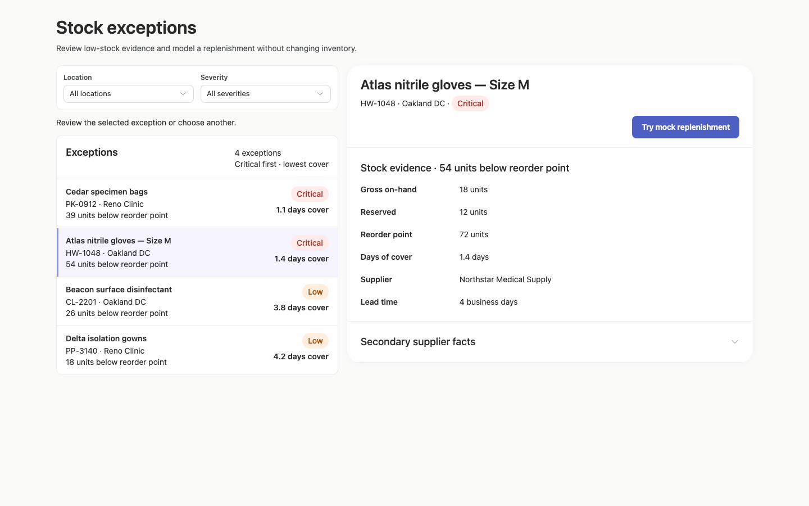

### desktop-1 — Select record and review modeled quantity

Interaction: passed.

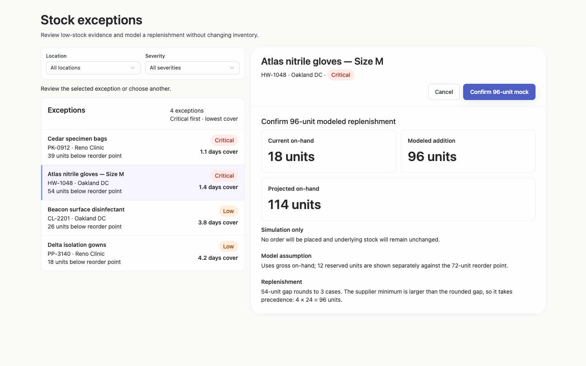

### desktop-2 — Confirm modeled replenishment

Interaction: passed.

### desktop-3 — Read projected quantity

Interaction: passed.

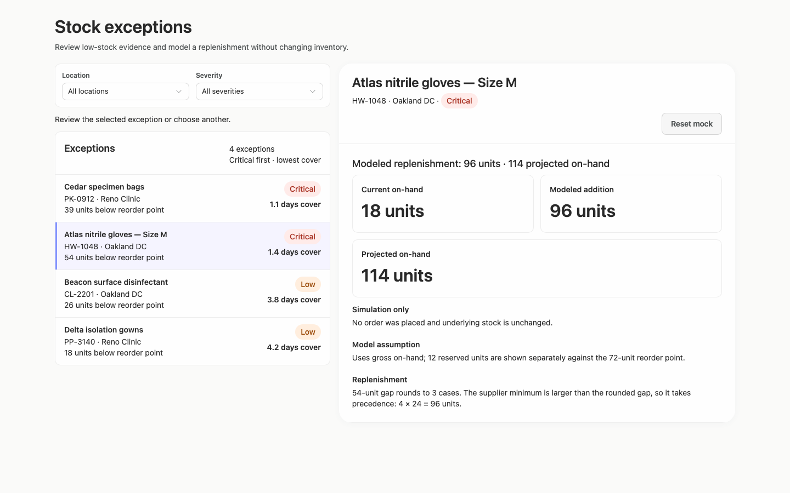

### desktop-4 — Reset fixture result

Interaction: passed.

### desktop-5 — Inspect supplier facts

Interaction: passed.

### desktop-wide-0 — initial

Interaction: not-run.

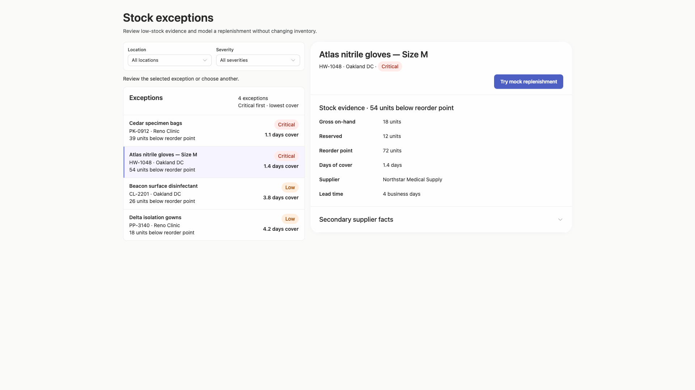

### desktop-wide-1 — Select record and review modeled quantity

Interaction: passed.

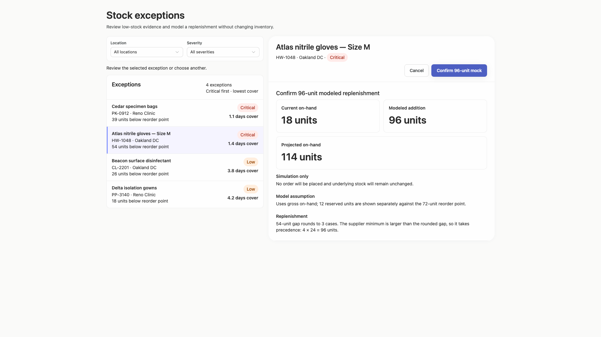

### desktop-wide-2 — Confirm modeled replenishment

Interaction: passed.

### desktop-wide-3 — Read projected quantity

Interaction: passed.

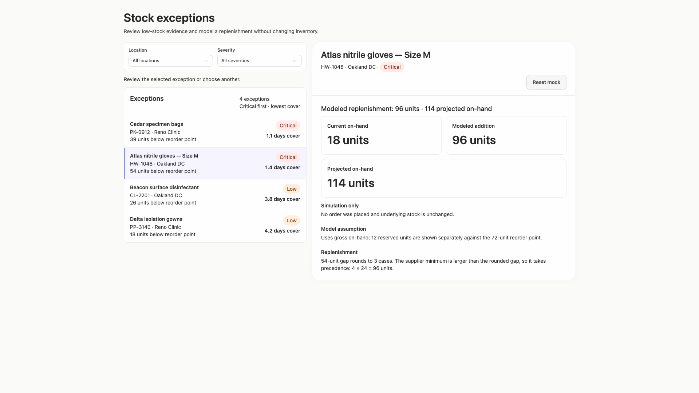

### desktop-wide-4 — Reset fixture result

Interaction: passed.

### desktop-wide-5 — Inspect supplier facts

Interaction: passed.

### desktop-window-0 — initial

Interaction: not-run.

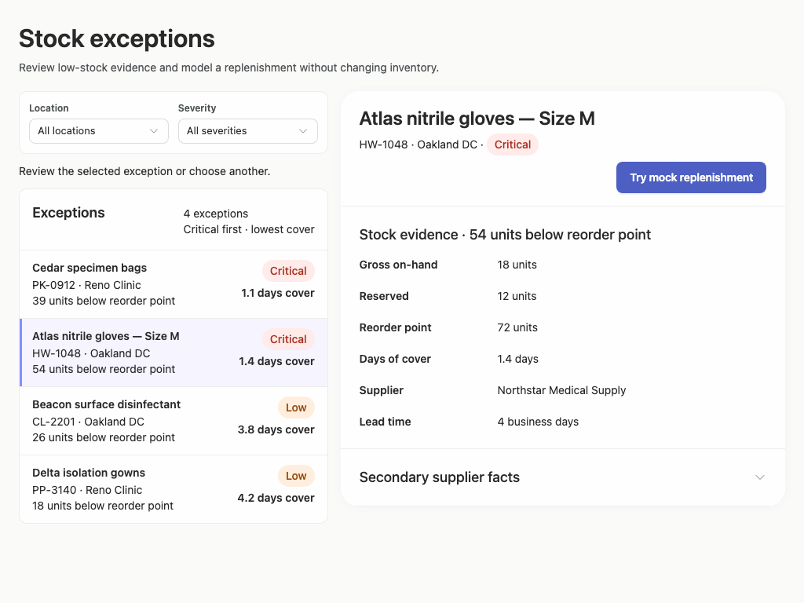

### desktop-window-1 — Select record and review modeled quantity

Interaction: passed.

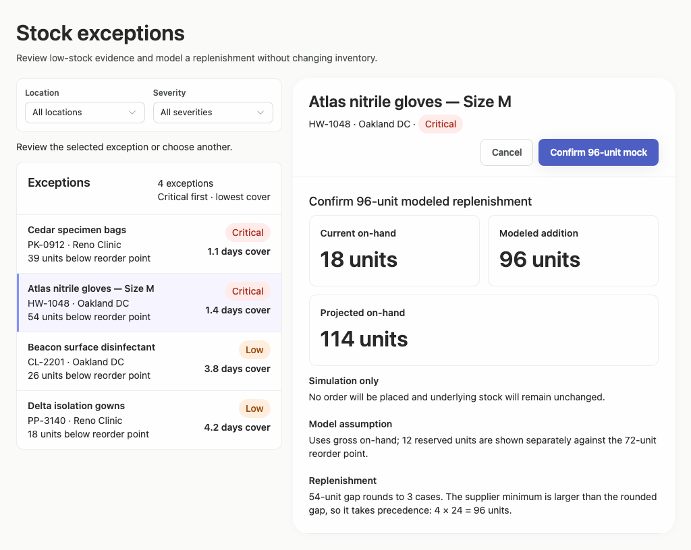

### desktop-window-2 — Confirm modeled replenishment

Interaction: passed.

### desktop-window-3 — Read projected quantity

Interaction: passed.

### desktop-window-4 — Reset fixture result

Interaction: passed.

### desktop-window-5 — Inspect supplier facts

Interaction: passed.

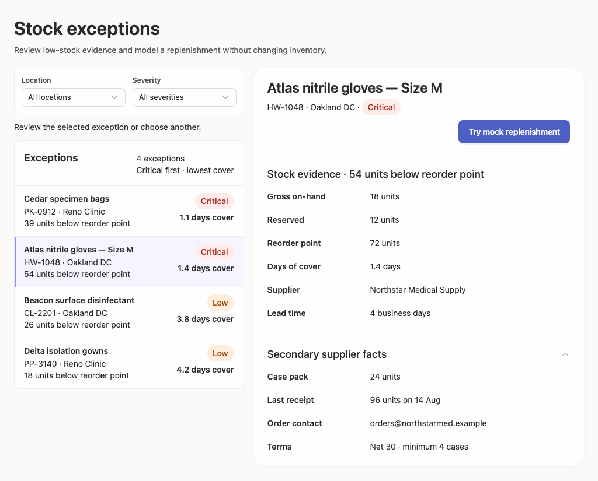

### desktop-custom-700x900-0 — initial

Interaction: not-run.

### desktop-custom-700x900-1 — Select record and review modeled quantity

Interaction: passed.

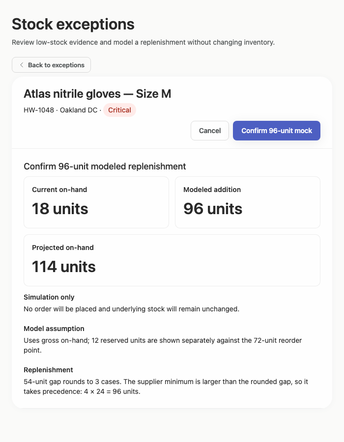

### desktop-custom-700x900-2 — Confirm modeled replenishment

Interaction: passed.

### desktop-custom-700x900-3 — Read projected quantity

Interaction: passed.

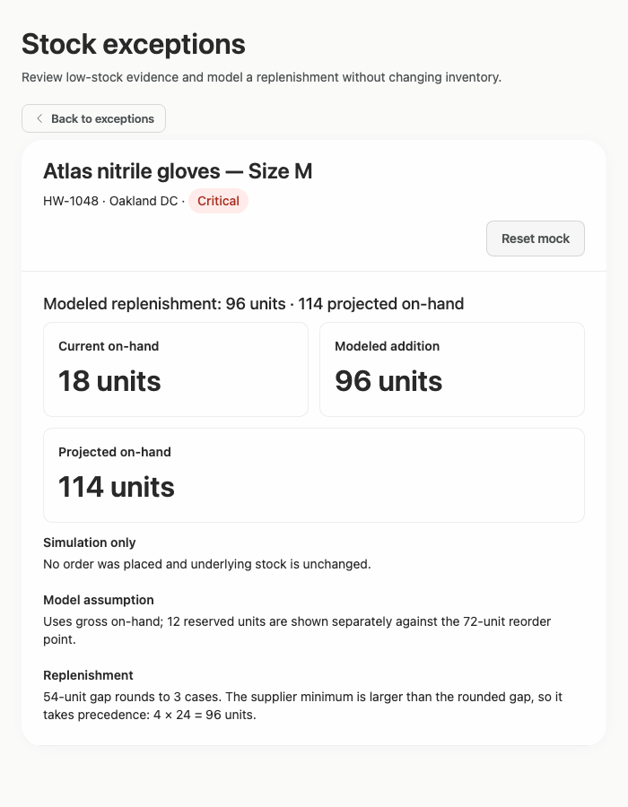

### desktop-custom-700x900-4 — Reset fixture result

Interaction: passed.

### desktop-custom-700x900-5 — Inspect supplier facts

Interaction: passed.

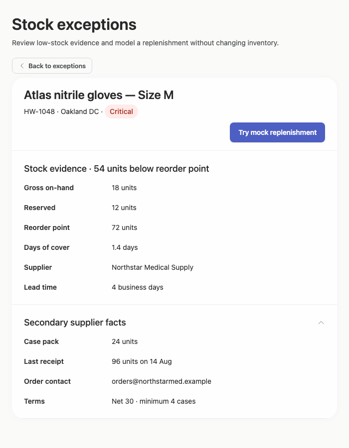

## Limitations

- Only supplied screenshots and measurements were assessed; filtered results, zero-result states, long product names, larger datasets, loading states, and error states were not shown.
- Interactions were reported as passed, but screenshots cannot establish backend behavior, persistence, authorization, or complete keyboard behavior.
- Static source evidence cannot prove that every dynamic branch or callback renders and behaves as intended.
- No implementation-plan artifact was supplied for review, so the brief's implementation-plan deliverable could not be evaluated.
- Styling provenance coverage was very limited; visual consistency was assessed from screenshots without claiming a token-adherence percentage.
