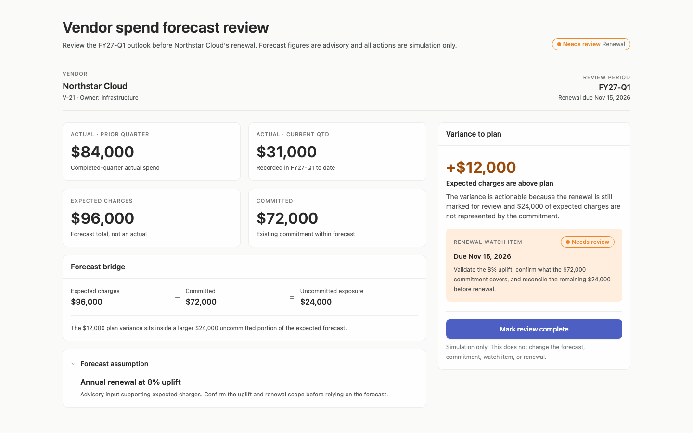
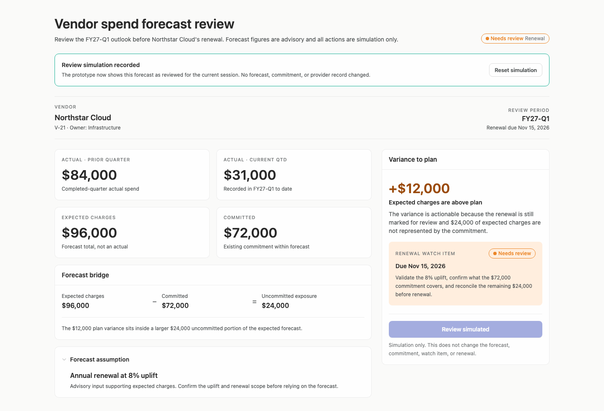
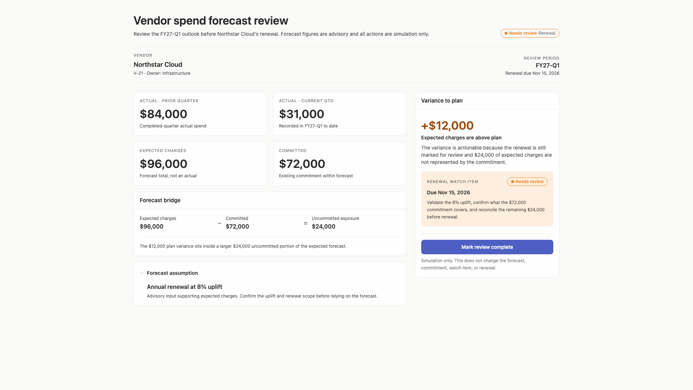
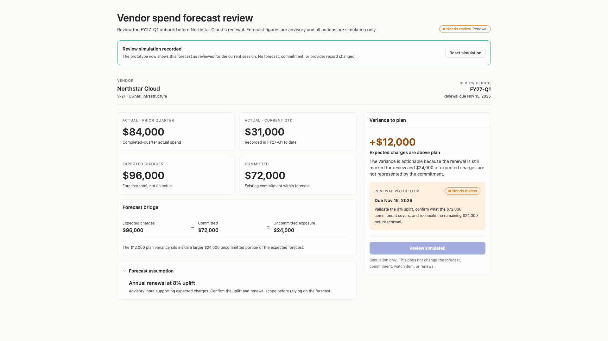
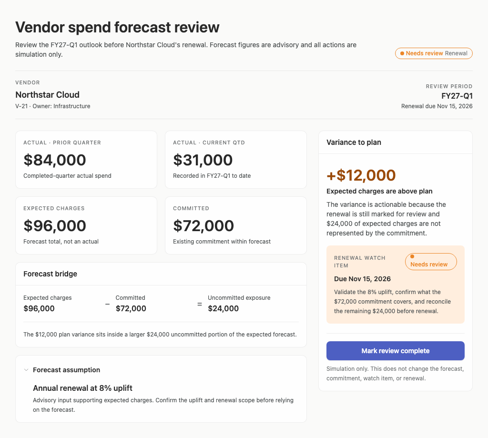
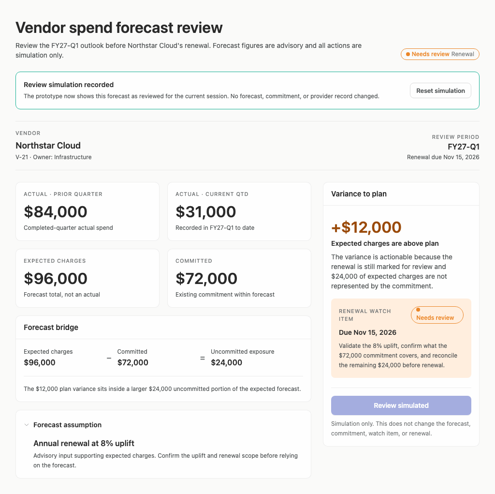

# vendor-spend-forecast — 2026-09-09T13:15:21.865Z

[All reports](../../README.md) · [Interactive HTML report](index.html) · [Full measurements and scoring](report.json)

GitHub renders this summary and the screenshots. Download or clone this folder to open the HTML report locally; GitHub does not serve it as a website.

**Subjective design score:** 80/100. Model: openai/gpt-5.6-sol. Rubric: 2.

**Arrusted adherence:** 99/100 (partial); evidence coverage 5.04%. Evaluator 3.

| Dimension | Conforming | Nonconforming | Unassessed | Adherence    |
| --------- | ---------- | ------------- | ---------- | ------------ |
| component | 55         | 0             | 1          | 100% (55/55) |
| api       | 99         | 0             | 3          | 100% (99/99) |
| styling   | 35         | 1             | 3577       | 97% (35/36)  |

Scores from different evaluator versions or captured states are not directly comparable.

This report evaluates the captured preview; evaluation itself does not regenerate the app or prove a built backend. Scores are advisory and not human-calibrated.

## Ratings

| Dimension | Score | Reason |
| --- | --- | --- |
| hierarchy | 4/4 | The page establishes an excellent review sequence: vendor and period context lead into four clearly labeled measures, the forecast bridge explains their relationship, and the visually prominent right panel elevates the +$12,000 variance and renewal watch item. Warning treatment and the primary completion action make the priority immediately scannable. |
| layout | 3/4 | Cards, dividers, and columns align consistently, with a sensible capped content width at 1440px and 1920px. Density is appropriate for a single-vendor review, though the persistent two-column arrangement becomes compressed at 1024px and causes additional wrapping in the watch item. |
| typography | 3/4 | Large monetary values, concise descriptions, and consistent heading weights provide strong numerical readability. Several uppercase metadata labels and status texts are only 11–12px, and the supplied accessibility evidence repeatedly flags marginal or insufficient contrast for these secondary and warning texts, reducing effortless reading. |
| responsive | 3/4 | The composition remains functional at all supplied desktop widths from 1024px to 1920px, with no horizontal overflow and controls remaining usable. At 1024px the 324px variance column forces the watch-item label and status pill to wrap, while the completed state increases document height from 918px to 1020px; this is usable but not fully optimized for constrained desktop panels. |
| productClarity | 3/4 | Actual prior-quarter spend, actual current QTD, expected charges, committed spend, and the 8% forecast assumption are explicitly labeled and not presented as equivalent facts. The design also identifies the renewal date and concrete checks involving the uplift, commitment scope, and $24,000 exposure. However, the underlying plan amount is absent, so the +$12,000 variance cannot be independently reconstructed, and “Mark review complete” acknowledges the review without capturing whether the identified renewal issues were resolved. |

## Strengths

- Actuals, expected charges, commitments, and assumptions are placed in separate, plainly labeled regions with useful explanatory subtitles such as “Forecast total, not an actual.”
- The forecast bridge makes the most important relationship explicit: $96,000 expected charges minus $72,000 committed equals $24,000 uncommitted exposure.
- The variance panel converts the numbers into a specific renewal task: validate the 8% uplift, confirm what the commitment covers, and reconcile the remaining $24,000.
- Vendor identity, ownership, review period, renewal date, and review status are visible without opening another view.
- The simulated completion state is clearly disclosed and reversible, and it explicitly states that no forecast, commitment, or provider record changed.
- The constrained 1024px view preserves all substantive information and usable controls without horizontal overflow.

## Improvements

- **high — desktop-0:** The panel emphasizes a +$12,000 variance to plan, but it never displays the plan value used to calculate that variance. Finance can see expected charges of $96,000 elsewhere, yet cannot independently verify the variance calculation. Add a compact calculation in this panel or the forecast bridge, such as “Expected $96,000 − Plan $84,000 = +$12,000,” while keeping the existing variance as the primary outcome.
- **medium — desktop-0:** The assumption is visually distinct, but “Annual renewal at 8% uplift” lacks its base amount, covered term or scope, and resulting contribution to the $96,000 forecast. This limits auditability of the expected-charge figure. Expand the disclosure with structured assumption details such as source amount, uplift calculation, effective period, included services, and owner or confirmation status.
- **medium — desktop-0:** “Mark review complete” records acknowledgement even though the adjacent watch item still says “Needs review.” The simulation disclaimer prevents a false claim of backend change, but the completion wording does not distinguish reviewed-with-open-issues from resolved. Before completion, provide a supported review disposition such as “Reviewed—follow-up required” versus “Reviewed—no follow-up,” or rename the action to “Acknowledge review” and retain the open renewal status.
- **low — desktop-window-0:** At the 1024px desktop window, the narrow right column makes “Renewal watch item” and the warning pill wrap, increasing visual density and separating the action panel from the wider evidence area. At constrained desktop panel widths, place the variance panel below the KPI and bridge content or allow it to span the available width, while keeping the review action adjacent to the variance summary.
- **medium — desktop-window-0:** The watch-item eyebrow and warning status use small text, and the supplied audit reports insufficient contrast for both warning and secondary metadata treatments. The content remains understandable, but these important action cues are less readable than the surrounding body copy. Use the supported medium Tag size for the status and promote “Renewal watch item” to a regular heading treatment rather than relying on micro uppercase text; preserve the existing Arrusted palette.

## Token evidence

Percentages cover only assessed properties. Missing provenance and ambiguous CSS remain unassessed; matching literals are not proof of token usage.

| Viewport         | Category   | Token references / assessed | Coverage   |
| ---------------- | ---------- | --------------------------- | ---------- |
| desktop-0        | color      | 1/1                         | 1% (1/184) |
| desktop-0        | typography | 0/0                         | 0% (0/465) |
| desktop-0        | spacing    | 0/0                         | 0% (0/254) |
| desktop-0        | radius     | 0/0                         | 0% (0/93)  |
| desktop-0        | border     | 0/0                         | 0% (0/104) |
| desktop-0        | shadow     | 0/0                         | 0% (0/93)  |
| desktop-wide-0   | color      | 1/1                         | 1% (1/184) |
| desktop-wide-0   | typography | 0/0                         | 0% (0/465) |
| desktop-wide-0   | spacing    | 0/0                         | 0% (0/254) |
| desktop-wide-0   | radius     | 0/0                         | 0% (0/93)  |
| desktop-wide-0   | border     | 0/0                         | 0% (0/104) |
| desktop-wide-0   | shadow     | 0/0                         | 0% (0/93)  |
| desktop-window-0 | color      | 1/1                         | 1% (1/184) |
| desktop-window-0 | typography | 0/0                         | 0% (0/465) |
| desktop-window-0 | spacing    | 0/0                         | 0% (0/254) |
| desktop-window-0 | radius     | 0/0                         | 0% (0/93)  |
| desktop-window-0 | border     | 0/0                         | 0% (0/104) |
| desktop-window-0 | shadow     | 0/0                         | 0% (0/93)  |

## Latest-run screenshots

### desktop-0 — initial

Interaction: not-run.

### desktop-1 — record a simulated review

Interaction: passed.

### desktop-2 — reset a simulated review

Interaction: passed.

### desktop-wide-0 — initial

Interaction: not-run.

### desktop-wide-1 — record a simulated review

Interaction: passed.

### desktop-wide-2 — reset a simulated review

Interaction: passed.

### desktop-window-0 — initial

Interaction: not-run.

### desktop-window-1 — record a simulated review

Interaction: passed.

### desktop-window-2 — reset a simulated review

Interaction: passed.

## Limitations

- Only desktop screenshots at 1024px, 1440px, and 1920px were supplied; behavior in narrower desktop panels or split views was not observed.
- The tested interaction only demonstrates recording and resetting a simulated review. No assumption expansion, data editing, renewal workflow, or error state was tested.
- Screenshots cannot establish persistence, authorization, calculation correctness, or operational follow-up behavior.
- The forecast contains one synthetic vendor and one assumption, so scalability to multiple commitments, renewals, or conflicting assumptions is uncertain.
- Contrast observations rely on the supplied automated audit and are advisory; this evaluation does not recommend overriding the authoritative Arrusted palette or primary Button styling.
